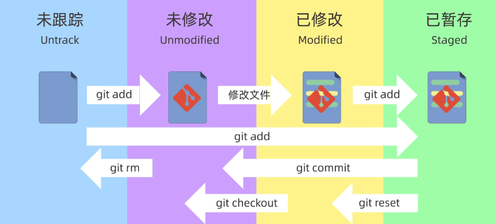
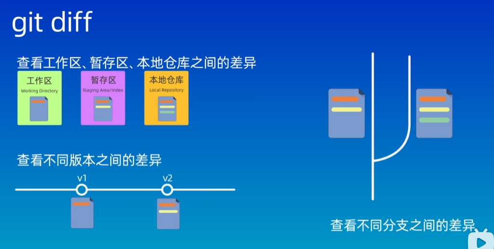
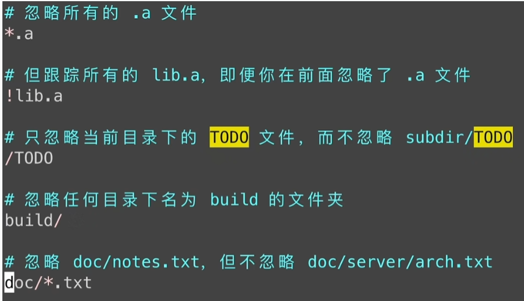

```shell
git -v	#查看git版本

git config --global user.name "Golfar"	#配置commit用户名称
git config --global user.email golfar3977@gmail.com	#配置commit用户邮箱
git config --global credential.helper store	#保存用户配置
git config --global --list	#查看用户配置
#默认参数local，仅对当前项目生效；gloabl，对所有项目生效；system，对系统内所有用户生效
```



```shell
git init	#创建仓库
git status	#查看仓库状态
git add	#将文件添加到暂存区，可以使用通配符或文件夹来同时添加多个文件
git commit -m "提交信息"	#提交
git log	#查看提交日记
git log --oneline	#查看简洁版的历史记录
git ls-files	#查看暂存区内容

git reset	#用于回退版本，默认参数--mixed
git reset --soft	#回退到某一个版本，保留工作区和暂存区的所有修改内容
git reset --hard	#回退到某一个版本，丢弃工作区和暂存区的所有修改内容
git reset --mixed	#回退到某一个版本，保留工作区的修改内容，丢弃掉暂存区的修改内容。
#soft和mixed一般用于多个提交版本合并，hard则用于彻底放弃已修改的内容

git reflog	#查看日记，可以通过这个命令来撤销git reset命令的修改

git diff	#查看差异，默认参数比较工作区与暂存区差异
git diff HEAD	#比较工作区和版本库之间的差异，HEAD作为当前分支提交的最新节点，HEAD~或HEAD^表示上一个版本，HEAD^2表示HEAD之前的第二个版本
git diff --cached	#比较暂存区与版本库之间的差异
git diff 版本号1 版本号2	#比较两个版本之间的差异
git diff ... 文件名	#仅查看文件差异
```



```shell
git rm 文件名	#同时从工作区和暂存区删除文件
git rm --cached 文件名	#把文件从暂存区中删除，但保留在当前工作区
git rm -r *	#递归的删除目录下的所有文件和子目录
```

```shell
.gitignore
#系统自动生成的文件
#编译生成的中间文件，可执行文件。如.class,.o等
#系统运行时生成的日志文件，缓存文件，临时文件等
#设计密码，私钥，口令等隐私敏感文件
#如果一个文件在写入.gitignore中以前已经被git跟踪，那么这个文件会被git始终跟踪
#git会跟踪所有已经被加入到git暂存区中的文件

#git不会跟踪空文件夹
#.gitignore中文件夹格式以/结尾
#使用Blob模式匹配
```



