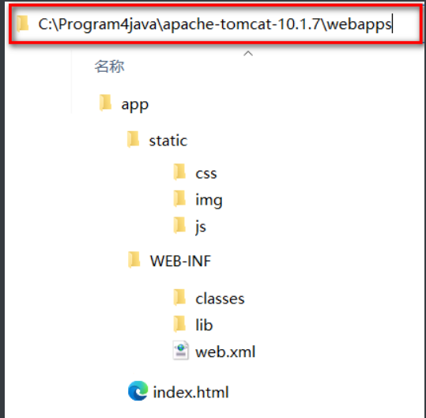
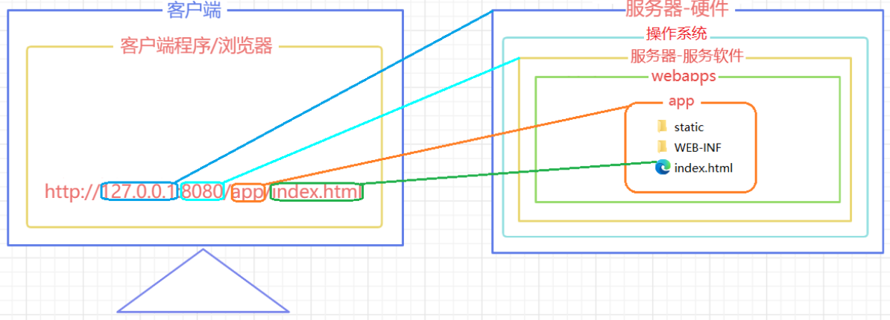
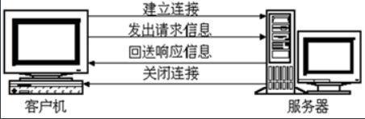
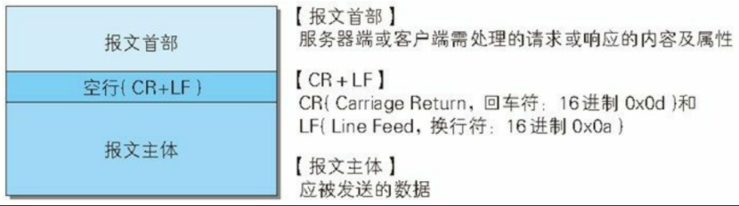
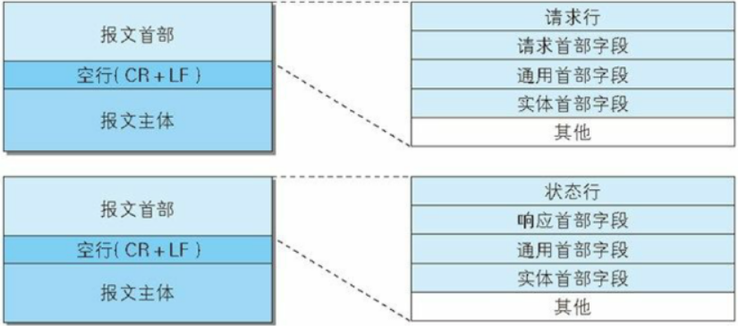
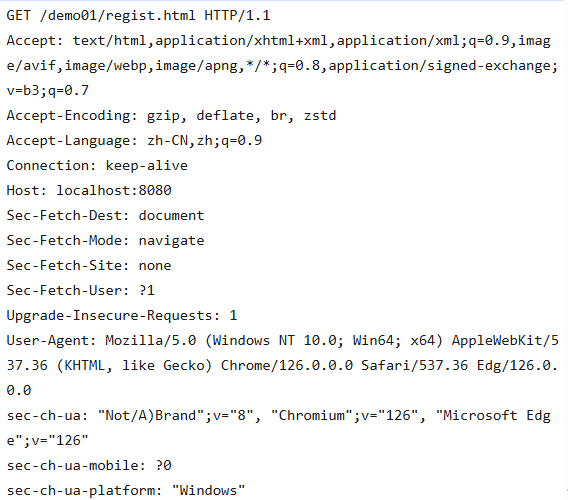
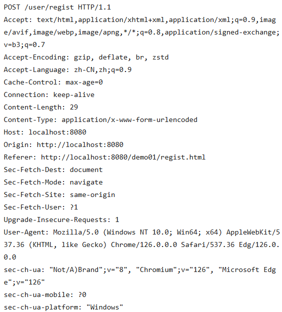
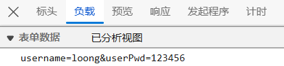
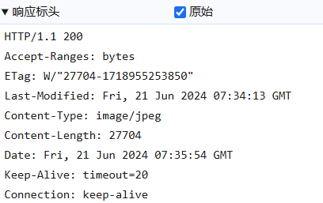

# XML

XML是EXtensible Markup Language的缩写，翻译过来就是可扩展标记语言。所以很明显，XML和HTML一样都是标记语言，也就是说它们的基本语法都是标签。

+ **可扩展** 三个字表面上的意思是XML允许自定义格式。但这不代表你可以随便写。

+ 在XML基本语法规范的基础上，你使用的那些第三方应用程序、框架会通过XML约束的方式强制规定配置文件中可以写什么和怎么写

+ XML基本语法这个知识点的定位是：我们不需要从零开始，从头到尾的一行一行编写XML文档，而是在第三方应用程序、框架已提供的配置文件的基础上修改。要改成什么样取决于你的需求，而怎么改取决XML基本语法和具体的XML约束。

## 常见配置文件类型

1.  properties文件,例如druid连接池就是使用properties文件作为配置文件
2.  XML文件,例如Tomcat就是使用XML文件作为配置文件
3.  YAML文件,例如SpringBoot就是使用YAML作为配置文件
4.  json文件,通常用来做文件传输，也可以用来做前端或者移动端的配置文件

### properties配置文件

```properties
atguigu.jdbc.url=jdbc:mysql://localhost:3306/atguigu
atguigu.jdbc.driver=com.mysql.cj.jdbc.Driver
atguigu.jdbc.username=root
atguigu.jdbc.password=root
```

-   由键值对组成
-   键和值之间的符号是等号
-   每一行都必须顶格写，前面不能有空格之类的其他符号

### xml配置文件

```xml
<?xml version="1.0" encoding="UTF-8"?>
<students>
    <student>
        <name>张三</name>
        <age>18</age>
    </student>
    <student>
        <name>李四</name>
        <age>20</age>
    </student>
</students>
```

+ XML的基本语法和HTML的基本语法简直如出一辙。其实这不是偶然的，XML基本语法+HTML约束=HTML语法。在逻辑上HTML确实是XML的子集。

-   XML文档声明 这部分基本上就是固定格式，要注意的是文档声明一定要从第一行第一列开始写

```xml
<?xml version="1.0" encoding="UTF-8"?>
```

-   根标签
    -   &#x20;根标签有且只能有一个。
-   标签关闭
    -   双标签：开始标签和结束标签必须成对出现。
    -   单标签：单标签在标签内关闭。
-   标签嵌套
    -   可以嵌套，但是不能交叉嵌套。
-   注释不能嵌套
-   标签名、属性名建议使用小写字母
-   属性
    -   属性必须有值
    -   属性值必须加引号，单双都行

XML的约束

将来我们主要就是根据XML约束中的规定来编写XML配置文件，而且会在我们编写XML的时候根据约束来提示我们编写, 而XML约束主要包括DTD和Schema两种。

-   DTD
-   Schema

Schema约束要求我们一个XML文档中，所有标签，所有属性都必须在约束中有明确的定义。

下面我们以web.xml的约束声明为例来做个说明：

```xml
<web-app xmlns="http://xmlns.jcp.org/xml/ns/javaee"
         xmlns:xsi="http://www.w3.org/2001/XMLSchema-instance"
         xsi:schemaLocation="http://xmlns.jcp.org/xml/ns/javaee http://xmlns.jcp.org/xml/ns/javaee/web-app_4_0.xsd"
         version="4.0">
```

# Tomcat10

## web服务器

-   **Tomcat（Apache）**：当前应用最广的JavaWeb服务器
-   Jetty:更轻量级、更灵活的servlet容器
-   JBoss（Redhat红帽）：支持JavaEE，应用比较广EJB容器 –> SSH轻量级的框架代替
-   GlassFish（Orcale）：Oracle开发JavaWeb服务器，应用不是很广
-   Resin（Caucho）：支持JavaEE，应用越来越广
-   Weblogic（Orcale）：要钱的！支持JavaEE，适合大型项目
-   Websphere（IBM）：要钱的！支持JavaEE，适合大型项目

## Tomcat服务器

Tomcat是Apache 软件基金会（Apache Software Foundation）的Jakarta 项目中的一个核心项目，由Apache、Sun 和其他一些公司及个人共同开发而成。最新的Servlet 和JSP 规范总是能在Tomcat 中得到体现，因为Tomcat 技术先进、性能稳定，而且免费，因而深受Java 爱好者的喜爱并得到了部分软件开发商的认可，成为目前比较流行的Web 应用服务器。

| **Servlet** Version | EE Version       |
| :------------------ | ---------------- |
| 6.1                 | Jakarta EE ?     |
| 6.0                 | Jakarta EE 10    |
| 5.0                 | Jakarta EE 9/9.1 |
| 4.0                 | JAVA EE 8        |
| 3.1                 | JAVA EE 7        |
| 3.1                 | JAVA EE 7        |
| 3.0                 | JAVAEE 6         |

Tomcat 版本和Servlet版本之间的对应关系

| **Servlet** Version | **Tomcat ** Version | **JDK** Version                         |
| :------------------ | :------------------ | :-------------------------------------- |
| 6.1                 | 11.0.x              | 17 and later                            |
| 6.0                 | 10.1.x              | 11 and later                            |
| 5.0                 | 10.0.x (superseded) | 8 and later                             |
| 4.0                 | 9.0.x               | 8 and later                             |
| 3.1                 | 8.5.x               | 7 and later                             |
| 3.1                 | 8.0.x (superseded)  | 7 and later                             |
| 3.0                 | 7.0.x (archived)    | 6 and later (7 and later for WebSocket) |

### Tomcat目录结构

- bin：该目录下存放的是二进制可执行文件，如果是安装版，那么这个目录下会有两个exe文件：tomcat10.exe、tomcat10w\.exe，前者是在控制台下启动Tomcat，后者是弹出GUI窗口启动Tomcat；如果是解压版，那么会有startup.bat和shutdown.bat文件，startup.bat用来启动Tomcat，但需要先配置JAVA\_HOME环境变量才能启动，shutdawn.bat用来停止Tomcat；

- conf：这是一个非常非常重要的目录，这个目录下有四个最为重要的文件：

  - **server.xml：配置整个服务器信息。例如修改端口号。默认HTTP请求的端口号是：8080**

  - tomcat-users.xml：存储tomcat用户的文件，这里保存的是tomcat的用户名及密码，以及用户的角色信息。可以按着该文件中的注释信息添加tomcat用户，然后就可以在Tomcat主页中进入Tomcat Manager页面了；

  - web.xml：部署描述符文件，这个文件中注册了很多MIME类型，即文档类型。这些MIME类型是客户端与服务器之间说明文档类型的，如用户请求一个html网页，那么服务器还会告诉客户端浏览器响应的文档是text/html类型的，这就是一个MIME类型。客户端浏览器通过这个MIME类型就知道如何处理它了。当然是在浏览器中显示这个html文件了。但如果服务器响应的是一个exe文件，那么浏览器就不可能显示它，而是应该弹出下载窗口才对。MIME就是用来说明文档的内容是什么类型的！

  - context.xml：对所有应用的统一配置，通常我们不会去配置它。
- lib：Tomcat的类库，里面是一大堆jar文件。如果需要添加Tomcat依赖的jar文件，可以把它放到这个目录中，当然也可以把应用依赖的jar文件放到这个目录中，这个目录中的jar所有项目都可以共享之，但这样你的应用放到其他Tomcat下时就不能再共享这个目录下的jar包了，所以建议只把Tomcat需要的jar包放到这个目录下；
- logs：这个目录中都是日志文件，记录了Tomcat启动和关闭的信息，如果启动Tomcat时有错误，那么异常也会记录在日志文件中。

- temp：存放Tomcat的临时文件，这个目录下的东西可以在停止Tomcat后删除！

- **webapps：存放web项目的目录，其中每个文件夹都是一个项目**；如果这个目录下已经存在了目录，那么都是tomcat自带的项目。其中ROOT是一个特殊的项目，在地址栏中访问：http://127.0.0.1:8080，没有给出项目目录时，对应的就是ROOT项目.http://localhost:8080/examples，进入示例项目。其中examples"就是项目名，即文件夹的名字。

- work：运行时生成的文件，最终运行的文件都在这里。通过webapps中的项目生成的！可以把这个目录下的内容删除，再次运行时会生再次生成work目录。当客户端用户访问一个JSP文件时，Tomcat会通过JSP生成Java文件，然后再编译Java文件生成class文件，生成的java和class文件都会存放到这个目录下。

- LICENSE：许可证。

- NOTICE：说明文件。

### web项目标准目录



app  本应用根目录

+ static 非必要目录,约定俗成的名字,一般在此处放静态资源 ( css  js  img)
+ WEB-INF  必要目录,必须叫WEB-INF,受保护的资源目录,浏览器通过url不可以直接访问的目录
  + classes     必要目录,src下源代码,配置文件,编译后会在该目录下,web项目中如果没有源码,则该目录不会出现
  + lib             必要目录,项目依赖的jar编译后会出现在该目录下,web项目要是没有依赖任何jar,则该目录不会出现
  + web.xml   必要文件,web项目的基本配置文件. 较新的版本中可以没有该文件,但是学习过程中还是需要该文件 
+ index.html  非必要文件,index.html/index.htm/index.jsp为默认的欢迎页



## WEB项目部署的方式

- 直接将编译好的项目放在webapps目录下 

- 将编译好的项目打成war包放在webapps目录下,tomcat启动后会自动解压war包

- 可以将项目放在非webapps的其他目录下,在tomcat中通过配置文件指向app的实际磁盘路径

  在tomcat的conf下创建Catalina/localhost目录,并在该目录下准备一个app.xml文件

  ```xml
  <!-- 
  	path: 项目的访问路径,也是项目的上下文路径,就是在浏览器中,输入的项目名称
      docBase: 项目在磁盘中的实际路径
   -->
  <Context path="/app" docBase="D:\mywebapps\app" />
  ```

项目的访问路径和部署目录可以不一致

## IDEA中开发并部署运行web项目

+ idea并没有直接进将编译好的项目放入tomcat的webapps中
+ idea根据关联的tomcat,创建了一个tomcat副本,将项目部署到了这个副本中
+ idea的tomcat副本在C:\用户\当前用户\AppData\Local\JetBrains\IntelliJIdea2022.2\tomcat\中
+ idea的tomcat副本并不是一个完整的tomcat,副本里只是准备了和当前项目相关的配置文件而已
+ idea启动tomcat时,是让本地tomcat程序按照tomcat副本里的配置文件运行
+ idea的tomcat副本部署项目的模式是通过conf/Catalina/localhost/*.xml配置文件的形式实现项目部署的


# Http协议

## 简介

### 发展历程

> HTTP/0.9 

+ 蒂姆伯纳斯李是一位英国计算机科学家，也是万维网的发明者。他在 1989 年创建了单行 HTTP 协议。它只是返回一个网页。这个协议在 1991 年被命名为 HTTP/0.9。 

>  HTTP/1.0

+  1996 年，HTTP/1.0 发布。该规范是显著扩大，并且支持三种请求方法：GET，Head，和POST。 
+  HTTP/1.0 相对于 HTTP/0.9 的改进如下：
   + 每个请求都附加了 HTTP 版本。
   + 在响应开始时发送状态代码。
   + 请求和响应都包含 HTTP 报文头。
   + 内容类型能够传输 HTML 文件以外的文档。
+  但是，HTTP/1.0 不是官方标准。

> HTTP/1.1

+ HTTP 的第一个标准化版本 HTTP/1.1 ( RFC 2068 ) 于 1997 年初发布，支持七种请求方法：OPTIONS，GET，HEAD，POST，PUT，DELETE，和TRACE 

+ HTTP/1.1 是 HTTP 1.0 的增强：

  + 虚拟主机允许从单个 IP 地址提供多个域。

  + 持久连接和流水线连接允许 Web 浏览器通过单个持久连接发送多个请求。

  + 缓存支持节省了带宽并使响应速度更快。

+ HTTP/1.1 在接下来的 15 年左右将非常稳定。 

+ 在此期间，出现了 HTTPS（安全超文本传输协议）。它是使用 SSL/TLS 进行安全加密通信的 HTTP 的安全版本。 

> HTTP/2

+  由IETF在2015年发布。HTTP/2旨在提高Web性能，减少延迟，增加安全性，使Web应用更加快速、高效和可靠。 

- 多路复用：HTTP/2 允许同时发送多个请求和响应，而不是像 HTTP/1.1 一样只能一个一个地处理。这样可以减少延迟，提高效率，提高网络吞吐量。
- 二进制传输：HTTP/2 使用二进制协议，与 HTTP/1.1 使用的文本协议不同。二进制协议可以更快地解析，更有效地传输数据，减少了传输过程中的开销和延迟。
- 头部压缩：HTTP/2 使用 HPACK 算法对 HTTP 头部进行压缩，减少了头部传输的数据量，从而减少了网络延迟。
- 服务器推送：HTTP/2 支持服务器推送，允许服务器在客户端请求之前推送资源，以提高性能。
- 改进的安全性：HTTP/2 默认使用 TLS（Transport Layer Security）加密传输数据，提高了安全性。
- 兼容 HTTP/1.1：HTTP/2 可以与 HTTP/1.1 共存，服务器可以同时支持 HTTP/1.1 和 HTTP/2。如果客户端不支持 HTTP/2，服务器可以回退到 HTTP/1.1。

> HTTP/3

+ 于 2021 年 5 月 27 日发布 , HTTP/3 是一种新的、快速、可靠且安全的协议，适用于所有形式的设备。 HTTP/3 没有使用 TCP，而是使用谷歌在 2012 年开发的新协议 QUIC 
+ HTTP/3 是继 HTTP/1.1 和 HTTP/2之后的第三次重大修订。 

+ HTTP/3 带来了革命性的变化，以提高 Web 性能和安全性。设置 HTTP/3 网站需要服务器和浏览器支持。

+ 目前，谷歌云、Cloudflare和Fastly支持 HTTP/3。Chrome、Firefox、Edge、Opera 和一些移动浏览器支持 HTTP/3。

### 会话方式



-   浏览器与WEB服务器的连接过程是短暂的，每次连接只处理一个请求和响应。对每一个页面的访问，浏览器与WEB服务器都要建立一次单独的连接。
-   浏览器到WEB服务器之间的所有通讯都是完全独立分开的请求和响应对。

### http1.0和http1.1

在HTTP1.0版本中，浏览器请求一个带有图片的网页，会由于下载图片而与服务器之间开启一个新的连接；但在HTTP1.1版本中，允许浏览器在拿到当前请求对应的全部资源后再断开连接，提高了效率。

http1.1增加了缓存支持

## 请求和响应报文





### 请求报文

请求报文格式

-   请求首行（**请求行**）；    请求方式   资源路径   协议以及版本
-   请求头信息（**请求头**）；k-v形式
-   空行；
-   请求体；POST请求才有请求体

#### GET请求



```http
-主机虚拟地址
Host: localhost:8080   
-长连接
Connection: keep-alive 
-请求协议的自动升级[http的请求，服务器却是https的，浏览器自动会将请求协议升级为https的]
Upgrade-Insecure-Requests: 1  
- 用户系统信息
User-Agent: Mozilla/5.0 (Windows NT 6.1; WOW64) AppleWebKit/537.36 (KHTML, like Gecko) Chrome/68.0.3440.75 Safari/537.36
- 浏览器支持的文件类型
Accept:text/html,application/xhtml+xml,application/xml;q=0.9,image/webp,image/apng,*/*;q=0.8
- 当前页面的上一个页面的路径[当前页面通过哪个页面跳转过来的]：   可以通过此路径跳转回上一个页面， 广告计费，防止盗链
Referer: http://localhost:8080/05_web_tomcat/login.html
- 浏览器支持的压缩格式
Accept-Encoding: gzip, deflate, br
- 浏览器支持的语言
Accept-Language: zh-CN,zh;q=0.9,en-US;q=0.8,en;q=0.7
```

由于请求参数在请求首行中已经携带了，所以没有请求体，也没有请求空行

请求参数拼接在url地址中，地址栏可见\[url?name1=value1\&name2=value2]，不安全

由于参数在地址栏中携带，所以由大小限制\[地址栏数据大小一般限制为4k]，只能携带纯文本

get请求参数只能上传文本数据

没有请求体。所以封装和解析都快，效率高， 浏览器默认提交的请求都是get请求比如：地址栏输入回车,超链接,表单默认的提交方式

#### POST请求





POST请求有请求体，而GET请求没有请求体。

post请求数据在请求体中携带，请求体数据大小没有限制，可以用来上传所有内容\[文件、文本]

只能使用post请求上传文件

post请求报文多了和请求体相关的配置\[请求头]

地址栏参数不可见，相对安全

post效率比get低

### 响应报文

-   响应首行（**响应行**）； 协议/版本  状态码    状态码描述
-   响应头信息（**响应头**）；
-   空行；
-   响应体；



#### 响应状态码

| 状态码 | 状态码英文描述                  | 中文含义                                                     |
| :----- | :------------------------------ | :----------------------------------------------------------- |
| 1**    |                                 |                                                              |
| 100    | Continue                        | 继续。客户端应继续其请求                                     |
| 101    | Switching Protocols             | 切换协议。服务器根据客户端的请求切换协议。只能切换到更高级的协议，例如，切换到HTTP的新版本协议 |
| 2**    |                                 |                                                              |
| 200    | OK                              | 请求成功。一般用于GET与POST请求                              |
| 201    | Created                         | 已创建。成功请求并创建了新的资源                             |
| 202    | Accepted                        | 已接受。已经接受请求，但未处理完成                           |
| 203    | Non-Authoritative Information   | 非授权信息。请求成功。但返回的meta信息不在原始的服务器，而是一个副本 |
| 204    | No Content                      | 无内容。服务器成功处理，但未返回内容。在未更新网页的情况下，可确保浏览器继续显示当前文档 |
| 205    | Reset Content                   | 重置内容。服务器处理成功，用户终端（例如：浏览器）应重置文档视图。可通过此返回码清除浏览器的表单域 |
| 206    | Partial Content                 | 部分内容。服务器成功处理了部分GET请求                        |
| 3**    |                                 |                                                              |
| 300    | Multiple Choices                | 多种选择。请求的资源可包括多个位置，相应可返回一个资源特征与地址的列表用于用户终端（例如：浏览器）选择 |
| 301    | Moved Permanently               | 永久移动。请求的资源已被永久的移动到新URI，返回信息会包括新的URI，浏览器会自动定向到新URI。今后任何新的请求都应使用新的URI代替 |
| 302    | Found                           | 临时移动。与301类似。但资源只是临时被移动。客户端应继续使用原有URI |
| 303    | See Other                       | 查看其它地址。与301类似。使用GET和POST请求查看               |
| 304    | Not Modified                    | 未修改。所请求的资源未修改，服务器返回此状态码时，不会返回任何资源。客户端通常会缓存访问过的资源，通过提供一个头信息指出客户端希望只返回在指定日期之后修改的资源 |
| 305    | Use Proxy                       | 使用代理。所请求的资源必须通过代理访问                       |
| 306    | Unused                          | 已经被废弃的HTTP状态码                                       |
| 307    | Temporary Redirect              | 临时重定向。与302类似。使用GET请求重定向                     |
| 4**    |                                 |                                                              |
| 400    | Bad Request                     | 客户端请求的语法错误，服务器无法理解                         |
| 401    | Unauthorized                    | 请求要求用户的身份认证                                       |
| 402    | Payment Required                | 保留，将来使用                                               |
| 403    | Forbidden                       | 服务器理解请求客户端的请求，但是拒绝执行此请求               |
| 404    | Not Found                       | 服务器无法根据客户端的请求找到资源（网页）。通过此代码，网站设计人员可设置"您所请求的资源无法找到"的个性页面 |
| 405    | Method Not Allowed              | 客户端请求中的方法被禁止                                     |
| 406    | Not Acceptable                  | 服务器无法根据客户端请求的内容特性完成请求                   |
| 407    | Proxy Authentication Required   | 请求要求代理的身份认证，与401类似，但请求者应当使用代理进行授权 |
| 408    | Request Time-out                | 服务器等待客户端发送的请求时间过长，超时                     |
| 409    | Conflict                        | 服务器完成客户端的 PUT 请求时可能返回此代码，服务器处理请求时发生了冲突 |
| 410    | Gone                            | 客户端请求的资源已经不存在。410不同于404，如果资源以前有现在被永久删除了可使用410代码，网站设计人员可通过301代码指定资源的新位置 |
| 411    | Length Required                 | 服务器无法处理客户端发送的不带Content-Length的请求信息       |
| 412    | Precondition Failed             | 客户端请求信息的先决条件错误                                 |
| 413    | Request Entity Too Large        | 由于请求的实体过大，服务器无法处理，因此拒绝请求。为防止客户端的连续请求，服务器可能会关闭连接。如果只是服务器暂时无法处理，则会包含一个Retry-After的响应信息 |
| 414    | Request-URI Too Large           | 请求的URI过长（URI通常为网址），服务器无法处理               |
| 415    | Unsupported Media Type          | 服务器无法处理请求附带的媒体格式                             |
| 416    | Requested range not satisfiable | 客户端请求的范围无效                                         |
| 417    | Expectation Failed              | 服务器无法满足Expect的请求头信息                             |
| 5**    |                                 |                                                              |
| 500    | Internal Server Error           | 服务器内部错误，无法完成请求                                 |
| 501    | Not Implemented                 | 服务器不支持请求的功能，无法完成请求                         |
| 502    | Bad Gateway                     | 作为网关或者代理工作的服务器尝试执行请求时，从远程服务器接收到了一个无效的响应 |
| 503    | Service Unavailable             | 由于超载或系统维护，服务器暂时的无法处理客户端的请求。延时的长度可包含在服务器的Retry-After头信息中 |
| 504    | Gateway Time-out                | 充当网关或代理的服务器，未及时从远端服务器获取请求           |
| 505    | HTTP Version not supported      | 服务器不支持请求的HTTP协议的版本，无法完成处理               |