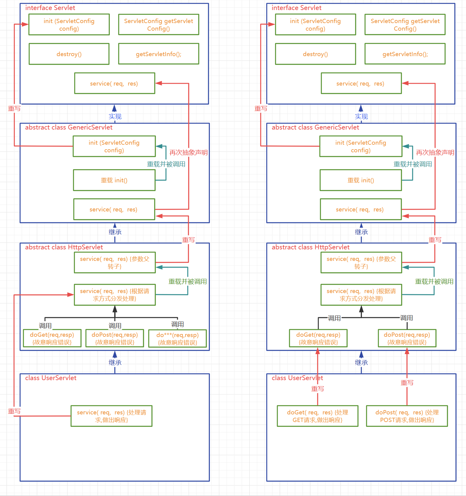

# 简介

## 静态资源和动态资源

- 静态资源

  无需在程序运行时通过代码运行生成的资源,在程序运行之前就写好的资源. 例如:html css js img ,音频文件和视频文件

- 动态资源

  需要在程序运行时通过代码运行生成的资源,在程序运行之前无法确定的数据,运行时动态生成,例如Servlet,Thymeleaf ... ...

  动态资源指的不是视图上的动画效果或者是简单的人机交互效果

## Servlet

Servlet  (server applet) 是运行在服务端(tomcat)的Java小程序，是sun公司提供一套定义动态资源规范; 从代码层面上来讲Servlet就是一个接口

用来接收、处理客户端请求、响应给浏览器的动态资源。在整个Web应用中，Servlet主要负责接收处理请求、协同调度功能以及响应数据。我们可以把Servlet称为Web应用中的**控制器**

# Servlet开发流程

## 目标

校验注册时,用户名是否被占用. 通过客户端向一个Servlet发送请求,携带username,如果用户名是'atguigu',则向客户端响应 NO,如果是其他,响应YES

## 开发过程

1. tomcat接收到请求后，会将请求报文信息转换成一个HttpServletRequest对象，该对象中包含了请求中的所有信息
2. tomcat同时创建了一个HttpServletResponse对象，该对象用于承装要响应给客户端的信息
3. tomcat根据请求中的资源路径找到对应的servlet，将servlet实例化，调用service方法， 同时将HttpServletRequest和HttpServletResponse对象传入
4. 我们需要做的就是开发servlet接口，该类实现了servlet接口，重写service方法

```java
public class UserNameServlet extends HttpServlet {
    @Override
    protected void service(HttpServletRequest req, HttpServletResponse resp) throws ServletException, IOException {
        //从req对象中获取请求的信息
        String username = req.getParameter("username");
        String info = "YES";
        if("golfar".equals(username)){
            info = "NO";
        }
        PrintWriter writer = resp.getWriter();//返回一个向响应体中打印字符的打印流
        writer.write(info);
    }
}
```

```xml
<?xml version="1.0" encoding="UTF-8"?>
<web-app xmlns="https://jakarta.ee/xml/ns/jakartaee"
         xmlns:xsi="http://www.w3.org/2001/XMLSchema-instance"
         xsi:schemaLocation="https://jakarta.ee/xml/ns/jakartaee https://jakarta.ee/xml/ns/jakartaee/web-app_5_0.xsd"
         version="5.0">

    <servlet>
        <!--给UserServlet起一个别名-->
        <servlet-name>userServlet</servlet-name>
        <servlet-class>com.atguigu.servlet.UserServlet</servlet-class>
    </servlet>


    <servlet-mapping>
        <!--关联别名和映射路径-->
        <servlet-name>userServlet</servlet-name>
        <!--可以为一个Servlet匹配多个不同的映射路径,但是不同的Servlet不能使用相同的url-pattern-->
        <url-pattern>/userServlet</url-pattern>
       <!-- <url-pattern>/userServlet2</url-pattern>-->
        <!--
            /        表示通配所有资源,不包括jsp文件，请求jsp仍然会定位到jsp页面
            /*       表示通配所有资源,包括jsp文件
            /a/*     匹配所有以a前缀的映射路径
            *.action 匹配所有以action为后缀的映射路径
        -->
       <!-- <url-pattern>/*</url-pattern>-->
    </servlet-mapping>

</web-app>
```

+ Servlet并不是文件系统中实际存在的文件或者目录,所以为了能够请求到该资源,我们需要为其配置映射路径
+ servlet的请求映射路径配置在web.xml中
+ servlet-name作为servlet的别名,可以自己随意定义,见名知意就好
+ url-pattern标签用于定义Servlet的请求映射路径
+ 一个servlet可以对应多个不同的url-pattern
+ 多个servlet不能使用相同的url-pattern
+ url-pattern中可以使用一些通配写法
  + /        表示通配所有资源,不包括jsp文件
  + /*      表示通配所有资源,包括jsp文件
  + /a/*     匹配所有以a前缀的映射路径
  + *.action 匹配所有以action为后缀的映射路径

# 注解方式配置servlet

## @WebServlet注解源码

```java
public @interface WebServlet {
    String name() default "";//相当于 servlet-name

    String[] value() default {};//和下面的urlPatterns相同，数组类型，可以定义多个路径。默认为value

    String[] urlPatterns() default {};

    int loadOnStartup() default -1;

    WebInitParam[] initParams() default {};

    boolean asyncSupported() default false;

    String smallIcon() default "";

    String largeIcon() default "";

    String description() default "";

    String displayName() default "";
}
```


## @WebServlet注解使用

使用@WebServlet注解替换Servlet配置

注意使用注解之后就不要在web.xml中配置路径了

```java
@WebServlet("/userServlet")
public class UserNameServlet extends HttpServlet {
    @Override
    protected void service(HttpServletRequest req, HttpServletResponse resp) throws ServletException, IOException {
        //从req对象中获取请求的信息
        String username = req.getParameter("username");
        String info = "YES";
        if("golfar".equals(username)){
            info = "NO";
        }
        PrintWriter writer = resp.getWriter();//返回一个向响应体中打印字符的打印流
        writer.write(info);
    }
}
```

# Servlet生命周期

Servlet对象是Servlet容器创建的，生命周期方法都是由容器(目前我们使用的是Tomcat)调用的。这一点和我们之前所编写的代码有很大不同。在今后的学习中我们会看到，越来越多的对象交给容器或框架来创建，越来越多的方法由容器或框架来调用，开发人员要尽可能多的将精力放在业务逻辑的实现上。

| 生命周期 | 对应方法                                                 | 执行时机               | 执行次数 |
| -------- | -------------------------------------------------------- | ---------------------- | -------- |
| 构造对象 | 构造器                                                   | 第一次请求或者容器启动 | 1        |
| 初始化   | init()                                                   | 构造完毕后             | 1        |
| 处理服务 | service(HttpServletRequest req,HttpServletResponse resp) | 每次请求               | 多次     |
| 销毁     | destory()                                                | 容器关闭               | 1        |

```xml
    <servlet>
        <servlet-name>servletLifeCycle</servlet-name>
        <servlet-class>com.atguigu.servlet.ServletLifeCycle</servlet-class>
        <!--load-on-startup
            如果配置的是正整数则表示容器在启动时就要实例化Servlet,
            数字表示的是实例化的顺序
        -->
        <load-on-startup>1</load-on-startup>
    </servlet>
    <servlet-mapping>
        <servlet-name>servletLifeCycle</servlet-name>
        <url-pattern>/servletLiftCycle</url-pattern>
    </servlet-mapping>
```

- 通过生命周期测试我们发现Servlet对象在容器中是单例的

  如果要在servlet中定义成员变量，则**尽量不要在service中更改。否则会出现线程安全问题**

- 容器是可以处理并发的用户请求的,每个请求在容器中都会开启一个线程

- 多个线程可能会使用相同的Servlet对象,所以在Servlet中,我们不要轻易定义一些容易经常发生修改的成员变量

- load-on-startup中定义的正整数表示实例化顺序,如果数字重复了,容器会自行解决实例化顺序问题,但是应该避免重复

- Tomcat容器中,已经定义了一些随系统启动实例化的servlet,我们自定义的servlet的load-on-startup尽量不要占用数字1-5

**default-servlet**

当请求资源为静态资源，且路径不能匹配到任何一个servlet时，会将请求交给default-servlet处理，根据路径寻找静态文件，并返回。

# Servlet继承结构

## Servlet接口

```java
//最底层的servlet接口
public interface Servlet {
    
    //初始化方法，构造完毕后，由tomcat自动调用完成初始化功能
    void init(ServletConfig var1) throws ServletException;
	
    //获得ServletConfig对象的方法
    ServletConfig getServletConfig();
	
    //接收用户请求，向用户相应信息
    void service(ServletRequest var1, ServletResponse var2) throws ServletException, IOException;
	
    //返回Servlet字符串形式的描述信息方法
    String getServletInfo();
	
    //销毁方法，在Servlet实例回收前，由tomcat调用的销毁方法，用于资源的释放工作
    void destroy();
}
```

```java
public abstract class GenericServlet implements Servlet, ServletConfig, Serializable {//抽象类
    private static final long serialVersionUID = 1L;
    private transient ServletConfig config;

    public GenericServlet() {
    }

    public void destroy() {
        //将抽象方法重写为普通方法，在方法内部没有任何实现代码
        //成为平庸实现，继承GenericServlet的类不必强制重写该方法
    }

    public String getInitParameter(String name) {
        return this.getServletConfig().getInitParameter(name);
    }

    public Enumeration<String> getInitParameterNames() {
        return this.getServletConfig().getInitParameterNames();
    }

    //返回ServletConfig方法
    public ServletConfig getServletConfig() {
        return this.config;
    }

    public ServletContext getServletContext() {
        return this.getServletConfig().getServletContext();
    }

    public String getServletInfo() {
        return "";
    }
	
    //tomcat在调用init方法时，会读取配置信息并写入一个ServletConfig对象，传入init方法
    public void init(ServletConfig config) throws ServletException {
        this.config = config;//写入成员ServletConfig变量
        this.init();//调用了重载的无参init对象
    }
	
    //重载的初始化方法，用户重写的init方法就是这个方法，这样用户就不需要处理ServletConfig参数
    public void init() throws ServletException {
    }

    public void log(String message) {
        ServletContext var10000 = this.getServletContext();
        String var10001 = this.getServletName();
        var10000.log(var10001 + ": " + message);
    }

    public void log(String message, Throwable t) {
        this.getServletContext().log(this.getServletName() + ": " + message, t);
    }

    //再次抽象生命service方法，由继承该类的子类实现
    public abstract void service(ServletRequest var1, ServletResponse var2) throws ServletException, IOException;

    public String getServletName() {
        return this.config.getServletName();
    }
}
```

```java
public abstract class HttpServlet extends GenericServlet {//也是一个抽象类，主要是service方法的处理
    
    public void service(ServletRequest req, ServletResponse res) throws ServletException, IOException {
        HttpServletRequest request;
        HttpServletResponse response;
        try {//将父类参数转换成Http子类
            request = (HttpServletRequest)req;
            response = (HttpServletResponse)res;
        } catch (ClassCastException var6) {
            throw new ServletException(lStrings.getString("http.non_http"));
        }
		
        //调用重载的方法
        this.service(request, response);
    }
    
    protected void service(HttpServletRequest req, HttpServletResponse resp) throws ServletException, IOException {
        String method = req.getMethod();//获取请求方式
        long lastModified;
        
        //根据请求方式调用对应的请求方法
        if (method.equals("GET")) {
            lastModified = this.getLastModified(req);
            if (lastModified == -1L) {
                this.doGet(req, resp);
            } else {
                long ifModifiedSince;
                try {
                    ifModifiedSince = req.getDateHeader("If-Modified-Since");
                } catch (IllegalArgumentException var9) {
                    ifModifiedSince = -1L;
                }

                if (ifModifiedSince < lastModified / 1000L * 1000L) {
                    this.maybeSetLastModified(resp, lastModified);
                    this.doGet(req, resp);
                } else {
                    resp.setStatus(304);
                }
            }
        } else if (method.equals("HEAD")) {
            lastModified = this.getLastModified(req);
            this.maybeSetLastModified(resp, lastModified);
            this.doHead(req, resp);
        } else if (method.equals("POST")) {
            this.doPost(req, resp);
        } else if (method.equals("PUT")) {
            this.doPut(req, resp);
        } else if (method.equals("DELETE")) {
            this.doDelete(req, resp);
        } else if (method.equals("OPTIONS")) {
            this.doOptions(req, resp);
        } else if (method.equals("TRACE")) {
            this.doTrace(req, resp);
        } else {
            String errMsg = lStrings.getString("http.method_not_implemented");
            Object[] errArgs = new Object[]{method};
            errMsg = MessageFormat.format(errMsg, errArgs);
            resp.sendError(501, errMsg);
        }
        
        protected void doGet(HttpServletRequest req, HttpServletResponse resp) throws ServletException, IOException 		{
        	String msg = lStrings.getString("http.method_get_not_supported");
        	this.sendMethodNotAllowed(req, resp, msg);
    	}
        
        protected void doPost(HttpServletRequest req, HttpServletResponse resp) throws ServletException, IOException {
        	String msg = lStrings.getString("http.method_post_not_supported");
        	this.sendMethodNotAllowed(req, resp, msg);
    	}
		
        private void sendMethodNotAllowed(HttpServletRequest req, HttpServletResponse resp, String msg) throws IOException {//响应405，请求方式不允许
        	String protocol = req.getProtocol();
        	if (protocol.length() != 0 && !protocol.endsWith("0.9") && !protocol.endsWith("1.0")) {
            	resp.sendError(405, msg);
        	} else {
            	resp.sendError(400, msg);
        	}

    	}
    }
}

```

因此，如果用户自定义的Servlet不重写service方法，则无论客户端如何请求都会响应405



# ServletConfig和ServletContext

## ServletConfig

为Servlet提供初始配置参数的一种对象,每个Servlet都有自己独立唯一的ServletConfig对象

容器会为每个Servlet实例化一个ServletConfig对象,并通过Servlet生命周期的init方法传入给Servlet作为属性

### 通过xml配置

```xml
<servlet>
        <servlet-name>servletConfig</servlet-name>
        <servlet-class>com.golfar.ServletConfig</servlet-class>
        <!--配置servlet的初始参数，以下键值对都会被tomcat读取并写入到ServletConfig类实例中-->
        <init-param>
            <param-name>keyA</param-name>
            <param-value>valueA</param-value>
        </init-param>
        <init-param>
            <param-name>keyB</param-name>
            <param-value>valueB</param-value>
        </init-param>
    </servlet>
    <servlet-mapping>
        <servlet-name>servletConfig</servlet-name>
        <url-pattern>/servletconf</url-pattern>
    </servlet-mapping>
```

### 通过注解方式配置

```java
@WebServlet(
        urlPatterns = "/serletconf",
        initParams = {@WebInitParam(name="keyA", value = "valueA"), @WebInitParam(name="keyB", value = "valueB")}
)
public class ServletConfig extends HttpServlet {
    @Override
    protected void service(HttpServletRequest req, HttpServletResponse resp) throws ServletException, IOException {
        jakarta.servlet.ServletConfig servletConfig = getServletConfig();
        System.out.println(servletConfig.getInitParameter("keyA"));
        System.out.println(servletConfig.getInitParameter("keyB"));

        //获取所有参数名字
        Enumeration<String> initParameterNames = servletConfig.getInitParameterNames();

        //判断有没有下一个参数，如果有返回true
        while(initParameterNames.hasMoreElements()){
            //获取下一个元素并向下移动一次
            System.out.println(servletConfig.getInitParameter(initParameterNames.nextElement()));
        }
    }
}
```

## ServletContext

+ ServletContext对象有称呼为上下文对象,或者叫应用域对象(后面统一讲解域对象)
+ 容器会为每个app创建一个独立的唯一的ServletContext对象
+ ServletContext对象为所有的Servlet所共享
+ ServletContext可以为所有的Servlet提供初始配置参数


ServletContext对象在一个tomcat容器中是单例的

### 配置参数

```xml
<context-param>
        <param-name>encoding</param-name>
        <param-value>UTF-8</param-value>
    </context-param>
    <context-param>
        <param-name>username</param-name>
        <param-value>golfar</param-value>
    </context-param>
```

### 在Servlet中获取ServletContext并获取参数

```java
//获取ServletConfig对象
        //1.直接获取
        ServletContext servletContext = getServletContext();
        //2.通过ServletConfig获取
        servletContext = servletConfig.getServletContext();
        //3.通过请求体获取
        servletContext = req.getServletContext();

        System.out.println(servletContext.getInitParameter("encoding"));
        Enumeration<String> initParameterNames1 = servletContext.getInitParameterNames();
        while(initParameterNames1.hasMoreElements()){
            System.out.println(servletConfig.getInitParameter(initParameterNames1.nextElement()));
        }
```

### 域对象的相关API

域对象: 一些用于存储数据和传递数据的对象,传递数据不同的范围,我们称之为不同的域,不同的域对象代表不同的域,共享数据的范围也不同

ServletContext代表应用,所以ServletContext域也叫作应用域,是webapp中最大的域,可以在本应用内实现数据的共享和传递

webapp中的三大域对象,分别是应用域,会话域,请求域

三大域对象都具有的API如下

| API                                         | 功能解释            |
| ------------------------------------------- | ------------------- |
| void setAttribute(String key,Object value); | 向域中存储/修改数据 |
| Object getAttribute(String key);            | 获得域中的数据      |
| void removeAttribute(String key);           | 移除域中的数据      |

### ServletContext其他重要API

```java
@WebServlet("/context")
public class ServletContext_ extends HttpServlet {
    @Override
    protected void service(HttpServletRequest req, HttpServletResponse resp) throws ServletException, IOException {
        ServletContext servletContext = getServletContext();
        //获得一个指向项目部署位置下的某个文件目录的磁盘真实路径
        String path = servletContext.getRealPath("upload");
        System.out.println(path);
        //C:\workspace4idea\javaweb\out\artifacts\demo03_servletConfigContext_war_exploded\upload

        //获取项目的上下文路径，也就是访问路径
        System.out.println(servletContext.getContextPath());///demo03
    }
}
```

# HttpServletRequest

+ HttpServletRequest是一个接口,其父接口是ServletRequest
+ HttpServletRequest是Tomcat将请求报文转换封装而来的对象,在Tomcat调用service方法时传入
+ HttpServletRequest代表客户端发来的请求,所有请求中的信息都可以通过该对象获得


## 常见API

+ 获取请求行信息相关(方式,请求的url,协议及版本)

| API                           | 功能解释                                           |
| ----------------------------- | -------------------------------------------------- |
| StringBuffer getRequestURL(); | 获取客户端请求的url                                |
| String getRequestURI();       | 获取客户端请求项目中的具体资源（项目内的资源路径） |
| int getServerPort();          | 获取客户端发送请求时的端口                         |
| int getLocalPort();           | 获取本应用所在容器的端口                           |
| int getRemotePort();          | 获取客户端程序的端口                               |
| String getScheme();           | 获取请求协议                                       |
| String getProtocol();         | 获取请求协议及版本号                               |
| String getMethod();           | 获取请求方式                                       |

*url和uri的区别：uri：统一资源标识符，/demo03/context	url：统一资源定位符，http://localhost:8080/demo03/context*

+ 获得请求头信息相关

| API                                   | 功能解释               |
| ------------------------------------- | ---------------------- |
| String getHeader(String headerName);  | 根据头名称获取请求头   |
| Enumeration<String> getHeaderNames(); | 获取所有的请求头名字   |
| String getContentType();              | 获取content-type请求头 |

+ 获得请求参数相关

| API                                                     | 功能解释                             |
| ------------------------------------------------------- | ------------------------------------ |
| String getParameter(String parameterName);              | 根据请求参数名获取请求单个参数值     |
| String[] getParameterValues(String parameterName);      | 根据请求参数名获取请求多个参数值数组 |
| Enumeration<String> getParameterNames();                | 获取所有请求参数名                   |
| Map<String, String[]> getParameterMap();                | 获取所有请求参数的键值对集合         |
| BufferedReader getReader() throws IOException;          | 获取读取请求体的字符输入流           |
| ServletInputStream getInputStream() throws IOException; | 获取读取请求体的字节输入流           |
| int getContentLength();                                 | 获得请求体长度的字节数               |

+ 其他API

| API                                          | 功能解释                    |
| -------------------------------------------- | --------------------------- |
| String getServletPath();                     | 获取请求的Servlet的映射路径 |
| ServletContext getServletContext();          | 获取ServletContext对象      |
| Cookie[] getCookies();                       | 获取请求中的所有cookie      |
| HttpSession getSession();                    | 获取Session对象             |
| void setCharacterEncoding(String encoding) ; | 设置请求体字符集            |

# HttpServletResponse

+ HttpServletResponse是一个接口,其父接口是ServletResponse
+ HttpServletResponse是Tomcat预先创建的,在Tomcat调用service方法时传入
+ HttpServletResponse代表对客户端的响应,该对象会被转换成响应的报文发送给客户端,通过该对象我们可以设置响应信息

## 常见API

+ 设置响应行相关

| API                        | 功能解释       |
| -------------------------- | -------------- |
| void setStatus(int  code); | 设置响应状态码 |


+ 设置响应头相关

| API                                                    | 功能解释                                         |
| ------------------------------------------------------ | ------------------------------------------------ |
| void setHeader(String headerName, String headerValue); | 设置/修改响应头键值对                            |
| void setContentType(String contentType);               | 设置content-type响应头及响应字符集(设置MIME类型) |

+ 设置响应体相关

| API                                                       | 功能解释                                                |
| --------------------------------------------------------- | ------------------------------------------------------- |
| PrintWriter getWriter() throws IOException;               | 获得向响应体放入信息的字符输出流                        |
| ServletOutputStream getOutputStream() throws IOException; | 获得向响应体放入信息的字节输出流                        |
| void setContentLength(int length);                        | 设置响应体的字节长度,其实就是在设置content-length响应头 |

+ 其他API

| API                                                          | 功能解释                                            |
| ------------------------------------------------------------ | --------------------------------------------------- |
| void sendError(int code, String message) throws IOException; | 向客户端响应错误信息的方法,需要指定响应码和响应信息 |
| void addCookie(Cookie cookie);                               | 向响应体中增加cookie                                |
| void setCharacterEncoding(String encoding);                  | 设置响应体字符集                                    |

> MIME类型

+ MIME类型,可以理解为文档类型,用户表示传递的数据是属于什么类型的文档
+ 浏览器可以根据MIME类型决定该用什么样的方式解析接收到的响应体数据
+ 可以这样理解: 前后端交互数据时,告诉对方发给对方的是 html/css/js/图片/声音/视频/... ...
+ tomcat/conf/web.xml中配置了常见文件的拓展名和MIMIE类型的对应关系
+ 常见的MIME类型举例如下

| 文件拓展名                  | MIME类型               |
| --------------------------- | ---------------------- |
| .html                       | text/html              |
| .css                        | text/css               |
| .js                         | application/javascript |
| .png /.jpeg/.jpg/... ...    | image/jpeg             |
| .mp3/.mpe/.mpeg/ ... ...    | audio/mpeg             |
| .mp4                        | video/mp4              |
| .m1v/.m1v/.m2v/.mpe/... ... | video/mpeg             |

# 请求转发和响应重定向

+ 请求转发和响应重定向是web应用中间接访问项目资源的两种手段,也是Servlet控制页面跳转的两种手段

+ 请求转发通过HttpServletRequest实现,响应重定向通过HttpServletResponse实现

+ 请求转发生活举例: 张三找李四借钱,李四没有,李四找王五,让王五借给张三
+ 响应重定向生活举例:张三找李四借钱,李四没有,李四让张三去找王五,张三自己再去找王五借钱

## 请求转发


+ 请求转发通过HttpServletRequest对象获取请求转发器实现
+ 请求转发是服务器内部的行为,对客户端是屏蔽的
+ 客户端只发送了一次请求,客户端地址栏不变
+ 服务端只产生了一对请求和响应对象,这一对请求和响应对象会继续传递给下一个资源
+ 因为全程只有一个HttpServletRequset对象,所以请求参数可以传递,请求域中的数据也可以传递
+ 请求转发可以转发给其他Servlet动态资源,也可以转发给一些静态资源以实现页面跳转
+ 请求转发可以转发给WEB-INF下受保护的资源
+ 请求转发不能转发到本项目以外的外部资源

```java
@WebServlet("/servleta")
public class ServletA extends HttpServlet {
    @Override
    protected void service(HttpServletRequest req, HttpServletResponse resp) throws ServletException, IOException {
        System.out.println("servletA");

        //获得请求转发器
        //RequestDispatcher servletB = req.getRequestDispatcher("servletb");
        
        //转发到html静态资源
        RequestDispatcher htmlA = req.getRequestDispatcher("a.html");
        
        //转发到WEB-INF受保护的静态资源
        RequestDispatcher htmlB = req.getRequestDispatcher("WEB-INF/b.html");
        
        //不可以转发到外部资源
        RequestDispatcher baidu = req.getRequestDispatcher("http://www.baidu.com");

        //请求转发器做出转发动作
        servletB.forward(req, resp);
    }
}
@WebServlet("/servletb")
public class ServletB extends HttpServlet {
    @Override
    protected void service(HttpServletRequest req, HttpServletResponse resp) throws ServletException, IOException {
        System.out.println("servletB");
        PrintWriter writer = resp.getWriter();
        writer.write("<h1>response of servletB<h1>");
    }
}
```

## 响应重定向


+ 响应重定向通过HttpServletResponse对象的sendRedirect方法实现
+ 响应重定向是服务端通过302响应码和路径,告诉客户端自己去找其他资源,是在服务端提示下的,客户端的行为
+ 客户端至少发送了两次请求,客户端地址栏是要变化的
+ 服务端产生了多对请求和响应对象,且请求和响应对象不会传递给下一个资源
+ 因为全程产生了多个HttpServletRequset对象,所以请求参数不可以传递,请求域中的数据也不可以传递
+ 重定向可以是其他Servlet动态资源,也可以是一些静态资源以实现页面跳转
+ 重定向不可以到给WEB-INF下受保护的资源
+ 重定向可以到本项目以外的外部资源

```java
@WebServlet("/servlet1")
public class ServletA extends HttpServlet {
    @Override
    protected void service(HttpServletRequest req, HttpServletResponse resp) throws ServletException, IOException {

        //重定向的两种方法
        //resp.setStatus(302);
        //resp.setHeader("location", "servlet2");

        //resp.sendRedirect("servlet2");

        //重定向还可以定向到其他资源
        //外部资源
        //resp.sendRedirect("http://www.baidu.com");
        //服务器内部资源
        //resp.sendRedirect("a.html");
        //不能请求WEB-INF保护的资源
        resp.sendRedirect("WEB-INF/b.html");
    }
}

@WebServlet("/servlet2")
public class ServletB extends HttpServlet {
    @Override
    protected void service(HttpServletRequest req, HttpServletResponse resp) throws ServletException, IOException {
        PrintWriter writer = resp.getWriter();
        writer.write("servletB response");
    }
}
```

# web乱码和路径问题

## 乱码问题

1. 数据的编码和解码使用的不是同一个字符集
2. 使用了不支持某个语言文字的字符集


### HTML乱码问题

设置项目文件的字符集要使用一个支持中文的字符集

查看当前文件的字符集


查看项目字符集 配置,将Global Encoding 全局字符集,Project Encoding 项目字符集, Properties Files 属性配置文件字符集设置为UTF-8


当前视图文件的字符集通过<meta charset="UTF-8"> 来告知浏览器通过什么字符集来解析当前文件

### Tomcat控制台乱码

在tomcat10.1.7这个版本中,修改 tomcat/conf/logging.properties中,所有的UTF-8为GBK即可


sout乱码问题,设置JVM加载.class文件时使用UTF-8字符集

设置虚拟机加载.class文件的字符集和编译时使用的字符集一致


### 请求乱码问题

#### GET请求乱码

+ GET方式提交参数的方式是将参数放到URL后面,如果使用的不是UTF-8,那么会对参数进行URL编码处理
+ HTML中的 <meta charset='字符集'/> 影响了GET方式提交参数的URL编码
+ tomcat10.1.7的URI编码默认为 UTF-8
+ 当GET方式提交的参数URL编码和tomcat10.1.7默认的URI编码不一致时,就会出现乱码

#### POST方式请求乱码

+ POST请求将参数放在请求体中进行发送
+ 请求体使用的字符集受到了<meta charset="字符集"/> 的影响
+ Tomcat10.1.7 默认使用UTF-8字符集对请求体进行解析
+ 如果请求体的URL转码和Tomcat的请求体解析编码不一致,就容易出现乱码

### 响应乱码问题

+ 在Tomcat10.1.7中,向响应体中放入的数据默认使用了工程编码 UTF-8
+ 浏览器在接收响应信息时,使用了不同的字符集或者是不支持中文的字符集就会出现乱码

通过设置content-type响应头,告诉浏览器以指定的字符集解析响应体

## 路径问题

+ > 相对路径和绝对路径

  + 相对路径
    + 相对路径的规则是: 以当前资源所在的路径为出发点去寻找目标资源
    + 相对路径不以 / 开头
    + 在file协议下,使用的是磁盘路径
    + 在http协议下,使用的是url路径
    + 相对路径中可以使用 ./表示当前资源所在路径,可以省略不写
    + 相对路径中可以使用../表示当前资源所在路径的上一层路径,需要时要手动添加

  + 绝对路径
    + 绝对路径的规则是: 使用以一个固定的路径做出出发点去寻找目标资源,和当前资源所在的路径没有关系
    + 绝对路径要以/ 开头
    + 绝对路径的写法中,不以当前资源的所在路径为出发点,所以不会出现  ./ 和../
    + 不同的项目和不同的协议下,绝对路径的基础位置可能不同,要通过测试确定
    + 绝对路径的好处就是:无论当前资源位置在哪,寻找目标资源路径的写法都一致
  + 应用场景
    1. 前端代码中,href src action 等属性
    2. 请求转发和重定向中的路径

  ### 10.2.1 前端路径问题

  > 前端项目结构

  

  #### 10.2.1.1  相对路径情况分析

  > 相对路径情况1:web/index.html中引入web/static/img/logo.png

  + 访问index.html的url为   :  http://localhost:8080/web03_war_exploded/index.html
  + 当前资源为                      :  index.html
  + 当前资源的所在路径为  : http://localhost:8080/web03_war_exploded/
  + 要获取的目标资源url为 :  http://localhost:8080/web03_war_exploded/static/img/logo.png
  + index.html中定义的了    : ``
  + 寻找方式就是在当前资源所在路径(http://localhost:8080/web03_war_exploded/)后拼接src属性值(static/img/logo.png),正好是目标资源正常获取的url(http://localhost:8080/web03_war_exploded/static/img/logo.png)

  ``` html
  <!DOCTYPE html>
  <html lang="en">
  <head>
      <meta charset="UTF-8">
      <title>Title</title>
  </head>
  <body>
      
      
  </body>
  </html>
  
  
  ```

  > 相对路径情况2:web/a/b/c/test.html中引入web/static/img/logo.png

  + 访问test.html的url为      :  http://localhost:8080/web03_war_exploded/a/b/c/test.html
  + 当前资源为                      :  test.html
  + 当前资源的所在路径为  : http://localhost:8080/web03_war_exploded/a/b/c/
  + 要获取的目标资源url为 :  http://localhost:8080/web03_war_exploded/static/img/logo.png
  + test.html中定义的了       : ``
  + 寻找方式就是在当前资源所在路径(http://localhost:8080/web03_war_exploded/a/b/c/)后拼接src属性值(../../../static/img/logo.png),其中 ../可以抵消一层路径,正好是目标资源正常获取的url(http://localhost:8080/web03_war_exploded/static/img/logo.png)

  ``` html
  <!DOCTYPE html>
  <html lang="en">
  <head>
      <meta charset="UTF-8">
      <title>Title</title>
  </head>
  <body>
      <!-- ../代表上一层路径 -->
      
  </body>
  </html>
  ```

  > 相对路径情况3:web/WEB-INF/views/view1.html中引入web/static/img/logo.png

  + view1.html在WEB-INF下,需要通过Servlet请求转发获得

  ``` java
  @WebServlet("/view1Servlet")
  public class View1Servlet extends HttpServlet {
      @Override
      protected void service(HttpServletRequest req, HttpServletResponse resp) throws ServletException, IOException {
          RequestDispatcher requestDispatcher = req.getRequestDispatcher("WEB-INF/views/view1.html");
          requestDispatcher.forward(req,resp);
      }
  }
  ```

  + 访问view1.html的url为   :  http://localhost:8080/web03_war_exploded/view1Servlet
  + 当前资源为                      :  view1Servlet
  + 当前资源的所在路径为  : http://localhost:8080/web03_war_exploded/
  + 要获取的目标资源url为 :  http://localhost:8080/web03_war_exploded/static/img/logo.png
  + view1.html中定义的了    : ``
  + 寻找方式就是在当前资源所在路径(http://localhost:8080/web03_war_exploded/)后拼接src属性值(static/img/logo.png),正好是目标资源正常获取的url(http://localhost:8080/web03_war_exploded/static/img/logo.png)

  ``` html
  <!DOCTYPE html>
  <html lang="en">
  <head>
      <meta charset="UTF-8">
      <title>Title</title>
  </head>
  <body>
  
  
  </body>
  </html>
  ```

  #### 10.2.1.2 绝对路径情况分析

  > 绝对路径情况1:web/index.html中引入web/static/img/logo.png

  + 访问index.html的url为   :  http://localhost:8080/web03_war_exploded/index.html
  + 绝对路径的基准路径为  :  http://localhost:8080
  + 要获取的目标资源url为 :  http://localhost:8080/web03_war_exploded/static/img/logo.png
  + index.html中定义的了    : ``
  + 寻找方式就是在基准路径(http://localhost:8080)后面拼接src属性值(/web03_war_exploded/static/img/logo.png),得到的正是目标资源访问的正确路径

  ``` html
  <!DOCTYPE html>
  <html lang="en">
  <head>
      <meta charset="UTF-8">
      <title>Title</title>
  </head>
  <body>
      <!-- 绝对路径写法 -->
      
  </body>
  </html>
  
  
  ```

  > 绝对路径情况2:web/a/b/c/test.html中引入web/static/img/logo.png

  + 访问test.html的url为   :  http://localhost:8080/web03_war_exploded/a/b/c/test.html
  + 绝对路径的基准路径为  :  http://localhost:8080
  + 要获取的目标资源url为 :  http://localhost:8080/web03_war_exploded/static/img/logo.png
  + test.html中定义的了    : ``
  + 寻找方式就是在基准路径(http://localhost:8080)后面拼接src属性值(/web03_war_exploded/static/img/logo.png),得到的正是目标资源访问的正确路径

  ``` html
  <!DOCTYPE html>
  <html lang="en">
  <head>
      <meta charset="UTF-8">
      <title>Title</title>
  </head>
  <body>
      <!-- 绝对路径写法 -->
      
  </body>
  </html>
  ```

  > 绝对路径情况3:web/WEB-INF/views/view1.html中引入web/static/img/logo.png

  + view1.html在WEB-INF下,需要通过Servlet请求转发获得

  ``` java
  @WebServlet("/view1Servlet")
  public class View1Servlet extends HttpServlet {
      @Override
      protected void service(HttpServletRequest req, HttpServletResponse resp) throws ServletException, IOException {
          RequestDispatcher requestDispatcher = req.getRequestDispatcher("WEB-INF/views/view1.html");
          requestDispatcher.forward(req,resp);
      }
  }
  ```

  + 访问view1.html的url为   :  http://localhost:8080/web03_war_exploded/view1Servlet
  + 绝对路径的基准路径为  :  http://localhost:8080
  + 要获取的目标资源url为 :  http://localhost:8080/web03_war_exploded/static/img/logo.png
  + view1.html中定义的了    : ``
  + 寻找方式就是在基准路径(http://localhost:8080)后面拼接src属性值(/static/img/logo.png),得到的正是目标资源访问的正确路径

  ``` html
  <!DOCTYPE html>
  <html lang="en">
  <head>
      <meta charset="UTF-8">
      <title>Title</title>
  </head>
  <body>
  
  
  </body>
  </html>
  ```

  #### 10.2.1.3 base标签的使用

  > base标签定义页面相对路径公共前缀

  + base 标签定义在head标签中,用于定义相对路径的公共前缀
  + base 标签定义的公共前缀只在相对路径上有效,绝对路径中无效
  + 如果相对路径开头有 ./ 或者../修饰,则base标签对该路径同样无效

  > index.html 和a/b/c/test.html 以及view1Servlet 中的路径处理

  ```html
  <!DOCTYPE html>
  <html lang="en">
  <head>
      <meta charset="UTF-8">
      <title>Title</title>
      <!--定义相对路径的公共前缀,将相对路径转化成了绝对路径-->
      <base href="/web03_war_exploded/">
  </head>
  <body>
      
  </body>
  </html>
  ```

  #### 10.2.1.4 缺省项目上下文路径

  > 项目上下文路径变化问题

  + 通过 base标签虽然解决了相对路径转绝对路径问题,但是base中定义的是项目的上下文路径
  + 项目的上下文路径是可以随意变化的
  + 一旦项目的上下文路径发生变化,所有base标签中的路径都需要改

  > 解决方案

  + 将项目的上下文路径进行缺省设置,设置为 /,所有的绝对路径中就不必填写项目的上下文了,直接就是/开头即可

  ### 10.2.2 重定向中的路径问题

  > 目标 :由/x/y/z/servletA重定向到a/b/c/test.html

  ``` java
  @WebServlet("/x/y/z/servletA")
  public class ServletA extends HttpServlet {
      @Override
      protected void service(HttpServletRequest req, HttpServletResponse resp) throws ServletException, IOException {
          
      }
  }
  
  ```

  #### 10.2.2.1相对路径写法

  + 访问ServletA的url为   :  http://localhost:8080/web03_war_exploded/x/y/z/servletA
  + 当前资源为                      :  servletA
  + 当前资源的所在路径为  : http://localhost:8080/web03_war_exploded/x/x/z/
  + 要获取的目标资源url为 :  http://localhost:8080/web03_war_exploded/a/b/c/test.html
  + ServletA重定向的路径    :  ../../../a/b/c/test/html
  + 寻找方式就是在当前资源所在路径(http://localhost:8080/web03_war_exploded/x/y/z/)后拼接(../../../a/b/c/test/html),形成(http://localhost:8080/web03_war_exploded/x/y/z/../../../a/b/c/test/html)每个../抵消一层目录,正好是目标资源正常获取的url(http://localhost:8080/web03_war_exploded/a/b/c/test/html)

  ``` java
  @WebServlet("/x/y/z/servletA")
  public class ServletA extends HttpServlet {
      @Override
      protected void service(HttpServletRequest req, HttpServletResponse resp) throws ServletException, IOException {
          // 相对路径重定向到test.html
          resp.sendRedirect("../../../a/b/c/test.html");
      }
  }
  ```

  #### 10.2.2.2绝对路径写法

  + 访问ServletA的url为   :  http://localhost:8080/web03_war_exploded/x/y/z/servletA

  + 绝对路径的基准路径为  :  http://localhost:8080

  + 要获取的目标资源url为 :  http://localhost:8080/web03_war_exploded/a/b/c/test.html

  + ServletA重定向的路径    : /web03_war_exploded/a/b/c/test.html

  + 寻找方式就是在基准路径(http://localhost:8080)后面拼接(/web03_war_exploded/a/b/c/test.html),得到( http://localhost:8080/web03_war_exploded/a/b/c/test.html)正是目标资源访问的正确路径

  + 绝对路径中需要填写项目上下文路径,但是上下文路径是变换的

    + 可以通过 ServletContext的getContextPath()获取上下文路径
    + 可以将项目上下文路径定义为 / 缺省路径,那么路径中直接以/开头即可

    ``` java
    //绝对路径中,要写项目上下文路径
    //resp.sendRedirect("/web03_war_exploded/a/b/c/test.html");
    // 通过ServletContext对象动态获取项目上下文路径
    //resp.sendRedirect(getServletContext().getContextPath()+"/a/b/c/test.html");
    // 缺省项目上下文路径时,直接以/开头即可
    resp.sendRedirect("/a/b/c/test.html");
    ```

    

  ### 10.2.3 请求转发中的路径问题

  > 目标 :由x/y/servletB请求转发到a/b/c/test.html

  ``` java
  @WebServlet("/x/y/servletB")
  public class ServletB extends HttpServlet {
      @Override
      protected void service(HttpServletRequest req, HttpServletResponse resp) throws ServletException, IOException {
  
      }
  }
  ```

  #### 10.2.3.1 相对路径写法

  + 访问ServletB的url为       :  http://localhost:8080/web03_war_exploded/x/y/servletB

  + 当前资源为                      :  servletB

  + 当前资源的所在路径为  : http://localhost:8080/web03_war_exploded/x/x/

  + 要获取的目标资源url为 :  http://localhost:8080/web03_war_exploded/a/b/c/test.html

  + ServletA请求转发路径    :  ../../a/b/c/test/html

  + 寻找方式就是在当前资源所在路径(http://localhost:8080/web03_war_exploded/x/y/)后拼接(../../a/b/c/test/html),形成(http://localhost:8080/web03_war_exploded/x/y/../../a/b/c/test/html)每个../抵消一层目录,正好是目标资源正常获取的url(http://localhost:8080/web03_war_exploded/a/b/c/test/html)

    ``` java
    @WebServlet("/x/y/servletB")
    public class ServletB extends HttpServlet {
        @Override
        protected void service(HttpServletRequest req, HttpServletResponse resp) throws ServletException, IOException {
            RequestDispatcher requestDispatcher = req.getRequestDispatcher("../../a/b/c/test.html");
            requestDispatcher.forward(req,resp);
        }
    }
    
    
    ```

  #### 10.2.3.2绝对路径写法

  + 请求转发只能转发到项目内部的资源,其绝对路径无需添加项目上下文路径

  + 请求转发绝对路径的基准路径相当于http://localhost:8080/web03_war_exploded

  + 在项目上下文路径为缺省值时,也无需改变,直接以/开头即可

    ```java
    @WebServlet("/x/y/servletB")
    public class ServletB extends HttpServlet {
        @Override
        protected void service(HttpServletRequest req, HttpServletResponse resp) throws ServletException, IOException {
            RequestDispatcher requestDispatcher = req.getRequestDispatcher("/a/b/c/test.html");
            requestDispatcher.forward(req,resp);
        }
    }
    ```

  #### 10.2.3.3目标资源内相对路径处理

  + 此时需要注意,请求转发是服务器行为,浏览器不知道,地址栏不变化,相当于我们访问test.html的路径为http://localhost:8080/web03_war_exploded/x/y/servletB

  + 那么此时 test.html资源的所在路径就是http://localhost:8080/web03_war_exploded/x/y/所以test.html中相对路径要基于该路径编写,如果使用绝对路径则不用考虑

    ``` html
    <!DOCTYPE html>
    <html lang="en">
    <head>
        <meta charset="UTF-8">
        <title>Title</title>
    </head>
    <body>
        <!--
    		当前资源路径是     http://localhost:8080/web03_war_exploded/x/y/servletB
            当前资源所在路径是  http://localhost:8080/web03_war_exploded/x/y/
            目标资源路径=所在资源路径+src属性值 
    		http://localhost:8080/web03_war_exploded/x/y/../../static/img/logo.png
            http://localhost:8080/web03_war_exploded/static/img/logo.png
    		得到目标路径正是目标资源的访问路径	
        -->
    
    </body>
    </html>
    ```


# MVC架构模式

MVC（Model View Controller）是软件工程中的一种**`软件架构模式`**，它把软件系统分为**`模型`**、**`视图`**和**`控制器`**三个基本部分。用一种业务逻辑、数据、界面显示分离的方法组织代码，将业务逻辑聚集到一个部件里面，在改进和个性化定制界面及用户交互的同时，不需要重新编写业务逻辑。

+ **M**：Model 模型层,具体功能如下
  1. 存放和数据库对象的实体类以及一些用于存储非数据库表完整相关的VO对象
  2. 存放一些对数据进行逻辑运算操作的的一些业务处理代码

+ **V**：View 视图层,具体功能如下
  1. 存放一些视图文件相关的代码 html css js等
  2. 在前后端分离的项目中,后端已经没有视图文件,该层次已经衍化成独立的前端项目

+ **C**：Controller 控制层,具体功能如下
  1. 接收客户端请求,获得请求数据
   2. 将准备好的数据响应给客户端

MVC模式下,项目中的常见包：

+ M:
  1. 实体类包(pojo /entity /bean) 专门存放和数据库对应的实体类和一些VO对象
  2. 数据库访问包(dao/mapper)  专门存放对数据库不同表格CURD方法封装的一些类
  3. 服务包(service)                       专门存放对数据进行业务逻辑运算的一些类

+ C:
  1. 控制层包(controller)

+ V:
  1. web目录下的视图资源 html css js img 等
  2. 前端工程化后,在后端项目中已经不存在了


