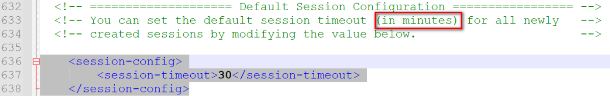

# 第六章 会话

## 6.1会话管理概述

### 6.1.1 为什么需要会话管理

http是无状态协议，对于发送过的请求或响应都不做持久化处理

### 6.1.2 会话管理的手段

cookie和session配合解决

- cookie是在客户端保留少量数据的技术，通过响应头向客户端响应一些客户端要保留的信息
- session是在服务端保留更多数据的技术，通过httpSession对象保存一些和客户端相关的信息
- cookie和session配合记录请求状态

## 6.2 Cookie

cookie是一种客户端会话技术,cookie由服务端产生,它是服务器存放在浏览器的一小份数据,浏览器以后每次访问该服务器的时候都会将这小份数据携带到服务器去。

+ 服务端创建cookie,将cookie放入响应对象中,Tomcat容器将cookie转化为set-cookie响应头,响应给客户端
+ 客户端在收到cookie的响应头时,在下次请求该服务的资源时,会以cookie请求头的形式携带之前收到的Cookie
+ cookie是一种键值对格式的数据,从tomcat8.5开始可以保存中文,但是不推荐
+ 由于cookie是存储于客户端的数据,比较容易暴露,一般不存储一些敏感或者影响安全的数据


### 6.2.1 cookie的使用

```java
@WebServlet("/cookie")
public class ServletA extends HttpServlet {
    @Override
    protected void service(HttpServletRequest req, HttpServletResponse resp) throws ServletException, IOException {
        //创建cookie
        Cookie cookie1 = new Cookie("keyA", "valueA");
        Cookie cookie2 = new Cookie("keyB", "valueB");

        resp.addCookie(cookie1);
        resp.addCookie(cookie2);

    }
}

@WebServlet("/servletB")
public class ServletB extends HttpServlet {
    @Override
    protected void service(HttpServletRequest req, HttpServletResponse resp) throws ServletException, IOException {
        Cookie[] cookies = req.getCookies();//如果没有返回cookie，返回结果为null
        for (Cookie cookie : cookies) {
            System.out.println(cookie.getName() + "=" + cookie.getValue());
        }
    }
}
```

### 6.2.2 cookie的时效性

默认情况下Cookie的有效期是一次会话范围内，我们可以通过cookie的setMaxAge()方法让Cookie持久化保存到浏览器上

-   会话级Cookie
    -   服务器端并没有明确指定Cookie的存在时间
    -   在浏览器端，Cookie数据存在于内存中
    -   只要浏览器还开着，Cookie数据就一直都在
    -   浏览器关闭，内存中的Cookie数据就会被释放
-   持久化Cookie
    -   服务器端明确设置了Cookie的存在时间
    -   在浏览器端，Cookie数据会被保存到硬盘上
    -   Cookie在硬盘上存在的时间根据服务器端限定的时间来管控，不受浏览器关闭的影响
    -   持久化Cookie到达了预设的时间会被释放

cookie.setMaxAge(int expiry)参数单位是秒，表示cookie的持久化时间，如果设置参数为0，表示将浏览器中保存的该cookie删除

### 6.2.3 cookie的提交路径

访问互联网资源时不能每次都需要把所有Cookie带上。访问不同的资源时,可以携带不同的cookie,我们可以通过cookie的setPath(String path) 对cookie的路径进行设置

```java
public class ServletA extends HttpServlet {
    @Override
    protected void service(HttpServletRequest req, HttpServletResponse resp) throws ServletException, IOException {
        // 创建Cookie
        Cookie cookie1 =new Cookie("c1","c1_message");
        // 设置cookie的提交路径
        cookie1.setPath("/web03_war_exploded/servletB");
        Cookie cookie2 =new Cookie("c2","c2_message");
        // 将cookie放入响应对象
        resp.addCookie(cookie1);
        resp.addCookie(cookie2);
    }
}
```

## 6.3 Session

### 6.3.1 session概述

HttpSession是一种保留更多信息在服务端的一种技术,服务器会为每一个客户端开辟一块内存空间,即session对象. 客户端在发送请求时,都可以使用自己的session. 这样服务端就可以通过session来记录某个客户端的状态了

+ 服务端在为客户端创建session时,会同时将session对象的id,即JSESSIONID以cookie的形式放入响应对象
+ 后端创建完session后,客户端会收到一个特殊的cookie,叫做JSESSIONID
+ 客户端下一次请求时携带JSESSIONID,后端收到后,根据JSESSIONID找到对应的session对象
+ 通过该机制,服务端通过session就可以存储一些专门针对某个客户端的信息了
+ session也是域对象(后续详细讲解)


### 6.3.2 HttpSession的使用

```java
public class ServletIn extends HttpServlet {
    @Override
    protected void service(HttpServletRequest req, HttpServletResponse resp) throws ServletException, IOException {
        //获得请求中的username对象
        String username = req.getParameter("username");

        //获得session对象
        HttpSession session = req.getSession();
        // 判断请求中有没有一个特殊的cookie JSESSIONID
        // 有：找到了：返回之前的session；没找到：创建一个新的
        // 没有：创建一个session返回，并且向response对象中存放一个JSESSIONID的cookie
        System.out.println(session.getId());
        System.out.println(session.isNew());

        //将username存入session
        session.setAttribute("username", username);
    }
}

public class SeesionOut extends HttpServlet {
    @Override
    protected void service(HttpServletRequest req, HttpServletResponse resp) throws ServletException, IOException {
        //获得session对象
        HttpSession session = req.getSession();
        System.out.println(session.getId());
        System.out.println(session.isNew());

        String username = (String)session.getAttribute("username");
        System.out.println(username);
    }
}
```

### 6.3.3 HttpSession时效性

+ 用户量很大之后，Session对象相应的也要创建很多。如果一味创建不释放，那么服务器端的内存迟早要被耗尽。
+ 客户端关闭行为无法被服务端直接侦测,或者客户端较长时间不操作也经常出现,类似这些的情况,就需要对session的时限进行设置了

默认的session最大闲置时间(两次使用同一个session中的间隔时间) 在tomcat/conf/web.xml配置为30分钟



我们可以自己在当前项目的web.xml对最大闲置时间进行重新设定


也可以通过HttpSession的API 对最大闲置时间进行设定

```java
// 设置最大闲置时间
session.setMaxInactiveInterval(60);

// 直接让session失效
session.invalidate();
```

## 6.4 三大域对象

### 6.4.1 域对象概述

域对象: 一些用于存储数据和传递数据的对象,传递数据不同的范围,我们称之为不同的域,不同的域对象代表不同的域,共享数据的范围也不同

+ web项目中,我们一定要熟练使用的域对象分别是 请求域,会话域,应用域
+ 请求域对象是HttpServletRequest ,传递数据的范围是一次请求之内及请求转发
+ 会话域对象是HttpSession,传递数据的范围是一次会话之内,可以跨多个请求
+ 应用域对象是ServletContext,传递数据的范围是本应用之内,可以跨多个会话

- 请求域

  

- 会话域

  

- 应用域

  

  

### 6.4.2 域对象的使用

| API                                         | 功能                    |
| ------------------------------------------- | ----------------------- |
| void setAttribute(String name,String value) | 向域对象中添加/修改数据 |
| Object getAttribute(String name);           | 从域对象中获取数据      |
| removeAttribute(String name);               | 移除域对象中的数据      |

```java
@WebServlet("/servletA")
public class ServletA extends HttpServlet {
    @Override
    protected void service(HttpServletRequest req, HttpServletResponse resp) throws ServletException, IOException {
        // 向请求域中放入数据
        req.setAttribute("request","request-message");
        //req.getRequestDispatcher("servletB").forward(req,resp);
        // 向会话域中放入数据
        HttpSession session = req.getSession();
        session.setAttribute("session","session-message");
        // 向应用域中放入数据
        ServletContext application = getServletContext();
        application.setAttribute("application","application-message");

    }
}

@WebServlet("/servletB")
public class ServletB extends HttpServlet {
    @Override
    protected void service(HttpServletRequest req, HttpServletResponse resp) throws ServletException, IOException {
        // 从请求域中获取数据
        String reqMessage =(String)req.getAttribute("request");
        System.out.println(reqMessage);
        
        // 从会话域中获取数据
        HttpSession session = req.getSession();
        String sessionMessage =(String)session.getAttribute("session");
        System.out.println(sessionMessage);
        // 从应用域中获取数据
        ServletContext application = getServletContext();
        String applicationMessage =(String)application.getAttribute("application");
        System.out.println(applicationMessage);
    }
}
```

# 第七章 过滤器

## 7.1 过滤器概述

+ Filter接口定义了过滤器的开发规范,所有的过滤器都要实现该接口
+ Filter的工作位置是项目中所有目标资源之前,容器在创建HttpServletRequest和HttpServletResponse对象后,会先调用Filter的doFilter方法
+ Filter的doFilter方法可以控制请求是否继续,如果放行,则请求继续,如果拒绝,则请求到此为止,由过滤器本身做出响应
+ Filter不仅可以对请求做出过滤,也可以在目标资源做出响应前,对响应再次进行处理
+ Filter是GOF中责任链模式的典型案例
+ Filter的常用应用包括但不限于: 登录权限检查,解决网站乱码,过滤敏感字符,日志记录,性能分析... ...


## 7.2 过滤器的使用

```java
public class LoggingFilter  implements Filter {

    private SimpleDateFormat dateFormat =new SimpleDateFormat("yyyy-MM-dd HH:mm:ss");
    @Override
    public void doFilter(ServletRequest servletRequest, ServletResponse servletResponse, FilterChain filterChain) throws IOException, ServletException {
        // 参数父转子
        HttpServletRequest request =(HttpServletRequest)  servletRequest;
        HttpServletResponse  response =(HttpServletResponse)  servletResponse;
        // 拼接日志文本
        String requestURI = request.getRequestURI();
        String time = dateFormat.format(new Date());
        String beforeLogging =requestURI+"在"+time+"被请求了";
        // 打印日志
        System.out.println(beforeLogging);
        // 获取系统时间
        long t1 = System.currentTimeMillis();
        // 放行请求
        filterChain.doFilter(request,response);
        // 获取系统时间
        long t2 = System.currentTimeMillis();
        //  拼接日志文本
        String afterLogging =requestURI+"在"+time+"的请求耗时:"+(t2-t1)+"毫秒";
        // 打印日志
        System.out.println(afterLogging);

    }
}
```

+ doFilter方法中的请求和响应对象是以父接口的形式声明的,实际传入的实参就是HttpServletRequest和HttpServletResponse子接口级别的,可以安全强转
+ filterChain.doFilter(request,response); 这行代码的功能是放行请求,如果没有这一行代码,则请求到此为止
+ filterChain.doFilter(request,response);在放行时需要传入request和response,意味着请求和响应对象要继续传递给后续的资源,这里没有产生新的request和response对象

```java
@WebServlet(urlPatterns = "/servletA",name = "servletAName")
public class ServletA extends HttpServlet {
    @Override
    protected void service(HttpServletRequest req, HttpServletResponse resp) throws ServletException, IOException {
        // 处理器请求
        System.out.println("servletA处理请求的方法,耗时10毫秒");
        // 模拟处理请求耗时
        try {
            Thread.sleep(10);
        } catch (InterruptedException e) {
            throw new RuntimeException(e);
        }

    }
}

@WebServlet(urlPatterns = "/servletB", name = "servletBName")
public class ServletB extends HttpServlet {
    @Override
    protected void service(HttpServletRequest req, HttpServletResponse resp) throws ServletException, IOException {
        // 处理器请求
        System.out.println("servletB处理请求的方法,耗时15毫秒");
        // 模拟处理请求耗时
        try {
            Thread.sleep(15);
        } catch (InterruptedException e) {
            throw new RuntimeException(e);
        }
    }
}
```

```xml
<?xml version="1.0" encoding="UTF-8"?>
<web-app xmlns="https://jakarta.ee/xml/ns/jakartaee"
         xmlns:xsi="http://www.w3.org/2001/XMLSchema-instance"
         xsi:schemaLocation="https://jakarta.ee/xml/ns/jakartaee https://jakarta.ee/xml/ns/jakartaee/web-app_5_0.xsd"
         version="5.0">

    <!--配置filter,并为filter起别名-->
   <filter>
       <filter-name>loggingFilter</filter-name>
       <filter-class>com.atguigu.filters.LoggingFilter</filter-class>
   </filter>
    <!--为别名对应的filter配置要过滤的目标资源-->
    <filter-mapping>
        <filter-name>loggingFilter</filter-name>
        <!--通过映射路径确定过滤资源-->
        <url-pattern>/servletA</url-pattern>
        <!--通过后缀名确定过滤资源-->
        <url-pattern>*.html</url-pattern>
        <!--通过servlet别名确定过滤资源-->
        <servlet-name>servletBName</servlet-name>

    </filter-mapping>
</web-app>
```

+ filter-mapping标签中定义了过滤器对那些资源进行过滤
+ 子标签url-pattern通过映射路径确定过滤范围
  + /servletA  精确匹配,表示对servletA资源的请求进行过滤
  + *.html 表示对以.action结尾的路径进行过滤
  + /* 表示对所有资源进行过滤
  + 一个filter-mapping下可以配置多个url-pattern
+ 子标签servlet-name通过servlet别名确定对那些servlet进行过滤
  + 使用该标签确定目标资源的前提是servlet已经起了别名
  + 一个filter-mapping下可以定义多个servlet-name
  + 一个filter-mapping下,servlet-name和url-pattern子标签可以同时存在


## 7.3 过滤器的生命周期

过滤器作为web项目的组件之一,和Servlet的生命周期类似,略有不同,没有servlet的load-on-startup的配置,默认就是系统启动立刻构造

| 阶段       | 对应方法                                                     | 执行时机      | 执行次数 |
| ---------- | ------------------------------------------------------------ | ------------- | -------- |
| 创建对象   | 构造器                                                       | web应用启动时 | 1        |
| 初始化方法 | void init(FilterConfig filterConfig)                         | 构造完毕      | 1        |
| 过滤请求   | void doFilter(ServletRequest servletRequest, ServletResponse servletResponse, FilterChain filterChain) | 每次请求      | 多次     |
| 销毁       | default void destroy()                                       | web应用关闭时 | 1次      |

```java
@WebServlet("/*")
public class LifeCycleFilter implements Filter {
    public LifeCycleFilter(){
        System.out.println("LifeCycleFilter constructor method invoked");
    }
    
    @Override
    public void init(FilterConfig filterConfig) throws ServletException {
        System.out.println(filterConfig.getInitParameter("dataTimePattern"));
        System.out.println("LifeCycleFilter init method invoked");
    }

    @Override
    public void doFilter(ServletRequest servletRequest, ServletResponse servletResponse, FilterChain filterChain) throws IOException, ServletException {
        System.out.println("LifeCycleFilter doFilter method invoked");
        filterChain.doFilter(servletRequest,servletResponse);
    }

    @Override
    public void destroy() {
        System.out.println("LifeCycleFilter destory method invoked");
    }
}
```

## 7.4 过滤器链

一个web项目中,可以同时定义多个过滤器,多个过滤器对同一个资源进行过滤时,工作位置有先后,整体形成一个工作链,称之为过滤器链

+ **过滤器链中的过滤器的顺序由filter-mapping顺序决定**
+ 每个过滤器过滤的范围不同,针对同一个资源来说,过滤器链中的过滤器个数可能是不同的
+ 如果某个Filter是使用ServletName进行匹配规则的配置，那么这个Filter执行的优先级要更低
+ 如果使用注解方式配置Filter，则调用顺序按照过滤器名称排序


## 7.5 注解方式配置过滤器

```java
@Target({ElementType.TYPE})
@Retention(RetentionPolicy.RUNTIME)
@Documented
public @interface WebFilter {
    String description() default "";

    String displayName() default "";

    WebInitParam[] initParams() default {};//初始化参数

    String filterName() default "";//过滤器名称

    String smallIcon() default "";

    String largeIcon() default "";

    String[] servletNames() default {};//通过servlet名字方式进行过滤

    String[] value() default {};//与url互为别名

    String[] urlPatterns() default {};//通过servletURL方式进行过滤

    DispatcherType[] dispatcherTypes() default {DispatcherType.REQUEST};

    boolean asyncSupported() default false;
}
```

# 第八章 监听器

## 8.1 监听器概述

专门用于对域对象对象身上发生的事件或状态改变进行监听和相应处理的对象

+ 监听器是GOF设计模式中,观察者模式的典型案例
+ 观察者模式: 当被观察的对象发生某些改变时, 观察者自动采取对应的行动的一种设计模式

+ 监听器使用的感受类似JS中的事件,被观察的对象发生某些情况时,自动触发代码的执行
+ 监听器并不监听web项目中的所有组件,仅仅是对三大域对象做相关的事件监听

监听器的分类

+ web中定义八个监听器接口作为监听器的规范,这八个接口按照不同的标准可以形成不同的分类

+ 按监听的对象划分
  + application域监听器 ServletContextListener  ServletContextAttributeListener 
  + session域监听器 HttpSessionListener  HttpSessionAttributeListener  HttpSessionBindingListener  HttpSessionActivationListener  
  + request域监听器 ServletRequestListener  ServletRequestAttributeListener 
+ 按监听的事件分
  + 域对象的创建和销毁监听器 ServletContextListener   HttpSessionListener   ServletRequestListener  
  + 域对象数据增删改事件监听器 ServletContextAttributeListener  HttpSessionAttributeListener   ServletRequestAttributeListener 
  + 其他监听器  HttpSessionBindingListener  HttpSessionActivationListener  

## 8.2 监听器的六个主要接口

### 8.2.1 application域监听器

| 方法名                                      | 作用                     |
| ------------------------------------------- | ------------------------ |
| contextInitialized(ServletContextEvent sce) | ServletContext创建时调用 |
| contextDestroyed(ServletContextEvent sce)   | ServletContext销毁时调用 |

ServletContextEvent对象代表从ServletContext对象身上捕获到的事件，通过这个事件对象我们可以获取到ServletContext对象。

ServletContextAttributeListener 监听ServletContext中属性的添加、移除和修改

| 方法名                                               | 作用                                 |
| ---------------------------------------------------- | ------------------------------------ |
| attributeAdded(ServletContextAttributeEvent scab)    | 向ServletContext中添加属性时调用     |
| attributeRemoved(ServletContextAttributeEvent scab)  | 从ServletContext中移除属性时调用     |
| attributeReplaced(ServletContextAttributeEvent scab) | 当ServletContext中的属性被修改时调用 |

ServletContextAttributeEvent对象代表属性变化事件，它包含的方法如下：

| 方法名              | 作用                     |
| ------------------- | ------------------------ |
| getName()           | 获取修改或添加的属性名   |
| getValue()          | 获取被修改或添加的属性值 |
| getServletContext() | 获取ServletContext对象   |

```java
@WebListener
public class ApplicationListener implements ServletContextListener , ServletContextAttributeListener {
    // 监听初始化
    @Override
    public void contextInitialized(ServletContextEvent sce) {
        ServletContext application = sce.getServletContext();
        System.out.println("application"+application.hashCode()+" initialized");
    }
    // 监听销毁
    @Override
    public void contextDestroyed(ServletContextEvent sce) {
        ServletContext application = sce.getServletContext();
        System.out.println("application"+application.hashCode()+" destroyed");
    }

    // 监听数据增加
    @Override
    public void attributeAdded(ServletContextAttributeEvent scae) {
        String name = scae.getName();
        Object value = scae.getValue();
        ServletContext application = scae.getServletContext();
        System.out.println("application"+application.hashCode()+" add:"+name+"="+value);
    }

    // 监听数据移除
    @Override
    public void attributeRemoved(ServletContextAttributeEvent scae) {
        String name = scae.getName();
        Object value = scae.getValue();
        ServletContext application = scae.getServletContext();
        System.out.println("application"+application.hashCode()+" remove:"+name+"="+value);
    }
    // 监听数据修改
    @Override
    public void attributeReplaced(ServletContextAttributeEvent scae) {
        String name = scae.getName();
        Object value = scae.getValue();
        ServletContext application = scae.getServletContext();
        Object newValue = application.getAttribute(name);
        System.out.println("application"+application.hashCode()+" change:"+name+"="+value+" to "+newValue);
    }


}
```

### 8.2.2 session域监听器

### 8.2.3 request域监听器

## 8.3 session域两个特殊的监听器

### 8.3.1 session绑定监听器

HttpSessionBindingListener 监听当前监听器对象在Session域中的增加与移除

| 方法名                                      | 作用                              |
| ------------------------------------------- | --------------------------------- |
| valueBound(HttpSessionBindingEvent event)   | 该类的实例被放到Session域中时调用 |
| valueUnbound(HttpSessionBindingEvent event) | 该类的实例从Session中移除时调用   |

HttpSessionBindingEvent对象代表属性变化事件，它包含的方法如下：

| 方法名       | 作用                          |
| ------------ | ----------------------------- |
| getName()    | 获取当前事件涉及的属性名      |
| getValue()   | 获取当前事件涉及的属性值      |
| getSession() | 获取触发事件的HttpSession对象 |

### 8.3.2 钝化活化监听器

HttpSessionActivationListener  监听某个对象在Session中的序列化与反序列化。

| 方法名                                    | 作用                                  |
| ----------------------------------------- | ------------------------------------- |
| sessionWillPassivate(HttpSessionEvent se) | 该类实例和Session一起钝化到硬盘时调用 |
| sessionDidActivate(HttpSessionEvent se)   | 该类实例和Session一起活化到内存时调用 |

HttpSessionEvent对象代表事件对象，通过getSession()方法获取事件涉及的HttpSession对象。

+ session对象在服务端是以对象的形式存储于内存的,session过多,服务器的内存也是吃不消的
+ 而且一旦服务器发生重启,所有的session对象都将被清除,也就意味着session中存储的不同客户端的登录状态丢失
+ 为了分摊内存 压力并且为了保证session重启不丢失,我们可以设置将session进行钝化处理
+ 在关闭服务器前或者到达了设定时间时,对session进行序列化到磁盘,这种情况叫做session的钝化
+ 在服务器启动后或者再次获取某个session时,将磁盘上的session进行反序列化到内存,这种情况叫做session的活化

# 第九章 Ajax

## 9.1 什么是Ajax

+ AJAX = Asynchronous JavaScript and XML（异步的 JavaScript 和 XML）。

+ AJAX 不是新的编程语言，而是一种使用现有标准的新方法。

+ AJAX 最大的优点是在不重新加载整个页面的情况下，可以与服务器交换数据并更新部分网页内容。

+ AJAX 不需要任何浏览器插件，但需要用户允许 JavaScript 在浏览器上执行。

+ XMLHttpRequest 只是实现 Ajax 的一种方式。

**ajax工作原理**


+ 简单来说,我们之前发的请求通过类似  form表单标签,a标签 这种方式,现在通过 运行js代码动态决定什么时候发送什么样的请求
+ 通过运行JS代码发送的请求浏览器可以不用跳转页面 ,我们可以在JS代码中决定是否要跳转页面
+ 通过运行JS代码发送的请求,接收到返回结果后,我们可以将结果通过dom编程渲染到页面的某些元素上,实现局部更新

## 9.2 原生JS实现ajax

