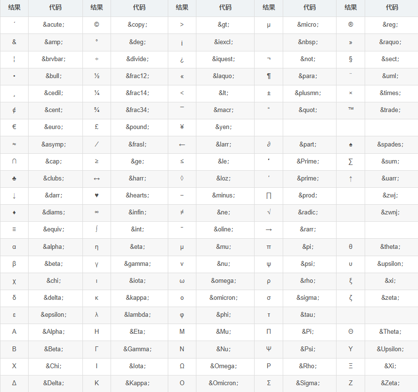
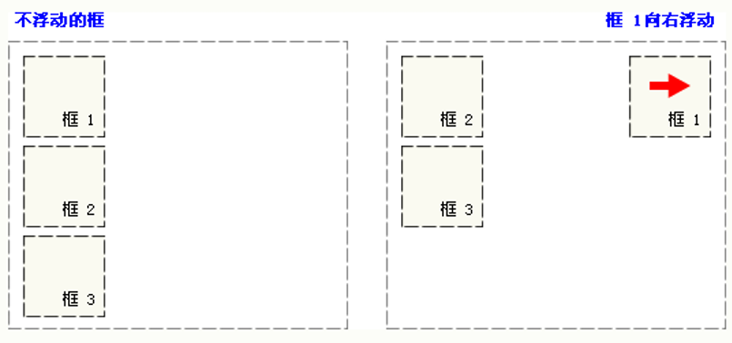
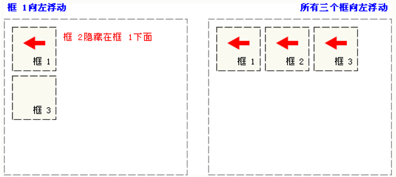
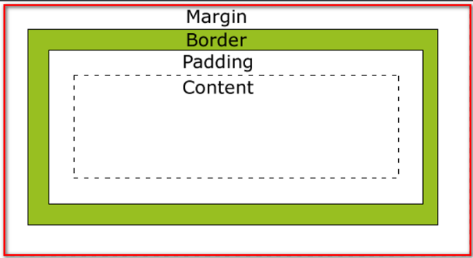
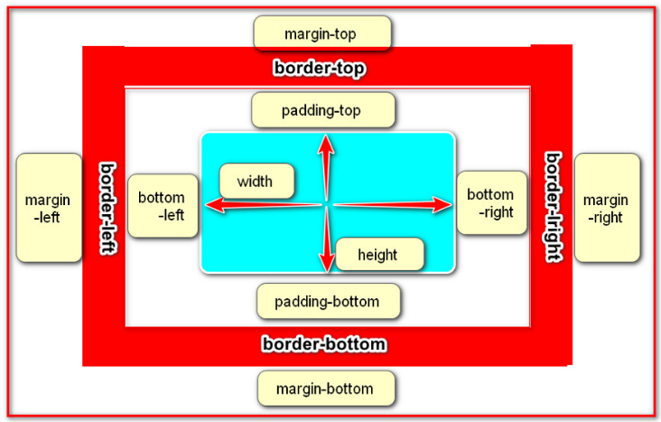
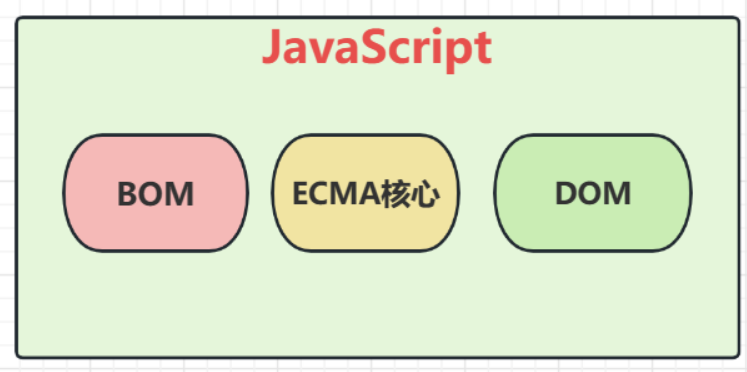
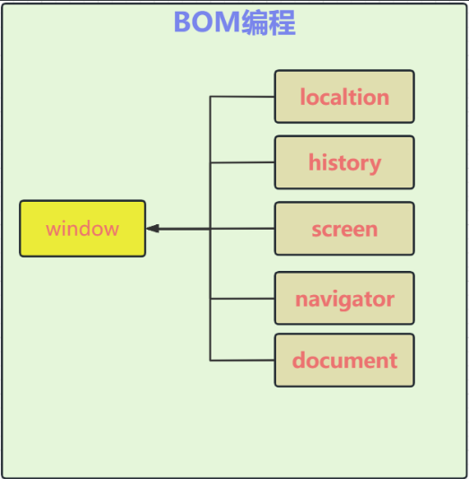
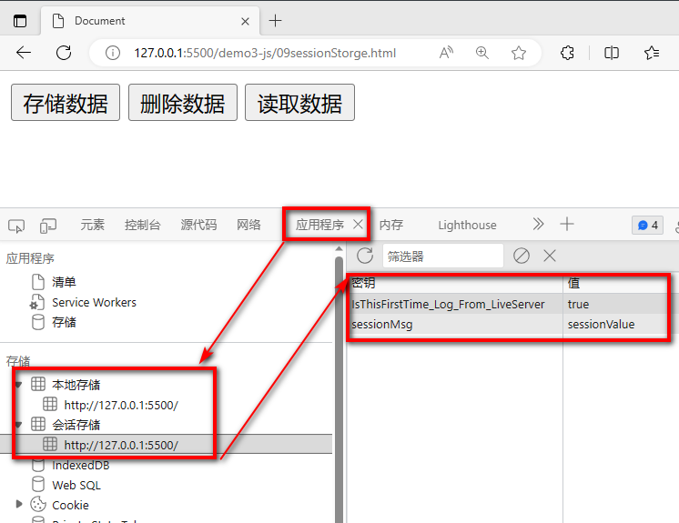
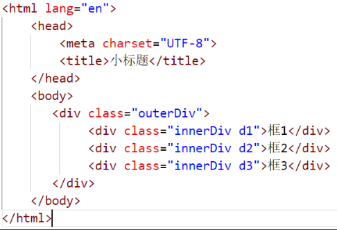
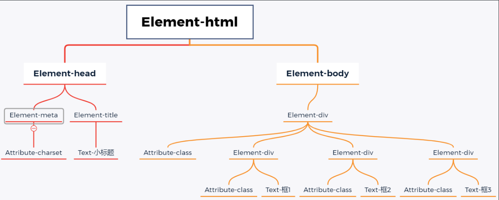

# Html

## 简介

### 基本结构

```html
<!--
	这是一个展示html基本结构的示例代码
	根标签下有两个一级子标签
	<head>头标签，定义那些不直接展示在页面主体上，但是又很不重要的内容
			字符集、css引入、js引入
	<body>体标签，定义要展示到页面主题上的标签
-->
<!DOCTYPE html>
<html>
    <head>
        <title>第一个页面</title>
        <meta charset="utf-8" />
    </head>
    <body>
        <h1>
            这是一个一级标题
        </h1>
    </body>
</html>
```

- 标签 tag	<>单双标签
- 属性 attribute 对标签特征进行一些设置
- 文本 text 双标签中间的文字
- 元素 element 开始标签+属性+文本+结束标签成为一个元素

### 语法细节

- 根标签有且只能有一个
- 单双标签都要正确关闭
- 标签可以嵌套，但不能交叉嵌套
- 属性必须有值，且必须加引号。H5不严格区分单双引号
- 标签不严格区分大小写，但不能大小写混用
- 不允许自定义标签名

## html常见标签

### 标题、段落、换行标签

```html
<!DOCTYPE html>
<html lang="en">
<head>
    <meta charset="UTF-8">
    <meta name="viewport" content="width=device-width, initial-scale=1.0">
    <title>Document</title>
</head>
<body>
    <h1>这是一个一级标题</h1>
    <h2>这是一个二级标题</h2>
    <h3>这是一个三级标题</h3>
    <!--标题标签从h1到h6-->
    <p>这是第一段
        这里不会换行
    </p>
    <p>这是第二段<br/>
        这里会换一行
    </p>
    <p>
        这是第三段<hr/>
        上面会有一个分割线
    </p>
</body>
</html>
```

### 列表标签

```html
<!--
        有序列表 ol
        无序列表 ul
        列表项   li
    -->
    <ol>
        <li>数据类型</li>
        <li>变量</li>
        <li>函数</li>
        <li>对象</li>
        <li>继承</li>
    </ol>
    <ul>
        <li>C</li>
        <li>C#</li>
        <li>C++</li>
        <li>JAVA</li>
        <li>PYTHON</li>
    </ul>
```

### 超链接标签

```html
<!--
        超链接标签
            a
                href用于定义跳转的地址
                    完整url
                    相对路径    可以以./或者../开头
                    绝对路径
                target用于定义目标资源的打开方式
                    _self在当前页面打开
                    _blank在新窗口打开
    -->
    <a href = 'https://www.baidu.com' target = '_self'>百度一下你就知道</a>
    <a href = '03列表标签.html' target = '_blank'>列表标签</a>
```

### 图片标签

```html
    <!--
        img
            src 定义图片路径
                1 url
                2 相对路径
                3 绝对路径
            title 定义鼠标悬停时的文字
            alt 图片加载失败时提示文字
    
    -->
    
```

### 表格标签

```html
<body>
    <!--
        table 整张表格
            thead 表头
            tbody 表体
            tfoot 表尾
                tr 表格中的一行
                    td 行中的一个单元格
                    th 自带加粗和居中的td
        
        如果不加tbody thead 浏览器在加载时会在所有的tr外层封装一个tbody
    
    -->

    <h3 style="text-align: center;">员工竞赛技能评分表</h3>
    <table border="1px" style="margin: 0px auto; width: 400px;">
        <thead>
            <tr>
                <th>排名</th>
                <th>姓名</th>
                <th>分数</th>
                <th>备注</th>
            </tr>
        </thead>
        <tbody>
            <tr>
                <td>1</td>
                <td>张晓明</td>
                <td>99</td>
                <td rowspan="5">前两名</td>
            </tr>
            <tr>
                <td>2</td>
                <td>立下黑</td>
                <td>98</td>
            </tr>
            <tr>
                <td>总人数</td>
                <td colspan="2">200</td>
            </tr>
            <tr>
                <td>平均分</td>
                <td colspan="2">96</td>
            </tr>
            <tr>
                <td>及格率</td>
                <td colspan="2">80%</td>
            </tr>
        </tbody>
        <tfoot></tfoot>
    </table>
</body>
```

### 表单标签

```html
<body>
    <!--
        form
            action 定义数据的提交地址
                1 url
                2 相对路径
                3 绝对路径
            method 定义数据的提交方式
                GET 默认时get
                    1. 参数会以键值对方式放在url后提交 url?key=value&key=value
                    2. 数据直接暴露在url中，不安全
                    3. url长度是有限制的，提交的数据量不大
                    4. 只能是字符，不能提交二进制数据
                    5. 效率比post高一些
                POST
                    1. 参数默认不在url中明文提交，相对安全
                    2. 数据单独打包通过请求体发送，提交的数据量相对较大
                    3. 可以传输二进制流数据
                    4. 相比于get效率略低
        表单项标签
            一定要定义name属性，该属性用于明确提交时的参数名
            还需要定义value属性，用于明确提交时的实参
        input
            type 输入信息的类型
                text 普通单行文本框
                password 密码框
                submit 提交按钮
                reset 重置按钮
    -->
    <form action="08welcome.html" method="post">
        用户名：<input type="text" name="userName" value="loong"> <br>
        密码：  <input type="password" name="password"> <br>
        <input type="submit" value="登录">
        <input type="reset" value="清空">
    </form>

</body>
```

### 表单项标签

```html
<body>
    <!--
        form
            action 定义数据的提交地址
                1 url
                2 相对路径
                3 绝对路径
            method 定义数据的提交方式
                GET 默认时get
                    1. 参数会以键值对方式放在url后提交 url?key=value&key=value
                    2. 数据直接暴露在url中，不安全
                    3. url长度是有限制的，提交的数据量不大
                    4. 只能是字符，不能提交二进制数据
                    5. 效率比post高一些
                POST
                    1. 参数默认不在url中明文提交，相对安全
                    2. 数据单独打包通过请求体发送，提交的数据量相对较大
                    3. 可以传输二进制流数据
                    4. 相比于get效率略低
        表单项标签
            一定要定义name属性，该属性用于明确提交时的参数名
            还需要定义value属性，用于明确提交时的实参
        input
            type 输入信息的类型
                text 普通单行文本框
                password 密码框
                submit 提交按钮
                reset 重置按钮
                radio 单选框
                    多个单选框使用相同的name属性值，会有互斥效果
                    check 默认勾选
                checkbox 复选框
                hidden 隐藏域 不显示在页面上，提交时会携带
                    希望用户提交一些特定信息，但是考虑安全问题，或者用户操作，不希望数据改变
                readonly 只读 提交时携带
                disable 提交时不携带
                file 选择文件
        textarea 多行文本框
        select 下拉框
            option

    -->
    <form action="08welcome.html" method="get">
        <input type="hidden" name="id" value="123">
        <input type="text" name="pid" value="456" readonly>
        <input type="text" name="pid" value="456" disabled>
        <br>
        用户名：<input type="text" name="userName" value="loong"> <br>
        密码：  <input type="password" name="password"> <br>
        性别：  <input type="radio" name="gender" value="0" checked> 男 
                <input type="radio" name="gender" value="1"> 女
                <br>
        爱好：
                <input type="checkbox" name="hobby" value="1" checked>篮球
                <input type="checkbox" name="hobby" value="2">足球
                <input type="checkbox" name="hobby" value="3">羽毛球
                <input type="checkbox" name="hobby" value="4">排球
                <input type="checkbox" name="hobby" value="5">乒乓球
                <br>
        个人简介：
                <textarea name="intro" style="width: 300px; height: 100px;"></textarea>
                <br>
        籍贯：
                <select name="pro">
                    <option value="1">京</option>
                    <option value="2">津</option>
                    <option value="3">冀</option>
                    <option value="0" selected>-请选择-</option>
                </select>
                <br>
        选择头像：
                <input type="file" name="" id="">
                <br>
            
        <input type="submit" value="登录">
        <input type="reset" value="清空">
    </form>

</body>
```

### 布局标签

```html
<body>
    <!--
        div 块元素 自己独占一行
            宽 高往往都是生效的
        span 行内元素 不会自己独占一行
            宽 高很多都是不生效的
    -->
    <div style="border: 1px solid red; width: 500px; height: 200px; margin: 10px auto;">123</div>
    <div style="border: 1px solid red; width: 500px; height: 200px; margin: 10px auto;">123</div>
    <div style="border: 1px solid red; width: 500px; height: 200px; margin: 10px auto;">123</div>
    <span style="border: 1px; width: 200px; height: 200px;">456</span>
    <div style="border: 1px solid red; width: 500px; height: 200px; margin: 10px auto;">
        2024年6月18日 星期二 <span style="font-size: 30px; color:aqua; font-weight: bold;">农历五月十三</span>1. 人力资源社会保障部：今年起，退休人员基本养老金上调3%。2. 教育部：首次上线高考志愿信息系统，免费帮考生填报志愿。
    </div>
</body>
```

### 特殊字符



# CSS

## css引入方式

```html
<head>
    <meta charset="UTF-8">
    <meta name="viewport" content="width=device-width, initial-scale=1.0">
    <title>Document</title>
    <link href="btn.css" rel="stylesheet">
</head>
<body>
    <!--
        方式1 行内式
            通过style属性引入
            缺点：代码复用度低，不利于维护
        方式2 内嵌式
            在head标签中的style标签定义本页面的公共样式
            通过选择器确定样式的作用元素
        方式3 外部样式表
            将css代码单独放入一个.css文件中，哪个html需要这些代码就在head中通过link标签引入
    -->
    <input type="button" value="按钮">
    <input type="button" value="按钮">
    <input type="button" value="按钮">
    <input type="button" value="按钮">
</body>
```

## CSS选择器

- 元素选择器

- id选择器

  #开头

- class选择器

  .开头

## 浮动

浮动设计的初衷为了解决文字环绕图片问题，浮动后一定不会将文字挡住

文档流是是文档中可显示对象在排列时所占用的位置/空间，而脱离文档流就是在页面中不占位置了。

### 原理

当把框 1 向右浮动时，它脱离文档流并且向右移动，直到它的右边缘碰到包含框的右边缘



当框 1 向左浮动时，它脱离文档流并且向左移动，直到它的左边缘碰到包含框的左边缘。因为它不再处于文档流中，所以它不占据空间，实际上覆盖住了框 2，使框 2 从视图中消失。如果把所有三个框都向左移动，那么框 1 向左浮动直到碰到包含框，另外两个框向左浮动直到碰到前一个浮动框。



```html
<head>
    <meta charset="UTF-8">
    <meta name="viewport" content="width=device-width, initial-scale=1.0">
    <title>Document</title>

    <style>
        .outerDiv{
            width: 500px;
            height: 300px;
            border: 1px solid rgb(112, 136, 112);
            background-color: beige;
        }
        .innerDiv{
            width: 100px;
            height: 100px;
            border: 1px solid blue;
            display: block;/* block块元素 inline 行内元素*/
        }
        .d1{
            background-color: greenyellow;
            float: left;
        }
        .d2{
            background-color: rgb(210, 119, 119);
        }
        .d3{
            background-color: rgb(53, 53, 209);
        }
        
    </style>
</head>
<body>
    <div class="outerDiv">
        <div class="innerDiv d1"></div>
        <div class="innerDiv d2"></div>
        <div class="innerDiv d3"></div>
    </div>
</body>
```

## 定位

position 属性指定了元素的定位类型。

```html
<head>
    <meta charset="UTF-8">
    <meta name="viewport" content="width=device-width, initial-scale=1.0">
    <title>Document</title>

    <style>
        .innerDiv{
            width: 100px;
            height: 100px;
            border: 1px solid blue;
        }
        .d1{
            background-color: greenyellow;
            position: fixed;
            top: 30px;
            left: 30px;
        }
        .d2{
            background-color: rgb(210, 119, 119);
        }
        .d3{
            background-color: rgb(53, 53, 209);
        }
        /*
        position:
            static 默认
            absolute 绝对
            relative 相对 相对元素原本的位置 原本位置不会被其他元素占用
            fixed 相对 相对浏览器窗口的位置 原本位置会被其他元素占用
        left
        right
        top
        bottom
        
        */
        
    </style>
</head>
<body>
    <div class="innerDiv d1">div1</div>
    <div class="innerDiv d2">div2</div>
    <div class="innerDiv d3">div3</div>
</body>
```

## 盒子模型

所有HTML元素可以看作盒子，在CSS中，"box model"这一术语是用来设计和布局时使用。

CSS盒模型本质上是一个盒子，封装周围的HTML元素，它包括：边距（margin），边框（border），填充（padding），和实际内容（content）



+ Margin(外边距) - 清除边框外的区域，外边距是透明的。
+ Border(边框) - 围绕在内边距和内容外的边框。
+ Padding(内边距) - 清除内容周围的区域，内边距是透明的。
+ Content(内容) - 盒子的内容，显示文本和图像。



# JavaScript

## 简介

JavaScript是一种解释型的脚本语言。不同于C、C++、Java等语言先编译后执行，JavaScript不会产生编译出来的字节码文件，而是在程序的运行过程中对源文件逐行进行解释。

JavaScript是一种基于对象的脚本语言，它不仅可以创建对象，也能使用现有的对象。但是面向对象的三大特性：『封装』、『继承』、『多态』中，JavaScript能够实现封装，可以模拟继承，不支持多态，所以它不是一门面向对象的编程语言。

JavaScript中也有明确的数据类型，但是声明一个变量后它可以接收任何类型的数据，并且会在程序执行过程中根据上下文自动转换类型。

JavaScript是一种采用事件驱动的脚本语言，它不需要经过Web服务器就可以对用户的输入做出响应

JavaScript脚本语言不依赖于操作系统，仅需要浏览器的支持。因此一个JavaScript脚本在编写后可以带到任意机器上使用，前提是机器上的浏览器支持JavaScript脚本语言。目前JavaScript已被大多数的浏览器所支持。





DOM编程就是使用document对象的API完成对网页HTML文档进行动态修改,以实现网页数据和样式动态变化效果的编程

## 引入方式

- 通过一对script标签定义脚本代码

- 引入外部脚本文件，通过一对script标签，通多scr属性引入script文件

  一对script标签不能同时引入外部文件的同时定义内部script脚本

## 数据类型和运算符

### 数据类型

- 数值类型

  数值类型统一为 number,不区分整数和浮点数

- 字符串类型

  字符串类型为 string 和JAVA中的String相似,JS中不严格区分单双引号,都可以用于表示字符串

- 布尔类型

  布尔类型为boolean 和Java中的boolean相似,但是在JS的if语句中,非空字符串会被转换为'真',非零数字也会被认为是'真'

- 引用数据类型

  引用数据类型对象是Object类型, 各种对象和数组在JS中都是Object类型

- function类型

  JS中的各种函数属于function数据类型

- 命名未赋值

  js为弱类型语言,统一使用 var 声明对象和变量,在赋值时才确定真正的数据类型,变量如果只声明没有赋值的话,数据类型为undefined

- 赋予NULL值

  在JS中,如果给一个变量赋值为null,其数据类型是Object, 可以通过typeof关键字判断数据类型

### 变量

- 弱类型变量,可以统一声明成var
- var声明的变量可以再次声明
- 变量可以使用不同的数据类型多次赋值
- JS的语句可以以; 结尾,也可以不用;结尾
- 变量标识符严格区分大小写
- 标识符的命名规则参照JAVA
- 如果使用了一个没有声明的变量,那么运行时会报uncaught ReferenceError: *** is not defined   at index.html:行号:列号
- 如果一个变量只声明,没赋值,那么值是undefined

### 运算符

- 算数运算符  + - * /  %

  其中需要注意的是 / 和 % 

  + / 在除0时,结果是Infinity ,而不是报错
  + %在模0时,结果是NaN,意思为 not a number ,而不是报错

- 复合算数运算符 ++ --  += -= *= /= %=

  符合算数运算符基本和JAVA一致,同样需要注意 /=和%=

  + 在/=0时,结果是Infinity ,而不是报错
  + 在%=0时,结果是NaN,意思为 not a number ,而不是报错

- 关系运算符  >   <  >= <= == === !=

  需要注意的是 == 和 === 差别

  + == 符号,如果两端的数据类型不一致,会尝试将两端的数据转换成number,再对比number大小
    + '123'  这种字符串可以转换成数字
    + true会被转换成1 false会被转换成0
  + ===  符号,如果两端数据类型不一致,直接返回false,数据类型一致在比较是否相同

- 逻辑运算符  || &&    

  几乎和JAVA中的一样,需要注意的是,这里直接就是短路的逻辑运算符,单个的 |   和 &  以及 ^ 是位运算符

- 条件运算符  条件? 值1  : 值2

  几乎和JAVA中的一样

- 位运算符  |  &  ^  <<  >>  >>>

  和 java中的类似

## 流程控制和函数

### if结构

这里的if结构几乎和JAVA中的一样,需要注意的是

+ if()中的非空字符串会被认为是true
+ if()中的非零数字会被认为是true

```js
if('false'){// 非空字符串 if判断为true
    console.log(true)
}else{
    console.log(false)
}
if(''){// 长度为0字符串 if判断为false
    console.log(true)
}else{
    console.log(false)
}
if(1){// 非零数字 if判断为true
    console.log(true)
}else{
    console.log(false)
}
if(0){
    console.log(true)
}else{
    console.log(false)
}
```

### switch

```js
var monthStr=prompt("请输入月份","例如:10 ");
var month= Number.parseInt(monthStr)
switch(month){
    case 3:
    case 4:
    case 5:
        console.log("春季");
        break;
    case 6:
    case 7:
    case 8:
        console.log("夏季");
        break;
    case 9:
    case 10:
    case 11:
        console.log("秋季");
        break;
    case 1:
    case 2:
    case 12:
        console.log("冬季");
        break;
    default :
        console.log("月份有误")
}
```

### while

```js
/* 打印99 乘法表 */
var i = 1;
while(i <= 9){
    var j = 1;
    while(j <= i){
        document.write(j+"*"+i+"="+i*j+"&nbsp;&nbsp;&nbsp;&nbsp;&nbsp;");
        j++;
    }
    document.write("<hr/>");
    i++;
}
```

### for

```js
for(  var i = 1;i <= 9; i++){
    for(var j = 1;j <= i;j++){
        document.write(j+"*"+i+"="+i*j+"&nbsp;&nbsp;&nbsp;&nbsp;&nbsp;");
    }
    document.write("<hr/>");
}
```

### foreach

迭代数组时,和java不一样

+ 括号中的临时变量表示的是元素的索引,不是元素的值,
+ ()中也不在使用: 分隔,而是使用 in 关键字

```js
var cities =["北京","上海","深圳","武汉","西安","成都"]
document.write("<ul>")
for(var index in  cities){
    document.write("<li>"+cities[index]+"</li>")
}
document.write("</ul>")
```

## 函数

函数说明

+ 函数没有权限控制符
+ 不用声明函数的返回值类型,需要返回在函数体中直接return即可,也无需void关键字
+ 参数列表中,无需数据类型
+ 调用函数时,实参和形参的个数可以不一致
+ 声明函数时需要用function关键字
+ 函数没有异常列表
+ 函数也可以作为参数传递给函数

```js
/* 
语法1 
    function 函数名 (参数列表){函数体}
            */
function sum(a, b){
    return a+b;
}
var result =sum(10,20);
console.log(result)

/* 
语法2
    var 函数名 = function (参数列表){函数体}
            */
var add = function(a, b){
    return a+b;
}
var result = add(1,2);
console.log(result);
```

## 对象和JSON

### 声明对象

```js
var person =new Object();
// 给对象添加属性并赋值
person.name="张小明";
person.age=10;
person.foods=["苹果","橘子","香蕉","葡萄"];
// 给对象添加功能函数
person.eat= function (){
    console.log(this.age+"岁的"+this.name+"喜欢吃:")
    for(var i = 0;i<this.foods.length;i++){
        console.log(this.foods[i])
    } 
}
//获得对象属性值
console.log(person.name)
console.log(person.age)
//调用对象方法
person.eat();
```

```js
var person ={
    "name":"张小明",
    "age":10,
    "foods":["苹果","香蕉","橘子","葡萄"],
    "eat":function (){
        console.log(this.age+"岁的"+this.name+"喜欢吃:")
        for(var i = 0;i<this.foods.length;i++){
            console.log(this.foods[i])
        } 
    }
}
//获得对象属性值
console.log(person.name)
console.log(person.age)
//调用对象方法
person.eat();
```

### JSON

JSON（JavaScript Object Notation, JS对象简谱）是一种轻量级的数据交换格式。它基于ECMAScript（European Computer Manufacturers Association, 欧洲计算机协会的一个子集，采用完全独立于编程语言的文本格式来存储和表示数据。简洁和清晰的层次结构使得 JSON 成为理想的数据交换语言。 易于人阅读和编写，同时也易于机器解析和生成，并有效地提升网络传输效率 简单来说,JSON 就是一种字符串格式,这种格式无论是在前端还是在后端,都可以很容易的转换成对象,所以常用于前后端数据传递

JSON的语法

​		var obj="{'属性名':'属性值','属性名':{'属性名':'属性值'},'属性名':['值1','值1','值3']}"

+ JSON字符串一般用于传递数据,所以字符串中的函数就显得没有意义,在此不做研究

+ 通过JSON.parse()方法可以将一个JSON串转换成对象

+ 通过JSON.stringify()方法可以将一个对象转换成一个JSON格式的字符串

+ 属性名必须用双引号包裹，属性值如果是数字可以不用

```js
/* 定义一个JSON串 */
var personStr ='{"name":"张小明","age":20,"girlFriend":{"name":"铁铃","age":23},"foods":["苹果","香蕉","橘子","葡萄"],"pets":[{"petName":"大黄","petType":"dog"},{"petName":"小花","petType":"cat"}]}'
console.log(personStr)
console.log(typeof personStr)
/* 将一个JSON串转换为对象 */
var person =JSON.parse(personStr);
console.log(person)
console.log(typeof person)
/* 获取对象属性值 */
console.log(person.name)
console.log(person.age)
console.log(person.girlFriend.name)
console.log(person.foods[1])
console.log(person.pets[1].petName)
console.log(person.pets[1].petType)
```

```js
/* 定义一个对象 */
var person={
    'name':'张小明',
    'age':20,
    'girlFriend':{
        'name':'铁铃',
        'age':23
    },
    'foods':['苹果','香蕉','橘子','葡萄'],
    'pets':[
        {
            'petName':'大黄',
            'petType':'dog'
        },
        {
            'petName':'小花',
            'petType':'cat'
        }
    ]
}

/* 获取对象属性值 */
console.log(person.name)
console.log(person.age)
console.log(person.girlFriend.name)
console.log(person.foods[1])
console.log(person.pets[1].petName)
console.log(person.pets[1].petType)
/* 将对象转换成JSON字符串 */
var personStr =JSON.stringify(person)
console.log(personStr)
console.log(typeof personStr)
```

### 常见对象

#### 数组

创建数组的四种方式

+ new Array()                                                   创建空数组
+ new Array(5)                                                 创建数组时给定长度
+ new Array(ele1,ele2,ele3,... ... ,elen);          创建数组时指定元素值
+ [ele1,ele2,ele3,... ... ,elen];                           相当于第三种语法的简写

数组的常见API

- 在JS中,数组属于Object类型,其长度是可以变化的,更像JAVA中的集合

- | 方法                                                         | 描述                                                         |
  | :----------------------------------------------------------- | :----------------------------------------------------------- |
  | [concat()](https://www.runoob.com/jsref/jsref-concat-array.html) | 连接两个或更多的数组，并返回结果。                           |
  | [copyWithin()](https://www.runoob.com/jsref/jsref-copywithin.html) | 从数组的指定位置拷贝元素到数组的另一个指定位置中。           |
  | [entries()](https://www.runoob.com/jsref/jsref-entries.html) | 返回数组的可迭代对象。                                       |
  | [every()](https://www.runoob.com/jsref/jsref-every.html)     | 检测数值元素的每个元素是否都符合条件。                       |
  | [fill()](https://www.runoob.com/jsref/jsref-fill.html)       | 使用一个固定值来填充数组。                                   |
  | [filter()](https://www.runoob.com/jsref/jsref-filter.html)   | 检测数值元素，并返回符合条件所有元素的数组。                 |
  | [find()](https://www.runoob.com/jsref/jsref-find.html)       | 返回符合传入测试（函数）条件的数组元素。                     |
  | [findIndex()](https://www.runoob.com/jsref/jsref-findindex.html) | 返回符合传入测试（函数）条件的数组元素索引。                 |
  | [forEach()](https://www.runoob.com/jsref/jsref-foreach.html) | 数组每个元素都执行一次回调函数。                             |
  | [from()](https://www.runoob.com/jsref/jsref-from.html)       | 通过给定的对象中创建一个数组。                               |
  | [includes()](https://www.runoob.com/jsref/jsref-includes.html) | 判断一个数组是否包含一个指定的值。                           |
  | [indexOf()](https://www.runoob.com/jsref/jsref-indexof-array.html) | 搜索数组中的元素，并返回它所在的位置。                       |
  | [isArray()](https://www.runoob.com/jsref/jsref-isarray.html) | 判断对象是否为数组。                                         |
  | [join()](https://www.runoob.com/jsref/jsref-join.html)       | 把数组的所有元素放入一个字符串。                             |
  | [keys()](https://www.runoob.com/jsref/jsref-keys.html)       | 返回数组的可迭代对象，包含原始数组的键(key)。                |
  | [lastIndexOf()](https://www.runoob.com/jsref/jsref-lastindexof-array.html) | 搜索数组中的元素，并返回它最后出现的位置。                   |
  | [map()](https://www.runoob.com/jsref/jsref-map.html)         | 通过指定函数处理数组的每个元素，并返回处理后的数组。         |
  | [pop()](https://www.runoob.com/jsref/jsref-pop.html)         | 删除数组的最后一个元素并返回删除的元素。                     |
  | [push()](https://www.runoob.com/jsref/jsref-push.html)       | 向数组的末尾添加一个或更多元素，并返回新的长度。             |
  | [reduce()](https://www.runoob.com/jsref/jsref-reduce.html)   | 将数组元素计算为一个值（从左到右）。                         |
  | [reduceRight()](https://www.runoob.com/jsref/jsref-reduceright.html) | 将数组元素计算为一个值（从右到左）。                         |
  | [reverse()](https://www.runoob.com/jsref/jsref-reverse.html) | 反转数组的元素顺序。                                         |
  | [shift()](https://www.runoob.com/jsref/jsref-shift.html)     | 删除并返回数组的第一个元素。                                 |
  | [slice()](https://www.runoob.com/jsref/jsref-slice-array.html) | 选取数组的一部分，并返回一个新数组。                         |
  | [some()](https://www.runoob.com/jsref/jsref-some.html)       | 检测数组元素中是否有元素符合指定条件。                       |
  | [sort()](https://www.runoob.com/jsref/jsref-sort.html)       | 对数组的元素进行排序。                                       |
  | [splice()](https://www.runoob.com/jsref/jsref-splice.html)   | 从数组中添加或删除元素。                                     |
  | [toString()](https://www.runoob.com/jsref/jsref-tostring-array.html) | 把数组转换为字符串，并返回结果。                             |
  | [unshift()](https://www.runoob.com/jsref/jsref-unshift.html) | 向数组的开头添加一个或更多元素，并返回新的长度。             |
  | [valueOf()](https://www.runoob.com/jsref/jsref-valueof-array.html) | 返回数组对象的原始值。                                       |
  | [Array.of()](https://www.runoob.com/jsref/jsref-of-array.html) | 将一组值转换为数组。                                         |
  | [Array.at()](https://www.runoob.com/jsref/jsref-at-array.html) | 用于接收一个整数值并返回该索引对应的元素，允许正数和负数。负整数从数组中的最后一个元素开始倒数。 |
  | [Array.flat()](https://www.runoob.com/jsref/jsref-flat-array.html) | 创建一个新数组，这个新数组由原数组中的每个元素都调用一次提供的函数后的返回值组成。 |
  | [Array.flatMap()](https://www.runoob.com/jsref/jsref-flatmap-array.html) | 使用映射函数映射每个元素，然后将结果压缩成一个新数组。       |

#### Boolean

| 方法                                                         | 描述                               |
| :----------------------------------------------------------- | :--------------------------------- |
| [toString()](https://www.runoob.com/jsref/jsref-tostring-boolean.html) | 把布尔值转换为字符串，并返回结果。 |
| [valueOf()](https://www.runoob.com/jsref/jsref-valueof-boolean.html) | 返回 Boolean 对象的原始值。        |

#### Date

| 方法                                                         | 描述                                                         |
| :----------------------------------------------------------- | :----------------------------------------------------------- |
| [getDate()](https://www.runoob.com/jsref/jsref-getdate.html) | 从 Date 对象返回一个月中的某一天 (1 ~ 31)。                  |
| [getDay()](https://www.runoob.com/jsref/jsref-getday.html)   | 从 Date 对象返回一周中的某一天 (0 ~ 6)。                     |
| [getFullYear()](https://www.runoob.com/jsref/jsref-getfullyear.html) | 从 Date 对象以四位数字返回年份。                             |
| [getHours()](https://www.runoob.com/jsref/jsref-gethours.html) | 返回 Date 对象的小时 (0 ~ 23)。                              |
| [getMilliseconds()](https://www.runoob.com/jsref/jsref-getmilliseconds.html) | 返回 Date 对象的毫秒(0 ~ 999)。                              |
| [getMinutes()](https://www.runoob.com/jsref/jsref-getminutes.html) | 返回 Date 对象的分钟 (0 ~ 59)。                              |
| [getMonth()](https://www.runoob.com/jsref/jsref-getmonth.html) | 从 Date 对象返回月份 (0 ~ 11)。                              |
| [getSeconds()](https://www.runoob.com/jsref/jsref-getseconds.html) | 返回 Date 对象的秒数 (0 ~ 59)。                              |
| [getTime()](https://www.runoob.com/jsref/jsref-gettime.html) | 返回 1970 年 1 月 1 日至今的毫秒数。                         |
| [getTimezoneOffset()](https://www.runoob.com/jsref/jsref-gettimezoneoffset.html) | 返回本地时间与格林威治标准时间 (GMT) 的分钟差。              |
| [getUTCDate()](https://www.runoob.com/jsref/jsref-getutcdate.html) | 根据世界时从 Date 对象返回月中的一天 (1 ~ 31)。              |
| [getUTCDay()](https://www.runoob.com/jsref/jsref-getutcday.html) | 根据世界时从 Date 对象返回周中的一天 (0 ~ 6)。               |
| [getUTCFullYear()](https://www.runoob.com/jsref/jsref-getutcfullyear.html) | 根据世界时从 Date 对象返回四位数的年份。                     |
| [getUTCHours()](https://www.runoob.com/jsref/jsref-getutchours.html) | 根据世界时返回 Date 对象的小时 (0 ~ 23)。                    |
| [getUTCMilliseconds()](https://www.runoob.com/jsref/jsref-getutcmilliseconds.html) | 根据世界时返回 Date 对象的毫秒(0 ~ 999)。                    |
| [getUTCMinutes()](https://www.runoob.com/jsref/jsref-getutcminutes.html) | 根据世界时返回 Date 对象的分钟 (0 ~ 59)。                    |
| [getUTCMonth()](https://www.runoob.com/jsref/jsref-getutcmonth.html) | 根据世界时从 Date 对象返回月份 (0 ~ 11)。                    |
| [getUTCSeconds()](https://www.runoob.com/jsref/jsref-getutcseconds.html) | 根据世界时返回 Date 对象的秒钟 (0 ~ 59)。                    |
| getYear()                                                    | 已废弃。 请使用 getFullYear() 方法代替。                     |
| [parse()](https://www.runoob.com/jsref/jsref-parse.html)     | 返回1970年1月1日午夜到指定日期（字符串）的毫秒数。           |
| [setDate()](https://www.runoob.com/jsref/jsref-setdate.html) | 设置 Date 对象中月的某一天 (1 ~ 31)。                        |
| [setFullYear()](https://www.runoob.com/jsref/jsref-setfullyear.html) | 设置 Date 对象中的年份（四位数字）。                         |
| [setHours()](https://www.runoob.com/jsref/jsref-sethours.html) | 设置 Date 对象中的小时 (0 ~ 23)。                            |
| [setMilliseconds()](https://www.runoob.com/jsref/jsref-setmilliseconds.html) | 设置 Date 对象中的毫秒 (0 ~ 999)。                           |
| [setMinutes()](https://www.runoob.com/jsref/jsref-setminutes.html) | 设置 Date 对象中的分钟 (0 ~ 59)。                            |
| [setMonth()](https://www.runoob.com/jsref/jsref-setmonth.html) | 设置 Date 对象中月份 (0 ~ 11)。                              |
| [setSeconds()](https://www.runoob.com/jsref/jsref-setseconds.html) | 设置 Date 对象中的秒钟 (0 ~ 59)。                            |
| [setTime()](https://www.runoob.com/jsref/jsref-settime.html) | setTime() 方法以毫秒设置 Date 对象。                         |
| [setUTCDate()](https://www.runoob.com/jsref/jsref-setutcdate.html) | 根据世界时设置 Date 对象中月份的一天 (1 ~ 31)。              |
| [setUTCFullYear()](https://www.runoob.com/jsref/jsref-setutcfullyear.html) | 根据世界时设置 Date 对象中的年份（四位数字）。               |
| [setUTCHours()](https://www.runoob.com/jsref/jsref-setutchours.html) | 根据世界时设置 Date 对象中的小时 (0 ~ 23)。                  |
| [setUTCMilliseconds()](https://www.runoob.com/jsref/jsref-setutcmilliseconds.html) | 根据世界时设置 Date 对象中的毫秒 (0 ~ 999)。                 |
| [setUTCMinutes()](https://www.runoob.com/jsref/jsref-setutcminutes.html) | 根据世界时设置 Date 对象中的分钟 (0 ~ 59)。                  |
| [setUTCMonth()](https://www.runoob.com/jsref/jsref-setutcmonth.html) | 根据世界时设置 Date 对象中的月份 (0 ~ 11)。                  |
| [setUTCSeconds()](https://www.runoob.com/jsref/jsref-setutcseconds.html) | setUTCSeconds() 方法用于根据世界时 (UTC) 设置指定时间的秒字段。 |
| setYear()                                                    | 已废弃。请使用 setFullYear() 方法代替。                      |
| [toDateString()](https://www.runoob.com/jsref/jsref-todatestring.html) | 把 Date 对象的日期部分转换为字符串。                         |
| toGMTString()                                                | 已废弃。请使用 toUTCString() 方法代替。                      |
| [toISOString()](https://www.runoob.com/jsref/jsref-toisostring.html) | 使用 ISO 标准返回字符串的日期格式。                          |
| [toJSON()](https://www.runoob.com/jsref/jsref-tojson.html)   | 以 JSON 数据格式返回日期字符串。                             |
| [toLocaleDateString()](https://www.runoob.com/jsref/jsref-tolocaledatestring.html) | 根据本地时间格式，把 Date 对象的日期部分转换为字符串。       |
| [toLocaleTimeString()](https://www.runoob.com/jsref/jsref-tolocaletimestring.html) | 根据本地时间格式，把 Date 对象的时间部分转换为字符串。       |
| [toLocaleString()](https://www.runoob.com/jsref/jsref-tolocalestring.html) | 根据本地时间格式，把 Date 对象转换为字符串。                 |
| [toString()](https://www.runoob.com/jsref/jsref-tostring-date.html) | 把 Date 对象转换为字符串。                                   |
| [toTimeString()](https://www.runoob.com/jsref/jsref-totimestring.html) | 把 Date 对象的时间部分转换为字符串。                         |
| [toUTCString()](https://www.runoob.com/jsref/jsref-toutcstring.html) | 根据世界时，把 Date 对象转换为字符串。实例：`var today = new Date(); var UTCstring = today.toUTCString();` |
| [UTC()](https://www.runoob.com/jsref/jsref-utc.html)         | 根据世界时返回 1970 年 1 月 1 日 到指定日期的毫秒数。        |
| [valueOf()](https://www.runoob.com/jsref/jsref-valueof-date.html) | 返回 Date 对象的原始值。                                     |

#### Math

| 方法                                                         | 描述                                                         |
| :----------------------------------------------------------- | :----------------------------------------------------------- |
| [abs(x)](https://www.runoob.com/jsref/jsref-abs.html)        | 返回 x 的绝对值。                                            |
| [acos(x)](https://www.runoob.com/jsref/jsref-acos.html)      | 返回 x 的反余弦值。                                          |
| [asin(x)](https://www.runoob.com/jsref/jsref-asin.html)      | 返回 x 的反正弦值。                                          |
| [atan(x)](https://www.runoob.com/jsref/jsref-atan.html)      | 以介于 -PI/2 与 PI/2 弧度之间的数值来返回 x 的反正切值。     |
| [atan2(y,x)](https://www.runoob.com/jsref/jsref-atan2.html)  | 返回从 x 轴到点 (x,y) 的角度（介于 -PI/2 与 PI/2 弧度之间）。 |
| [ceil(x)](https://www.runoob.com/jsref/jsref-ceil.html)      | 对数进行上舍入。                                             |
| [cos(x)](https://www.runoob.com/jsref/jsref-cos.html)        | 返回数的余弦。                                               |
| [exp(x)](https://www.runoob.com/jsref/jsref-exp.html)        | 返回 Ex 的指数。                                             |
| [floor(x)](https://www.runoob.com/jsref/jsref-floor.html)    | 对 x 进行下舍入。                                            |
| [log(x)](https://www.runoob.com/jsref/jsref-log.html)        | 返回数的自然对数（底为e）。                                  |
| [max(x,y,z,...,n)](https://www.runoob.com/jsref/jsref-max.html) | 返回 x,y,z,...,n 中的最高值。                                |
| [min(x,y,z,...,n)](https://www.runoob.com/jsref/jsref-min.html) | 返回 x,y,z,...,n中的最低值。                                 |
| [pow(x,y)](https://www.runoob.com/jsref/jsref-pow.html)      | 返回 x 的 y 次幂。                                           |
| [random()](https://www.runoob.com/jsref/jsref-random.html)   | 返回 0 ~ 1 之间的随机数。                                    |
| [round(x)](https://www.runoob.com/jsref/jsref-round.html)    | 四舍五入。                                                   |
| [sin(x)](https://www.runoob.com/jsref/jsref-sin.html)        | 返回数的正弦。                                               |
| [sqrt(x)](https://www.runoob.com/jsref/jsref-sqrt.html)      | 返回数的平方根。                                             |
| [tan(x)](https://www.runoob.com/jsref/jsref-tan.html)        | 返回角的正切。                                               |
| [tanh(x)](https://www.runoob.com/jsref/jsref-tanh.html)      | 返回一个数的双曲正切函数值。                                 |
| [trunc(x)](https://www.runoob.com/jsref/jsref-trunc.html)    | 将数字的小数部分去掉，只保留整数部分。                       |

#### Number

| 方法                                                         | 描述                                                 |
| :----------------------------------------------------------- | :--------------------------------------------------- |
| [isFinite](https://www.runoob.com/jsref/jsref-isfinite-number.html) | 检测指定参数是否为无穷大。                           |
| [isInteger](https://www.runoob.com/jsref/jsref-isinteger-number.html) | 检测指定参数是否为整数。                             |
| [isNaN](https://www.runoob.com/jsref/jsref-isnan-number.html) | 检测指定参数是否为 NaN。                             |
| [isSafeInteger](https://www.runoob.com/jsref/jsref-issafeInteger-number.html) | 检测指定参数是否为安全整数。                         |
| [toExponential(x)](https://www.runoob.com/jsref/jsref-toexponential.html) | 把对象的值转换为指数计数法。                         |
| [toFixed(x)](https://www.runoob.com/jsref/jsref-tofixed.html) | 把数字转换为字符串，结果的小数点后有指定位数的数字。 |
| [toLocaleString(locales, options)](https://www.runoob.com/jsref/jsref-tolocalestring-number.html) | 返回数字在特定语言环境下的表示字符串。               |
| [toPrecision(x)](https://www.runoob.com/jsref/jsref-toprecision.html) | 把数字格式化为指定的长度。                           |
| [toString()](https://www.runoob.com/jsref/jsref-tostring-number.html) | 把数字转换为字符串，使用指定的基数。                 |
| [valueOf()](https://www.runoob.com/jsref/jsref-valueof-number.html) | 返回一个 Number 对象的基本数字值。                   |

#### String

| 方法                                                         | 描述                                                         |
| :----------------------------------------------------------- | :----------------------------------------------------------- |
| [charAt()](https://www.runoob.com/jsref/jsref-charat.html)   | 返回在指定位置的字符。                                       |
| [charCodeAt()](https://www.runoob.com/jsref/jsref-charcodeat.html) | 返回在指定的位置的字符的 Unicode 编码。                      |
| [concat()](https://www.runoob.com/jsref/jsref-concat-string.html) | 连接两个或更多字符串，并返回新的字符串。                     |
| [endsWith()](https://www.runoob.com/jsref/jsref-endswith.html) | 判断当前字符串是否是以指定的子字符串结尾的（区分大小写）。   |
| [fromCharCode()](https://www.runoob.com/jsref/jsref-fromcharcode.html) | 将 Unicode 编码转为字符。                                    |
| [indexOf()](https://www.runoob.com/jsref/jsref-indexof.html) | 返回某个指定的字符串值在字符串中首次出现的位置。             |
| [includes()](https://www.runoob.com/jsref/jsref-string-includes.html) | 查找字符串中是否包含指定的子字符串。                         |
| [lastIndexOf()](https://www.runoob.com/jsref/jsref-lastindexof.html) | 从后向前搜索字符串，并从起始位置（0）开始计算返回字符串最后出现的位置。 |
| [match()](https://www.runoob.com/jsref/jsref-match.html)     | 查找找到一个或多个正则表达式的匹配。                         |
| [repeat()](https://www.runoob.com/jsref/jsref-repeat.html)   | 复制字符串指定次数，并将它们连接在一起返回。                 |
| [replace()](https://www.runoob.com/jsref/jsref-replace.html) | 在字符串中查找匹配的子串，并替换与正则表达式匹配的子串。     |
| [replaceAll()](https://www.runoob.com/jsref/jsref-replaceall.html) | 在字符串中查找匹配的子串，并替换与正则表达式匹配的所有子串。 |
| [search()](https://www.runoob.com/jsref/jsref-search.html)   | 查找与正则表达式相匹配的值。                                 |
| [slice()](https://www.runoob.com/jsref/jsref-slice-string.html) | 提取字符串的片断，并在新的字符串中返回被提取的部分。         |
| [split()](https://www.runoob.com/jsref/jsref-split.html)     | 把字符串分割为字符串数组。                                   |
| [startsWith()](https://www.runoob.com/jsref/jsref-startswith.html) | 查看字符串是否以指定的子字符串开头。                         |
| [substr()](https://www.runoob.com/jsref/jsref-substr.html)   | 从起始索引号提取字符串中指定数目的字符。                     |
| [substring()](https://www.runoob.com/jsref/jsref-substring.html) | 提取字符串中两个指定的索引号之间的字符。                     |
| [toLowerCase()](https://www.runoob.com/jsref/jsref-tolowercase.html) | 把字符串转换为小写。                                         |
| [toUpperCase()](https://www.runoob.com/jsref/jsref-touppercase.html) | 把字符串转换为大写。                                         |
| [trim()](https://www.runoob.com/jsref/jsref-trim.html)       | 去除字符串两边的空白。                                       |
| [toLocaleLowerCase()](https://www.runoob.com/jsref/jsref-tolocalelowercase.html) | 根据本地主机的语言环境把字符串转换为小写。                   |
| [toLocaleUpperCase()](https://www.runoob.com/jsref/jsref-tolocaleuppercase.html) | 根据本地主机的语言环境把字符串转换为大写。                   |
| [valueOf()](https://www.runoob.com/jsref/jsref-valueof-string.html) | 返回某个字符串对象的原始值。                                 |
| [toString()](https://www.runoob.com/jsref/jsref-tostring.html) | 返回一个字符串。                                             |

## 事件的绑定

### 事件

#### 鼠标事件

| 属性                                                         | 描述                                   |
| :----------------------------------------------------------- | :------------------------------------- |
| [onclick](https://www.runoob.com/jsref/event-onclick.html)   | 当用户点击某个对象时调用的事件句柄。   |
| [oncontextmenu](https://www.runoob.com/jsref/event-oncontextmenu.html) | 在用户点击鼠标右键打开上下文菜单时触发 |
| [ondblclick](https://www.runoob.com/jsref/event-ondblclick.html) | 当用户双击某个对象时调用的事件句柄。   |
| [onmousedown](https://www.runoob.com/jsref/event-onmousedown.html) | 鼠标按钮被按下。                       |
| [onmouseenter](https://www.runoob.com/jsref/event-onmouseenter.html) | 当鼠标指针移动到元素上时触发。         |
| [onmouseleave](https://www.runoob.com/jsref/event-onmouseleave.html) | 当鼠标指针移出元素时触发               |
| [onmousemove](https://www.runoob.com/jsref/event-onmousemove.html) | 鼠标被移动。                           |
| [onmouseover](https://www.runoob.com/jsref/event-onmouseover.html) | 鼠标移到某元素之上。                   |
| [onmouseout](https://www.runoob.com/jsref/event-onmouseout.html) | 鼠标从某元素移开。                     |
| [onmouseup](https://www.runoob.com/jsref/event-onmouseup.html) | 鼠标按键被松开。                       |

#### 键盘事件

| 属性                                                         | 描述                       |
| :----------------------------------------------------------- | :------------------------- |
| [onkeydown](https://www.runoob.com/jsref/event-onkeydown.html) | 某个键盘按键被按下。       |
| [onkeypress](https://www.runoob.com/jsref/event-onkeypress.html) | 某个键盘按键被按下并松开。 |
| [onkeyup](https://www.runoob.com/jsref/event-onkeyup.html)   | 某个键盘按键被松开。       |

#### 表单事件

| 属性                                                         | 描述                                                         |
| :----------------------------------------------------------- | :----------------------------------------------------------- |
| [onblur](https://www.runoob.com/jsref/event-onblur.html)     | 元素失去焦点时触发                                           |
| [onchange](https://www.runoob.com/jsref/event-onchange.html) | 该事件在表单元素的内容改变时触发( <input>, <keygen>, <select>, 和 <textarea>) |
| [onfocus](https://www.runoob.com/jsref/event-onfocus.html)   | 元素获取焦点时触发                                           |
| [onfocusin](https://www.runoob.com/jsref/event-onfocusin.html) | 元素即将获取焦点时触发                                       |
| [onfocusout](https://www.runoob.com/jsref/event-onfocusout.html) | 元素即将失去焦点时触发                                       |
| [oninput](https://www.runoob.com/jsref/event-oninput.html)   | 元素获取用户输入时触发                                       |
| [onreset](https://www.runoob.com/jsref/event-onreset.html)   | 表单重置时触发                                               |
| [onsearch](https://www.runoob.com/jsref/event-onsearch.html) | 用户向搜索域输入文本时触发 ( <input="search">)               |
| [onselect](https://www.runoob.com/jsref/event-onselect.html) | 用户选取文本时触发 ( <input> 和 <textarea>)                  |
| [onsubmit](https://www.runoob.com/jsref/event-onsubmit.html) | 表单提交时触发                                               |

### 事件的绑定

#### 通过属性绑定

```html
<head>
        <meta charset="UTF-8">
        <title>小标题</title>
      
        <script>
            function testDown1(){
                console.log("down1")
            }
            function testDown2(){
                console.log("down2")
            }
            function testFocus(){
                console.log("获得焦点")
            }

            function testBlur(){
                console.log("失去焦点")
            }
            function testChange(input){
                console.log("内容改变")
                console.log(input.value);
            }
            function testMouseOver(){
                console.log("鼠标悬停")
            }
            function testMouseLeave(){
                console.log("鼠标离开")
            }
            function testMouseMove(){
                console.log("鼠标移动")
            }
        </script>
    </head>

    <body>
        <input type="text" 
        onkeydown="testDown1(),testDown2()"
        onfocus="testFocus()" 
        onblur="testBlur()" 
        onchange="testChange(this)"
        onmouseover="testMouseOver()" 
        onmouseleave="testMouseLeave()" 
        onmousemove="testMouseMove()" 
         />
    </body>
```

+ 通过事件属性绑定函数,在行为发生时会自动执行函数
+ 一个事件可以同时绑定多个函数

+ 一个元素可以同时绑定多个事件
+ 方法中可以传入 this对象,代表当前元素

#### 通过DOM绑定

```html
    <head>
        <meta charset="UTF-8">
        <title>小标题</title>
      
        <script>
            // 页面加载完毕事件,浏览器加载完整个文档行为
            window.onload=function(){
                var in1 =document.getElementById("in1");
                // 通过DOM编程绑定事件
                in1.onchange=testChange
            }
            function testChange(){
                console.log("内容改变")
                console.log(event.target.value);
            }
        </script>
    </head>

    <body>
        <input id="in1" type="text" />
    </body>
```

### 事件触发

#### 行为触发

#### DOM触发

```html
    <head>
        <meta charset="UTF-8">
        <title>小标题</title>
      
        <script>
            // 页面加载完毕事件,浏览器加载完整个文档行为
            window.onload=function(){
                var in1 =document.getElementById("in1");
                // 通过DOM编程绑定事件
                in1.onchange=testChange

                var btn1 =document.getElementById("btn1");
                btn1.onclick=function (){
                    console.log("按钮点击了")
                    // 调用事件方法触发事件
                    in1.onchange()
                }
            }
            function testChange(){
                console.log("内容改变")
                console.log(event.target.value);
            }
        </script>
    </head>

    <body>
        <input id="in1" type="text" />
        <br>
        <button id="btn1">按钮</button>
    </body>
```

## BOM编程

+ BOM是Browser Object Model的简写，即浏览器对象模型。

+ BOM由一系列对象组成，是访问、控制、修改浏览器的属性和方法(通过window对象及属性的一系列方法 控制浏览器行为的一种编程)

+ BOM没有统一的标准(每种客户端都可以自定标准)。

+ BOM编程是将浏览器窗口的各个组成部分抽象成各个对象,通过各个对象的API操作组件行为的一种编程

+ BOM编程的对象结构如下

  + window 顶级对象,代表整个浏览器窗口
    + location对象                 window对象的属性之一,代表浏览器的地址栏
    + history对象                   window对象的属性之一,代表浏览器的访问历史
    + screen对象                    window对象的属性之一,代表屏幕
    + navigator对象               window对象的属性之一,代表浏览器软件本身
    + document对象              window对象的属性之一,代表浏览器窗口目前解析的html文档
    + console对象                  window对象的属性之一,代表浏览器开发者工具的控制台
    + localStorage对象          window对象的属性之一,代表浏览器的本地数据持久化存储
    + sessionStorage对象      window对象的属性之一,代表浏览器的本地数据会话级存储

### window对象的常见属性

| 属性                                                         | 描述                                                         |
| :----------------------------------------------------------- | :----------------------------------------------------------- |
| [closed](https://www.runoob.com/jsref/prop-win-closed.html)  | 返回窗口是否已被关闭。                                       |
| [defaultStatus](https://www.runoob.com/jsref/prop-win-defaultstatus.html) | 设置或返回窗口状态栏中的默认文本。                           |
| [document](https://www.runoob.com/jsref/dom-obj-document.html) | 对 Document 对象的只读引用。(请参阅[对象](https://www.runoob.com/jsref/dom-obj-document.html)) |
| [frames](https://www.runoob.com/jsref/prop-win-frames.html)  | 返回窗口中所有命名的框架。该集合是 Window 对象的数组，每个 Window 对象在窗口中含有一个框架。 |
| [history](https://www.runoob.com/jsref/obj-history.html)     | 对 History 对象的只读引用。请参数 [History 对象](https://www.runoob.com/jsref/obj-history.html)。 |
| [innerHeight](https://www.runoob.com/jsref/prop-win-innerheight.html) | 返回窗口的文档显示区的高度。                                 |
| [innerWidth](https://www.runoob.com/jsref/prop-win-innerheight.html) | 返回窗口的文档显示区的宽度。                                 |
| [localStorage](https://www.runoob.com/jsref/prop-win-localstorage.html) | 在浏览器中存储 key/value 对。没有过期时间。                  |
| [length](https://www.runoob.com/jsref/prop-win-length.html)  | 设置或返回窗口中的框架数量。                                 |
| [location](https://www.runoob.com/jsref/obj-location.html)   | 用于窗口或框架的 Location 对象。请参阅 [Location 对象](https://www.runoob.com/jsref/obj-location.html)。 |
| [name](https://www.runoob.com/jsref/prop-win-name.html)      | 设置或返回窗口的名称。                                       |
| [navigator](https://www.runoob.com/jsref/obj-navigator.html) | 对 Navigator 对象的只读引用。请参数 [Navigator 对象](https://www.runoob.com/jsref/obj-navigator.html)。 |
| [opener](https://www.runoob.com/jsref/prop-win-opener.html)  | 返回对创建此窗口的窗口的引用。                               |
| [outerHeight](https://www.runoob.com/jsref/prop-win-outerheight.html) | 返回窗口的外部高度，包含工具条与滚动条。                     |
| [outerWidth](https://www.runoob.com/jsref/prop-win-outerheight.html) | 返回窗口的外部宽度，包含工具条与滚动条。                     |
| [pageXOffset](https://www.runoob.com/jsref/prop-win-pagexoffset.html) | 设置或返回当前页面相对于窗口显示区左上角的 X 位置。          |
| [pageYOffset](https://www.runoob.com/jsref/prop-win-pagexoffset.html) | 设置或返回当前页面相对于窗口显示区左上角的 Y 位置。          |
| [parent](https://www.runoob.com/jsref/prop-win-parent.html)  | 返回父窗口。                                                 |
| [screen](https://www.runoob.com/jsref/obj-screen.html)       | 对 Screen 对象的只读引用。请参数 [Screen 对象](https://www.runoob.com/jsref/obj-screen.html)。 |
| [screenLeft](https://www.runoob.com/jsref/prop-win-screenleft.html) | 返回相对于屏幕窗口的x坐标                                    |
| [screenTop](https://www.runoob.com/jsref/prop-win-screenleft.html) | 返回相对于屏幕窗口的y坐标                                    |
| [screenX](https://www.runoob.com/jsref/prop-win-screenx.html) | 返回相对于屏幕窗口的x坐标                                    |
| [sessionStorage](https://www.runoob.com/jsref/prop-win-sessionstorage.html) | 在浏览器中存储 key/value 对。 在关闭窗口或标签页之后将会删除这些数据。 |
| [screenY](https://www.runoob.com/jsref/prop-win-screenx.html) | 返回相对于屏幕窗口的y坐标                                    |
| [self](https://www.runoob.com/jsref/prop-win-self.html)      | 返回对当前窗口的引用。等价于 Window 属性。                   |
| [status](https://www.runoob.com/jsref/prop-win-status.html)  | 设置窗口状态栏的文本。                                       |
| [top](https://www.runoob.com/jsref/prop-win-top.html)        | 返回最顶层的父窗口。                                         |

### window对象的常见方法

| 方法                                                         | 描述                                                         |
| :----------------------------------------------------------- | :----------------------------------------------------------- |
| [alert()](https://www.runoob.com/jsref/met-win-alert.html)   | 显示带有一段消息和一个确认按钮的警告框。                     |
| [atob()](https://www.runoob.com/jsref/met-win-atob.html)     | 解码一个 base-64 编码的字符串。                              |
| [btoa()](https://www.runoob.com/jsref/met-win-btoa.html)     | 创建一个 base-64 编码的字符串。                              |
| [blur()](https://www.runoob.com/jsref/met-win-blur.html)     | 把键盘焦点从顶层窗口移开。                                   |
| [clearInterval()](https://www.runoob.com/jsref/met-win-clearinterval.html) | 取消由 setInterval() 设置的 timeout。                        |
| [clearTimeout()](https://www.runoob.com/jsref/met-win-cleartimeout.html) | 取消由 setTimeout() 方法设置的 timeout。                     |
| [close()](https://www.runoob.com/jsref/met-win-close.html)   | 关闭浏览器窗口。                                             |
| [confirm()](https://www.runoob.com/jsref/met-win-confirm.html) | 显示带有一段消息以及确认按钮和取消按钮的对话框。             |
| [createPopup()](https://www.runoob.com/jsref/met-win-createpopup.html) | 创建一个 pop-up 窗口。                                       |
| [focus()](https://www.runoob.com/jsref/met-win-focus.html)   | 把键盘焦点给予一个窗口。                                     |
| [getSelection](https://www.runoob.com/jsref/met-win-getselection.html)() | 返回一个 Selection 对象，表示用户选择的文本范围或光标的当前位置。 |
| [getComputedStyle()](https://www.runoob.com/jsref/jsref-getcomputedstyle.html) | 获取指定元素的 CSS 样式。                                    |
| [matchMedia()](https://www.runoob.com/jsref/met-win-matchmedia.html) | 该方法用来检查 media query 语句，它返回一个 MediaQueryList对象。 |
| [moveBy()](https://www.runoob.com/jsref/met-win-moveby.html) | 可相对窗口的当前坐标把它移动指定的像素。                     |
| [moveTo()](https://www.runoob.com/jsref/met-win-moveto.html) | 把窗口的左上角移动到一个指定的坐标。                         |
| [open()](https://www.runoob.com/jsref/met-win-open.html)     | 打开一个新的浏览器窗口或查找一个已命名的窗口。               |
| [print()](https://www.runoob.com/jsref/met-win-print.html)   | 打印当前窗口的内容。                                         |
| [prompt()](https://www.runoob.com/jsref/met-win-prompt.html) | 显示可提示用户输入的对话框。                                 |
| [resizeBy()](https://www.runoob.com/jsref/met-win-resizeby.html) | 按照指定的像素调整窗口的大小。                               |
| [resizeTo()](https://www.runoob.com/jsref/met-win-resizeto.html) | 把窗口的大小调整到指定的宽度和高度。                         |
| scroll()                                                     | 已废弃。 该方法已经使用了 [scrollTo()](https://www.runoob.com/jsref/met-win-scrollto.html) 方法来替代。 |
| [scrollBy()](https://www.runoob.com/jsref/met-win-scrollby.html) | 按照指定的像素值来滚动内容。                                 |
| [scrollTo()](https://www.runoob.com/jsref/met-win-scrollto.html) | 把内容滚动到指定的坐标。                                     |
| [setInterval()](https://www.runoob.com/jsref/met-win-setinterval.html) | 按照指定的周期（以毫秒计）来调用函数或计算表达式。           |
| [setTimeout()](https://www.runoob.com/jsref/met-win-settimeout.html) | 在指定的毫秒数后调用函数或计算表达式。                       |
| [stop()](https://www.runoob.com/jsref/met-win-stop.html)     | 停止页面载入。                                               |
| [postMessage()](https://www.runoob.com/jsref/met-win-postmessage.html) | 安全地实现跨源通信。                                         |

### 通过BOM编程控制浏览器行为演示

#### 三种弹窗


```html
    <head>
        <meta charset="UTF-8">
        <title>小标题</title>
      
        <script>
           function testAlert(){
                //普通信息提示框
                window.alert("提示信息");
           }
           function testConfirm(){
                //确认框
                var con =confirm("确定要删除吗?");
                if(con){
                    //window.可以省略不写
                    alert("点击了确定")
                }else{
                    alert("点击了取消")
                }
           }
           function testPrompt(){
                //信息输入对话框
                var res =prompt("请输入昵称","例如:张三");
                alert("您输入的是:"+res)
           }
        </script>
    </head>

    <body>
        <input type="button" value="提示框" onclick="testAlert()"/> <br>
        <input type="button" value="确认框" onclick="testConfirm()"/> <br>
        <input type="button" value="对话框" onclick="testPrompt()"/> <br>
    </body>
```

#### 页面跳转

```html
    <head>
        <meta charset="UTF-8">
        <title>小标题</title>
      
        <script>
           function goAtguigu(){
                var flag =confirm("即将跳转到尚硅谷官网,本页信息即将丢失,确定吗?")
                if(flag){
                    // 通过BOM编程地址栏url切换
                    window.location.href="http://www.atguigu.com"
                }
           }
          
        </script>
    </head>

    <body>
        <input type="button" value="跳转到尚硅谷" onclick="goAtguigu()"/> <br>
    </body>
```

### 通过BOM编程实现会话级和持久级数据存储

+ 会话级数据 : 内存型数据,是浏览器在内存上临时存储的数据,浏览器关闭后,数据失去,通过window的sessionStorge属性实现
+ 持久级数据 : 磁盘型数据,是浏览器在磁盘上持久存储的数据,浏览器关闭后,数据仍在,通过window的localStorge实现
+ 可以用于将来存储一些服务端响应回来的数据,比如:token令牌,或者一些其他功能数据,根据数据的业务范围我们可以选择数据存储的会话/持久 级别

```html
<!DOCTYPE html>
<html lang="en">
<head>
    <meta charset="UTF-8">
    <meta name="viewport" content="width=device-width, initial-scale=1.0">
    <title>Document</title>
    <script>
        function saveItem(){
            // 让浏览器存储一些会话级数据
            window.sessionStorage.setItem("sessionMsg","sessionValue")
            // 让浏览器存储一些持久级数据
            window.localStorage.setItem("localMsg","localValue")

            console.log("haha")
        }

        function removeItem(){
            // 删除数据
            sessionStorage.removeItem("sessionMsg")
            localStorage.removeItem("localMsg")
        }

        function readItem(){
            console.log("read")
            // 读取数据
            console.log("session:"+sessionStorage.getItem("sessionMsg"))
            console.log("local:"+localStorage.getItem("localMsg"))
        }
    </script>
</head>
<body>

    <button onclick="saveItem()">存储数据</button>
    <button onclick="removeItem()">删除数据</button>
    <button onclick="readItem()">读取数据</button>

</body>
</html>
```



## DOM编程

简单来说:DOM(Document Object Model)编程就是使用document对象的API完成对网页HTML文档进行动态修改,以实现网页数据和样式动态变化效果的编程.

+ document对象代表整个html文档，可用来访问页面中的所有元素
+ 根据HTML代码结构特点,document对象本身是一种树形结构的文档对象。



上面的代码生成的树如下



dom树中节点的类型

+ node  节点,所有结点的父类型
  + element   元素节点,node的子类型之一,代表一个完整标签
  + attribute  属性节点,node的子类型之一,代表元素的属性
  + text          文本节点,node的子类型之一,代表双标签中间的文本

### 获取页面元素的几种方式

#### 在整个文档范围内查找元素结点

| 功能               | API                                     | 返回值           |
| ------------------ | --------------------------------------- | ---------------- |
| 根据id值查询       | document.getElementById(“id值”)         | 一个具体的元素节 |
| 根据标签名查询     | document.getElementsByTagName(“标签名”) | 元素节点数组     |
| 根据name属性值查询 | document.getElementsByName(“name值”)    | 元素节点数组     |
| 根据类名查询       | document.getElementsByClassName("类名") | 元素节点数组     |

#### 在具体元素节点范围内查找子节点

| 功能               | API                       | 返回值         |
| ------------------ | ------------------------- | -------------- |
| 查找子标签         | element.children          | 返回子标签数组 |
| 查找第一个子标签   | element.firstElementChild | 标签对象       |
| 查找最后一个子标签 | element.lastElementChild  | 节点对象       |

#### 查找指定子元素节点的父节点

| 功能                     | API                   | 返回值   |
| ------------------------ | --------------------- | -------- |
| 查找指定元素节点的父标签 | element.parentElement | 标签对象 |

#### 查找指定元素节点的兄弟节点

| 功能               | API                         | 返回值   |
| ------------------ | --------------------------- | -------- |
| 查找前一个兄弟标签 | node.previousElementSibling | 标签对象 |
| 查找后一个兄弟标签 | node.nextElementSibling     | 标签对象 |

### 操作元素属性值

#### 属性操作

| 需求       | 操作方式                   |
| ---------- | -------------------------- |
| 读取属性值 | 元素对象.属性名            |
| 修改属性值 | 元素对象.属性名=新的属性值 |

#### 内部文本操作

| 需求                         | 操作方式          |
| ---------------------------- | ----------------- |
| 获取或者设置标签体的文本内容 | element.innerText |
| 获取或者设置标签体的内容     | element.innerHTML |

### 增删元素

#### 对页面的元素进行增删操作

| API                                      | 功能                                       |
| ---------------------------------------- | ------------------------------------------ |
| document.createElement(“标签名”)         | 创建元素节点并返回，但不会自动添加到文档中 |
| document.createTextNode(“文本值”)        | 创建文本节点并返回，但不会自动添加到文档中 |
| element.appendChild(ele)                 | 将ele添加到element所有子节点后面           |
| parentEle.insertBefore(newEle,targetEle) | 将newEle插入到targetEle前面                |
| parentEle.replaceChild(newEle, oldEle)   | 用新节点替换原有的旧子节点                 |
| element.remove()                         | 删除某个标签                               |

## 正则表达式

正则表达式是描述字符模式的对象。正则表达式用于对字符串模式匹配及检索替换，是对字符串执行模式匹配的强大工具。

```js
var patt=new RegExp(pattern,modifiers);
或者更简单的方式:
var patt=/pattern/modifiers; 
```

### 修饰符

| 修饰符                                             | 描述                                                     |
| :------------------------------------------------- | :------------------------------------------------------- |
| [i](https://www.runoob.com/js/jsref-regexp-i.html) | 执行对大小写不敏感的匹配。                               |
| [g](https://www.runoob.com/js/jsref-regexp-g.html) | 执行全局匹配（查找所有匹配而非在找到第一个匹配后停止）。 |
| m                                                  | 执行多行匹配。                                           |

### 方括号

| 表达式                                                       | 描述                               |
| :----------------------------------------------------------- | :--------------------------------- |
| [[abc\]](https://www.runoob.com/jsref/jsref-regexp-charset.html) | 查找方括号之间的任何字符。         |
| [[^abc\]](https://www.runoob.com/jsref/jsref-regexp-charset-not.html) | 查找任何不在方括号之间的字符。     |
| [0-9]                                                        | 查找任何从 0 至 9 的数字。         |
| [a-z]                                                        | 查找任何从小写 a 到小写 z 的字符。 |
| [A-Z]                                                        | 查找任何从大写 A 到大写 Z 的字符。 |
| [A-z]                                                        | 查找任何从大写 A 到小写 z 的字符。 |
| [adgk]                                                       | 查找给定集合内的任何字符。         |
| [^adgk]                                                      | 查找给定集合外的任何字符。         |
| (red\|blue\|green)                                           | 查找任何指定的选项。               |

### 元字符

| 元字符                                                       | 描述                                        |
| :----------------------------------------------------------- | :------------------------------------------ |
| [.](https://www.runoob.com/jsref/jsref-regexp-dot.html)      | 查找单个字符，除了换行和行结束符。          |
| [\w](https://www.runoob.com/jsref/jsref-regexp-wordchar.html) | 查找数字、字母及下划线。                    |
| [\W](https://www.runoob.com/jsref/jsref-regexp-wordchar-non.html) | 查找非单词字符。                            |
| [\d](https://www.runoob.com/jsref/jsref-regexp-digit.html)   | 查找数字。                                  |
| [\D](https://www.runoob.com/jsref/jsref-regexp-digit-non.html) | 查找非数字字符。                            |
| [\s](https://www.runoob.com/jsref/jsref-regexp-whitespace.html) | 查找空白字符。                              |
| [\S](https://www.runoob.com/jsref/jsref-regexp-whitespace-non.html) | 查找非空白字符。                            |
| [\b](https://www.runoob.com/jsref/jsref-regexp-begin.html)   | 匹配单词边界。                              |
| [\B](https://www.runoob.com/jsref/jsref-regexp-begin-not.html) | 匹配非单词边界。                            |
| \0                                                           | 查找 NULL 字符。                            |
| [\n](https://www.runoob.com/jsref/jsref-regexp-newline.html) | 查找换行符。                                |
| \f                                                           | 查找换页符。                                |
| \r                                                           | 查找回车符。                                |
| \t                                                           | 查找制表符。                                |
| \v                                                           | 查找垂直制表符。                            |
| [\xxx](https://www.runoob.com/jsref/jsref-regexp-octal.html) | 查找以八进制数 xxx 规定的字符。             |
| [\xdd](https://www.runoob.com/jsref/jsref-regexp-hex.html)   | 查找以十六进制数 dd 规定的字符。            |
| [\uxxxx](https://www.runoob.com/jsref/jsref-regexp-unicode-hex.html) | 查找以十六进制数 xxxx 规定的 Unicode 字符。 |

### 量词

| 量词                                                         | 描述                                                         |
| :----------------------------------------------------------- | :----------------------------------------------------------- |
| [n+](https://www.runoob.com/jsref/jsref-regexp-onemore.html) | 匹配任何包含至少一个 n 的字符串。例如，/a+/ 匹配 "candy" 中的 "a"，"caaaaaaandy" 中所有的 "a"。 |
| [n*](https://www.runoob.com/jsref/jsref-regexp-zeromore.html) | 匹配任何包含零个或多个 n 的字符串。例如，/bo*/ 匹配 "A ghost booooed" 中的 "boooo"，"A bird warbled" 中的 "b"，但是不匹配 "A goat grunted"。 |
| [n?](https://www.runoob.com/jsref/jsref-regexp-zeroone.html) | 匹配任何包含零个或一个 n 的字符串。例如，/e?le?/ 匹配 "angel" 中的 "el"，"angle" 中的 "le"。 |
| [n{X}](https://www.runoob.com/jsref/jsref-regexp-nx.html)    | 匹配包含 X 个 n 的序列的字符串。例如，/a{2}/ 不匹配 "candy," 中的 "a"，但是匹配 "caandy," 中的两个 "a"，且匹配 "caaandy." 中的前两个 "a"。 |
| [n{X,}](https://www.runoob.com/jsref/jsref-regexp-nxcomma.html) | X 是一个正整数。前面的模式 n 连续出现至少 X 次时匹配。例如，/a{2,}/ 不匹配 "candy" 中的 "a"，但是匹配 "caandy" 和 "caaaaaaandy." 中所有的 "a"。 |
| [n{X,Y}](https://www.runoob.com/jsref/jsref-regexp-nxy.html) | X 和 Y 为正整数。前面的模式 n 连续出现至少 X 次，至多 Y 次时匹配。例如，/a{1,3}/ 不匹配 "cndy"，匹配 "candy," 中的 "a"，"caandy," 中的两个 "a"，匹配 "caaaaaaandy" 中的前面三个 "a"。注意，当匹配 "caaaaaaandy" 时，即使原始字符串拥有更多的 "a"，匹配项也是 "aaa"。 |
| [n$](https://www.runoob.com/jsref/jsref-regexp-ndollar.html) | 匹配任何结尾为 n 的字符串。                                  |
| [^n](https://www.runoob.com/jsref/jsref-regexp-ncaret.html)  | 匹配任何开头为 n 的字符串。                                  |
| [?=n](https://www.runoob.com/jsref/jsref-regexp-nfollow.html) | 匹配任何其后紧接指定字符串 n 的字符串。                      |
| [?!n](https://www.runoob.com/jsref/jsref-regexp-nfollow-not.html) | 匹配任何其后没有紧接指定字符串 n 的字符串。                  |

### RegExp对象方法

| 方法                                                         | 描述                                               |
| :----------------------------------------------------------- | :------------------------------------------------- |
| [compile](https://www.runoob.com/jsref/jsref-regexp-compile.html) | 在 1.5 版本中已废弃。 编译正则表达式。             |
| [exec](https://www.runoob.com/jsref/jsref-exec-regexp.html)  | 检索字符串中指定的值。返回找到的值，并确定其位置。 |
| [test](https://www.runoob.com/jsref/jsref-test-regexp.html)  | 检索字符串中指定的值。返回 true 或 false。         |
| [toString](https://www.runoob.com/jsref/jsref-regexp-tostring.html) | 返回正则表达式的字符串。                           |

### 支持正则的String的方法

| 方法                                                    | 描述                             |
| :------------------------------------------------------ | :------------------------------- |
| [search](https://www.runoob.com/js/jsref-search.html)   | 检索与正则表达式相匹配的值。     |
| [match](https://www.runoob.com/js/jsref-match.html)     | 找到一个或多个正则表达式的匹配。 |
| [replace](https://www.runoob.com/js/jsref-replace.html) | 替换与正则表达式匹配的子串。     |
| [split](https://www.runoob.com/js/jsref-split.html)     | 把字符串分割为字符串数组。       |