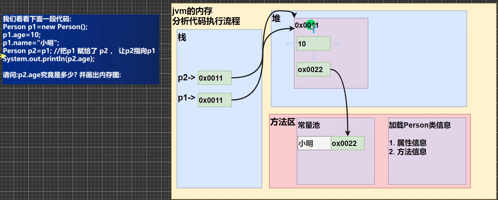
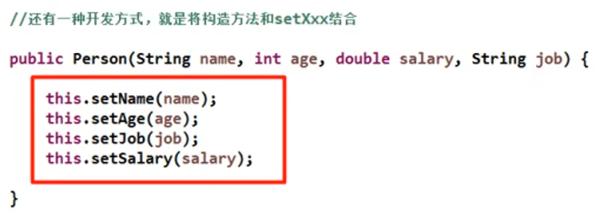
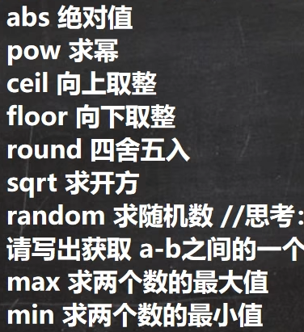
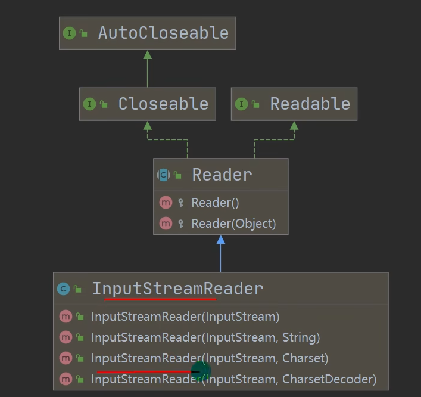
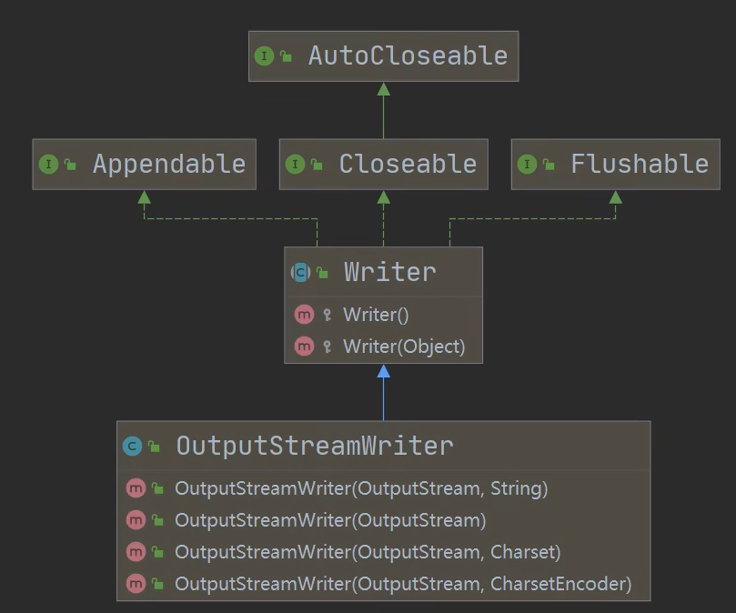

```java
//主类的名字必须和文件名相同，本文件名为Hello.java
public class Hello{
    
    //main方法必须为如下写法
    public static void main(String[] args){
        System.out.println("Hello World!");
    }
}
```

- 一个源文件中最多只能有一个`public`类，其他类的数量不受限制，且该类为主类，文件名必须和主类相同
- java文件编译时，每个类都会生成一个`.class`文件

```java
public class Plus{
    
    public static void main(String[] args){
        System.out.println(32 + 1);//33
        System.out.println(32 + "1");//321
        System.out.println(32 + 1 + "hello");//33hello
        System.out.println("hello" + 1 + 32);//hello132
    }
}
//加法运算中，从左向右计算，当有一项是字符串时，则作拼接运算
```


# 基本语法

## 数据类型

Java数据类型主要分为两大类，分别是**基础数据类型和引用数据类型**

- 基础数据类型

  - 数值型

    - 整数类型

      byte[1]，short[2]，int[4]，long[8]

    - 浮点型

      float[4]，double[8]

  - 字符型

    char[2]

  - 布尔型

    boolean[1]

- 引用数据类型

  - 类
  - 接口
  - 数组

```java
public class Int{
    public static void main(String[] args){
        int a = 1;
        long b = 1L;
        long c = 1;
    }
}

public class Floatdetail{
    public static void main(String[] args){
        Float num1 = 1.1;//错误，小数默认为double类型
        Float num2 = 1.1f;//正确
        double num3 = 1.1;//正确
        double num4 = 1.1f;//正确
        double num5 = .512;//正确 num5  = 0.512。小数点前默认省略0
        double num6 = 5.12e2;//5.12*10^2。科学计数法
    }
}

public class FloatTrap{
    public static void main(String[] args){
        double num = 8.1 / 3;//num=2.6999999999
        
        if (num == 2.7){
            System.out.println("相等");//无输出
        }//应改为
        if (Math.abs(num - 2.7) < 0.00001){
            System.out.println("相等");
        }
    }
}

public class CharDetail{
    public static void main(String[] args){
        char ch1 = "a";//错误，双引号为字符串
        char ch2 = '\n';//转义字符
        //在java中，char的本质是一个整数，编码表为unicode
        System.out.println((int)ch1);//输出97
    }
}

public class BoolDetail{
    public static void main(String[] args){
        boolean flg = true;//取值仅能为true或false，不能为0或1
    }
}
```

编码表细节

- ASCII表

  1个字节

- Unicode

  字母和汉字都用2个字节表示

- utf-8

  大小可变的编码，字母用1个字节，汉字用3个字节

  对Unicode的一种改进

  使用1-6个字节表示一个符号

### 自动类型转换

精度小的类型可以自动转换成精度大的类型


- 多种数据类型运算时，系统会自动将其转换为容量最大的类型

  ```java
  public class ConvertDetail{
      public static void main(String[] args){
          double n = 1.1;
          float a = n + 1.1;//报错，右式为double类型
          float b = n + 1.1f;//正确
      }
  }
  ```

- byte和short不能和char之间相互自动转换

  ```java
  public class ConvertDetail{
      public static void main(String[] args){
          byte a = 10;//正确，在byte范围内能够赋值
          char ch1 = a;//错误
      }
  }
  ```

- byte，short，char可以进行运算，计算时会转换为int类型

  ```java
  public class ConvertDetail{
      public static void main(String[] args){
          byte a = 10;
          char ch1 = 97;
          short b = a + ch1;//报错，右式为int类型
      }
  }
  ```

- boolean不参与任何自动类型转换

### 强制类型转换

```java
public class ConvertDetail{
    public static void main(String[] args){
        int a = (int)1.9;//i = 1
        
        int b = (int)10 * 3.5 + 6 * 1.5;//报错，强转之对10有效
        int c = (int)(10 * 3.5 + 6 * 1.5);//正确
        
        int m = 100;
        char c = m;//报错
        char c = (char)m;
        
    }
}
```


### 字符串转换

```java
public class Basic2String{
    public static void main(String[] args){
        int a = 100;
        String s1 = a + "";//就能转换
        
        String s2 = "123";
        int b = Integer.parseInt(s2);
        double d = Double.parseDouble(s2);
        
        String s3 = "hello";
        int b = Integer.parseInt(s3);//不会报错，但会抛出异常
    }
}
```

## 运算符

### 算数运算符


```java
public class Operator{
    public static void main(String[] args){
        System.out.println(10 / 4);//输出2，而不是2.5
        double f = 10 / 4;//f=2.0
        
        double d = 5 / 9 * (256.4 - 100);//d=0，因为5/9会得0
    }
}
```

### 关系运算符


### 逻辑运算符


- &&和&的区别

  &&：如果第一个条件为假，则不判断第二个条件，表达式整体为假

  &：如果第一个条件为假，仍会判断第二个条件

- ^为异或，相同为真，不同为假

### 赋值运算符

复合赋值运算符会进行类型转换

```java
public class Operator{
    public static void main(String[] args){
        byte b = 3;
        b += 3;//正确，等价于 b = (byte)(b + 3)
        b = b + 3;//报错，为int
    }
}
```

### 三元运算符

```java
//条件？表达式1：表达式2
public class Operator{
    public static void main(String[] args){
        int a = 3;
        int b = 4;
        int c = a > b ? a : b;//正确
        int c = a > b ? 1.1 : 3.4;//错误，double赋给int
    }
}
```

### Java标识符的命名规则和规范

- 包名

  多单词组成时，所有字母都小写，如aaa.bbb.ccc

- 类名、接口名

  所有单词的首字母大写，如TankShotGame，驼峰命名

- 变量名，方法名

  第一个单词首字母小写，后续单词的首字母大写tankShotGame

- 常量名

  所有字母大写，多个单词用下划线连接

### Java输入

```java
import java.util.Scanner;//注意有;

public class Input {
    public static void main(String[] args){
        //接受键盘输入
        Scanner myScanner = new Scanner(System.in);
        System.out.println("请输入名称");
        String name = myScanner.next();
        System.out.println("请输入年龄");
        int age = myScanner.nextInt();
        System.out.println(name + age);
    }

}
```

### 位运算

```java
public class Bit {
    public static void main(String[] args){
        int a = 1 >> 2;
        int c = 1 << 2;
        int a = 3 >>> 2;//逻辑右移，无符号右移，低位溢出，高位补0
    }
	//java中没有无符号数，所有数都有符号位
}
```

## 控制结构

```java
switch(){
    case 1:
        代码块;
        break;
    case 2:
        ...;
    default:
        
}
```

### break

```java
public static void main(String[] args){
        label1:
        for(int i = 0; i < 1000; ++i){
            label2:
            for(int j = 0; j < 1000; ++j){
                if (j==50){
                    System.out.println(i);
                    System.out.println(j);
                    break label1;

                }
            }
        }
    }
```

## 数组、排序和查找

### 数组

存放多个**同一类型**的数据。**数组也是一种数据类型，是引用类型**

```java
public class Array {
    public static void main(String[] args){
        double[] hens = {3, 5, 1, 3.4, 50};
        for(int i = 0; i < hens.length; ++i){
            //通过.length成员变量遍历数组，这是一个变量，不是方法。
        }
    }
}
```

通过.length成员变量遍历数组，**这是一个变量，不是方法。**

#### 数组初始化

```java
public class Array {
    public static void main(String[] args){
        double[] hens;
        double hen[];
        //上面两种方法等价
        
        int a[] = new int[5];//初始化一个大小为5的数组
        
        int a[];
        a = new int[10];
        //先声明，再初始化数组
        
        int a[] = {2, 3, 4, 5, 1};
        
        int a[] = new int[]{1,2,3,4};
    }
}
```

#### 数组赋值

```java
public class Array {
    public static void main(String[] args){
        //数组在默认情况下是引用传递，赋值的是地址
        int arr1[] = {1, 2, 3};
        int arr2[] = arr1;
        
        arr2[1] = 1;
        System.out.println(arr1[1]);//输出1
        
        int arr3 = new int[arr1.length];
        for(int i = 0; i < arr1.length; ++i){
            arr3[i] = arr1[i];
        }//这样完成数值拷贝
    }
}
```


#### 数组细节

- 数组默认值为0，布尔为`false`，字符串为`null`。
- 数组越界会抛出异常，但不会报错
- 数组是一个引用类型

#### 数组扩容

```java
public class Array {
    public static void main(String[] args){
        int arr[] = {1, 2, 3};
        int arrNew[] = new int[arr.length + 1];
        for (int i = 0; i < arr; ++i){
            arrNew[i] = arr[i];
        }
        arrNew[arrNew.length - 1] = 4;
        arr = arrNew;//原来的数组被jvm回收内存
    }
}
```

### 排序

```java
import java.util.Scanner;
//冒泡排序
public class Hello {
    public static void main(String[] args){
        Scanner myScanner = new Scanner(System.in);
        int[] data = new int[10];
        for(int i = 0; i < data.length; ++i){
            data[i] = myScanner.nextInt();
        }
        data = sort(data);
        for(int i = 0 ; i < data.length; ++i){
            System.out.println(data[i]);
        }
    }
    public static int[] sort(int[] data){
        for(int i = 0; i < data.length; ++i){
            for(int j = 0; j < data.length - i - 1; ++j){
                if(data[j] > data[j + 1]){
                    int temp = data[j];
                    data[j] = data[j + 1];
                    data[j + 1] = temp;
                }
            }
        }
        return data;
    }

}
```

### 二维数组

```java
public class Array {
    public static void main(String[] args){
        int[][] arr = {{1,2,3}, {1,2,3}};
        int[][] a = new int[2][3];
        
        //java中，允许二维数组的每个元素长度不一样
        int[][] b = new int[3][];
        for(int i = 0; i < b.length; ++i){
            b[i] = new int[i + 1];
        }
        
        
    }
}
```


# 面向对象方法

## 类与对象

```java
public class Array {
    public static void main(String[] args){
        Cat cat1 = new Cat();
        cat1.name = "小白";
        cat1.age = 3;
        cat2.color = "白色";
    }
}
class Cat{
    String name;
    int age;
    String color;
}
```

### 对象在内存中的存在形式


基本数据类型放在`堆区域`



-  栈：存放基本数据类型，局部变量
- 堆：存放对象
- 方法区：常量池（存放常量，如字符串等），类加载信息（属性信息和方法信息。只会在第一次声明类时加载，后续不用加载）

### 方法

```java
public class Object{
    public static void main(String[] args){
        Person p = new Person();
        p.speak();
    }
}

class Person{
    String name;
    int age;
    
    public void speak(){
        System.out.println("我是个好人");
        
    }
}
```

**方法中不能再定义方法**

- 同一个类中调用方法可以直接调用

  ```java
  class Person{
      String name;
      int age;
      
      public void speak(){
          System.out.println("我是个好人");
          
      }
      public void hi(){
          speak();
      }
  }
  ```

- 跨类要用对象调用

  ```java
  class Person{
      String name;
      int age;
      
      public void speak(){
          System.out.println("我是个好人");
          
      }
      public void hi(){
          speak();
      }
  }
  class Man{
      public void main(){
          speak();//报错
          Person p = new Person();
          p.speak();
      }
  }
  ```

- 局部基本变量是值传递
- 数组是引用传递
- 对象也是引用传递

### 重载

java中允许同一个类内多个同名方法存在，但要求形参列表不一致。对返回值无要求。

### 可变参数

java允许将同一个类中多个同名同功能但参数个数不同的方法，封装成一个方法。

```java
public static void main(String[] args){
    
}
class AddMethod{
    public int add(int... nums){
        //nums可以当作数组使用
        int res = 0;
        for(int i = 0; i < nums.length; ++i){
            res += nums[i];
        }
        return res;
    }
}
```

- 实参可以是0个或任意多个
- 实参可以为数组。。
- 可变参数的本质就是数组
- 可变参数可以和普通类型参数一起放在形参列表，但必须保证可变参数放在最后
- 一个形参列表中只能出现一个可变参数

- 局部变量必须赋值，它没有缺省值
- 全局变量可以不赋值，它有缺省值

### 构造器

```java
public static void main(String[] args){
    Person p = new Person("smith", 80);
}
class Person{
    String name;
    int age;
    
    public Person(String name, int age){
        //下面是错的，编译器不会自动调用this指针
        name = name;
        age = age;
        
        //应将形参名称和属性名称不同，或者使用this
        name = pName;
        this.age = age;
    }
}
```

- 构造器的修饰符只能是`public`或者默认
- 构造器没有返回值
- 方法名和类名相同
- 构造器的调用有编译器完成
- 构造方法可以重载
- 如果没有构造方法，编译器会自动生成一个缺省构造方法。
- 一旦自己定义了构造方法，缺省构造方法就会被覆盖。

对象的创建流程分析

1. 方法区加载类，*.class
2. 在堆中创建一个对象，值为默认值。
3. 根据构造方法初始化对象

### this

```java
class A{
    public A(){
        this(10,10);//r如果有这条语句，就必须是构造方法中的第一条语句。这条语句只能在构造器中使用。
        System.out.println("这是一个空构造器");
        
    }
    public A(int a, int b){
        System.out.println("这是一个含参构造器");
    }
}
```

## 包

- 区分相同名字的类
- 管理类
- 控制访问范围

包的基本语法：package com.myblog

package 打包

实质就是创建不同的文件夹来保存类

有点类似于`namespace`

### 包的命名

- 只能包含字母、数字、下划线
- 不能使用数字开头
- 不能使用保留字

### 命名规范

com.公司名.项目名.业务模块名

## 访问修饰符

- `public`，公开
- `protected`，对子类和同一个包中的类公开
- 默认，没有修饰符，向同一个包的类公开
- `private`，只有类本身能够访问
- 
- 只有`public`和默认可以修饰类，访问规则同上
- 成员方法的访问规则也同上

## 面向对象的三大特征

**封装、继承、多态**

### 封装

把抽象出来的数据和对数据的操作封装在一起，数据被保护在内部，程序的其他部分只有通过被授权的操作才能对数据进行操作。



### 继承

提高代码复用性


- 私有属性不能在子类直接访问，需要通过`public`方法去访问

- 子类继承了所有的属性和方法，但是`private`修饰的属性和方法无法直接访问

- 当子类创建时，子类必须调用父类的构造器，完成父类的初始化

- 当创建子类对象时，不管使用子类哪个构造器，默认情况下都会调用父类的无参构造器，如果父类没有提供无参构造器，则必须在子类的构造器中用`super`去指定使用父类的哪个构造器去完成对父类的初始化工作。

  ```java
  public class Base{
      public Base(){}
      public Base(String s, int a){
          
      }
  }
  
  public class Sub extends Base{
      public Sub(){
          super();//如果没有显式的使用super，则编译器在编译时会自动在子类构造器中调用父类的无参构造器
          //如果此时父类没有定义无参构造器，则会报错
          super("jack", 10);//这个会调用父类的对应构造器
      }
  }
  ```

- `super`在使用时，必须放在构造器的第一行。**也就是说在创建子类时，必须先初始化父类，再初始化子类。**

- `super`和`this`都只能放在构造器的第一行，因此两个方法不能同时存在于同一个构造方法中。`super`是调用父类构造方法，`this`是调用类本身的构造方法。

- `Object`类是所有类的基类

- 对于父类构造方法的调用不限于直接父类

- `java`是单继承机制，每个子类对多只能继承一个父类。

#### 子类的创建过程

```java
public class Extend {
    public static void main(String[] args) {
        Son son = new Son();
        System.out.println(son.name);//会输出儿子
    }
}

class Grand{
    String name = "爷爷";
    String hobby = "旅游";
}

class Father extends Grand{
    String name = "爸爸";
    int age = 30;

}

class Son extends Father{
    String name = "儿子";

}
```

new Son时，会在方法区先加载`Object`，然后加载`Grand`，然后是`Father`，最后才是`Son`的类信息。

加载之后，会在堆中分配一个地址空间，此时先给`Grand`类中的两个变量分配空间。*由于这两个变量是`String`，为常量，因此堆中保存地址，内容存放在方法区中的常量池*。然后再给`Father`类中的两个变量分配空间。最后会给`Son`的属性分配空间。

此时用`son`访问属性时，按照查找关系返回信息。

1. 首先查看子类是否有给属性
2. 子类有直接访问
3. 子类没有则向上找父类
4. 父类有且有权访问，则直接访问
5. 父类有但无权访问，则子类无法访问这个属性。此时不会再继续找父类的父类
6. 父类如果没有，则继续向上查找


#### super

`super`代表父类的引用，用于访问父类的属性、方法、构造器

- 访问父类的属性，但不能访问私有属性、方法

  ```java
  super.属性名;
  super.方法名();
  ```

- 访问父类构造器时，必须在子类构造器中的第一句使用

- 当父类中的属性与子类重名时，则必须使用`super`才能访问。如果没有重名，则`this`和`super`访问效果相同。

- `super`和`this`的区别在于`super`不会在本类中查找，直接查找父类。**如果父类中没有也会向上查找**

#### 重写

子类有一个方法和父类的某个方法的名称、返回类型、参数列表一致，那么我们就说子类的这个方法覆盖了父类的方法。

- 子类的方法的**参数、方法名称**要与父类放的完全一样

- 子类方法的**返回类型**要和父类方法的返回类型一样，或者是 **父类放回类型的子类**，比如父类返回Object，子类返回String

- 如果参数、方法名称相同，但返回类型不符合第二条，则会报错。

- 子类方法不能缩小父类方法的访问权限。

  比如父类方法为`public`，而子类是`proteced`，则会报错

  父类方法为`private`，而子类方法问`public`则可以

**重载和重写的区别**


##### 重写举例

```java
public class Person {
    String name;
    int age;
    public Person(){}
    public Person(String name, int age){
        this.name = name;
        this.age = age;
    }
    public void say(){
        System.out.println("name=" + age + "\tage=" + age);
    }
}

public class Student extends Person{
    int id;
    int score;

    public Student(){}
    public Student(String name, int age, int id, int score){
        super(name, age);
        this.id = id;
        this.score = score;
    }

    @Override
    public void say() {
        super.say();
        System.out.println("id=" + id + "\tscore=" + score);
    }
}
```

### 多态

方法和对象具有多种形态。多态是建立在封装和继承的基础上的

#### 方法多态

重载、重写

#### 对象多态

- 一个对象的编译类型和运行类型可以不一致

  ```java
  Animal animal = new Dog();
  animal = new Cat();
  ```

- 编译类型在定义对象时就确定了，不能改变

- 运行类型可以改变

  *指针类型不能变，但指针指的内容可以改变*

  ```java
  public class Animal {
      public void cry(){
          System.out.println("动物在哭");
      }
  }
  
  public class Cat extends Animal{
      @Override
      public void cry(){
          System.out.println("猫猫在叫");
      }
  }
  
  public class Dog extends Animal{
      @Override
      public void cry(){
          System.out.println("狗再叫");
      }
  }
  
  public class Run {
      public static void main(String[] args) {
          Animal animal = new Dog();
          animal.cry();//输出狗再叫
          
          animal = new Cat();
          animal.cry();//输出猫猫再叫
      }
  }
  ```

- 多态的前提是两个类存在继承关系

- 父类的引用指向了子类的对象

- 可以调用父类中的所有成员(遵守访问权限)

- 不能调用子类中的特有成员，**比如子类有一个父类没有的方法，则不能调用这个方法**

- 重写方法的运行效果看子类的具体实现

- 能够强制类型转换

  - 只能强制转换父类的引用，不能强制转换父类的对象

    就是说对象的类型无法强制转换，而指针的类型可以转换

  - 要求父类的引用必须指向的是当前目标类型的对象

  - 向下转型后，可以调用子类类型的所有成员

  ```java
  public class Animal {
      public void cry(){
          System.out.println("动物在哭");
      }
  }
  
  public class Cat extends Animal{
      @Override
      public void cry(){
          System.out.println("猫猫在叫");
      }
  
      public void catchMouse(){
          System.out.println("这只猫抓到了一只老鼠");
      }
  }
  
  public class Run {
      public static void main(String[] args) {
          Animal animal = new Cat();
          animal.cry();//输出猫在叫
  
          Cat cat = (Cat)animal;
          cat.catchMouse();//输出这只猫抓到了一只老鼠
          
          Dog dog = (Dog)aniaml;//会抛出异常，无法进行强制类型转化
      }
  }
  ```

 

```java
public class Base {
    int count = 10;
}

public class Sub extends Base{
    int count = 20;
}

public class Run {
    public static void main(String[] args) {
        Base base = new Sub();
        System.out.println(base.count);//输出10
        
        Sub sub = new Sub()
        System.out.println(sub instanceof Sub);//true
        System.out.println(sub instanceof Base);//true
        System.out.println(base instanceof Base);//true
        System.out.println(base instanceof sub);//true
    }
}
```

`instancecof`关键字用于判断一个对象指针所指向的内容是否为该类型或该类型的子类型。**如果两个类型之间不存在偏序关系，会直接报错**

#### 动态绑定

当调用对象方法的时候，该方法会和该对象的内存地址/运行类型绑定

当调用对象属性时，没有动态绑定机制，哪里声明，哪里使用

```Java
public class A{
    int i = 10;
    public sum(){
        return getI() + 10;
    }
    public sum1(){
        return i + 20;
    }
    public getI(){
        return i;
    }
}

public class B{
    int i = 20;
   	public getI(){
        return i;
    }
}

public class Run {
    public static void main(String[] args) {
        A a = new B();
        System.out.println(a.sum());
        /*
        *首先，类B中没有sum方法，寻找父类A。
        *父类A中找到sum方法，但是父类A调用了getI方法，此时父类存在一个getI方法，子类存在一个getI方法
        *动态绑定按内存类型绑定方法，内存类型为B，会调用B类的getI方法，返回20，最终结果为40
        */
        
        
        System.out.println(a.sum1());
        /*
        *首先，类B中没有sum1方法，寻找父类A。
        *父类A中找到sum1方法，此时sum1方法中直接使用了变量i，对于属性，在哪里声明，就使用哪里的变量，因此这个i会使用A类的i
        *最终返回结果30
        */
    }
}
```

#### 应用

##### 多态数组

数组的定义类型为父类数组，但里面保存的实际元素类型为子类类型

```java
public class Person {
    private String name;
    private int age;

    public String getName() {
        return name;
    }

    public void setName(String name) {
        this.name = name;
    }

    public int getAge() {
        return age;
    }

    public void setAge(int age) {
        this.age = age;
    }

    public Person(String name, int age) {
        this.name = name;
        this.age = age;
    }

    public String say(){
        return "名字是" + name + "年龄是" + age;
    }
}

public class Student extends Person{
    private double score;

    public Student(String name, int age, double score) {
        super(name, age);
        this.score = score;
    }

    public double getScore() {
        return score;
    }

    public void setScore(double score) {
        this.score = score;
    }

    @Override
    public String say() {
        return super.say() + "成绩是" + score;
    }
    
    public void study(){
        System.out.println(super.getName() + "正在学习");
    }
}

public class Teacher extends Person{
    private double salary;

    public Teacher(String name, int age, double salary) {
        super(name, age);
        this.salary = salary;
    }

    public double getSalary() {
        return salary;
    }

    public void setSalary(double salary) {
        this.salary = salary;
    }

    @Override
    public String say() {
        return super.say() + "工资是" + salary;
    }
    
    public void teach(){
        System.out.println(super.getName() + "正在教课");
    }
}

public class Run {
    public static void main(String[] args) {
        Person[] persons = new Person[5];
        persons[0] = new Person("jack", 19);
        persons[1] = new Student("lucy", 15, 89.5);
        persons[2] = new Student("jason", 16, 99.5);
        persons[3] = new Teacher("nancy", 35, 1000);
        persons[4] = new Teacher("chary", 49, 5000.31);

        for (Person person : persons) {
            System.out.println(person.say());//动态绑定机制
            System.out.println(person.say());//动态绑定机制
            //名字是jack年龄是19
            //名字是lucy年龄是15成绩是89.5
            //lucy正在学习
            //名字是jason年龄是16成绩是99.5
            //jason正在学习
            //名字是nancy年龄是35工资是1000.0
            //nancy正在教课
            //名字是chary年龄是49工资是5000.31
            //chary正在教课

            if (person instanceof Student) {
                Student stu = (Student) person;
                stu.study();
            } else if (person instanceof Teacher) {
                Teacher teacher = (Teacher) person;
                teacher.teach();
            }
        }

    }
}
```

##### 多态参数

```java
public class Employee {
    private String name;
    private double salary;

    public Employee(String name, double salary) {
        this.name = name;
        this.salary = salary;
    }

    public String getName() {
        return name;
    }

    public void setName(String name) {
        this.name = name;
    }

    public double getSalary() {
        return salary;
    }

    public void setSalary(double salary) {
        this.salary = salary;
    }

    public double getAnnual(){
        return salary * 12;
    }
}

public class ComEmplyee extends Employee{
    public ComEmplyee(String name, double salary) {
        super(name, salary);
    }

    public void work(){
        System.out.println(getName() + "正在工作");
    }
}

public class Manager extends Employee{
    private double bonus;

    public Manager(String name, double salary, double bonus) {
        super(name, salary);
        this.bonus = bonus;
    }

    public double getBonus() {
        return bonus;
    }

    public void setBonus(double bonus) {
        this.bonus = bonus;
    }

    public void manage(){
        System.out.println(getName() + "正在管理");
    }

    @Override
    public double getAnnual() {
        return super.getAnnual() + bonus;
    }
}

public class Run {
    public static void main(String[] args) {
        Employee[] employees = new Employee[3];
        employees[0] = new ComEmplyee("jack", 4000);
        employees[1] = new ComEmplyee("jason", 17000);
        employees[2] = new Manager("nancy", 30000, 90000);
        Run run = new Run();//实例化一个当前类，就可以不用在其他的方法中加static修饰

        for (Employee employee:employees) {
            run.showEmpAnnual(employee);
            run.testWork(employee);
        }
        
        //48000.0
        //jack正在工作
        //204000.0
        //jason正在工作
        //450000.0
        //nancy正在管理
    }

    public void showEmpAnnual(Employee employee){
        System.out.println(employee.getAnnual());
    }

    public void testWork(Employee employee){
        if(employee instanceof ComEmplyee){
            ((ComEmplyee) employee).work();
        } else if (employee instanceof Manager) {
            ((Manager) employee).manage();
        }
    }
}
```

## Object类详解


### equals

**`==`和`equals`的区别**

`==`是比较运算符，既可以判断基本类型，也可以判断引用类型。对于基本类型，判断值是否相等 ；对于引用类型，判断地址是否相等，即判断是否为同一个对象

`equals`只能用于判断引用类型。默认判断的是引用类型的地址是否相等；子类往往重写改方法，用于判断是否值相等。

```java
//Object类中equals方法
public boolean equals(Object obj) {
        return (this == obj);
}//仅判断是否地址相同

//Integer中的equals方法
public boolean equals(Object obj) {
    if (obj instanceof Integer) {
        return value == ((Integer)obj).intValue();
    }
    return false;
}//判断值是否相同
```

```java
public class Run {
    public static void main(String[] args) {
        String lol = new String("lol");
        String lol1 = new String("lol");
        System.out.println(lol == lol1);//false
        System.out.println(lol.equals(lol1));//true
        
        int i = 65;
        float f = 65.0;
        char ch1 = 'A';
        
        System.out.println(i == ch1);//true
        System.out.println(i == f);//true
    }
}
```

### hashCode

- 提高具有哈希结构的容器的效率
- 两个引用，如果指向的是同一个对象，则哈希值肯定是一样的
- 两个引用，如果指向的是不同的对象，则哈希值大概率是不一样的
- 哈希值主要根据地址来计算，但不能完全将哈希值等价于地址

### toString

默认返回：全类名 + @ + 哈希值的十六进制。

子类往往重写该方法，用于返回对象的属性信息

当输出一个对象时，会默认调用他的toStirng方法

```java
public String toString() {
    return getClass().getName() + "@" + Integer.toHexString(hashCode());
}
```

```java
//默认不重写
public class Run {
    public static void main(String[] args) {
        Person jack = new Person("jack", 10);
        System.out.println(jack.toString());//com.learn.tostring.Person@1b6d3586
        //重写后输出Person{name='jack', age=10}
        System.out.println(jack);//直接输出对象时，会默认调用toString
    }
}

class Person{
    private String name;
    private int age;

    public Person(String name, int age) {
        this.name = name;
        this.age = age;
    }
    
    @Override
    public String toString() {
        return "Person{" +
                "name='" + name + '\'' +
                ", age=" + age +
                '}';
    }
}
```

### finalize

- 当对象被回收时，系统会自动调用该对象的`finalize`方法，子类可以重写该方法，做一些资源释放的操作
- 当某个对象没有任何引用时，则`jvm`会认为这个对象是一个垃圾对象，就会使用垃圾回收机制来销毁该对象
- 垃圾回收机制的调用，是由系统来决定的。也可以通过`System.gc()`来主动调用
- 不是计数为0时立刻回收，jvm有自己的GC算法

## 类变量和类方法(静态变量和静态方法)

在内存中，每个对象存放的是静态变量的地址。它被同一个类的所有对象共享，在类加载时就生成了。

```java
public class Run {
    public static void main(String[] args) {
        System.out.println(A.name);//myBlog
        //类变量是在类加载时就生成了，即使没有对象实例也可以访问
    }
}

class A{
    public static String name = "myBlog";
}
```

如果希望不创建实例，也可以调用方法(即将这个方法当作工具使用)。这是将其定义为静态方法就比较方便

类方法不能使用和对象有关的关键字，比如`this`,`super`等。

类方法中只能访问静态变量或静态方法。*因为静态方法在调用时没有实例，所以没有具体对象来进行普通方法的调用*

## main

- main方法是jvm调用的
- jvm在调用main方法时，没必要创建对象，因此该方法是static

## 代码块

代码块，又称初始化块，属于类中的成员，类似于方法，将逻辑语句封装在方法体中，通过{}包围起来

但和方法不同，代码块没有方法名，没有返回值，没有参数，只有方法体。在加载类时，或创建对象时隐式调用

```java
class Movie{
    [static]{
        System.out.println("电影正在放映");
        System.out.println("电影放映结束");
    };
}
```

代码块的调用顺序优先于构造函数

- static代码块随着类的加载而执行，并且只会执行一次
- 类什么时候会被加载
  - new
  - 创建子类对象时，父类会被加载
  - 使用类的静态成员时，类会被加载
- 普通代码块，在创建对象实例时，会被隐式调用，创建一次就调用一次
- 只是用类的静态成员时，普通代码块不会执行

在创建一个对象时，在一个类 调用顺序是

1. 调用静态代码块和静态属性初始化

   静态代码块和静态属性的优先级一样，按它们定义的顺序调用

2. 调用普通代码块和普通属性的初始化

3. 调用构造方法

构造器的最前面其实隐含了super()和调用普通代码块；而静态代码块和静态属性初始化，在类加载时就已经完成了，因此是先于构造器的。

创建一个子类对象时的顺序

1. 父类的静态代码块和静态属性初始化
2. 子类的静态代码块和静态属性初始化
3. 父类的普通代码块和普通属性初始化
4. 父类的构造函数
5. 子类的普通代码块和普通属性初始化
6. 子类的构造函数

```java
public class Base {
    private static int age = getAge();

    static{
        System.out.println("这是Base类的静态代码块初始化");
    }

    {
        System.out.println("这是Base类的代码块初始化");
    }

    public static int getAge(){
        System.out.println("这是Base类的静态属性初始化");
        return 1;
    }

    public Base() {
        System.out.println("这是Base类的构造函数");
    }
}

public class Father extends Base{

    static{
        System.out.println("这是Father类的静态代码块初始化");
    }
    private static int age = getAge();


    {
        System.out.println("这是Father类的代码块初始化");
    }

    public static int getAge(){
        System.out.println("这是Father类的静态属性初始化");
        return 1;
    }

    public Father() {
        System.out.println("这是Father类的构造函数");
    }
}

public class Son extends Father{

    private static int age = getAge();

    static{
        System.out.println("这是Son类的静态代码块初始化");
    }

    {
        System.out.println("这是Son类的代码块初始化");
    }

    public static int getAge(){
        System.out.println("这是Son类的静态属性初始化");
        return 1;
    }

    public Son() {
        System.out.println("这是Son类的构造函数");
    }
}

public class Run {
    public static void main(String[] args) {
        Son son = new Son();
        //这是Base类的静态属性初始化
        //这是Base类的静态代码块初始化
        //这是Father类的静态代码块初始化
        //这是Father类的静态属性初始化
        //这是Son类的静态属性初始化
        //这是Son类的静态代码块初始化
        //这是Base类的代码块初始化
        //这是Base类的构造函数
        //这是Father类的代码块初始化
        //这是Father类的构造函数
        //这是Son类的代码块初始化
        //这是Son类的构造函数
    }
}
```

## 单例模式

1. 构造器私有化
2. 类的内部创建对象
3. 向外暴露一个静态的公共方法

### 饿汉单例

```java
public class Hungery {
    private String name;
    private static Hungery hun = new Hungery("饿汉");
    private Hungery(String name){
        this.name = name;
    }

    public static Hungery getInstance() {
        return hun;
    }
}
```

### 懒汉单例

```java
public class Lazy {

    private String name;
    private static Lazy lazy;
    private Lazy(String name){
        this.name = name;
    }

    public static Lazy getInstance() {
        if (lazy == null) {
            lazy = new Lazy("懒汉");
        }
        return lazy;
    }
}
```

- 为什么`getInstance()`方法要用`static`修饰

  因为要保证单例，如果不用`static`修饰，就要先创建一个对象才能调用`getInstance()`，这和单例模式的初衷不符

- 为什么对象实例要用`static`修饰

  因为`getInstance()`方法为静态方法，静态方法中只能调用静态成员

- 饿汉单例不存在线程安全问题，懒汉单例存在线程安全问题

## final

final可以修饰类、属性、方法和局部变量

- 当不希望类被继承时，用final修饰类
- 当不希望父类的某个方法被子类重写，可以用final修饰该方法
- 当不希望类的某个属性的值被修改，就用final修饰这个属性。*常量*

使用细节

- final修饰的变量为常量，该属性必须初始化，初始化的位置可以为
  1. 定义时初始化
  2. 在构造器中初始化
  3. 在代码块中初始化
- 如果final修饰的属性是静态的，那么只能在
  1. 定义时初始化
  2. 静态代码块中初始化
- final不能修饰构造器
- final和static一起使用时，仅使用final static变量并不会导致类的加载
- final修饰引用变量时，是该变量不能变，而不是变量指向的内容不能变

## 抽象类

当父类的某些方法需要声明，但是又不确定如何实现时，可以将其声明为抽象方法，那么这个类就是抽象类。抽象方法用`abstract`修饰。

当类中有一个方法是抽象方法时，要将该类也用`abstract`修饰。

*抽象方法没有方法体*

**使用细节**

- 抽象类不能实例化
- 抽象类不一定要包含抽象方法，但含有抽象方法的类必须是抽象类
-  抽象类还是类，它可以有任意的成员，比如非抽象方法，构造器，静态属性等
- 如果一个方法继承了抽象类，则它必须实现这个抽象类的所有抽象方法，除非它也是一个抽象类
- 抽象方法不能使用`private`，`fianl`，`static`修饰，因为这三个关键字修饰的方法都不允许被重写。

## 模板模式

需求：

- 有多个类，完成不同的任务
- 要求统计各自完成任务的时间

```java
public class abstract Template{
    public abstract void job();
    public void cul(){
        ...;
        ...;
        ...;
        job();
        ...;
        ...;
    }
}

public class Employee{
    @Override
    public void job(){
        ...;
    }
}

public class Manager{
    @Override
    public void job(){
        ...;
    }
}
```

## 接口

```java
public interface Usb {
    //规定接口相关方法
    public void start();
    public void stop();
}

public class Camera implements Usb {
    @Override
    public void start() {
        System.out.println("相机开始工作");
    }

    @Override
    public void stop() {
        System.out.println("相机结束工作");
    }
}

public class Phone implements Usb {
    @Override
    public void start() {
        System.out.println("手机开始工作");
    }

    @Override
    public void stop() {
        System.out.println("手机停止工作");
    }
}

public class Computer {
    public void work(Usb usb){
        usb.start();
        usb.stop();
    }
}

public class Run {
    public static void main(String[] args) {
        Camera camera = new Camera();
        Phone phone = new Phone();
        Computer computer = new Computer();
        computer.work(camera);
        computer.work(phone);
        //相机开始工作
        //相机结束工作
        //手机开始工作
        //手机停止工作
    }
}
```

接口就是给出一些没有实现的方法，封装在一起，到某个类要使用的时候，再根据具体情况把这些方法写出来

```java
interface 接口名{
    //属性
    //方法
}

class 类名 implements 接口名1,接口名2{
    //自己的属性
    //自己的方法
    //必须实现接口的全部方法
}
```

**使用细节**

- 接口不能被实例化
- 接口中的所有方法都是`public`，接口中的抽象方法可以不用`abstract`修饰
- 一个普通类实现接口，就必须实现接口的全部方法
- 抽象类实现接口可以不用实现接口方法
- 一个类可以同时实现多个接口。*不同于继承，继承只能单继承*
- 接口中的属性只能是`public static final`修饰。
- 接口不能继承类，但可以继承多个别的接口
- 接口的修饰符只能是public和默认

### 接口和继承

- 实现是对java单继承机制的一种补充

  当子类继承了父类时，就自动的拥有了父类的功能

  当子类需要扩展功能时，可以通过实现接口的方式来扩展

- 继承的价值主要在于：解决代码的复用性和可维护性

  接口的价值主要在于：设计好各种规范，让其它类去实现这种方法。即更加的灵活

- 接口在一定程度上实现了代码解耦

### 接口的多态

- 参数多态，当参数为接口时，可以接收所有实现了这个接口的对象
- 接口类型的指针可以指向实现了这个接口的对象实例
- 同时也可以进行向上向下转型来调用子类的特有方法
- 多态传递：接口A继承了接口B，类C实现了接口A，那么接口B的指针也能指向类C的实例

## 内部类

一个类的内部又完整的嵌套了另一个类的结构。被嵌套的类称为内部类。

内部类的最大的特点是可以直接访问私有属性，并且可以体现类与类之间的包含关系

```java
class Outer{//外部类
    class Inner{//内部类
        
    }
}
```

**内部类的分类**

- 定义在外部类的局部位置(比如方法内)
  - 局部内部类(有类名)
  - 匿名内部类(没有类名)
- 定义在外部类的成员位置上
  - 成员内部类(没有static修饰)
  - 静态内部类(使用static修饰)

### 局部内部类

- 可以直接访问外部类的所有成员，包括私有成员
- 不能添加修饰符，因为它的地位就是一个局部变量，而局部变量不能使用修饰符修饰
  但是可以使用final修饰，因为局部变量本身就可以使用final
- 作用域：仅在定义它的方法或代码块中
- 局部内部类访问外部类时：直接访问
- 外部类访问局部内部类时，在作用域中创建对象再访问
- 如果外部类和局部内部类重名时，默认遵循就近原则，如果想访问外部类的成员，则可以使用`外部类名.this.成员`

```java
public class Outer {
    private int n1 = 100;

    public int n2 = 1000;
    private void m2(){}

    public void m1(){
        class Inner{//本质仍然是一个类
            public int n2 = 10000;
            public void f1(){//直接访问外部类的全部私有成员
                System.out.println("n1=" + n1);//Outer的100
                m2();
                System.out.println("n2=" + n2);//Inner的10000
                System.out.println("n2=" + Outer.this.n2);//Outer的1000
            }
        }

        final class Inner01 extends Inner{}//局部内部类可以使用final修饰，此时Inner01不能再被继承

        Inner inner = new Inner();
        inner.f1();//创建内部类的实例，再调用方法
        System.out.println("n2=" + n2);//Outer的1000
    }
}

public class Run {
    public static void main(String[] args) {
        Outer outer = new Outer();
        outer.m1();
    }
}

```

### 匿名内部类

- 本质是类
- 内部类
- 没有名字
- 同时还是一个对象

```java
new 类或接口名(参数列表){
    类体
};
```

```java
public class Outer {
    private int n1 = 100;
    public void method(){
        //基于接口的匿名内部类
        //需求：想使用接口A的cry方法。但是只用很少次甚至一次这个方法
        //此时如果专门写一个类去实现接口方法就会很冗余
        //采用匿名内部类解决

        //基于接口的匿名内部类
        A tiger = new A(){
            @Override
            public void cry() {
                System.out.println("老虎在叫");
            }
        };//此时tiger的编译类型为A，运行类型为一个新的类，这个类实现了接口A
        System.out.println("tiger的类型" + tiger.getClass());//在底层实现上有类名，但在代码层面不需要
        //class com.learn.anonyinner.Outer$1
        tiger.cry();//老虎在叫


        //基于类的匿名内部类
        //本质就是创建了一个继承了Father类的子类，参数列表会传递给Father类的构造器
        Father father = new Father("jack"){
            @Override
            public void test() {
                System.out.println("匿名内部类重写了test方法");
            }
        };
        System.out.println("father的类型为" + father.getClass());//class com.learn.anonyinner.Outer$2
        father.test();
    }
}

interface A{
    public void cry();
}

class Father{
    public Father(String name){
        super();
    }
    public void test(){

    }
}
```

匿名内部类既是一个类的声明，同时也初始化了一个这个类的对象

最多的使用场景为当作实参作为参数传递

```java
public interface Bell {
    void ring();
}

public class CellPhone{
    public void alarmClock(Bell bell){
        bell.ring();
    }
}

public class Run {
    public static void main(String[] args) {
        CellPhone cellPhone = new CellPhone();
        cellPhone.alarmClock(new Bell() {
            @Override
            public void ring() {
                System.out.println("懒猪起床了");
            }
        });
        cellPhone.alarmClock(new Bell() {
            @Override
            public void ring() {
                System.out.println("上课了");
            }
        });
    }
}
```

### 成员内部类

- 成员内部类可以直接访问外部类的全部成员，包括私有成员
- 可以添加任意的访问修饰符
- 外部类访问内部类则需要创建给类的对象，然后调用
- 外部其他类使用成员内部类有四种方式
- 外部类与内部类重名与上面相同

```java
public class Outer {
    private int n1 = 100;
    public String name = "张三";
    class Inner{
        public void say(){
            System.out.println("n1=" + n1 + "name=" + name);
        }
    }
}

public class Run {
    Outer outer = new Outer();
    Outer.Inner inner = outer.new Inner();//外部其他类调用成员内部类
    Outer.Inner inner2 = outer.gerInner();//外部其他类调用成员内部类
    Outer.Inner inner3 = new Outer().new Inner();//外部其他类调用成员内部类
    Outer.Inner inner4 = new Outer().gerInner();//外部其他类调用成员内部类
}
```

### 静态内部类

- 可以直接访问外部类的所有静态成员
- 可以添加任意的访问修饰符
- 外部类访问内部类时同上
- 外部其他类访问内部类时也同上

```java
public class Outer {
    private int n1 = 100;
    public static String name = "张三";
    public static class Inner{
         public void say(){
             System.out.println("name=" + name);
         }
    }
}

public class Run {
    public static void main(String[] args) {
        Outer.Inner inner = new Outer.Inner();//静态内部类可以通过类名直接访问，不需要先创建外部类，再访问内部类
        inner.say();
    }
}
```

# 面向对象应用

## 枚举类

枚举是一组常量的集合

### 自定义枚举

```java
public class Season {
    private String name;
    
    public static final Season SPRING = new Season("春天");
    public static final Season SUMMER = new Season("夏天");
    public static final Season AUTUMN = new Season("秋天");
    public static final Season WINTER = new Season("冬天");
    
    //构造器私有化，防止直接new
    //去掉set方法，防止属性被修改
    //在Season内部创建内部类
    //提供final修饰，防止被继承
    private Season(String name) {
        this.name = name;
    }

    public String getName() {
        return name;
    }
    
}
```

### Emun枚举

```java
public enum Day {

    //使用enum字段替代class字段
    //public static final Day MONDAY = new Day("周一")直接使用
    //多个常量对象使用“，”间隔
    //定义的常量对象放在最前面

    MONDAY("周一"),
    THUESDAT("周二"),
    WENSEDAY("周三"),
    FRIDAY;
    private String day;

    Day(String day) {
        this.day = day;
    }
    Day(){
        
    }
}
```

- 使用`enum`关键字修饰的类会自动继承`Enum`类

- `WENSEDAY("周三");`必须知道调用的是哪个构造器

- 使用无参构造器时，可以直接不加参数列表，即`FRIDAY`

- Emun父类的toString方法会直接打印类名

- ```java
  public class Run {
      public static void main(String[] args) {
          Day day = Day.THUESDAY;
  
          //输出枚举对象名字
          System.out.println(day.name());
  
          //输出枚举对象的索引，从0开始
          System.out.println(day.ordinal());
  
          //values方法为编译器自动生成的枚举类方法，其返回值为所有对象的数组
          Day[] week = Day.values();
          for (Day days: week) {
              System.out.println(days.name());
          }
  
          //将字符串转换成枚举对象，没有则会异常
          Day monday = Day.valueOf("Monday");
  
          //比较两个枚举常量的编号
          System.out.println(day.compareTo(monday));
      }
  }
  ```

- 使用emun关键字后就不能再继承其他类了，因为他会隐式继承Emun类。而java是单继承机制

- 枚举类可以和普通类一样实现接口

## 注解

注解也被称为元数据，用于修饰解释 包、类、方法、属性、构造器、局部变量等数据信息

注解不影响程序逻辑，但注解可以被编译或运行，相当于嵌入到代码中的补充信息

一般是用来配置应用程序的任何切面，代替繁冗代码和xml配置等

**三个基本注解**

- `@Override`限定于修饰方法，表示重写父类方法
- `@Deprecated`用于表示某个程序元素(类、方法)已经过时
- `@SuppressWarning`抑制编译器警告

注解本质是@interface类型，他并不是接口，而是表明他是一个注解类

### Override

- 从编译层面验证重写，如果父类没有这个被重写的方法就会报错
- 即使不写`@Override`注解，也仍然会构成方法的重写
- `@Override`只能修饰方法，而不能修饰类、包、属性等
-  `@Override`源码为`@Target(ElementType.METHOD)`，说明只能修饰方法
- `@Target`注解说明其能够修饰的对象；`@Target`是修饰注解的注解，成为元注解

### Deprecated

- 用于表示某个程序元素已经过时
- 可以修饰方法、类、字段、包、参数等等元素

### SuppressWarning

### 元注解

- `@Retention`指定注解的作用范围，三种SOURCE，CLASS，RUNTIME
- `@Target`指定注解可以在哪些地方使用
- `@Documented`指定该注解是否会在javadc中体现
- `@Inherited`子类会继承父类的注解

# 异常

如果程序员认为一段代码可能出现异常，可以使用try-catch异常处理机制来解决，从而保证程序的鲁棒性

- Error：Java虚拟机无法解决的严重错误，如：JVM系统内部错误，爆栈爆内存等。Error是严重错误，程序会崩溃
- Exception： 其他因编程错误或偶然的外在因素导致的一般性问题，可以针对性的对代码进行处理。异常分为两类，一种是**运行时异常**，一种是**编译时异常**


## 运行时异常

- `NullPointException`空指针异常
- `ClassCastException`类型转换异常
- `ArithmeticException`算数异常
- `ArrayIndexOutOfBoundsException`数组越界异常
- `NumberFormatException`数字格式异常，当字符串转数字时可能会抛出这个异常

## 编译时异常

- `SQLException`
- `IOException`
- `FileNotFoundException`
- `ClassNotFoundException`加载类，该类不存在
- `EOFException`文件末尾异常
- `IllegalArgumentException`参数异常

## 异常处理方式

- try-catch-finally

  程序员在代码中捕获发生的异常

- throws

  将发生的异常抛出，交给调用者

### try-catch

```java
try{
    //这段代码可能发生异常
    //如果某一行代码出现异常，则不会执行这行后面的代码，直接进入catch代码块
}catch(Exception e){
    //捕获到异常时，将异常封装为Exception对象，之后程序员自行处理异常
}finally{
    //无论有没有异常发生，这里一定会执行
}

//同时捕获多个异常
try{
    Person p = null;
    p.getName();//NullPointerException
    int a = 0;
    c = 10 / a;//ArithmeticException
}catch(NullPointerException ne){
    
}catch(ArithmeticException ae){
    
}catch(Exception e){
    //需要注意捕获多个异常时，需要子类异常在父类异常前
}

//可以不带catch代码块
try{
    
}finally{
    //无论try代码块是否发生异常，这里的代码都会执行
}
```

### throws


JVM处理异常时则会直接输出异常信息并终止程序运行

只要没有显式的使用try-catch处理异常，则默认为throws处理

throws可以同时抛出多个异常

- 对于编译异常，程序必须处理。比如读文件无论是否能够读到该文件，都要处理文件无法找到的异常
- 对于运行异常，则默认为throws处理
- 子类重写父类方法时，所抛出的异常要么和父类一致，要么为父类抛出异常的子类

## 自定义异常

如果程序发生了某些错误，但这些错误并不在Throwable的子类中，则需要自定义异常

- 定义类：需要继承Exception或RuntimeException
- 继承Exception属于编译异常，继承RuntimeException属于运行异常

```java
public class IllegalAge extends RuntimeException{
    public IllegalAge(String message) {
        super(message);
    }
}

public class Run {
    public static void main(String[] args) {
        int age = 80;
        if (age < 18 || age > 22){
            throw new IllegalAge("年龄需要在18-22岁之间");
        }
        System.out.println("你的年龄是：" + age);
    }
}
```


## throw和throws


# 常用类

## 包装类


### 包装类和基本数据类型转换

```java
public class Run {
    public static void main(String[] args) {
        //jdk5以前
        int n1 = 100;
        Integer i = new Integer(n1);
        Integer j = Integer.valueOf(n1);

        int m =  i.intValue();

        //jdk5以后
        int n2 = 100;
        Integer k = n2;//底层使用的还是valueOf方法

        int l = k;//底层使用的仍然是intValue
        
    }
}
```

```java
Object obj1 = true? new Integer(1) : new Double(2.0);//输出1.0

Object obj2;
if (true) obj2 = new Integer(1);
else obj2 = new Double(2.0);
//obj2为1
```

### 包装类和String转换

```java
public class ToString {
    Integer i = 10;
    String str1 = i + "";

    String str2 = i.toString();

    String str3 = String.valueOf(i);

    String str4 = "1234";
    Integer i2 = Integer.parseInt(str4);
    Integer i3 = new Integer(str4);
}
```

### 常用方法


### Integer


```java
//valueOf源码
public static Integer valueOf(int i) {
    if (i >= IntegerCache.low && i <= IntegerCache.high)
        return IntegerCache.cache[i + (-IntegerCache.low)];
    return new Integer(i);
}
//IntegerCache.low为-128，IntegerCache.high为127
```

```java
Integer i = 127;
int j = 127;
System.out.println(i == j);//true
//只要有基本数据类型，==就是判断是否为值相等
```

### String

- 字符串使用Unicode字符编码，一个字符占两个字节

- String的常用构造器

  - String s1 = new String();
  - String s2 = new String(String);
  - String s3 = new String(char[]);
  - String s4 = new String(char[], int startIndex, int count);

- 实现了Serializable接口，可以串行化，进行网络传输

- 实现了Comparable接口，可以进行比较

- 是final类，不可被继承

- 在底层仍然是一个char数组，private final char value[];

  注意是final类型，是常量，无法更改。是地址不能更改，而不是地址中的内容不可更改


#### 创建String对象

- 直接赋值，String s = "hahaha";

  先从常量池中查找是否有"hahaha"的数据空间，如果有则直接指向；如果没有则重新创建，然后指向

- 调用构造器创建

  先从堆中创建空间，里面维护value属性，指向常量池的数据空间，如果常量池没有该常量，则创建，如果有则让value直接指向


```java
public class Com {

    public static void main(String[] args) {
        String s1 = "abc";
        String s2 = new String("abc");

        System.out.println(s1.equals(s2));//true
        System.out.println(s1 == s2);//false
        

        System.out.println(s1 == s2.intern());//true
        System.out.println(s2 == s2.intern());//false
    }

}
```

#### String特性

```java
public class Create {
    String a = "Hello ";
    String b = "World!";

    //先创建了一个StringBuilder
    //调用append方法将字符串a放入
    //再调用append方法将字符串b放入
    //调用toStirng方法，调用构造器String(char[], int startIndex, int count)
    //返回
    String c = a + b;
    String d = "Hello World!";
    d == c;//false，因为c在创建时使用了构造器
}
```

#### String常用方法

String类是保存字符串常量的，每次更新都需要重新开辟空间，效率较低，因此java设计者还提供了StringBuilder和StringBuffer来增强String的功能并提高效率


### StringBuffer

可变的字符序列，可以对字符串内容进行增删

很多方法与String相同，但StringBuffer是可变长度的

StringBuffer是一个容器


- StringBuffer的直接父类是AbstractStringBuilder
- StringBuffer实现了Serializable，可是串行化
- AbstractStringBuilder中的char[] value不是final类型的，因此是存放在堆中的，而不是常量池中
- StringBuffer是一个final类，不可被继承

String和StringBuffer的区别

- String保存的是字符串常量，里面的值不能更改。每次更新String时实际上是更改地址，也就是会重新创建一个String对象然后将地址重新指向它。放在常量池中
- 而StringBuffer保存的是字符串变量，里面的值可以更改，每次就是更新其中的内容。放在堆中

#### 创建StringBuffer

```java
public class Creat {
    public static void main(String[] args) {

        //创建一个容量大小为16的char[]
        StringBuffer stringBuffer1 = new StringBuffer();

        //创建一个容量大小为100的char[]
        StringBuffer stringBuffer2 = new StringBuffer(100);

        //通过String创建StringBuffer
        //此时容量大小为str的长度加上16
        StringBuffer stringBuffer3 = new StringBuffer("hello");
    }
}
```

#### String和StringBuffer转换

```java
public class Convert {
    public static void main(String[] args) {
        //String -->  StringBuffer
        String str = "hello world";
        StringBuffer sb = new StringBuffer(str);

        StringBuffer stringBuffer = new StringBuffer();
        stringBuffer.append(str);
        
        
        //StringBuffer -->  String
        String hello = sb.toString();
        
        String s = new String(sb);
    }
}
```

#### StringBuffer的常用方法


```java
public class Method {
    public static void main(String[] args) {
        String s = null;
        StringBuffer sb = new StringBuffer();
        sb.append(s);
        System.out.println(sb.length());//4

        System.out.println(sb);//null
        StringBuffer sb1 = new StringBuffer(s);//异常
        System.out.println(sb1);
    }
}

//append方法如果字符串为空，则将null追加在末尾
//如果用构造器null来初始化，由于在最开始会调用str.length()方法，会出现空指针异常
```

### StringBuilder

- 一个可变的字符串序列。此类提供一个与SttingBuffer兼容的API，但不保证同步。常常用在字符串缓冲区仅被单个线程使用的时候。效率要比StringBuffer高
- 主要使用append和insert两个方法，可重载这些方法


- StringBuffer的直接父类是AbstractStringBuilder
- StringBuffer实现了Serializable，可是串行化
- AbstractStringBuilder中的char[] value不是final类型的，因此是存放在堆中的，而不是常量池中
- StringBuffer是一个final类，不可被继承


### Math



均为静态方法

### Arrays

包含了一系列静态方法，用于管理或操作数组

```java
public class Method {
    public static void main(String[] args) {
        Integer[] arr = {1, 3, 55, 10, 421, 432, 255};
        System.out.println(Arrays.toString(arr));//[1, 3, 55, 10, 421, 432, 255]
        Arrays.sort(arr);//从小到大排序
        System.out.println(Arrays.toString(arr));//[1, 3, 10, 55, 255, 421, 432]

        Arrays.sort(arr, new Comparator<Integer>() {//匿名内部类
            @Override
            public int compare(Integer o1, Integer o2) {
                return o2 - o1;
            }
        });//从大到小排序
        System.out.println(Arrays.toString(arr));//[432, 421, 255, 55, 10, 3, 1]
        
        Arrays.sort(arr);
        int index = Arrays.binarySearch(arr, 421);//必须是有序的
        Integer[] newarr = Arrays.copyOf(arr, arr.length);
        Arrays.fill(newarr, 99);
        
        Arrays.equals(arr, newarr);
        Arrays.asList();//转化成列表
    }

}
```

### System


### BigInteger和BigDecimal


### Date


//回来再补日期这块，看不下去了

## 集合


### Collection

```java
public interface Collection<E> extends Iterable<E>
```

- Collection的实现子类可以存放多个元素，每个元素都可以是Object
- Collection接口没有直接实现子类，而是通过子接口Set和List实现的


```java
public class Method {
    public static void main(String[] args) {
        List arr = new ArrayList();

        arr.add(10);
        arr.add(true);
        arr.add("jack");

        //arr.remove(0);
        //arr.remove("jack");
        //arr.remove(true);

        arr.contains(10);

        arr.isEmpty();

        arr.clear();

        arr.size();

        arr.addAll(arr);

        arr.containsAll(arr);

        arr.removeAll(arr);
    }
}
```

### 迭代器


foreach的底层就是迭代器

### List


### ArrayList

- 可以放入任何元素，甚至包括null
- 底层是使用数组实现的
- 基本等同于vector，但它是线程不安全的。效率比vector高

#### 源码

- ArrayList中维护的是一个Object类型的数组elementData数组
- 创建ArrayList对象时，如果使用的是无参构造器，则初始elementData容量为0，第一次扩容为10，以后每次为原来的1.5倍
- 如果创建时指定了容量，则后面每次都是1.5倍

```java
transient Object[] elementData; // non-private to simplify nested class access
//transient 表示瞬间。被修饰的属性不会被序列化。
//序列化就是用一个字节序列表示一个对象

//如果一个用户有一些密码等信息，为了安全起见，不希望在网络操作中被传输，这些信息对应的变量就可以加上transient关键字。换句话说，这个字段的生命周期仅存于调用者的内存中而不会写到磁盘里持久化。
```

```java
public ArrayList() {
    this.elementData = DEFAULTCAPACITY_EMPTY_ELEMENTDATA;
}//无参构造器
private static final Object[] DEFAULTCAPACITY_EMPTY_ELEMENTDATA = {};//就是一个空数组

public boolean add(E e) {
    ensureCapacityInternal(size + 1);  // Increments modCount!!确保容量足够
    elementData[size++] = e;
    return true;
}

private void ensureCapacityInternal(int minCapacity) {
    ensureExplicitCapacity(calculateCapacity(elementData, minCapacity));
}

private static int calculateCapacity(Object[] elementData, int minCapacity) {//计算要扩容的容量大小
    if (elementData == DEFAULTCAPACITY_EMPTY_ELEMENTDATA) {//判断是否为空数组
        return Math.max(DEFAULT_CAPACITY, minCapacity);//空数组则将容量置为10或插入元素数量中的较大值
    }
    return minCapacity;//不是空数组则直接扩容
}
private static final int DEFAULT_CAPACITY = 10;

private void ensureExplicitCapacity(int minCapacity) {//决定是否扩容
    modCount++;//防止多个线程同时修改，记录集合被修改的次数

    // overflow-conscious code
    if (minCapacity - elementData.length > 0)//确实需要扩容
        grow(minCapacity);
}

private void grow(int minCapacity) {
    // overflow-conscious code
    int oldCapacity = elementData.length;
    int newCapacity = oldCapacity + (oldCapacity >> 1);//1.5倍
    if (newCapacity - minCapacity < 0)
        newCapacity = minCapacity;
    if (newCapacity - MAX_ARRAY_SIZE > 0)//太大
        newCapacity = hugeCapacity(minCapacity);
    // minCapacity is usually close to size, so this is a win:
    elementData = Arrays.copyOf(elementData, newCapacity);//使用copyOf重新创建一个数组
}
```

```java
public ArrayList(int initialCapacity) {//指定容量大小的构造器
    if (initialCapacity > 0) {
        this.elementData = new Object[initialCapacity];
    } else if (initialCapacity == 0) {
        this.elementData = EMPTY_ELEMENTDATA;
    } else {
        throw new IllegalArgumentException("Illegal Capacity: "+ initialCapacity);
    }
}
```

### Vector

```java
public class Vector<E>
    extends AbstractList<E>
    implements List<E>, RandomAccess, Cloneable, java.io.Serializable
```

- 底层也是一个数组`protected Object[] elementData;`
- 线程安全的，vector类的操作方法带有synchronized

#### 源码


```java
public Vector() {
    this(10);
}//无参构造器
public Vector(int initialCapacity) {
    this(initialCapacity, 0);
}//指定容量大小的构造器
public Vector(int initialCapacity, int capacityIncrement) {
    super();
    if (initialCapacity < 0)
        throw new IllegalArgumentException("Illegal Capacity: "+ initialCapacity);
    this.elementData = new Object[initialCapacity];
    this.capacityIncrement = capacityIncrement;
}

public synchronized boolean add(E e) {
    modCount++;//记录被修改的次数
    
    ensureCapacityHelper(elementCount + 1);//确保容量足够
    elementData[elementCount++] = e;
    return true;
}

private void ensureCapacityHelper(int minCapacity) {
    // overflow-conscious code
    if (minCapacity - elementData.length > 0)//容量不够则扩容
        grow(minCapacity);
}

private void grow(int minCapacity) {
    // overflow-conscious code
    int oldCapacity = elementData.length;
    int newCapacity = oldCapacity + ((capacityIncrement > 0) ? capacityIncrement : oldCapacity);//两倍或者加上自定义的扩容大小
    if (newCapacity - minCapacity < 0)
        newCapacity = minCapacity;
    if (newCapacity - MAX_ARRAY_SIZE > 0)
        newCapacity = hugeCapacity(minCapacity);
    elementData = Arrays.copyOf(elementData, newCapacity);//扩容
}
```

### LinkedList

- 底层实现了双向链表和双端队列特点
- 可以添加任意元素，包括`null`
- 线程不安全

#### 源码

```java
public class LinkedList<E>
    extends AbstractSequentialList<E>
    implements List<E>, Deque<E>, Cloneable, java.io.Serializable
```

```java
transient int size = 0;//链表大小

/**
 * Pointer to first node.
 * Invariant: (first == null && last == null) ||
 *            (first.prev == null && first.item != null)
 */
transient Node<E> first;//头节点指针

/**
 * Pointer to last node.
 * Invariant: (first == null && last == null) ||
 *            (last.next == null && last.item != null)
 */
transient Node<E> last;//尾节点指针

private static class Node<E> {
    E item;
    Node<E> next;
    Node<E> prev;

    Node(Node<E> prev, E element, Node<E> next) {
        this.item = element;
        this.next = next;
        this.prev = prev;
    }
}

public boolean add(E e) {
    linkLast(e);
    return true;
}

void linkLast(E e) {
    final Node<E> l = last;
    final Node<E> newNode = new Node<>(l, e, null);//pre指向last
    last = newNode;//修改last指针
    if (l == null)//原来为空，头尾相同
        first = newNode;
    else
        l.next = newNode;
    size++;
    modCount++;
}

public boolean remove(Object o) {
    if (o == null) {
        for (Node<E> x = first; x != null; x = x.next) {
            if (x.item == null) {
                unlink(x);
                return true;
            }
        }
    } else {
        for (Node<E> x = first; x != null; x = x.next) {
            if (o.equals(x.item)) {
                unlink(x);
                return true;
            }
        }
    }
    return false;
}
```

### Set

- 无序的，没有索引
- 不允许重复元素，最多包含一个null
- 不能使用索引方式访问
- 取出元素的顺序不是添加的顺序，但顺序是固定的
- add相同元素返回`false`

#### 遍历

迭代器和foreach，不能通过索引获取

```java
public class Method {
    public static void main(String[] args) {
        Set set = new HashSet();

        set.add("john");
        set.add("jack");
        set.add(null);
        set.add("lucy");


        Iterator iterator = set.iterator();
        while (iterator.hasNext()) {
            Object object =  iterator.next();
            System.out.println(object);
        }

        for (Object object : set) {
            System.out.println(object);
        }
    }

}
```

### Hashset

- 在添加一个元素时，会先得到其哈希值，然后将其转换为索引值
- 根据索引值将其放入到散列表（数组+链表）中
- 如果没有元素，则直接添加
- 如果有元素，则调用equals方法，相同则不添加，不同则添加
- 链表元素数量超过8，且数组大小超过64，则将这条链表转换为红黑树
- **就是哈希桶**

**扩容机制**

1. 第一次添加时，table数组扩容到16，加载因子为0.75。此时临界值为12
2. 如果散列表中的所有元素之和达到了临界值12，就会加倍扩容到32，新的临界值为24，以此类推
3. 链表长度如果>=8，此时如果table大小不足64，则会继续扩大table数组，容量翻倍；如果table>=64，则会将链表转换为红黑树
4. table数组扩容后会对所有元素进行重哈希

```java
public class Method {
    public static void main(String[] args) {
        Set set = new HashSet();

        set.add("john");
        set.add("jack");
        set.add(null);
        set.add("lucy");

        set.remove(null);

        set.add(new Dog("tom"));
        set.add(new Dog("tom"));

        System.out.println(set);//[Dog{name='tom'}, john, Dog{name='tom'}, lucy, jack]

        System.out.println(new String("tom"));//true
        System.out.println(new String("tom"));//false
        //String类重写了equals方法，变成了比较值是否相同，而不是地址是否相同
    }
}
```

#### 源码

```java
public HashSet() {//hashset的底层为hashmap
    map = new HashMap<>();
}

public boolean add(E e) {
    return map.put(e, PRESENT)==null;
}

public V put(K key, V value) {//value=PRESENT
    return putVal(hash(key), key, value, false, true);
}

static final int hash(Object key) {
    int h;
    return (key == null) ? 0 : (h = key.hashCode()) ^ (h >>> 16);
}

final V putVal(int hash, K key, V value, boolean onlyIfAbsent, boolean evict) {
    Node<K,V>[] tab; Node<K,V> p; int n, i;//辅助变量
    if ((tab = table) == null || (n = tab.length) == 0)//table就是HashMap的散列表，table为空或长度等于零
        n = (tab = resize()).length;//初始化table表，并将其赋值给tab
    if ((p = tab[i = (n - 1) & hash]) == null)//根据key得到的hash计算其索引，(n - 1) & hash相当于取模，取hash低位
        tab[i] = newNode(hash, key, value, null);//该位置为空，直接将其插入
    else {//索引位置不为空，
        Node<K,V> e; K k;
        
        //p是索引位置已经有的元素
        if (p.hash == hash && ((k = p.key) == key || (key != null && key.equals(k))))
            //如果key相同，即是同一对象，或equals方法返回true，并且两者的哈希值相同，则确定为同一元素，不再插入
            e = p;
        else if (p instanceof TreeNode)//不是相同元素，树节点，直接作红黑树插入
            e = ((TreeNode<K,V>)p).putTreeVal(this, tab, hash, key, value);
        else {//链表插入
            for (int binCount = 0; ; ++binCount) {
                
                //该位置仅有一个p元素，p元素后面没有链接别的元素
                if ((e = p.next) == null) {
                    p.next = newNode(hash, key, value, null);//创建新节点插入
                    if (binCount >= TREEIFY_THRESHOLD - 1) // -1 for 1st
                        treeifyBin(tab, hash);//链表太长则变换成红黑树
                    break;//跳出循环
                }
                
                //判断有没有和后续元素相同
                if (e.hash == hash && ((k = e.key) == key || (key != null && key.equals(k))))
                    break;
                //遍历链表
                p = e;
            }
        }
        if (e != null) { // existing mapping for key
            V oldValue = e.value;
            if (!onlyIfAbsent || oldValue == null)
                e.value = value;
            afterNodeAccess(e);
            return oldValue;//返回PRESENT，不为空，表示add失败
        }
    }
    ++modCount;
    if (++size > threshold)//大小是否超过加载因子
        resize();
    afterNodeInsertion(evict);//空方法，留给hashMap的子类实现
    return null;
}

final Node<K,V>[] resize() {
    Node<K,V>[] oldTab = table;
    int oldCap = (oldTab == null) ? 0 : oldTab.length;
    int oldThr = threshold;
    int newCap, newThr = 0;
    if (oldCap > 0) {
        if (oldCap >= MAXIMUM_CAPACITY) {
            threshold = Integer.MAX_VALUE;
            return oldTab;
        }
        else if ((newCap = oldCap << 1) < MAXIMUM_CAPACITY &&
                 oldCap >= DEFAULT_INITIAL_CAPACITY)
            newThr = oldThr << 1; // double threshold
    }
    else if (oldThr > 0) // initial capacity was placed in threshold
        newCap = oldThr;
    else {               // zero initial threshold signifies using defaults
        newCap = DEFAULT_INITIAL_CAPACITY;//初始化容量，为16
        newThr = (int)(DEFAULT_LOAD_FACTOR * DEFAULT_INITIAL_CAPACITY);//加载因子 乘 容量
    }
    if (newThr == 0) {
        float ft = (float)newCap * loadFactor;
        newThr = (newCap < MAXIMUM_CAPACITY && ft < (float)MAXIMUM_CAPACITY ?
                  (int)ft : Integer.MAX_VALUE);
    }
    threshold = newThr;
    @SuppressWarnings({"rawtypes","unchecked"})
    Node<K,V>[] newTab = (Node<K,V>[])new Node[newCap];
    table = newTab;
    if (oldTab != null) {
        for (int j = 0; j < oldCap; ++j) {
            Node<K,V> e;
            if ((e = oldTab[j]) != null) {
                oldTab[j] = null;
                if (e.next == null)
                    newTab[e.hash & (newCap - 1)] = e;
                else if (e instanceof TreeNode)
                    ((TreeNode<K,V>)e).split(this, newTab, j, oldCap);
                else { // preserve order
                    Node<K,V> loHead = null, loTail = null;
                    Node<K,V> hiHead = null, hiTail = null;
                    Node<K,V> next;
                    do {
                        next = e.next;
                        if ((e.hash & oldCap) == 0) {
                            if (loTail == null)
                                loHead = e;
                            else
                                loTail.next = e;
                            loTail = e;
                        }
                        else {
                            if (hiTail == null)
                                hiHead = e;
                            else
                                hiTail.next = e;
                            hiTail = e;
                        }
                    } while ((e = next) != null);
                    if (loTail != null) {
                        loTail.next = null;
                        newTab[j] = loHead;
                    }
                    if (hiTail != null) {
                        hiTail.next = null;
                        newTab[j + oldCap] = hiHead;
                    }
                }
            }
        }
    }
    return newTab;
}
```

### LinkedHashSet

```java
public class LinkedHashSet<E>
    extends HashSet<E>
    implements Set<E>, Cloneable, java.io.Serializable
```

- 继承自HashSet
- 底层为LinkedHashMap，维护的是数组加双向链表
- 通过双向链表维护元素次
- 不允许添加重复元素

####  源码


- LinkedHashSet的底层为LinkedHashMap map
- map主要进行存储的数据结构为table
- table为HashMap.Node类型，其中存放的为LinkedHashMap.Entry类型。这个类型是HashMap.Node的子类
- 最大的区别是相比于HashMap.Node仅有一个next指针域维护链表，LinkedHashMap.Entry多了一个before和after指针来维护双向链表，来保证存储次序

### TreeSet


区分与HashSet最大的特点是可以排序

- 需要自定义排序时，使用输入比较器的构造器

  ```java
  public class Method {
      public static void main(String[] args) {
          TreeSet treeSet = new TreeSet();
          TreeSet treeSet1 = new TreeSet(new Comparator() {
              @Override
              public int compare(Object o1, Object o2) {
                  return ((String)o2).compareTo((String) o1);
              }
          });
          treeSet.add("a");
          treeSet.add("b");
          treeSet.add("loong");
          treeSet.add("dawdwa");
          treeSet.add("c");
          treeSet.add("av");
  
          treeSet1.add("a");
          treeSet1.add("b");
          treeSet1.add("loong");
          treeSet1.add("dawdwa");
          treeSet1.add("c");
          treeSet1.add("av");
  
          System.out.println(treeSet);//[a, av, b, c, dawdwa, loong]
          System.out.println(treeSet1);//[loong, dawdwa, c, b, av, a]
      }
  
  }
  ```

- 底层的实现为TreeMap

- 如果比较器放回的值为0，就不会将元素插入

  ```java
  if (cpr != null) {
      do {
          parent = t;
          cmp = cpr.compare(key, t.key);
          if (cmp < 0)
              t = t.left;
          else if (cmp > 0)
              t = t.right;
          else//比较器返回0
              return t.setValue(value);//直接返回不插入。比如比较器为返回字符串长的。那么第二个相等长度的字符串不会被插入
      } while (t != null);
  }
  ```

### Map

- Map与Collection并列存在。用于保存具有映射关系的k-v数据

- Map中的key和value可以是任何引用类型的数据，封装到HashMap$Node中

- Map中的key不允许重复，value可以重复，且都可以为null

- 常用String类作为Map的key

- key和value存在单向的一对一映射关系，即通过指定的key可以找到唯一的value

- 不保证线程同步

- 无需存储

- k-v就是存放在HashMap$Node结构中。而Node数组就是table，数据存放在table中。

  程序员无法直接访问table，为了方便程序员遍历Map集合，还会创建一个`EntrySet`集合，这个集合存放的元素类型为`Entry`，而`entrySet`指向的地址与table相同。

  本质区别在于table是Node的数组，而entrySet是Node的集合。由于Node属于内部类，外部代码想访问Node只能通过entrySet、keySet或者values

  ```java
  transient Set<Map.Entry<K, V>> entrySet;
  //Entry中存放的是Node的地址
  
  public class Method {
      public static void main(String[] args) {
          Map map = new HashMap();
          map.put("no1", "jack");
          map.put("no2", "lucy");
          map.put("no1", "marry");//会将jack替换掉
  
          System.out.println(map.get("no2"));//lucy
  
          Set set = map.entrySet();
          System.out.println(set.getClass());//class java.util.HashMap$EntrySet
      }
  }
  ```

- HashMap$Node源码

  ```java
  static class Node<K,V> implements Map.Entry<K,V> {//可以看到,Entry是一个接口
      final int hash;
      final K key;
      V value;
      Node<K,V> next;
  
      Node(int hash, K key, V value, Node<K,V> next) {
          this.hash = hash;
          this.key = key;
          this.value = value;
          this.next = next;
      }
  	
      //提供了getKey和getValue方法，方便遍历Map
      public final K getKey()        { return key; }
      public final V getValue()      { return value; }
      public final String toString() { return key + "=" + value; }
  
      public final int hashCode() {
          return Objects.hashCode(key) ^ Objects.hashCode(value);
      }
  
      public final V setValue(V newValue) {
          V oldValue = value;
          value = newValue;
          return oldValue;
      }
  
      public final boolean equals(Object o) {
          if (o == this)
              return true;
          if (o instanceof Map.Entry) {
              Map.Entry<?,?> e = (Map.Entry<?,?>)o;
              if (Objects.equals(key, e.getKey()) &&
                  Objects.equals(value, e.getValue()))
                  return true;
          }
          return false;
      }
  }
  ```

- ```java
      /**
       * The table, initialized on first use, and resized as
       * necessary. When allocated, length is always a power of two.
       * (We also tolerate length zero in some operations to allow
       * bootstrapping mechanics that are currently not needed.)
       */
      transient Node<K,V>[] table;
  
      /**
       * Holds cached entrySet(). Note that AbstractMap fields are used
       * for keySet() and values().
       */
      transient Set<Map.Entry<K,V>> entrySet;
  ```

```java
public class Method {
    public static void main(String[] args) {
        Map map = new HashMap();
        map.put("no1", "jack");
        map.put("no2", "lucy");
        map.put("no1", "marry");//会将jack替换掉

        System.out.println(map.get("no2"));//lucy

        Set set = map.entrySet();
        Set keySet = map.keySet();
        Collection col = map.values();
        System.out.println(set.getClass());//class java.util.HashMap$EntrySet
        System.out.println(set);//[no2=lucy, no1=marry]
        System.out.println(keySet);//[no2, no1]
        System.out.println(col);//[lucy, marry]
    }
}
```


#### 遍历

主要通过entrySet、keySet或者values进行遍历

### HashMap

```java
final V putVal(int hash, K key, V value, boolean onlyIfAbsent, boolean evict) {
    Node<K,V>[] tab; Node<K,V> p; int n, i;//辅助变量
    if ((tab = table) == null || (n = tab.length) == 0)//table就是HashMap的散列表，table为空或长度等于零
        n = (tab = resize()).length;//初始化table表，并将其赋值给tab
    if ((p = tab[i = (n - 1) & hash]) == null)//根据key得到的hash计算其索引，(n - 1) & hash相当于取模，取hash低位
        tab[i] = newNode(hash, key, value, null);//该位置为空，直接将其插入
    else {//索引位置不为空，
        Node<K,V> e; K k;
        
        //p是索引位置已经有的元素
        if (p.hash == hash && ((k = p.key) == key || (key != null && key.equals(k))))
            //如果key相同，即是同一对象，或equals方法返回true，并且两者的哈希值相同，则确定为同一元素，不再插入
            e = p;
        else if (p instanceof TreeNode)//不是相同元素，树节点，直接作红黑树插入
            e = ((TreeNode<K,V>)p).putTreeVal(this, tab, hash, key, value);
        else {//链表插入
            for (int binCount = 0; ; ++binCount) {
                
                //该位置仅有一个p元素，p元素后面没有链接别的元素
                if ((e = p.next) == null) {
                    p.next = newNode(hash, key, value, null);//创建新节点插入
                    if (binCount >= TREEIFY_THRESHOLD - 1) // -1 for 1st
                        treeifyBin(tab, hash);//链表太长则变换成红黑树
                    break;//跳出循环
                }
                
                //判断有没有和后续元素相同
                if (e.hash == hash && ((k = e.key) == key || (key != null && key.equals(k))))
                    break;
                //遍历链表
                p = e;
            }
        }
        if (e != null) { // existing mapping for key
            V oldValue = e.value;//以前的value
            if (!onlyIfAbsent || oldValue == null)
                e.value = value;//将旧的value更改
            afterNodeAccess(e);
            return oldValue;//返回旧的value
        }
    }
    ++modCount;
    if (++size > threshold)//大小是否超过加载因子
        resize();
    afterNodeInsertion(evict);//空方法，留给hashMap的子类实现
    return null;
}
```

### HashTable


```java
public class Hashtable<K,V>
    extends Dictionary<K,V>
    implements Map<K,V>, Cloneable, java.io.Serializable {
```

- 存放的为K-V

- 键和值都不能为null，否则会抛出空指针异常

- 使用方法基本和hashMap一致

- hashTable线程安全，hashMap线程不安全

- 底层存放数据的数据结构为`Hashtable$Entry`，初始化大小为11

  加载因子仍为0.75

  ```java
  private transient Entry<?,?>[] table;
  private static class Entry<K,V> implements Map.Entry<K,V> {//静态内部类
          final int hash;
          final K key;
          V value;
          Entry<K,V> next;
  
          protected Entry(int hash, K key, V value, Entry<K,V> next) {
              this.hash = hash;
              this.key =  key;
              this.value = value;
              this.next = next;
          }
  
          @SuppressWarnings("unchecked")
          protected Object clone() {
              return new Entry<>(hash, key, value,
                                    (next==null ? null : (Entry<K,V>) next.clone()));
          }
  
          // Map.Entry Ops
  
          public K getKey() {
              return key;
          }
  
          public V getValue() {
              return value;
          }
  
          public V setValue(V value) {
              if (value == null)
                  throw new NullPointerException();
  
              V oldValue = this.value;
              this.value = value;
              return oldValue;
          }
  
          public boolean equals(Object o) {
              if (!(o instanceof Map.Entry))
                  return false;
              Map.Entry<?,?> e = (Map.Entry<?,?>)o;
  
              return (key==null ? e.getKey()==null : key.equals(e.getKey())) &&
                 (value==null ? e.getValue()==null : value.equals(e.getValue()));
          }
  
          public int hashCode() {
              return hash ^ Objects.hashCode(value);
          }
  
          public String toString() {
              return key.toString()+"="+value.toString();
          }
      }
  ```

- 扩容

  ```java
  public synchronized V put(K key, V value) {
          // Make sure the value is not null
          if (value == null) {
              throw new NullPointerException();
          }
  
          // Makes sure the key is not already in the hashtable.
          Entry<?,?> tab[] = table;
          int hash = key.hashCode();
          int index = (hash & 0x7FFFFFFF) % tab.length;
          @SuppressWarnings("unchecked")
          Entry<K,V> entry = (Entry<K,V>)tab[index];
          for(; entry != null ; entry = entry.next) {
              if ((entry.hash == hash) && entry.key.equals(key)) {//替换
                  V old = entry.value;
                  entry.value = value;
                  return old;
              }
          }
  
          addEntry(hash, key, value, index);//实际上添加了元素的方法
          return null;
      }
  
  private void addEntry(int hash, K key, V value, int index) {
          modCount++;
  
          Entry<?,?> tab[] = table;
          if (count >= threshold) {//数量大于临界值
              // Rehash the table if the threshold is exceeded
              rehash();//扩容重哈希
  
              tab = table;
              hash = key.hashCode();
              index = (hash & 0x7FFFFFFF) % tab.length;
          }
  
          // Creates the new entry.
          @SuppressWarnings("unchecked")
          Entry<K,V> e = (Entry<K,V>) tab[index];
          tab[index] = new Entry<>(hash, key, value, e);//添加新元素
          count++;
      }
  
  protected void rehash() {
          int oldCapacity = table.length;
          Entry<?,?>[] oldMap = table;
  
          // overflow-conscious code
          int newCapacity = (oldCapacity << 1) + 1;//扩容：乘2加1
          if (newCapacity - MAX_ARRAY_SIZE > 0) {//超过了最大容量
              if (oldCapacity == MAX_ARRAY_SIZE)//以前的容量已经是最大容量了，就直接返回
                  // Keep running with MAX_ARRAY_SIZE buckets
                  return;
              newCapacity = MAX_ARRAY_SIZE;
          }
          Entry<?,?>[] newMap = new Entry<?,?>[newCapacity];//新的table数组
  
          modCount++;
          threshold = (int)Math.min(newCapacity * loadFactor, MAX_ARRAY_SIZE + 1);//新的临界值
          table = newMap;//将新的table赋值给table成员
  
          for (int i = oldCapacity ; i-- > 0 ;) {//做重哈希操作
              for (Entry<K,V> old = (Entry<K,V>)oldMap[i] ; old != null ; ) {
                  Entry<K,V> e = old;
                  old = old.next;
  
                  int index = (e.hash & 0x7FFFFFFF) % newCapacity;
                  e.next = (Entry<K,V>)newMap[index];
                  newMap[index] = e;
              }
          }
      }
  ```

### HashMap和HashTable比较


### Properties

- 继承自Hashtable类，并且实现了Map接口，也是使用一种键值对来存储数据
- 使用特点与Hashtable类似
- 还可以用于从`xxx.properties`文件中，加载数据到Properties对象，并进行读取和修改

### TreeMap


```java
public V put(K key, V value) {
        Entry<K,V> t = root;
        if (t == null) {
            compare(key, key); // type (and possibly null) check

            root = new Entry<>(key, value, null);
            size = 1;
            modCount++;
            return null;
        }
        int cmp;
        Entry<K,V> parent;
        // split comparator and comparable paths
        Comparator<? super K> cpr = comparator;
        if (cpr != null) {
            do {
                parent = t;
                cmp = cpr.compare(key, t.key);
                if (cmp < 0)
                    t = t.left;
                else if (cmp > 0)
                    t = t.right;
                else
                    return t.setValue(value);
            } while (t != null);
        }
        else {
            if (key == null)
                throw new NullPointerException();
            @SuppressWarnings("unchecked")
                Comparable<? super K> k = (Comparable<? super K>) key;
            do {
                parent = t;
                cmp = k.compareTo(t.key);
                if (cmp < 0)
                    t = t.left;
                else if (cmp > 0)
                    t = t.right;
                else
                    return t.setValue(value);
            } while (t != null);
        }
        Entry<K,V> e = new Entry<>(key, value, parent);
        if (cmp < 0)
            parent.left = e;
        else
            parent.right = e;
        fixAfterInsertion(e);
        size++;
        modCount++;
        return null;
    }
```

排序过程实质就是一颗红黑树

**与HashMap不同，插入相同key的元素不会替换原来的元素，而是直接不会插入新元素**

在第一次添加元素时，也会调用一次cmp方法。其主要目的是为了检验传入的自定义cmp方法是否合法，能够跑通。

### 集合类总结

- 一组对象：Collection接口

  允许重复：List

  - 增删多：LinkedList(底层实现为双向链表)
  - 改查多：ArrayList(底层实现为Object类型的数组)

  不允许重复：Set

  - 无序：HashSet(底层为HashMap，维护一个table哈希表(即数组+链表+红黑树))
  - 排序：TreeSet
  - 插入和取出顺序一致：LinkedHashSet，(底层为LinkedHashMap，维护数组和一个双向链表)

- 一组键值对：Map

  键无序：HashMap

  键排序：TreeMap

  键插入和取出顺序一致：LinkedHashMap(底层为HashMap)

  读取文件：Properties

### Collections

- 是一个操作Set，List，Map等集合的工具类

- 提供了一系列静态方法对集合元素进行排序、查询和修改等操作

- 常用方法

  - sort：List

  - binarySearch：List

  - reverse：List

  - shuffle：List

  - swap：List

  - fill：List

  - copy：List

  - min：Collecion

  - max：Collection

  - replaceAll：List

  - frequency：Collection

    返回指定集合中指定元素出现的次数

  - copy：List

```java
public class Method {
    public static void main(String[] args) {
        List list = new ArrayList();

        list.add(1);
        list.add(2);
        list.add(10);
        list.add(3);
        list.add(5);
        list.add(7);

        System.out.println(list);//[1, 2, 10, 3, 5, 7]

        Collections.reverse(list);
        System.out.println(list);//[7, 5, 3, 10, 2, 1]

        Collections.sort(list);
        System.out.println(list);//[1, 2, 3, 5, 7, 10]

        Collections.sort(list, new Comparator() {
            @Override
            public int compare(Object o1, Object o2){
                return (Integer)o2 - (Integer)o1;
            }
        });
        System.out.println(list);//[10, 7, 5, 3, 2, 1]

        Collections.shuffle(list);//对元素进行随机打乱
        System.out.println(list);//[3, 5, 2, 1, 10, 7]
    }
}
```

# 泛型编程

- 对集合中的数据类型进行约束
- 遍历时不再需要进行强制类型转换
- 可以保证只要程序能够通过编译，在运行时就不会发生类转换异常

在类声明时，通过一个标识，表示类中某个属性的类型，或者是某个方法返回值的类型，或者是参数类型

泛型究竟是什么类型在编译期间就确定了，因此如果编译期间类型不符合会直接报错

- 泛型只能是引用类型，而不能是基本数据类型
- 在指定泛型的具体类型后，可以传入给类型或子类类型
- 在实际开发中，在创建集合时，构造器的尖括号中的类型可以省略
- 泛型默认为Object

泛型+OOP练习

```java
public class MyDate implements Comparable {
    private int month;
    private int day;
    private int year;

    public int getMonth() {
        return month;
    }

    public void setMonth(int month) {
        this.month = month;
    }

    public int getDay() {
        return day;
    }

    public void setDay(int day) {
        this.day = day;
    }

    public int getYear() {
        return year;
    }

    public void setYear(int year) {
        this.year = year;
    }

    @Override
    public String toString() {
        return "MyDate{" +
                "month='" + month + '\'' +
                ", day='" + day + '\'' +
                ", year='" + year + '\'' +
                '}';
    }

    public MyDate(int month, int day, int year) {
        this.month = month;
        this.day = day;
        this.year = year;
    }

    @Override
    public int compareTo(Object o) {
        MyDate date = (MyDate)o;
        if(this.year != date.year){
            return this.year - date.year;
        }
        if(this.month != date.month){
            return this.month - date.month;
        }
        return this.day - date.day;
    }
}

public class Employee {
    private String name;
    private double sal;
    private MyDate birthday;

    public String getName() {
        return name;
    }

    public void setName(String name) {
        this.name = name;
    }

    public double getSal() {
        return sal;
    }

    public void setSal(double sal) {
        this.sal = sal;
    }

    public MyDate getBirthday() {
        return birthday;
    }

    public void setBirthday(MyDate birthday) {
        this.birthday = birthday;
    }

    @Override
    public String toString() {
        return "Employee{" +
                "name='" + name + '\'' +
                ", sal=" + sal +
                ", birthday=" + birthday.toString() +
                '}';
    }

    public Employee(String name, double sal, int year, int month, int day) {
        this.name = name;
        this.sal = sal;
        this.birthday = new MyDate(month, day, year);
    }
}

public class Run {
    public static void main(String[] args) {
        ArrayList<Employee> employees = new ArrayList<>();
        employees.add(new Employee("jack", 3000, 1996, 12, 31));
        employees.add(new Employee("lucy", 3000, 1996, 12, 31));
        employees.add(new Employee("jack", 3000, 1996, 1, 11));

        employees.sort(new Comparator<Employee>() {
            @Override
            public int compare(Employee o1, Employee o2) {
                if (o1.getName().compareTo(o2.getName()) != 0) {
                    return o1.getName().compareTo(o2.getName());
                }
                //写法一：将比较全部在这个Comporator写
//                if (o1.getBirthday().getYear() != o2.getBirthday().getYear()) {
//                    return o1.getBirthday().getYear() - o2.getBirthday().getYear();
//                }
//                if (o1.getBirthday().getMonth() != o2.getBirthday().getMonth()) {
//                    return o1.getBirthday().getMonth() - o2.getBirthday().getMonth();
//                }
//                return o1.getBirthday().getDay() - o2.getBirthday().getDay();
                //写法二：将日期的比较放在MyDate类中
                return o1.getBirthday().compareTo(o2.getBirthday());
            }
        });

        System.out.println(employees);
    }
}
```

## 自定义泛型

- 普通成员可以使用泛型

- 使用泛型的数组，不能初始化//就是不能new

- 静态方法中不能使用类的泛型//因为静态方法不需要进行类的实例化就能使用，而类如果不实例化就没有指定泛型类型

- 泛型类的创建，实在创建对象时确定的

- 如果创建对象时没有指定类型，默认为Object

- 使用泛型接口时要注意，由于接口中的所有成员属性都是静态的，所以不能使用泛型修饰属性

- 可以在普通类中定义泛型方法

  ```java
  public <T, R> void hello(T t, R r);
  hello("你好", "世界");//此时由编译器完成类型的推断
  
  public void hello(T t, R r);//这样的方法是使用了泛型，而不是泛型方法
  ```

## 泛型的继承和通配符

- 泛型不具备继承性

  ```java
  List<Object> list = new ArrayList<String>();//错误
  ```

- <?>支持任意类型的泛型

- <? extrends A>支持任意A类以及A类的子类

- <? super A>支持任意A类还有A类的父类

# 多线程基础

## 线程的基本使用

### 创建线程的基本方式

- 继承Thread类，重写run方法
- 实现Runnable接口，重写run方法


```java
public class Inherit extends Thread{
    //当一个类继承了线程类，该类就可以当作线程使用
    //run方法从根上是从Runnable接口中来的
    @Override
    public void run(){//重写run方法
        while(true){
            System.out.println("I am a thread, thread name is " + Thread.currentThread().getName());
            try {
                Thread.sleep(1000);//单位为毫秒
            } catch (InterruptedException e) {
                throw new RuntimeException(e);
            }
        }
    }
}

public class Run {
    public static void main(String[] args) {
        Inherit inherit = new Inherit();
        inherit.start();//启动线程，会调用run方法
        System.out.println("这个线程不会阻塞主线程的运行");
    }
}
```

```java
public class Implement implements Runnable{

    @Override
    public void run(){
        while(true){
            System.out.println("hello");

            try{
                Thread.sleep(1000);
            }catch(InterruptedException e){
                e.printStackTrace();
            }
        }
    }
}

public class Run {
    public static void main(String[] args) {
        Implement implement = new Implement();
        //implement.start();//错误，没有start方法
        Thread thread = new Thread(implement);//使用了代理模式的设计模式
        thread.start();
    }
}
```


这个线程不会阻塞主线程的运行，所有线程都结束后进程结束

```java
public synchronized void start() {
        /**
         * This method is not invoked for the main method thread or "system"
         * group threads created/set up by the VM. Any new functionality added
         * to this method in the future may have to also be added to the VM.
         *
         * A zero status value corresponds to state "NEW".
         */
        if (threadStatus != 0)
            throw new IllegalThreadStateException();

        /* Notify the group that this thread is about to be started
         * so that it can be added to the group's list of threads
         * and the group's unstarted count can be decremented. */
        group.add(this);

        boolean started = false;
        try {
            start0();
            started = true;
        } finally {
            try {
                if (!started) {
                    group.threadStartFailed(this);
                }
            } catch (Throwable ignore) {
                /* do nothing. If start0 threw a Throwable then
                  it will be passed up the call stack */
            }
        }
    }

private native void start0();//本地native方法，由JVM调用，由c/c++实现
```


实现Runnable接口的方式更加适合多个线程共享一个资源的情况，并且避免了单继承的限制


两个线程同时使用t3对象，有利于资源共享

### 线程终止

- 当线程完成任务后，会自动退出
- 还可以通过使用变量来控制run方法退出的方式停止线程，即：**通知方式**

### 线程常用方法


- run方法不会创建新的线程，start才会

- 线程优先级的范围为1~10，数值越低，优先级越低

- interrupt中断线程，但并没有真正的结束线程。一般用于中断正在休眠的线程，唤醒它

  子线程会catch到这个中断，执行catch代码块中的业务逻辑

- sleep，线程的静态方法，使当前线程休眠


join方法会阻塞当前线程

### 用户线程和守护线程

- 用户线程：也叫工作线程，当线程的任务执行完或通知方式结束

- 守护线程：一般是为工作线程服务的，当该进程的所有用户线程都结束时，守护线程才会自动结束

  常见的守护线程：GC垃圾回收机制

将用户线程设置为守护线程（希望主线程结束时子线程自动退出）

```java
Thread t1 = new Thread();
t1.setDaemon(true);
```

## 线程的七大状态

- NEW

  尚未启动的线程出于此状态

- RUNNABLE

  在JVM中执行的线程处于此状态。就绪态以及运行态都在这个状态中

- WAITING

  正在等待另一个线程执行特定动作的线程处于此状态

- BLOCK

  被阻塞等待监视器锁定的线程出于此状态

- TIME_WAITING

  正在等待另一个线程执行动作达到指定等待时间的线程出于此状态

- TERMINATED

  已退出的线程处于此状态

- ```java
  getState();//使用这个方法来获取线程状态
  ```

  


## 线程同步

```java
synchronized(对象){//只有得到该对象的锁时，才能执行下面的代码
    //需要被同步的代码块
}
//synchronized还可以放在方法声明中，表示整个方法为同步方法
public synchronized void m(String name){//同一时刻只能有一个线程执行该方法
    //需要同步执行的代码块
}
```

## 线程死锁

## 释放锁

释放锁的操作

- 同步方法、同步代码块执行完毕，释放锁
- 在执行同步代码块、同步方法中遇到break，return语句时，释放锁
- 当线程在同步代码块、同步方法中出现了未处理的Error或Exception，导致异常结束，释放锁
- 当线程在同步代码块、同步方法中执行了线程对象的wait方法时，当前线程暂停，释放锁

不会释放锁的操作

- sleep和yield方法不会释放锁

- 其他线程调用suspend方法将该线程挂起，该线程不会释放锁

  **该方法已被弃用**

# I/O流


## 创建文件

```java
File(String pathname);
File(File parent, String child);
File(String parent, String child);
```

```java
    public static void create1(){
        String filePath = "C:\\create1.txt";
        File file = new File(filePath);
        try{
            file.createNewFile();
            System.out.println("文件创建成功");
        }catch(IOException e){
            System.out.println(e);
        }
    }

    public static void create2(){
        File parentFile = new File("C:\\");
        String fileName = "create2.txt";
        File file = new File(parentFile, fileName);
        try{
            file.createNewFile();
            System.out.println("文件创建成功");
        }catch(IOException e){
            System.out.println(e);
        }
    }

    public static void create3(){
        String parentPath = "C:\\";
        String fileName = "create3.txt";
        File file = new File(parentPath, fileName);
        try{
            file.createNewFile();
            System.out.println("文件创建成功");
        }catch(IOException e){
            System.out.println(e);
        }
    }
```

## 获取文件信息


```java
File file = new File("C:\\create1.txt");
file.getName();//获取文件名
file.getAbsolutePath();//获取文件绝对路径
file.getParent();//得到文件的父级目录
file.length();//得到文件大小，单位为字节
file.exists();//文件是否存在
file.isFile();//是否为一个文件
file.isDirctory();//是否为一个目录
```

## 目录的操作和文件删除

```java
file.delete();//删除文件或空目录，成功返回true，失败返回false
file.mkdir();//创建一级目录
file.mkdirs();//创建多级目录
```

## I/O流分类

`java.io`包下提供了各种“流”类和接口，用以获取不同种类的数据

- 按操作数据单位不同分为：字节流，字符流
- 桉数据流向不同分为：输入流、输出流
- 按流的角色不同分为：节点流，包装流/处理流


由这四个类派生出来的子类名称都是以其父类名作为子类名后缀

**均为抽象类，不能直接实例化**


## 常用类

### InputStream


#### FileInputStream


```java
public void readFile1() {//每次读取一个字节
        String filePath = "d:\\hello.txt";
        int readByte = 0;
        FileInputStream fileInputStream = null;
        try {
            fileInputStream = new FileInputStream(filePath);
            while((readByte = fileInputStream.read()) != -1){//返回-1表示读到文件末尾
                System.out.print((char) readByte);
            }
        } catch (IOException e) {
            e.printStackTrace();
        } finally {
            try {
                fileInputStream.close();
            } catch (IOException e) {
                e.printStackTrace();
            }
        }

    }

public void readFile2() {//每次都一buffer的字节
        String filePath = "d:\\hello.txt";
        byte[] buffer = new byte[8];
        FileInputStream fileInputStream = null;
        int len = 0;
        try {
            fileInputStream = new FileInputStream(filePath);
            while((len = fileInputStream.read(buffer)) != -1){//返回-1表示读到文件末尾，否则返回实际读取到的字节数
                System.out.print(new String(buffer, 0, len));
            }
        } catch (IOException e) {
            e.printStackTrace();
        } finally {
            try {
                fileInputStream.close();
            } catch (IOException e) {
                e.printStackTrace();
            }
        }
    }
```

### OutputStream

#### FileOutputStream


```java
public void writeFile(){
        String path = "D:\\a.txt";
        FileOutputStream fileOutputStream = null;

        try {
            fileOutputStream = new FileOutputStream(path, true);
            //fileOutputStream = new FileOutputStream(path);

            //方法一
            fileOutputStream.write('H');

            //方法二
            String str = "hello World!";
            fileOutputStream.write(str.getBytes());

            //方法三
            fileOutputStream.write(str.getBytes(), 0, 3);
            //三种方式均会覆盖写，不是追加写
            //对于同一个流是追加

        } catch (IOException e) {
            throw new RuntimeException(e);
        } finally {
            try {
                fileOutputStream.close();
            } catch (IOException e) {
                throw new RuntimeException(e);
            }
        }
    }
```

### Reader


#### FileReader

```java
FileReader(String File);
read();//读取单个字符，返回该字符，读到文件末尾返回-1
read(char[]);//读取多个字符到数组，返回字符长度，读到文件末尾返回-1
```

```java
public class FileReader_ {
    public static void main(String[] args) {
        String filePath = "d:\\hello.txt";
        char[] buffer = new char[8];
        FileReader fileReader = null;
        int len = 0;
        try {
            fileReader = new FileReader(filePath);
            while((len = fileReader.read(buffer)) != -1){//返回-1表示读到文件末尾，否则返回实际读取到的字节数
                System.out.print(new String(buffer, 0, len));
            }
        } catch (IOException e) {
            e.printStackTrace();
        } finally {
            try {
                fileReader.close();
            } catch (IOException e) {
                e.printStackTrace();
            }
        }
    }
}
```

### Writer


#### FileWriter

```java
FileWriter(String file);
FileWriter(String file, boolean append);
write(int);//写入单个字符
write(char[]);//写入指定数组
write(char[], off, len);//写入数组的指定部分
write(String);//写入整个字符串
write(String, off, len);//写入字符串指定部分

//FileWriter使用后，必须要关闭或者刷新flush，将缓冲区内容确实写入到文件。否则写入不到指定的文件
//底层是FileOutputStream，只有调用close或flush方法，才会进行write写操作
```

```java
public class FileWriter_ {
    public static void main(String[] args) {
        String content = "hello world!";
        String path = "d:\\hi.txt";
        FileWriter fileWriter = null;
        try {
            fileWriter = new FileWriter(path);
            fileWriter.write(content);
            fileWriter.flush();
        } catch (IOException e) {
            throw new RuntimeException(e);
        } finally {
            if(fileWriter != null){
                try {
                    fileWriter.close();
                } catch (IOException e) {
                    throw new RuntimeException(e);
                }
            }
        }
    }
}
```

### 节点流和处理流

- 节点流是指可以从一个特定的数据源读写数据的流，如FileReader，FileWriter等

- 处理流，也称包装流，是指在连接已经存在的流（节点流或处理流）值上，为程序提供更为强大的读写功能，如BufferedReader，BufferedWriter

  实质就是对节点流进行了一层包装，使其功能更加强大。


比如BufferedReader中存在一个Reader成员，即可以封装一个节点流

节点流和处理流的区别和联系

- 节点流是底层流，直接跟数据源相接
- 处理流包装节点流，既可以消除不同节点流的实现差异，也可以提供更方便的方法来完成IO
- 处理流使用了修饰器设计模式，不会直接与数据源相连
- 处理流相比于节点流的优点主要体现在：
  - 性能的提高：增加缓冲的方式来提高IO的效率
  - 操作的便捷：处理流可能提供了一系列便捷的方法来一次输入输出大批量的数据

#### BufferedReader

```java
public class BufferedReader_ {
    public static void main(String[] args) throws Exception{

        String path = "d:\\hello.txt";
        BufferedReader bufferedReader = new BufferedReader(new FileReader(path));
        String line;
        while((line = bufferedReader.readLine()) != null){//按行读取，返回null时表示读取完毕
            System.out.println(line);
        }

        bufferedReader.close();//底层会自动关闭FileReader
    }
}
```

#### BufferedWriter

```java
public class BufferedWriter_ {
    public static void main(String[] args) throws Exception{
        String path = "d:\\hello.txt";
        BufferedWriter bufferedWriter = new BufferedWriter(new FileWriter(path, true));
        bufferedWriter.write("hello world!\n");
        bufferedWriter.write("郭峰\n");
        bufferedWriter.write("hahahaha\n");

        bufferedWriter.close();
    }
}

//BufferedWriter仍然需要主动close或flush才能真正的写入文件
```

#### BufferedInputStream


使用的是从FilterInputStream继承下来的InputStream对象


#### BufferedOutputStream


### 对象处理流

ObjectInputStream和ObjectOutputStream

能够将**基本数据类型**和**对象**进行**序列化**和**反序列化**

- 序列化就是在保存数据时，保存数据的值和数据类型

- 反序列化就是在恢复数据时，恢复数据的值和数据类型

- 需要让某个对象支持序列化机制，则必须让其类是可序列化的

  类是可序列化的，则其必须实现`Serializable`或者`Externalizable`两个接口之一

  `Serializable`是一个标记接口，里面没有任何方法

#### ObjectInputStream


```java
public class ObjectInputStream_ {
    public static void main(String[] args) throws Exception{
        String filePath = "d:\\object.dat";
        ObjectInputStream objectInputStream = new ObjectInputStream(new FileInputStream(filePath));
        //反序列化顺序需要和序列化顺序一致
        System.out.println(objectInputStream.readInt());
        System.out.println(objectInputStream.readBoolean());
        System.out.println(objectInputStream.readChar());
        System.out.println(objectInputStream.readDouble());
        System.out.println(objectInputStream.readUTF());
        System.out.println(objectInputStream.readObject());

        objectInputStream.close();
    }
}
```


#### ObjectOutputStream


```java
public class ObjectOutputStream_ {
    public static void main(String[] args) throws Exception{
        String filePath = "d:\\object.dat";

        ObjectOutputStream objectOutputStream = new ObjectOutputStream(new FileOutputStream(filePath));

        objectOutputStream.write(100);
        objectOutputStream.writeBoolean(true);
        objectOutputStream.writeChar('H');
        objectOutputStream.writeDouble(9.5);
        objectOutputStream.writeUTF("郭峰");

        objectOutputStream.writeObject(new Dog("jack", 10));

        objectOutputStream.close();
    }
}
```

#### 总结

- 读写顺序一致
- 需要序列化和反序列化的类，要实现`Serializable`接口
- 序列化的类中建议添加`SerialVersionUID`，序列化版本号，目的是提高序列化的兼容性
- 类中`static`和`transient`修饰的成员不会进行序列化
- 类中的属性的类型也需要实现序列化
- 序列化具有可继承性

## 标准输入输出流


### System.in

运行类型为BufferedInputStream

### System.out

运行类型为PrintStream

## 转换流

字节流转换为字符流

字节流+编码格式=字符流

### InputStreamReader



### OutputStreamWriter



## 打印流

只有输出流，没有输入流

### PrintStream


### PrintWriter


## Properties


# 网络编程

## InetAddress


```java
public class Inet {
    public static void main(String[] args) throws Exception {
        InetAddress localHost = InetAddress.getLocalHost();
        System.out.println(localHost);//Loong/192.168.3.28

        InetAddress loong = InetAddress.getByName("Loong");
        System.out.println(loong);//Loong/192.168.3.28

        InetAddress baidu = InetAddress.getByName("www.baidu.com");
        System.out.println(baidu);//www.baidu.com/110.242.68.3

        String address = loong.getHostAddress();
        System.out.println(address);//192.168.3.28

        String hostName = baidu.getHostName();
        System.out.println(hostName);//www.baidu.com
    }
}
```

## Socket

- 套接字开发网络应用程序被广泛使用
- 通信两端都要有socket
- socket允许程序把网络连接当成一个流，数据在两个socket之间传输
- 一般主动发起通信的应用程序为客户端，等待通信请求的为服务端


### TCP

```java
public class Server {
    public static void main(String[] args) throws Exception{

        //在本机9999端口上监听，等待连接
        //需要本机9999端口没有被占用
        ServerSocket serverSocket = new ServerSocket(9999);

        //等待客户端请求连接，这条语句会阻塞，等待连接
        //如果有客户端连接，就会返回一个Socket对象
        System.out.println("在9999端口等待连接");
        Socket socket = serverSocket.accept();

        System.out.println("socket = " + socket);

        //会等待客户端写入数据后再继续执行，否则会阻塞
        InputStream inputStream = socket.getInputStream();
        byte[] buffer = new byte[1024];
        int len = 0;
        while((len = inputStream.read(buffer)) != -1){
            System.out.println(new String(buffer, 0, len));
        }

        OutputStream outputStream = socket.getOutputStream();
        outputStream.write("hello client".getBytes());
        socket.shutdownOutput();//标记本次输出完成
        inputStream.close();
        outputStream.close();
        socket.close();
    }
}

public class Client {
    public static void main(String[] args) throws Exception{

        //连接本机的9999端口，如果连接成功，返回socket对象
        Socket socket = new Socket(InetAddress.getLocalHost(), 9999);
        System.out.println("客户端socket=" + socket);

        OutputStream outputStream = socket.getOutputStream();
        outputStream.write("hello server".getBytes());
        socket.shutdownOutput();//标记本次输出完成
        InputStream inputStream = socket.getInputStream();
        byte[] buffer = new byte[1024];
        int len = 0;
        while((len = inputStream.read(buffer)) != -1){
            System.out.println(new String(buffer, 0, len));
        }
        outputStream.close();
        inputStream.close();
        socket.close();
    }
}
```

- 如果采用字符流，则可以使用`writer.newLine()`方式写入结束标记，但是对方必须使用`reader.readLine()`来读取数据

### UDP

- DatagramSocket和DatagramPacket实现了基于UDP协议的网络程序
- UDP数据报提供数据报套接字DatagramSocket发送和接收，但是系统不保证UDP数据报一定能够送达，也不确定什么时候可以送到
- DatagramPacket封装了UDP数据报，在数据报中包含了发送端的IP地址和端口号以及接收端的IP地址和端口号
- 通信双方无需建立连接


```java
public class Server {
    public static void main(String[] args) throws Exception{
        DatagramSocket datagramSocket = new DatagramSocket(9999);
        byte[] buf = new byte[1024];//UDP一个数据报最大64KB
        DatagramPacket datagramPacket = new DatagramPacket(buf, buf.length);
        datagramSocket.receive(datagramPacket);//当接收到数据时，会将其填充到dataPacket中。如果没有数据，会阻塞

        System.out.println(new String(datagramPacket.getData(), 0, datagramPacket.getLength()));

        byte[] msg = "好的，明天见".getBytes();
        ;
        datagramSocket.send(new DatagramPacket(msg, msg.length, datagramPacket.getAddress(), datagramPacket.getPort()));
        datagramSocket.close();
    }
}

public class Client {
    public static void main(String[] args) throws Exception{

        DatagramSocket datagramSocket = new DatagramSocket(9998);//准备在9998端口接收数据
        byte[] msg = "你好 今天吃火锅".getBytes();
        DatagramPacket datagramPacket = new DatagramPacket(msg, msg.length, InetAddress.getLocalHost(), 9999);
        datagramSocket.send(datagramPacket);

        byte[] buf = new byte[1024];
        DatagramPacket datagramPacket1 = new DatagramPacket(buf, buf.length);
        datagramSocket.receive(datagramPacket1);
        System.out.println(new String(datagramPacket1.getData(), 0, datagramPacket1.getLength()));

        datagramSocket.close();
    }
}
```

# 反射

```java
public class Sample {
    public static void main(String[] args) throws Exception{
        Properties properties = new Properties();
        properties.load(new FileInputStream("C:\\Loong\\learnJava\\learnJava\\learnJava\\com\\learn\\reflect\\example\\re.properties"));
        String className = properties.get("class").toString();
        String method = properties.get("method").toString();

        Class cls = Class.forName(className);

        Object o = cls.newInstance();//获得一个加载实例
        System.out.println(o.getClass());
        Method md = cls.getMethod(method);//获得这个类的方法
        md.invoke(o);//通过方法对象来实现调用方法

        Field ageField = cls.getField("age");//获得age属性字段
        System.out.println(ageField.get(o));//通过加载实例，来获取age大小

        Constructor constructorNoPara = cls.getConstructor();//返回无参构造器
        Constructor constructor = cls.getConstructor(String.class, int.class);//返回带参数的构造器
    }
}
```

在不修改源码的情况下，来扩展功能

- 允许程序在执行期间借助ReflectionAPI取得任何类的内部信息（成员变量，构造器，成员方法等），并且能够操作对象的属性以及方法。
- 加载完类之后，在堆中就产生了一个Class类型的对象（一个类只有一个Class对象），这个对象包含了类的完整结构信息。通过这个对象得到类的结构。这个对象就像一个镜子，通过这个镜子可以看到类的结构，所以称之为反射


通过反射机制，可以完成：

- 在运行时判断任意一个对象所属的类
- 在运行时构造任意一个类的对象
- 在运行时得到任意一个类所具有的成员变量和方法
- 在运行时调用任意一个对象的成员变量和方法
- 生成动态代理

## 反射相关的主要类

- java.lang.Class

  代表一个类，表示某个类在加载后在堆中的对象

- java.lang.reflect.Mehtod

  代表类的方法

- java.lang.reflect.Field

  代表类的成员变量

- java.lang.reflect.Constructor

  代表类的构造方法

P715
