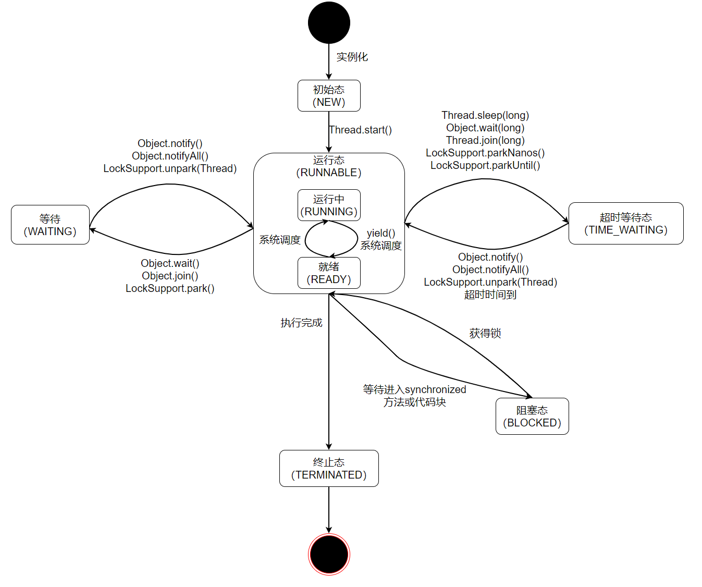

# 第一章 Java并发编程基础

## 1.1线程简介

**使用JMX输出线程信息**

~~~java
//使用JMX输出线程信息
public static void main(String[] args) {
    ThreadMXBean threadMXBean = ManagementFactory.getThreadMXBean();
    ThreadInfo[] threadInfos = threadMXBean.dumpAllThreads(false, false);
    for (ThreadInfo threadInfo : threadInfos) {
        System.out.println("threadInfo = " + threadInfo.getThreadId() + "  .." + threadInfo.getThreadName());
    }
}
//threadInfo = 1  ..main
//threadInfo = 2  ..Reference Handler
//threadInfo = 3  ..Finalizer
//threadInfo = 4  ..Signal Dispatcher
//threadInfo = 5  ..Attach Listener
//threadInfo = 21  ..Common-Cleaner
//threadInfo = 22  ..Monitor Ctrl-Break
//threadInfo = 23  ..Notification Thread
~~~


**线程优先级**

通过一个整型成员变量`priority`来控制优先级，范围为1 - 10，构建线程时可以通过`setPrority(int)`来设置线程优先级

*线程优先级并不一定会生效，有些操作系统会忽略对线程优先级的设置*


**Java线程的状态**



| 状态名称     | 说明                                                         |
| ------------ | ------------------------------------------------------------ |
| NEW          | 初始状态，线程被构建但是还没有start()                        |
| RUNNABLE     | 运行状态，Java线程将就绪态和运行态笼统的成为“运行中状态”     |
| BLOCKED      | 阻塞状态，表示线程阻塞于锁                                   |
| WAITING      | 等待状态，表示线程进入等待状态，进入该状态表示当前线程需要等待其他线程做出一些特定动作(通知或中断) |
| TIME_WAITING | 超时等待状态，该状态不同于WAITING，它可以在指定时间内自行返回，不需要通知 |
| TERMINATED   | 终止状态，表示当前线程已经执行完毕                           |

```java
package basic;

import utils.SleepUtils;

import java.util.concurrent.TimeUnit;

public class ThreadState {
    public static void main(String[] args) {
        new Thread(new TimeWaiting(), "TimeWaitingThread").start();
        new Thread(new Waiting(), "WaitingThread").start();

        //使用两个Blocked线程，一个获取锁成功，一个被阻塞
        new Thread(new Blocked(), "BlockedThread_1").start();
        new Thread(new Blocked(), "BlockedThread_2").start();
    }

    //该线程不断睡眠
    static class TimeWaiting implements Runnable{
        @Override
        public void run() {
            while(true){
                SleepUtils.second(100);
            }
        }
    }

    //该线程在Waiting.class实例上等待
    static class Waiting implements Runnable{
        @Override
        public void run() {
            while(true){
                synchronized (Waiting.class){
                    try {
                        Waiting.class.wait();
                    }catch (InterruptedException e){
                        e.printStackTrace();
                    }
                }
            }
        }
    }

    //该线程在Blocked.class实例上加锁后，不会释放该锁
    static class Blocked implements Runnable{
        @Override
        public void run() {
            synchronized (Blocked.class){
                while(true){
                    SleepUtils.second(100);
                }
            }
        }
    }
}

```

```shell
jsp
# 19024 Launcher
# 4112 Jps
# 23032
# 9736 ThreadState
jstack 9736
```

```java
2024-10-18 22:43:02
Full thread dump OpenJDK 64-Bit Server VM (17.0.12+1-b1087.25 mixed mode):

Threads class SMR info:
_java_thread_list=0x000002393d0c6c20, length=17, elements={
0x00000239384c2af0, 0x00000239384c56c0, 0x0000023938538b20, 0x000002393853b400,
0x000002393853bcd0, 0x000002393853ecb0, 0x000002393853f9a0, 0x00000239385413b0,
0x0000023938541db0, 0x0000023938657e30, 0x000002393d050cb0, 0x000002393d051190,
0x000002393d05b970, 0x000002393d05eca0, 0x000002393d0756f0, 0x000002393d065eb0,
0x000002390f0aced0
}

"Reference Handler" #2 daemon prio=10 os_prio=2 cpu=0.00ms elapsed=19.69s tid=0x00000239384c2af0 nid=0x38fc waiting on condition  [0x000000f5fc0ff000]
   java.lang.Thread.State: RUNNABLE
        at java.lang.ref.Reference.waitForReferencePendingList(java.base@17.0.12/Native Method)
        at java.lang.ref.Reference.processPendingReferences(java.base@17.0.12/Reference.java:253)
        at java.lang.ref.Reference$ReferenceHandler.run(java.base@17.0.12/Reference.java:215)

"Finalizer" #3 daemon prio=8 os_prio=1 cpu=0.00ms elapsed=19.69s tid=0x00000239384c56c0 nid=0x6398 in Object.wait()  [0x000000f5fc1fe000]
   java.lang.Thread.State: WAITING (on object monitor)
        at java.lang.Object.wait(java.base@17.0.12/Native Method)
        - waiting on <0x000000062380c090> (a java.lang.ref.ReferenceQueue$Lock)
        at java.lang.ref.ReferenceQueue.remove(java.base@17.0.12/ReferenceQueue.java:155)
        - locked <0x000000062380c090> (a java.lang.ref.ReferenceQueue$Lock)
        at java.lang.ref.ReferenceQueue.remove(java.base@17.0.12/ReferenceQueue.java:176)
        at java.lang.ref.Finalizer$FinalizerThread.run(java.base@17.0.12/Finalizer.java:172)

"Signal Dispatcher" #4 daemon prio=9 os_prio=2 cpu=0.00ms elapsed=19.68s tid=0x0000023938538b20 nid=0x31f4 waiting on condition  [0x0000000000000000]
   java.lang.Thread.State: RUNNABLE

"Attach Listener" #5 daemon prio=5 os_prio=2 cpu=0.00ms elapsed=19.68s tid=0x000002393853b400 nid=0xff4 waiting on condition  [0x0000000000000000]
   java.lang.Thread.State: RUNNABLE

"Service Thread" #6 daemon prio=9 os_prio=0 cpu=0.00ms elapsed=19.68s tid=0x000002393853bcd0 nid=0x1e0c runnable  [0x0000000000000000]
   java.lang.Thread.State: RUNNABLE

"Monitor Deflation Thread" #7 daemon prio=9 os_prio=0 cpu=0.00ms elapsed=19.68s tid=0x000002393853ecb0 nid=0x2554 runnable  [0x0000000000000000]
   java.lang.Thread.State: RUNNABLE

"C2 CompilerThread0" #8 daemon prio=9 os_prio=2 cpu=15.62ms elapsed=19.68s tid=0x000002393853f9a0 nid=0x2f8c waiting on condition  [0x0000000000000000]
   java.lang.Thread.State: RUNNABLE
   No compile task

"C1 CompilerThread0" #16 daemon prio=9 os_prio=2 cpu=0.00ms elapsed=19.68s tid=0x00000239385413b0 nid=0x3188 waiting on condition  [0x0000000000000000]
   java.lang.Thread.State: RUNNABLE
   No compile task

"Sweeper thread" #20 daemon prio=9 os_prio=2 cpu=0.00ms elapsed=19.68s tid=0x0000023938541db0 nid=0x56a0 runnable  [0x0000000000000000]
   java.lang.Thread.State: RUNNABLE

"Common-Cleaner" #21 daemon prio=8 os_prio=1 cpu=0.00ms elapsed=19.66s tid=0x0000023938657e30 nid=0x3518 in Object.wait()  [0x000000f5fc9ff000]
   java.lang.Thread.State: TIMED_WAITING (on object monitor)
        at java.lang.Object.wait(java.base@17.0.12/Native Method)
        - waiting on <0x000000062391e180> (a java.lang.ref.ReferenceQueue$Lock)
        at java.lang.ref.ReferenceQueue.remove(java.base@17.0.12/ReferenceQueue.java:155)
        - locked <0x000000062391e180> (a java.lang.ref.ReferenceQueue$Lock)
        at jdk.internal.ref.CleanerImpl.run(java.base@17.0.12/CleanerImpl.java:140)
        at java.lang.Thread.run(java.base@17.0.12/Thread.java:840)
        at jdk.internal.misc.InnocuousThread.run(java.base@17.0.12/InnocuousThread.java:162)

"Monitor Ctrl-Break" #22 daemon prio=5 os_prio=0 cpu=0.00ms elapsed=19.63s tid=0x000002393d050cb0 nid=0x50b0 runnable  [0x000000f5fcefe000]
   java.lang.Thread.State: RUNNABLE
        at sun.nio.ch.SocketDispatcher.read0(java.base@17.0.12/Native Method)
        at sun.nio.ch.SocketDispatcher.read(java.base@17.0.12/SocketDispatcher.java:46)
        at sun.nio.ch.NioSocketImpl.tryRead(java.base@17.0.12/NioSocketImpl.java:266)
        at sun.nio.ch.NioSocketImpl.implRead(java.base@17.0.12/NioSocketImpl.java:317)
        at sun.nio.ch.NioSocketImpl.read(java.base@17.0.12/NioSocketImpl.java:355)
        at sun.nio.ch.NioSocketImpl$1.read(java.base@17.0.12/NioSocketImpl.java:808)
        at java.net.Socket$SocketInputStream.read(java.base@17.0.12/Socket.java:966)
        at sun.nio.cs.StreamDecoder.readBytes(java.base@17.0.12/StreamDecoder.java:281)
        at sun.nio.cs.StreamDecoder.implRead(java.base@17.0.12/StreamDecoder.java:324)
        at sun.nio.cs.StreamDecoder.read(java.base@17.0.12/StreamDecoder.java:189)
        - locked <0x0000000623afb4a8> (a java.io.InputStreamReader)
        at java.io.InputStreamReader.read(java.base@17.0.12/InputStreamReader.java:177)
        at java.io.BufferedReader.fill(java.base@17.0.12/BufferedReader.java:162)
        at java.io.BufferedReader.readLine(java.base@17.0.12/BufferedReader.java:329)
        - locked <0x0000000623afb4a8> (a java.io.InputStreamReader)
        at java.io.BufferedReader.readLine(java.base@17.0.12/BufferedReader.java:396)
        at com.intellij.rt.execution.application.AppMainV2$1.run(AppMainV2.java:53)

"Notification Thread" #23 daemon prio=9 os_prio=0 cpu=0.00ms elapsed=19.63s tid=0x000002393d051190 nid=0x618c runnable  [0x0000000000000000]
   java.lang.Thread.State: RUNNABLE

"TimeWaitingThread" #24 prio=5 os_prio=0 cpu=0.00ms elapsed=19.63s tid=0x000002393d05b970 nid=0xcdc waiting on condition  [0x000000f5fd1ff000]
   java.lang.Thread.State: TIMED_WAITING (sleeping)
        at java.lang.Thread.sleep(java.base@17.0.12/Native Method)
        at java.lang.Thread.sleep(java.base@17.0.12/Thread.java:344)
        at java.util.concurrent.TimeUnit.sleep(java.base@17.0.12/TimeUnit.java:446)
        at utils.SleepUtils.second(SleepUtils.java:8)
        at basic.ThreadState$TimeWaiting.run(ThreadState.java:22)
        at java.lang.Thread.run(java.base@17.0.12/Thread.java:840)

"WaitingThread" #25 prio=5 os_prio=0 cpu=0.00ms elapsed=19.63s tid=0x000002393d05eca0 nid=0x19f8 in Object.wait()  [0x000000f5fd2ff000]
   java.lang.Thread.State: WAITING (on object monitor)
        at java.lang.Object.wait(java.base@17.0.12/Native Method)
        - waiting on <0x0000000623a7b428> (a java.lang.Class for basic.ThreadState$Waiting)
        at java.lang.Object.wait(java.base@17.0.12/Object.java:338)
        at basic.ThreadState$Waiting.run(ThreadState.java:34)
        - locked <0x0000000623a7b428> (a java.lang.Class for basic.ThreadState$Waiting)
        at java.lang.Thread.run(java.base@17.0.12/Thread.java:840)

"BlockedThread_1" #26 prio=5 os_prio=0 cpu=0.00ms elapsed=19.63s tid=0x000002393d0756f0 nid=0x2b74 waiting on condition  [0x000000f5fd3fe000]
   java.lang.Thread.State: TIMED_WAITING (sleeping)
        at java.lang.Thread.sleep(java.base@17.0.12/Native Method)
        at java.lang.Thread.sleep(java.base@17.0.12/Thread.java:344)
        at java.util.concurrent.TimeUnit.sleep(java.base@17.0.12/TimeUnit.java:446)
        at utils.SleepUtils.second(SleepUtils.java:8)
        at basic.ThreadState$Blocked.run(ThreadState.java:49)
        - locked <0x0000000623a7c5b8> (a java.lang.Class for basic.ThreadState$Blocked)
        at java.lang.Thread.run(java.base@17.0.12/Thread.java:840)

"BlockedThread_2" #27 prio=5 os_prio=0 cpu=0.00ms elapsed=19.63s tid=0x000002393d065eb0 nid=0x278c waiting for monitor entry  [0x000000f5fd4ff000]
   java.lang.Thread.State: BLOCKED (on object monitor)
        at basic.ThreadState$Blocked.run(ThreadState.java:49)
        - waiting to lock <0x0000000623a7c5b8> (a java.lang.Class for basic.ThreadState$Blocked)
        at java.lang.Thread.run(java.base@17.0.12/Thread.java:840)

"DestroyJavaVM" #28 prio=5 os_prio=0 cpu=0.00ms elapsed=19.63s tid=0x000002390f0aced0 nid=0x15b4 waiting on condition  [0x0000000000000000]
   java.lang.Thread.State: RUNNABLE

"VM Thread" os_prio=2 cpu=0.00ms elapsed=19.69s tid=0x00000239384c0020 nid=0x342c runnable

"GC Thread#0" os_prio=2 cpu=0.00ms elapsed=19.71s tid=0x0000023935210900 nid=0x4194 runnable

"G1 Main Marker" os_prio=2 cpu=0.00ms elapsed=19.71s tid=0x000002390f12bfb0 nid=0x878 runnable

"G1 Conc#0" os_prio=2 cpu=0.00ms elapsed=19.71s tid=0x000002390f12c9d0 nid=0x1190 runnable

"G1 Refine#0" os_prio=2 cpu=0.00ms elapsed=19.71s tid=0x00000239352d9710 nid=0x3d64 runnable

"G1 Service" os_prio=2 cpu=0.00ms elapsed=19.71s tid=0x00000239352daff0 nid=0x38c4 runnable

"VM Periodic Task Thread" os_prio=2 cpu=0.00ms elapsed=19.63s tid=0x000002393d0b7c10 nid=0x2b18 waiting on condition

JNI global refs: 23, weak refs: 0

JNI global refs memory usage: 843, weak refs: 209

JNI global refs: 23, weak refs: 0
```


**Daemon线程**

Daemon线程是一种支持型线程，主要被用作程序中的后台调度以及支持工作。当一个Java虚拟机中不存在非Daemon线程的时候，Java虚拟机将退出。通过调用`Thread.setDaemon(true)`将线程设置为Daemon线程

*Daemon属性需要在启动线程之前设置，不能在启动线程之后设置*

Daemon线程中的`finally`代码块不一定会执行，因为当虚拟机中只有Daemon线程时，虚拟机会退出

## 1.2启动和终止线程

### 1.2.1创建线程

线程对象在构造时需要提供线程所需要的属性

```java
private Thread(ThreadGroup g, Runnable target, String name,
                   long stackSize, AccessControlContext acc,
                   boolean inheritThreadLocals) {
        if (name == null) {
            throw new NullPointerException("name cannot be null");
        }

        this.name = name;
		
    	//当前线程就是该线程的父线程
        Thread parent = currentThread();

		
        this.group = g;
        this.daemon = parent.isDaemon();
        this.priority = parent.getPriority();
        
        this.target = target;
        setPriority(priority);
    
    	//将父线程的inheritableThreadLocals复制过来
        if (inheritThreadLocals && parent.inheritableThreadLocals != null)
            this.inheritableThreadLocals =
                ThreadLocal.createInheritedMap(parent.inheritableThreadLocals);
        /* Stash the specified stack size in case the VM cares */
        this.stackSize = stackSize;

        /* Set thread ID */
        this.tid = nextThreadID();
    }
```

### 1.2.2启动线程

`start()`方法启动线程，含义是：**当前线程（即父线程）同步告知Java虚拟机，只要线程规划期空闲，应立即启动调用start()方法的线程**
