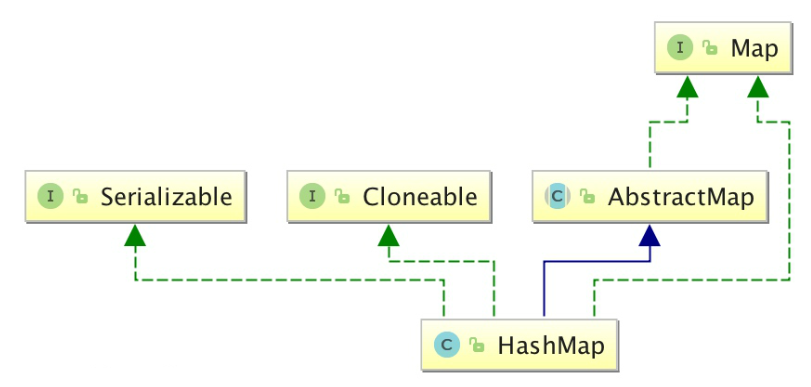
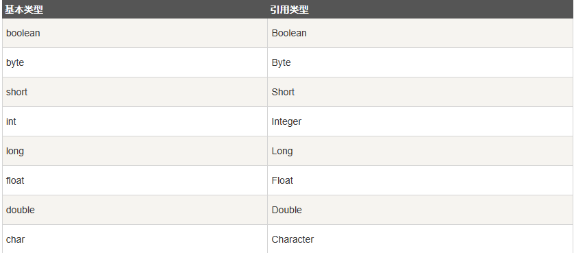

```java
class Solution {
    public int[] twoSum(int[] nums, int target) {
        int[] rst = new int[2];
        for (int i = 0; i < nums.length; ++i){
            for (int j = i + 1; j < nums.length; ++j){
                if (nums[i] + nums[j] == target){
                    rst[0] = i;
                    rst[1] = j;
                }
            }
        }
        return rst;
    }
}
//暴力枚举， 时间复杂度O(n^2)，空间复杂度O(1)

class Solution {
    public int[] twoSum(int[] nums, int target) {
        Map<Integer, Integer> hash = new HashMap<Integer, Integer>();
        for (int i = 0; i < nums.length; ++i){
            if (hash.containsKey(target - nums[i])){
                return new int[]{hash.get(target - nums[i]), i};
            }
            hash.put(nums[i], i);
        }
        return new int[0];
    }
}
//使用哈希表， 时间复杂度O(n)，空间复杂度O(n)
//注意：题目要求返回的下标不能重复
```

笔记：

- 哈希表插入，删除，随机访问的时间复杂度均为O(1)

- HashMap

  HashMap实现了Map接口，最多允许一条记录的键值为`null`，**不支持线程同步**

  无序列表，不会记录插入的顺序

  HashMap类位于`java.unil.HashMap`

  继承自AbstractMap，实现了Map，Cloneable，java.io.Serializable的接口

  key和value的类型可以不相同

  

  HashMap中的元素实质上是对象，一些常见的基本类型可以使用它们的包装类

  

  