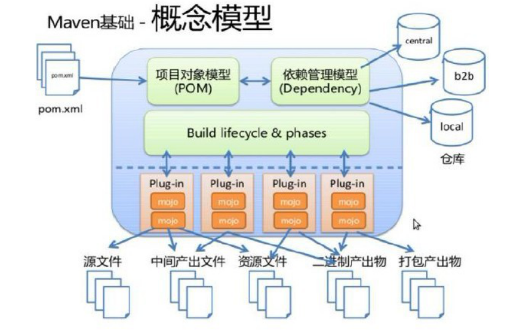

# 一、Maven简介

## 1.1 依赖管理工具

```xml
<!-- Nacos 服务注册发现启动器 -->
<dependency>
    <groupId>com.alibaba.cloud</groupId>
    <artifactId>spring-cloud-starter-alibaba-nacos-discovery</artifactId>
</dependency>

<!-- web启动器依赖 -->
<dependency>
    <groupId>org.springframework.boot</groupId>
    <artifactId>spring-boot-starter-web</artifactId>
</dependency>

<!-- 视图模板技术 thymeleaf -->
<dependency>
    <groupId>org.springframework.boot</groupId>
    <artifactId>spring-boot-starter-thymeleaf</artifactId>
</dependency>
```

使用 Maven 后，依赖对应的 jar 包能够**自动下载**，方便、快捷又规范。

框架中使用的 jar 包，不仅数量庞大，而且彼此之间存在错综复杂的依赖关系。依赖关系的复杂程度，已经上升到了完全不能靠人力手动解决的程度。另外，jar 包之间有可能产生冲突。进一步增加了我们在 jar 包使用过程中的难度。

## 1.2 构建工具


## 1.3 工作原理



# 二、Maven安装和配置

p6

