# 一、Maven简介

## 1.1 依赖管理工具

```xml
<!-- Nacos 服务注册发现启动器 -->
<dependency>
    <groupId>com.alibaba.cloud</groupId>
    <artifactId>spring-cloud-starter-alibaba-nacos-discovery</artifactId>
</dependency>

<!-- web启动器依赖 -->
<dependency>
    <groupId>org.springframework.boot</groupId>
    <artifactId>spring-boot-starter-web</artifactId>
</dependency>

<!-- 视图模板技术 thymeleaf -->
<dependency>
    <groupId>org.springframework.boot</groupId>
    <artifactId>spring-boot-starter-thymeleaf</artifactId>
</dependency>
```

使用 Maven 后，依赖对应的 jar 包能够**自动下载**，方便、快捷又规范。

框架中使用的 jar 包，不仅数量庞大，而且彼此之间存在错综复杂的依赖关系。依赖关系的复杂程度，已经上升到了完全不能靠人力手动解决的程度。另外，jar 包之间有可能产生冲突。进一步增加了我们在 jar 包使用过程中的难度。

## 1.2 构建工具

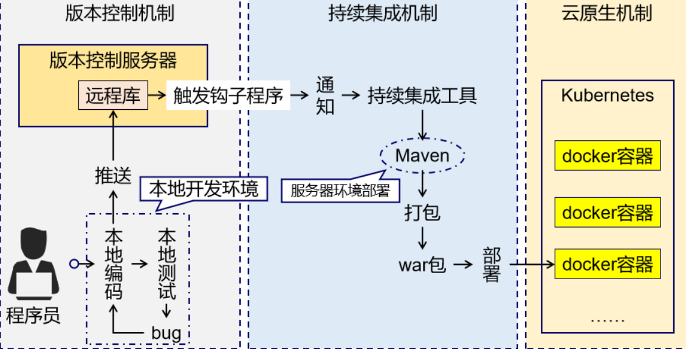

## 1.3 工作原理


# 二、Maven安装和配置

## 2.1 Maven安装

<https://maven.apache.org/docs/history.html>

各个工具选用版本：

| 工具  | 版本   |
| ----- | ------ |
| Maven | 3.8.8  |
| JDK   | 17     |
| IDEA  | 2022.2 |

**安装条件：** maven需要本机安装java环境、必需包含java\_home环境变量！

**软件安装：** 右键解压即可（绿色免安装）

**软件结构：**

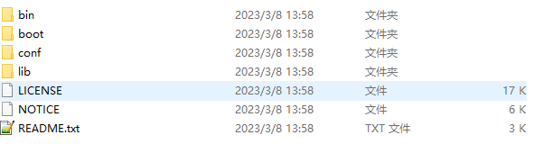

**bin**：含有Maven的运行脚本

boot：含有plexus-classworlds类加载器框架

**conf**：含有Maven的核心配置文件

lib：含有Maven运行时所需要的Java类库

LICENSE、NOTICE、README.txt：针对Maven版本，第三方软件等简要介绍

## 2.2 Maven环境配置

1. 配置MAVEN_HOME

   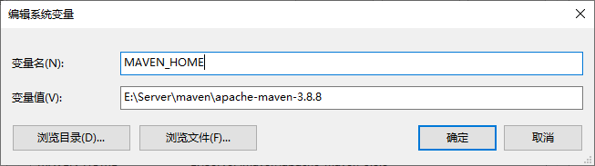

2. 配置Path

   

3. 命令测试（cmd窗口）

   ```bash
   mvn -v 
   # 输出版本信息即可，如果错误，请仔细检查环境变量即可！
   ```

## 2.3 Maven功能配置

> 我们需要需改**maven/conf/settings.xml**配置文件，来修改maven的一些默认配置。我们主要休要修改的有三个配置：
>
> 1.依赖本地缓存位置（本地仓库位置）
>
> 2.maven下载镜像
>
> 3.maven选用编译项目的jdk版本

1. 配置本地仓库地址

   ```xml
     <!-- localRepository
      | The path to the local repository maven will use to store artifacts.
      |
      | Default: ${user.home}/.m2/repository
     <localRepository>/path/to/local/repo</localRepository>
     -->
    <!-- conf/settings.xml 55行 -->
    <localRepository>D:\maven-repository</localRepository>
   ```

2. 配置国内阿里镜像

   ```xml
   <!--在mirrors节点(标签)下添加中央仓库镜像 160行附近-->
   <mirror>
       <id>alimaven</id>
       <name>aliyun maven</name>
       <url>http://maven.aliyun.com/nexus/content/groups/public/</url>
       <mirrorOf>central</mirrorOf>
   </mirror>
   ```

3. 配置jdk17版本项目构建

   ```xml
   <!--在profiles节点(标签)下添加jdk编译版本 268行附近-->
   <profile>
       <id>jdk-17</id>
       <activation>
         <activeByDefault>true</activeByDefault>
         <jdk>17</jdk>
       </activation>
       <properties>
         <maven.compiler.source>17</maven.compiler.source>
         <maven.compiler.target>17</maven.compiler.target>
         <maven.compiler.compilerVersion>17</maven.compiler.compilerVersion>
       </properties>
   </profile>
   ```

## 2.4 IDEA配置本地Maven软件

> 我们需要将配置好的maven软件，配置到idea开发工具中即可！ 注意：idea工具默认自带maven配置软件，但是因为没有修改配置，建议替换成本地配置好的maven！

选择本地maven软件

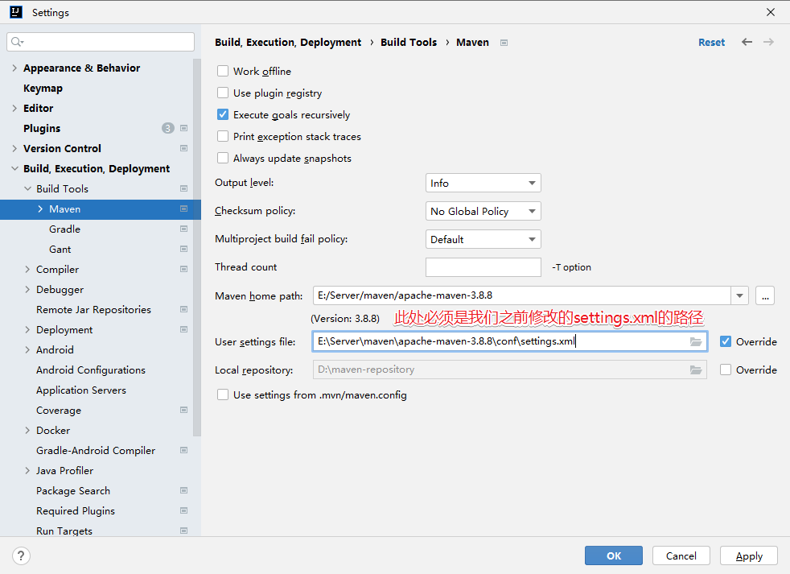

**注意**：

1、如果本地仓库地址不变化，只有一个原因，就是maven/conf/settings.xml配置文件编写错误！仔细检查即可！

2、一定保证User settings file对应之前修改的settings.xml的路径，若 不一致，选中Override复选框，手动选择配置文件

# 三、基于IDEA创建Maven工程

## 3.1 概念梳理Maven工程的GAVP

Maven工程相对之前的项目，多出一组gavp属性，gav需要我们在创建项目的时候指定，p有默认值，我们先行了解下这组属性的含义：

Maven 中的 GAVP 是指 GroupId、ArtifactId、Version、Packaging 等四个属性的缩写，其中前三个是必要的，而 Packaging 属性为可选项。这四个属性主要为每个项目在maven仓库中做一个标识，类似人的姓-名！有了具体标识，方便后期项目之间相互引用依赖等！

GAV遵循一下规则：

​	1） **GroupID 格式**：com.{公司/BU }.业务线.\[子业务线]，最多 4 级。

​		说明：{公司/BU} 例如：alibaba/taobao/tmall/aliexpress 等 BU 一级；子业务线可选。

​		正例：com.taobao.tddl 或 com.alibaba.sourcing.multilang

​	2） **ArtifactID 格式**：产品线名-模块名。语义不重复不遗漏，先到仓库中心去查证一下。

​		正例：tc-client / uic-api / tair-tool / bookstore

​	3） **Version版本号格式推荐**：主版本号.次版本号.修订号

​		1） 主版本号：当做了不兼容的 API 修改，或者增加了能改变产品方向的新功能。

​		2） 次版本号：当做了向下兼容的功能性新增（新增类、接口等）。

​		3） 修订号：修复 bug，没有修改方法签名的功能加强，保持 API 兼容性。

​		例如： 初始→1.0.0  修改bug → 1.0.1  功能调整 → 1.1.1等

**Packaging定义规则：**

​	指示将项目打包为什么类型的文件，idea根据packaging值，识别maven项目类型！

​	packaging 属性为 jar（默认值），代表普通的Java工程，打包以后是.jar结尾的文件。

​	packaging 属性为 war，代表Java的web工程，打包以后.war结尾的文件。

​	packaging 属性为 pom，代表不会打包，用来做继承的父工程。

## 3.2 Idea构建Maven Java SE工程

注意：此处省略了version，直接给了一个默认值：**1.0-SNAPSHOT**

自己后期可以在项目中随意修改！

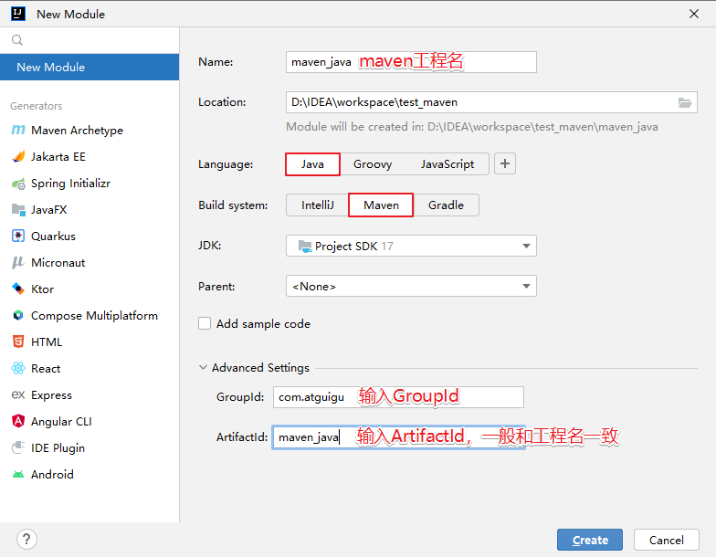

创建工程之后，若第一次使用maven，或者使用的是新的**本地仓库**，idea右下角会出现以下进度条，表示maven正在下载相关插件，等待下载完毕，进度条消失即可


验证maven工程是否创建成功，当创建完毕maven工程之后，idea中会自动打开Maven视图，如下图：

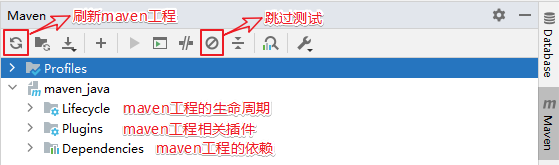

## 3.3 Idea构建Maven Java Web工程

1. 手动创建

   1. 创建一个maven的javase工程

      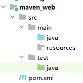

   2. 修改pom.xml文件打包方式

      修改位置：项目下/pom.xml

      ```xml
      <groupId>com.atguigu</groupId>
      <artifactId>maven_web</artifactId>
      <version>1.0-SNAPSHOT</version>
      <!-- 新增一列打包方式packaging -->
      <packaging>war</packaging>
      ```

   3. 设置**web资源路径**和**web.xml路径**

      点击File-->Project Structure

      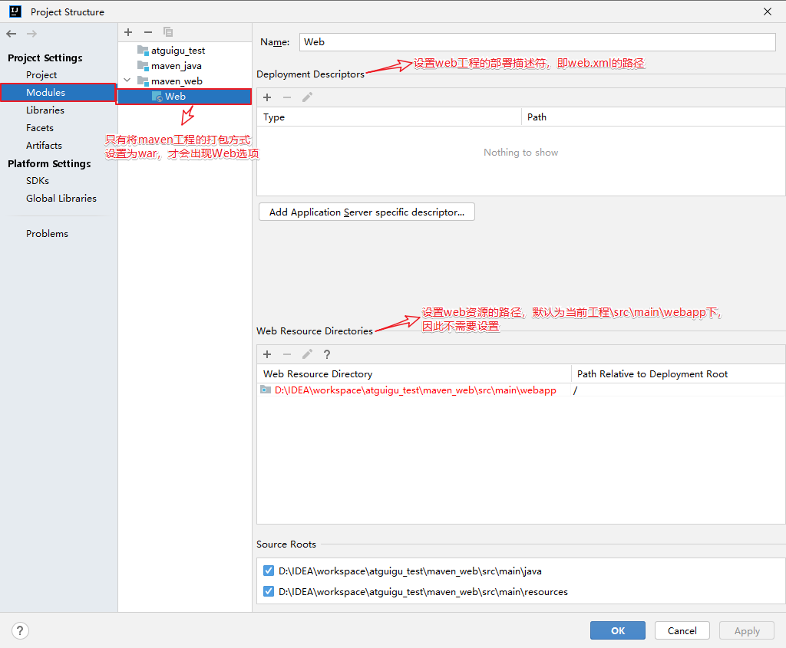

      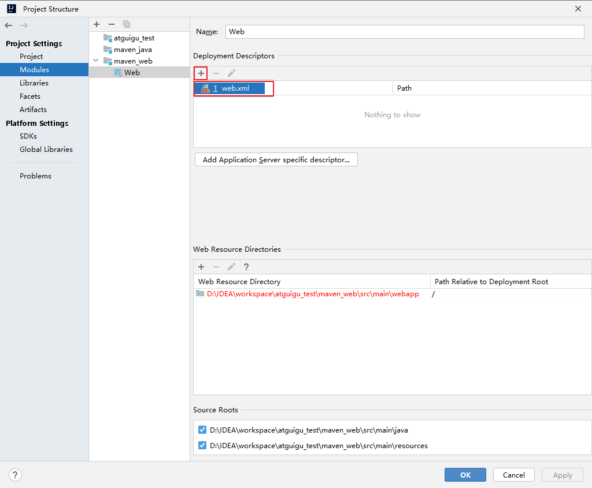

      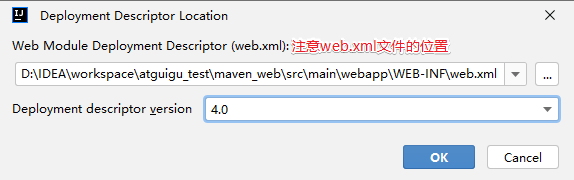

   4. 刷新和校验

      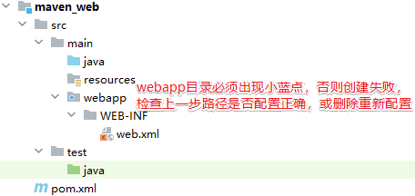

      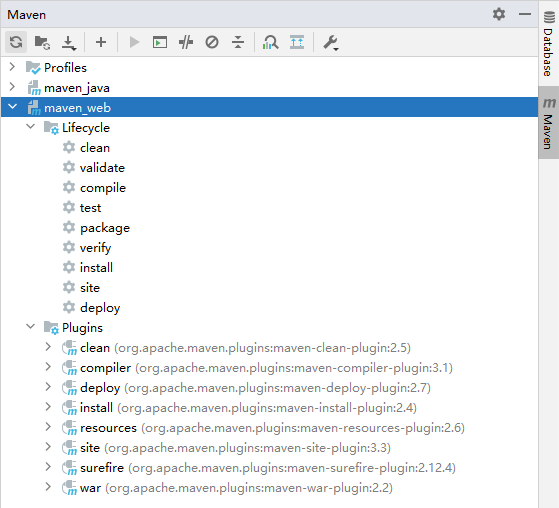

2. 插件创建

   1. 安装插件JBLJavaToWeb

      file / settings / plugins / marketplace

      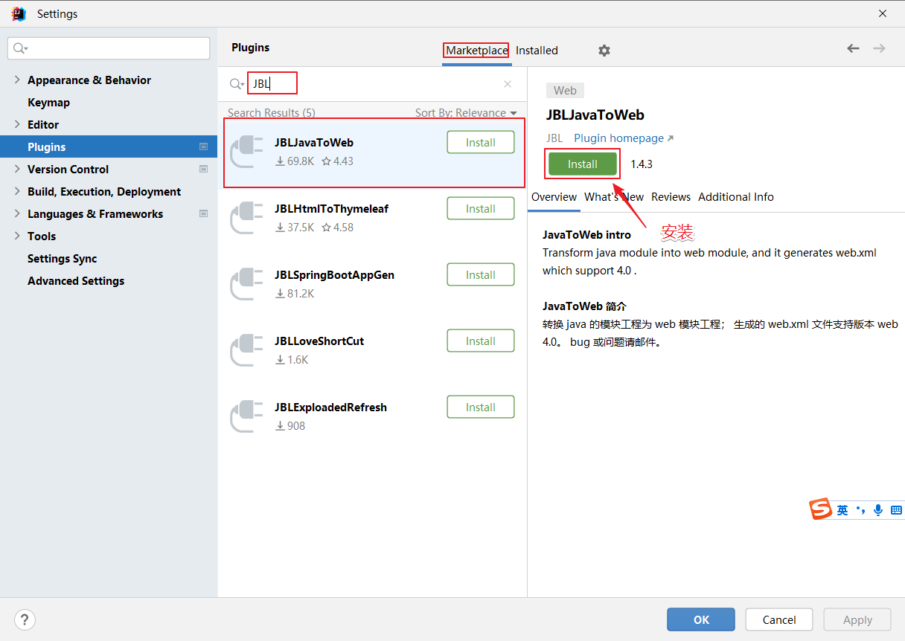

   2. 创建一个javasemaven工程

   3. 右键、使用插件快速补全web项目

      

## 3.4 Maven工程项目结构说明

Maven 是一个强大的构建工具，它提供一种标准化的项目结构，可以帮助开发者更容易地管理项目的依赖、构建、测试和发布等任务。以下是 Maven Web 程序的文件结构及每个文件的作用：

```xml
|-- pom.xml                               # Maven 项目管理文件 
|-- src
    |-- main                              # 项目主要代码
    |   |-- java                          # Java 源代码目录
    |   |   `-- com/example/myapp         # 开发者代码主目录
    |   |       |-- controller            # 存放 Controller 层代码的目录
    |   |       |-- service               # 存放 Service 层代码的目录
    |   |       |-- dao                   # 存放 DAO 层代码的目录
    |   |       `-- model                 # 存放数据模型的目录
    |   |-- resources                     # 资源目录，存放配置文件、静态资源等
    |   |   |-- log4j.properties          # 日志配置文件
    |   |   |-- spring-mybatis.xml        # Spring Mybatis 配置文件
    |   |   `-- static                    # 存放静态资源的目录
    |   |       |-- css                   # 存放 CSS 文件的目录
    |   |       |-- js                    # 存放 JavaScript 文件的目录
    |   |       `-- images                # 存放图片资源的目录
    |   `-- webapp                        # 存放 WEB 相关配置和资源
    |       |-- WEB-INF                   # 存放 WEB 应用配置文件
    |       |   |-- web.xml               # Web 应用的部署描述文件
    |       |   `-- classes               # 存放编译后的 class 文件
    |       `-- index.html                # Web 应用入口页面
    `-- test                              # 项目测试代码
        |-- java                          # 单元测试目录
        `-- resources                     # 测试资源目录
```

-   pom.xml：Maven 项目管理文件，用于描述项目的依赖和构建配置等信息。
-   src/main/java：存放项目的 Java 源代码。
-   src/main/resources：存放项目的资源文件，如配置文件、静态资源等。
-   src/main/webapp/WEB-INF：存放 Web 应用的配置文件。
-   src/main/webapp/index.jsp：Web 应用的入口页面。
-   src/test/java：存放项目的测试代码。
-   src/test/resources：存放测试相关的资源文件，如测试配置文件等。

# 四、基于IDEA进行Maven工程构建

## 4.1 构建概念和构建过程

项目构建是指将源代码、依赖库和资源文件等转换成可执行或可部署的应用程序的过程，在这个过程中包括编译源代码、链接依赖库、打包和部署等多个步骤。

项目构建是软件开发过程中至关重要的一部分，它能够大大提高软件开发效率，使得开发人员能够更加专注于应用程序的开发和维护，而不必关心应用程序的构建细节。

同时，项目构建还能够将多个开发人员的代码汇合到一起，并能够自动化项目的构建和部署，大大降低了项目的出错风险和提高开发效率。常见的构建工具包括 Maven、Gradle、Ant 等。


## 4.2 命令方式项目构建

| 命令        | 描述                        |
| ----------- | --------------------------- |
| mvn compile | 编译项目，生成target文件    |
| mvn package | 打包项目，生成jar或war文件  |
| mvn clean   | 清理编译或打包后的项目结构  |
| mvn install | 打包后上传到maven本地仓库   |
| mvn deploy  | 只打包，上传到maven私服仓库 |
| mvn site    | 生成站点                    |
| mvn test    | 执行测试源码                |

war包打包插件和jdk版本不匹配：pom.xml 添加以下代码即可

```xml
<build>
    <!-- jdk17 和 war包版本插件不匹配 -->
    <plugins>
        <plugin>
            <groupId>org.apache.maven.plugins</groupId>
            <artifactId>maven-war-plugin</artifactId>
            <version>3.2.2</version>
        </plugin>
    </plugins>
</build>
```

命令触发练习：

```bash
mvn 命令 命令

#清理
mvn clean
#清理，并重新打包
mvn clean package
#执行测试代码
mvn test
```

## 4.3 可视化方式项目构建


注意：打包（package）和安装（install）的区别是什么

打包是将工程打成jar或war文件，保存在target目录下

安装是将当前工程所生成的jar或war文件，安装到本地仓库，会按照坐标保存到指定位置

## 4.4 构建插件、命令、生命周期命令之间关系

- **构建生命周期**

  我们发现一个情况！当我们执行package命令也会自动执行compile命令！

  ```xml
  [INFO] --------------------------------[ jar ]---------------------------------
  [INFO] 
  [INFO] --- maven-resources-plugin:2.6:resources (default-resources) @ mybatis-base-curd ---
  [INFO] --- maven-compiler-plugin:3.1:compile (default-compile) @ mybatis-base-curd ---
  [INFO] --- maven-resources-plugin:2.6:testResources (default-testResources) @ mybatis-base-curd ---
  [INFO] --- maven-compiler-plugin:3.1:testCompile (default-testCompile) @ mybatis-base-curd ---
  [INFO] --- maven-surefire-plugin:2.12.4:test (default-test) @ mybatis-base-curd ---
  [INFO] --- maven-jar-plugin:2.4:jar (default-jar) @ mybatis-base-curd ---
  [INFO] Building jar: D:\javaprojects\backend-engineering\part03-mybatis\mybatis-base-curd\target\mybatis-base-curd-1.0-SNAPSHOT.jar
  [INFO] ------------------------------------------------------------------------
  [INFO] BUILD SUCCESS
  [INFO] ------------------------------------------------------------------------
  [INFO] Total time:  5.013 s
  [INFO] Finished at: 2023-06-05T10:03:47+08:00
  [INFO] ------------------------------------------------------------------------
  ```

  这种行为就是因为构建生命周期产生的！构建生命周期可以理解成是一组固定构建命令的有序集合，触发周期后的命令，会自动触发周期前的命令！！！

  **构建周期作用：会简化构建过程**

  例如：项目打包   mvn clean package即可。&#x20;

  主要两个构建生命周期：

  - 清理周期：主要是对项目编译生成文件进行清理

    包含命令：clean&#x20;

- 默认周期：定义了真正构件时所需要执行的所有步骤，它是生命周期中最核心的部分

      包含命令：compile -  test - package - install - deploy

- **插件、命令、周期三者关系（了解）**

  周期→包含若干命令→包含若干插件

  使用周期命令构建，简化构建过程！

  最终进行构建的是插件！

# 五、基于IDEA进行Maven依赖管理

## 5.1 依赖管理概念

Maven 依赖管理是 Maven 软件中最重要的功能之一。Maven 的依赖管理能够帮助开发人员自动解决软件包依赖问题，使得开发人员能够轻松地将其他开发人员开发的模块或第三方框架集成到自己的应用程序或模块中，避免出现版本冲突和依赖缺失等问题。

我们通过定义 POM 文件，Maven 能够自动解析项目的依赖关系，并通过 Maven **仓库自动**下载和管理依赖，从而避免了手动下载和管理依赖的繁琐工作和可能引发的版本冲突问题。

总之，Maven 的依赖管理是 Maven 软件的一个核心功能之一，使得软件包依赖的管理和使用更加智能和方便，简化了开发过程中的工作，并提高了软件质量和可维护性。

## 5.2 Maven工程核心信息配置和解读（GAVP）

位置：pom.xml

```xml
<!-- 模型版本 -->
<modelVersion>4.0.0</modelVersion>
<!-- 公司或者组织的唯一标志，并且配置时生成的路径也是由此生成， 如com.companyname.project-group，maven会将该项目打成的jar包放本地路径：/com/companyname/project-group -->
<groupId>com.companyname.project-group</groupId>
<!-- 项目的唯一ID，一个groupId下面可能多个项目，就是靠artifactId来区分的 -->
<artifactId>project</artifactId>
<!-- 版本号 -->
<version>1.0.0</version>

<!--打包方式
    默认：jar
    jar指的是普通的java项目打包方式！ 项目打成jar包！
    war指的是web项目打包方式！项目打成war包！
    pom不会讲项目打包！这个项目作为父工程，被其他工程聚合或者继承！后面会讲解两个概念
-->
<packaging>jar/pom/war</packaging>
```

## 5.3 Maven工程依赖管理配置

位置：pom.xml

依赖管理和依赖添加

```xml
<!-- 
   通过编写依赖jar包的gav必要属性，引入第三方依赖！
   scope属性是可选的，可以指定依赖生效范围！
   依赖信息查询方式：
      1. maven仓库信息官网 https://mvnrepository.com/
      2. mavensearch插件搜索
 -->
<dependencies>
    <!-- 引入具体的依赖包 -->
    <dependency>
        <groupId>log4j</groupId>
        <artifactId>log4j</artifactId>
        <version>1.2.17</version>
        <!-- 依赖范围 -->
        <scope>runtime</scope>
    </dependency>

</dependencies>
```

依赖版本统一提取和维护

```xml
<!--声明版本-->
<properties>
  <!--命名随便,内部制定版本号即可！-->
  <junit.version>4.12</junit.version>
  <!-- 也可以通过 maven规定的固定的key，配置maven的参数！如下配置编码格式！-->
  <project.build.sourceEncoding>UTF-8</project.build.sourceEncoding>
  <project.reporting.outputEncoding>UTF-8</project.reporting.outputEncoding>
</properties>

<dependencies>
  <dependency>
    <groupId>junit</groupId>
    <artifactId>junit</artifactId>
    <!--引用properties声明版本 -->
    <version>${junit.version}</version>
  </dependency>
</dependencies>
```

## 5.4 依赖范围

通过设置坐标的依赖范围(scope)，可以设置 对应jar包的作用范围：编译环境、测试环境、运行环境

| 依赖范围     | 描述                                                         |
| ------------ | ------------------------------------------------------------ |
| **compile**  | 编译依赖范围，scope 元素的缺省值。使用此依赖范围的 Maven 依赖，对于三种 classpath 均有效，即该 Maven 依赖在上述三种 classpath 均会被引入。例如，log4j 在编译、测试、运行过程都是必须的。 |
| **test**     | 测试依赖范围。使用此依赖范围的 Maven 依赖，只对测试 classpath 有效。例如，Junit 依赖只有在测试阶段才需要。 |
| **provided** | 已提供依赖范围。使用此依赖范围的 Maven 依赖，只对编译 classpath 和测试 classpath 有效。例如，servlet-api 依赖对于编译、测试阶段而言是需要的，但是运行阶段，由于外部容器已经提供，故不需要 Maven 重复引入该依赖。 |
| runtime      | 运行时依赖范围。使用此依赖范围的 Maven 依赖，只对测试 classpath、运行 classpath 有效。例如，JDBC 驱动实现依赖，其在编译时只需 JDK 提供的 JDBC 接口即可，只有测试、运行阶段才需要实现了 JDBC 接口的驱动。 |
| system       | 系统依赖范围，其效果与 provided 的依赖范围一致。其用于添加非 Maven 仓库的本地依赖，通过依赖元素 dependency 中的 systemPath 元素指定本地依赖的路径。鉴于使用其会导致项目的可移植性降低，一般不推荐使用。 |
| import       | 导入依赖范围，该依赖范围只能与 dependencyManagement 元素配合使用，其功能是将目标 pom.xml 文件中 dependencyManagement 的配置导入合并到当前 pom.xml 的 dependencyManagement 中。 |

## 5.5 Maven工程依赖下载失败错误解决（重点）

在使用 Maven 构建项目时，可能会发生依赖项下载错误的情况，主要原因有以下几种：

1.  下载依赖时出现网络故障或仓库服务器宕机等原因，导致无法连接至 Maven 仓库，从而无法下载依赖。
2.  依赖项的版本号或配置文件中的版本号错误，或者依赖项没有正确定义，导致 Maven 下载的依赖项与实际需要的不一致，从而引发错误。
3.  本地 Maven 仓库或缓存被污染或损坏，导致 Maven 无法正确地使用现有的依赖项。

解决方案：

1. 检查网络连接和 Maven 仓库服务器状态。

2. 确保依赖项的版本号与项目对应的版本号匹配，并检查 POM 文件中的依赖项是否正确。

3. 清除本地 Maven 仓库缓存（lastUpdated 文件），因为只要存在lastupdated缓存文件，刷新也不会重新下载。本地仓库中，根据依赖的gav属性依次向下查找文件夹，最终删除内部的文件，刷新重新下载即可！

   例如： pom.xml依赖

   ```xml
   <dependency>
     <groupId>com.alibaba</groupId>
     <artifactId>druid</artifactId>
     <version>1.2.8</version>
   </dependency>
   ```

   文件：

   

4. 或者可以将清除**lastUpdated文件**的操作写在一个脚本文件中，手动创建文件"clearLastUpdated.bat"，名字任意，但是后缀必须是bat，将以下内容复制到文件中

   ```bat
   cls 
   @ECHO OFF 
   SET CLEAR_PATH=D: 
   SET CLEAR_DIR=D:\maven-repository(本地仓库路径)
   color 0a 
   TITLE ClearLastUpdated For Windows 
   GOTO MENU 
   :MENU 
   CLS
   ECHO. 
   ECHO. * * * *  ClearLastUpdated For Windows  * * * * 
   ECHO. * * 
   ECHO. * 1 清理*.lastUpdated * 
   ECHO. * * 
   ECHO. * 2 查看*.lastUpdated * 
   ECHO. * * 
   ECHO. * 3 退 出 * 
   ECHO. * * 
   ECHO. * * * * * * * * * * * * * * * * * * * * * * * * 
   ECHO. 
   ECHO.请输入选择项目的序号： 
   set /p ID= 
   IF "%id%"=="1" GOTO cmd1 
   IF "%id%"=="2" GOTO cmd2 
   IF "%id%"=="3" EXIT 
   PAUSE 
   :cmd1 
   ECHO. 开始清理
   %CLEAR_PATH%
   cd %CLEAR_DIR%
   for /r %%i in (*.lastUpdated) do del %%i
   ECHO.OK 
   PAUSE 
   GOTO MENU 
   :cmd2 
   ECHO. 查看*.lastUpdated文件
   %CLEAR_PATH%
   cd %CLEAR_DIR%
   for /r %%i in (*.lastUpdated) do echo %%i
   ECHO.OK 
   PAUSE 
   GOTO MENU 
   ```

   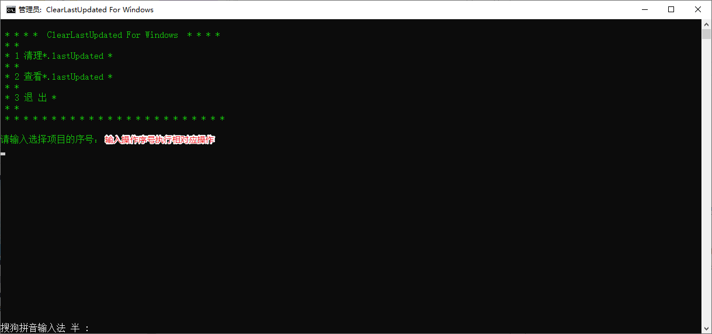

## 5.6 Maven工程Build构建配置

项目构建是指将源代码、依赖库和资源文件等转换成可执行或可部署的应用程序的过程，在这个过程中包括编译源代码、链接依赖库、打包和部署等多个步骤。

默认情况下，构建不需要额外配置，都有对应的缺省配置。当然了，我们也可以在pom.xml定制一些配置，来修改默认构建的行为和产物！

例如：

1.  指定构建打包文件的名称，非默认名称
2.  制定构建打包时，指定包含文件格式和排除文件
3.  打包插件版本过低，配置更高版本插件

构建配置是在pom.xml / build标签中指定！

**指定打包命名**

```xml
<!-- 默认的打包名称：artifactid+verson.打包方式 -->
<build>
  <finalName>定义打包名称</finalName>
</build>  
```

**指定打包文件**

如果在java文件夹中添加java类，会自动打包编译到classes文件夹下！

但是在java文件夹中添加xml文件，默认不会被打包！

默认情况下，按照maven工程结构放置的文件会默认被编译和打包！

除此之外、我们可以使用resources标签，指定要打包资源的文件夹要把哪些静态资源打包到 classes根目录下！

应用场景：mybatis中有时会将用于编写SQL语句的映射文件和mapper接口都写在src/main/java下的某个包中，此时映射文件就不会被打包，如何解决

```xml
<build>
    <!--设置要打包的资源位置-->
    <resources>
        <resource>
            <!--设置资源所在目录-->
            <directory>src/main/java</directory>
            <includes>
                <!--设置包含的资源类型-->
                <include>**/*.xml</include>
            </includes>
        </resource>
    </resources>
</build>
```

**配置依赖插件**

dependencies标签下引入开发需要的jar包！我们可以在build/plugins/plugin标签引入插件！

常用的插件：修改jdk版本、tomcat插件、mybatis分页插件、mybatis逆向工程插件等等！

```xml
<build>
  <plugins>
      <!-- java编译插件，配jdk的编译版本 -->
      <plugin>
        <groupId>org.apache.maven.plugins</groupId>
        <artifactId>maven-compiler-plugin</artifactId>
        <configuration>
          <source>1.8</source>
          <target>1.8</target>
          <encoding>UTF-8</encoding>
        </configuration>
      </plugin>
      <!-- tomcat插件 -->
      <plugin>
        <groupId>org.apache.tomcat.maven</groupId>
        <artifactId>tomcat7-maven-plugin</artifactId>
         <version>2.2</version>
          <configuration>
          <port>8090</port>
          <path>/</path>
          <uriEncoding>UTF-8</uriEncoding>
          <server>tomcat7</server>
        </configuration>
      </plugin>
    </plugins>
</build>
```

# 六、Maven依赖传递和依赖冲突

## 6.1 Maven依赖传递特性

**概念**

假如有Maven项目A，项目B依赖A，项目C依赖B。那么我们可以说 C依赖A。也就是说，依赖的关系为：C—>B—>A， 那么我们执行项目C时，会自动把B、A都下载导入到C项目的jar包文件夹中，这就是依赖的传递性。

**作用**

-   简化依赖导入过程
-   确保依赖版本正确

**传递的原则**

在 A 依赖 B，B 依赖 C 的前提下，C 是否能够传递到 A，取决于 B 依赖 C 时使用的依赖范围以及配置

- B 依赖 C 时使用 compile 范围：可以传递

- B 依赖 C 时使用 test 或 provided 范围：不能传递，所以需要这样的 jar 包时，就必须在需要的地方明确配置依赖才可以。

- B 依赖 C 时，若配置了以下标签，则不能传递

  ```xml
  <dependency>
      <groupId>com.alibaba</groupId>
      <artifactId>druid</artifactId>
      <version>1.2.15</version>
      <optional>true</optional>
  </dependency>
  ```

**依赖传递终止**

-   非compile范围进行依赖传递
-   使用optional配置终止传递
-   依赖冲突（传递的依赖已经存在）

**案例：导入jackson依赖**

分析：jackson需要三个依赖


依赖传递关系：data-bind中，依赖其他两个依赖


最佳导入：直接可以导入data-bind，自动依赖传递需要的依赖

```xml
<!-- https://mvnrepository.com/artifact/com.fasterxml.jackson.core/jackson-databind -->
<dependency>
    <groupId>com.fasterxml.jackson.core</groupId>
    <artifactId>jackson-databind</artifactId>
    <version>2.10.0</version>
</dependency>

```

## 6.2 Maven依赖冲突特性

当直接引用或者间接引用出现了相同的jar包! 这时呢，一个项目就会出现相同的重复jar包，这就算作冲突！依赖冲突避免出现重复依赖，并且终止依赖传递！

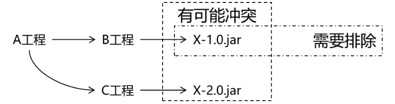

maven自动解决依赖冲突问题能力，会按照自己的原则，进行重复依赖选择。同时也提供了手动解决的冲突的方式，不过不推荐！

**解决依赖冲突（如何选择重复依赖）方式：**

1. 自动选择原则

   - 短路优先原则（第一原则）

     A—>B—>C—>D—>E—>X(version 0.0.1)

     A—>F—>X(version 0.0.2)

     则A依赖于X(version 0.0.2)。

   - 依赖路径长度相同情况下，则“先声明优先”（第二原则）

     A—>E—>X(version 0.0.1)

     A—>F—>X(version 0.0.2)

     在\<depencies>\</depencies>中，先声明的，路径相同，会优先选择！

2. 手动排除

   ```xml
   <dependency>
     <groupId>com.atguigu.maven</groupId>
     <artifactId>pro01-maven-java</artifactId>
     <version>1.0-SNAPSHOT</version>
     <scope>compile</scope>
     <!-- 使用excludes标签配置依赖的排除  -->
     <exclusions>
       <!-- 在exclude标签中配置一个具体的排除 -->
       <exclusion>
         <!-- 指定要排除的依赖的坐标（不需要写version） -->
         <groupId>commons-logging</groupId>
         <artifactId>commons-logging</artifactId>
       </exclusion>
     </exclusions>
   </dependency>
   ```

3. 小案例

   伪代码如下：

   ```xml
   前提：
      A 1.1 -> B 1.1 -> C 1.1 
      F 2.2 -> B 2.2 
      
   pom声明：
      F 2.2
      A 1.1 
   ```

   请问最终会导入哪些依赖和对应版本？

# 七、Maven工程继承和聚合关系

## 7.1 Maven工程继承关系

1. 继承概念

   Maven 继承是指在 Maven 的项目中，让一个项目从另一个项目中继承配置信息的机制。继承可以让我们在多个项目中共享同一配置信息，简化项目的管理和维护工作。

2. 继承作用

   在父工程中统一管理项目中的依赖信息。

   它的背景是：

   -   对一个比较大型的项目进行了模块拆分。
   -   一个 project 下面，创建了很多个 module。
   -   每一个 module 都需要配置自己的依赖信息。

   它背后的需求是：

   -   在每一个 module 中各自维护各自的依赖信息很容易发生出入，不易统一管理。
   -   使用同一个框架内的不同 jar 包，它们应该是同一个版本，所以整个项目中使用的框架版本需要统一。
   -   使用框架时所需要的 jar 包组合（或者说依赖信息组合）需要经过长期摸索和反复调试，最终确定一个可用组合。这个耗费很大精力总结出来的方案不应该在新的项目中重新摸索。
       通过在父工程中为整个项目维护依赖信息的组合既保证了整个项目使用规范、准确的 jar 包；又能够将以往的经验沉淀下来，节约时间和精力。

3. 继承语法

   - 父工程

     ```xml
       <groupId>com.atguigu.maven</groupId>
       <artifactId>pro03-maven-parent</artifactId>
       <version>1.0-SNAPSHOT</version>
       <!-- 当前工程作为父工程，它要去管理子工程，所以打包方式必须是 pom -->
       <packaging>pom</packaging>
     
     ```

   - 子工程

     ```xml
     <!-- 使用parent标签指定当前工程的父工程 -->
     <parent>
       <!-- 父工程的坐标 -->
       <groupId>com.atguigu.maven</groupId>
       <artifactId>pro03-maven-parent</artifactId>
       <version>1.0-SNAPSHOT</version>
     </parent>
     
     <!-- 子工程的坐标 -->
     <!-- 如果子工程坐标中的groupId和version与父工程一致，那么可以省略 -->
     <!-- <groupId>com.atguigu.maven</groupId> -->
     <artifactId>pro04-maven-module</artifactId>
     <!-- <version>1.0-SNAPSHOT</version> -->
     ```

4. 父工程依赖统一管理

   - 父工程声明版本

     ```xml
     <!-- 使用dependencyManagement标签配置对依赖的管理 -->
     <!-- 被管理的依赖并没有真正被引入到工程 -->
     <dependencyManagement>
       <dependencies>
         <dependency>
           <groupId>org.springframework</groupId>
           <artifactId>spring-core</artifactId>
           <version>6.0.10</version>
         </dependency>
         <dependency>
           <groupId>org.springframework</groupId>
           <artifactId>spring-beans</artifactId>
           <version>6.0.10</version>
         </dependency>
         <dependency>
           <groupId>org.springframework</groupId>
           <artifactId>spring-context</artifactId>
           <version>6.0.10</version>
         </dependency>
         <dependency>
           <groupId>org.springframework</groupId>
           <artifactId>spring-expression</artifactId>
           <version>6.0.10</version>
         </dependency>
         <dependency>
           <groupId>org.springframework</groupId>
           <artifactId>spring-aop</artifactId>
           <version>6.0.10</version>
         </dependency>
       </dependencies>
     </dependencyManagement>
     ```

   - 子工程引用版本

     ```xml
     <!-- 子工程引用父工程中的依赖信息时，可以把版本号去掉。  -->
     <!-- 把版本号去掉就表示子工程中这个依赖的版本由父工程决定。 -->
     <!-- 具体来说是由父工程的dependencyManagement来决定。 -->
     <dependencies>
       <dependency>
         <groupId>org.springframework</groupId>
         <artifactId>spring-core</artifactId>
       </dependency>
       <dependency>
         <groupId>org.springframework</groupId>
         <artifactId>spring-beans</artifactId>
       </dependency>
       <dependency>
         <groupId>org.springframework</groupId>
         <artifactId>spring-context</artifactId>
       </dependency>
       <dependency>
         <groupId>org.springframework</groupId>
         <artifactId>spring-expression</artifactId>
       </dependency>
       <dependency>
         <groupId>org.springframework</groupId>
         <artifactId>spring-aop</artifactId>
       </dependency>
     </dependencies>
     ```

## 7.2 Maven工程聚合关系

1. 聚合概念

   Maven 聚合是指将多个项目组织到一个父级项目中，以便一起构建和管理的机制。聚合可以帮助我们更好地管理一组相关的子项目，同时简化它们的构建和部署过程。

2. 聚合作用

   1.  管理多个子项目：通过聚合，可以将多个子项目组织在一起，方便管理和维护。
   2.  构建和发布一组相关的项目：通过聚合，可以在一个命令中构建和发布多个相关的项目，简化了部署和维护工作。
   3.  优化构建顺序：通过聚合，可以对多个项目进行顺序控制，避免出现构建依赖混乱导致构建失败的情况。
   4.  统一管理依赖项：通过聚合，可以在父项目中管理公共依赖项和插件，避免重复定义。

3. 聚合语法

   父项目中包含的子项目列表。

   ```xml
   <project>
     <groupId>com.example</groupId>
     <artifactId>parent-project</artifactId>
     <packaging>pom</packaging>
     <version>1.0.0</version>
     <modules>
       <module>child-project1</module>
       <module>child-project2</module>
     </modules>
   </project>
   ```

4. 聚合演示

   通过触发父工程构建命令、引发所有子模块构建！产生反应堆！
