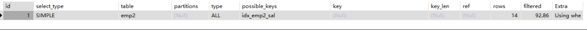
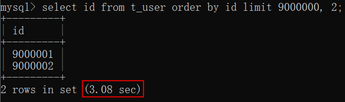

# 数据库概述

## 数据库类型

### 关系型数据库

### 非关系型数据库(NoSQL)

# 初始化数据

```sql
DROP TABLE IF EXISTS EMP;
DROP TABLE IF EXISTS DEPT;
DROP TABLE IF EXISTS SALGRADE;

CREATE TABLE DEPT(DEPTNO int(2) not null ,
	DNAME VARCHAR(14) ,
	LOC VARCHAR(13),
	primary key (DEPTNO)
);
CREATE TABLE EMP(EMPNO int(4)  not null ,
	ENAME VARCHAR(10),
	JOB VARCHAR(9),
	MGR INT(4),
	HIREDATE DATE  DEFAULT NULL,
	SAL DOUBLE(7,2),
	COMM DOUBLE(7,2),
	primary key (EMPNO),
	DEPTNO INT(2) 
);

CREATE TABLE SALGRADE( GRADE INT,
	LOSAL INT,
	HISAL INT
);

INSERT INTO DEPT ( DEPTNO, DNAME, LOC ) VALUES ( 10, 'ACCOUNTING', 'NEW YORK'); 
INSERT INTO DEPT ( DEPTNO, DNAME, LOC ) VALUES ( 20, 'RESEARCH', 'DALLAS'); 
INSERT INTO DEPT ( DEPTNO, DNAME, LOC ) VALUES ( 30, 'SALES', 'CHICAGO'); 
INSERT INTO DEPT ( DEPTNO, DNAME, LOC ) VALUES ( 40, 'OPERATIONS', 'BOSTON'); 
 
INSERT INTO EMP ( EMPNO, ENAME, JOB, MGR, HIREDATE, SAL, COMM,DEPTNO ) VALUES ( 7369, 'SMITH', 'CLERK', 7902,  '1980-12-17', 800, NULL, 20); 
INSERT INTO EMP ( EMPNO, ENAME, JOB, MGR, HIREDATE, SAL, COMM,DEPTNO ) VALUES ( 7499, 'ALLEN', 'SALESMAN', 7698,  '1981-02-20', 1600, 300, 30); 
INSERT INTO EMP ( EMPNO, ENAME, JOB, MGR, HIREDATE, SAL, COMM,DEPTNO ) VALUES ( 7521, 'WARD', 'SALESMAN', 7698,  '1981-02-22', 1250, 500, 30); 
INSERT INTO EMP ( EMPNO, ENAME, JOB, MGR, HIREDATE, SAL, COMM,DEPTNO ) VALUES ( 7566, 'JONES', 'MANAGER', 7839,  '1981-04-02', 2975, NULL, 20); 
INSERT INTO EMP ( EMPNO, ENAME, JOB, MGR, HIREDATE, SAL, COMM,DEPTNO ) VALUES ( 7654, 'MARTIN', 'SALESMAN', 7698,  '1981-09-28', 1250, 1400, 30); 
INSERT INTO EMP ( EMPNO, ENAME, JOB, MGR, HIREDATE, SAL, COMM,DEPTNO ) VALUES ( 7698, 'BLAKE', 'MANAGER', 7839,  '1981-05-01', 2850, NULL, 30); 
INSERT INTO EMP ( EMPNO, ENAME, JOB, MGR, HIREDATE, SAL, COMM,DEPTNO ) VALUES ( 7782, 'CLARK', 'MANAGER', 7839,  '1981-06-09', 2450, NULL, 10); 
INSERT INTO EMP ( EMPNO, ENAME, JOB, MGR, HIREDATE, SAL, COMM,DEPTNO ) VALUES ( 7788, 'SCOTT', 'ANALYST', 7566,  '1987-04-19', 3000, NULL, 20); 
INSERT INTO EMP ( EMPNO, ENAME, JOB, MGR, HIREDATE, SAL, COMM,DEPTNO ) VALUES ( 7839, 'KING', 'PRESIDENT', NULL,  '1981-11-17', 5000, NULL, 10); 
INSERT INTO EMP ( EMPNO, ENAME, JOB, MGR, HIREDATE, SAL, COMM,DEPTNO ) VALUES ( 7844, 'TURNER', 'SALESMAN', 7698,  '1981-09-08', 1500, 0, 30); 
INSERT INTO EMP ( EMPNO, ENAME, JOB, MGR, HIREDATE, SAL, COMM,DEPTNO ) VALUES ( 7876, 'ADAMS', 'CLERK', 7788,  '1987-05-23', 1100, NULL, 20); 
INSERT INTO EMP ( EMPNO, ENAME, JOB, MGR, HIREDATE, SAL, COMM,DEPTNO ) VALUES ( 7900, 'JAMES', 'CLERK', 7698,  '1981-12-03', 950, NULL, 30); 
INSERT INTO EMP ( EMPNO, ENAME, JOB, MGR, HIREDATE, SAL, COMM,DEPTNO ) VALUES ( 7902, 'FORD', 'ANALYST', 7566,  '1981-12-03', 3000, NULL, 20); 
INSERT INTO EMP ( EMPNO, ENAME, JOB, MGR, HIREDATE, SAL, COMM,DEPTNO ) VALUES ( 7934, 'MILLER', 'CLERK', 7782,  '1982-01-23', 1300, NULL, 10); 
 
INSERT INTO SALGRADE ( GRADE, LOSAL, HISAL ) VALUES ( 1, 700, 1200); 
INSERT INTO SALGRADE ( GRADE, LOSAL, HISAL ) VALUES ( 2, 1201, 1400); 
INSERT INTO SALGRADE ( GRADE, LOSAL, HISAL ) VALUES ( 3, 1401, 2000); 
INSERT INTO SALGRADE ( GRADE, LOSAL, HISAL ) VALUES ( 4, 2001, 3000); 
INSERT INTO SALGRADE ( GRADE, LOSAL, HISAL ) VALUES ( 5, 3001, 9999); 
commit;
```

命令

```sql
source sql脚本路径
desc 表明 #查看表的结构
```

# 查询

## 简单查询

```sql
#查询部门编号、部门名称以及位置
SELECT DEPTNO, DNAME, LOC FROM DEPT;

#查询员工名字以及工作岗位
SELECT ENAME, JOB FROM EMP;

#查员工年薪
SELECT ENAME, SAL*12 FROM EMP;

#起别名
SELECT ENAME AS NAME FROM EMP;#as也可以省略
SELECT ENAME NAME FROM EMP;
SELECT ENAME 'EMP NAME' FROM EMP;#别名中有空格，用引号括起来
```

## 条件查询

| **条件**           | **说明**                           |
| ------------------ | ---------------------------------- |
| =                  | 等于                               |
| <>或!=             | 不等于                             |
| >=                 | 大于等于                           |
| <=                 | 小于等于                           |
| >                  | 大于                               |
| <                  | 小于                               |
| between...and...   | 等同于 >= and <=                   |
| is null            | 为空                               |
| is not null        | 不为空                             |
| <=>                | 安全等于（可读性差，很少使用了）。 |
| and 或 &&          | 并且                               |
| or 或 &#124;&#124; | 或者                               |
| in                 | 在指定的值当中                     |
| not in             | 不在指定的值当中                   |
| exists             |                                    |
| not exists         |                                    |
| like               | 模糊查询                           |

### 条件查询语法格式

```sql
select 
  ...
from
  ...
where
  过滤条件;
```

```sql
#查询月薪3000的员工编号以及姓名
SELECT EMPNO, ENAME FROM EMP WHERE SAL = 3000;

#查询ford的岗位以及月薪
SELECT JOB, SAL FROM EMP WHERE ENAME = 'FORD';
```

通过测试发现，即使写成小写ford，也是可以查询到结果的，**不过这里需要注意的是：在Oracle数据库当中是查询不到数据的，Oracle的语法要比MySQL的语法严谨。对于SQL语句本身来说是不区分大小写的，但是对于表中真实存储的数据，大写A和小写a还是不一样的，这一点Oracle做的很好。MySQL的语法更随性。另外在Oracle当中，字符串是必须使用单引号括起来的，但在MySQL当中，字符串可以使用单引号，也可以使用双引号**

### AND和OR的优先级

and优先级比or大

### BETWEEN AND

between...and...等同于 >= and <=
做区间判断的，包含左右两个边界值。
它支持数字、日期、字符串等数据类型。
between...and...在使用时一定是**左小右大**。左大右小时无法查询到数据。
between...and... 和 >= and <=只是在写法结构上有区别，执行原理和效率方面没有区别。

### IS NULL

判断为空不能用=

### IN

```sql
#找出工作岗位是MANAGER和SALESMAN的员工姓名，薪资
SELECT ENAME, SAL FROM EMP WHERE JOB IN ('MANAGER', 'SALESMAN');
```

```SQL
select * from emp where comm in(NULL, 300);
select * from emp where comm = NULL or comm = 300;
```

in是自动忽略null的。因为comm=null始终为假

```sql
select * from emp where comm NOT in(NULL, 300);
select * from emp where comm != NULL AND comm != 300;
```

not in中的null会导致查不出任何东西。not in的括号中不能有空

### 模糊查询like

通配符 %任意多个字符；_任意一个字符

```sql
#以s开头的员工姓名
SELECT EMPNO, JOB FROM EMP WHERE ENAME LIKE 'S%';
```

对于字段中有下划线或%的，使用转义字符\

## 排序

```sql
select .. from .. order by 字段 [asc]/desc#asc升序
```

### 单一字段

```sql
#查询员工的编号、姓名、薪资，按照薪资升序排
SELECT EMPNO, ENAME, SAL FROM EMP ORDER BY SAL ASC;
```

### 多字段

```sql
#查询员工的编号、姓名、薪资，按照薪资升序排，如果薪资相同，按照姓名降序排
SELECT EMPNO, ENAME, SAL FROM EMP ORDER BY SAL, ENAME DESC;
```

### where和order by

```sql
#找出工作岗位是MANAGER和SALESMAN的员工姓名，薪资，按照薪资升序排列
SELECT ENAME, SAL FROM EMP WHERE JOB IN ('MANAGER', 'SALESMAN') ORDER BY SAL;
```

ORDER BY 在select后面执行

## DISTINCT去重

```sql
#查询工作岗位，去重
SELECT DISTINCT JOB FROM EMP;
```

只能用在所有字段的最前方

## 数据处理函数

### 字符串相关

#### 转大、小写

```sql
# 查询所有员工名字，以大写形式展现
select upper(ename) as ename from emp;

# 查询名字是SMITH的员工编号，岗位，无论数据库中寸的是大写还是小写
select SAL, JOB from emp where lower(ename) = 'smith';
```

#### 子串

语法：substr('被截取的字符串', 起始下标, 截取长度)
有两种写法：
第一种：substr('被截取的字符串', 起始下标, 截取长度)
第二种：substr('被截取的字符串', 起始下标)，当第三个参数“截取长度”缺失时，截取到字符串末尾
注意：起始下标从1开始，不是从0开始。（1表示从左侧开始的第一个位置，-1表示从右侧开始的第一个位置。）

```SQL
#第二个字母是a的员工姓名和岗位
SELECT ENAME, JOB FROM EMP WHERE SUBSTR(ENAME, 2, 1) = 'A';
```

#### 字符串长度

length：统计字节长度，中文两个字节，英文一个字节

char_length：统计字符个数

#### 字符串拼接

语法：concat('字符串1', '字符串2', '字符串3'....)
拼接的字符串数量没有限制。

#### 去除字符串前后空白

```sql
select concat(trim('    a   bc    '), 'def');
```


去除前置0

```sql
select trim(leading '0' from '000111000');
```

去除后置0

```sql
select trim(trailing '0' from '000111000');
```

前置0和后置0全部去除

```sql
select trim(both '0' from '000111000');
```

### 数字相关

#### rand()和rand(x)

生成0-1的随机数，x为种子

#### round(x)和round(x, y)

四舍五入，保留整数位，舍去所有小数

四舍五入，保留y位小数

#### truncate(x, y)

舍去

#### ceil和floor

向上向下取整

### 空处理

ifnull(x, y)，空处理函数，当x为NULL时，将x当做y处理。
ifnull(comm, 0)，表示如果员工的津贴是NULL时当做0处理。
在SQL语句中，凡是有NULL参与的数学运算，最终的计算结果都是NULL：

```SQL
#求员工的月薪加上津贴
SELECT ENAME, SAL, ((SAL + COMM) * 12) AS YEARSAL FROM EMP;#有些员工的津贴为空导致年薪为空
SELECT ENAME, SAL, ((SAL + ifnull(COMM, 0)) * 12) AS YEARSAL FROM EMP;
```

### 日期和时间相关函数

#### 获取当前日期和时间

- now()：获取的是执行select语句的时刻。
- sysdate()：获取的是执行sysdate()函数的时刻。

#### 获取日期

- curdate()
- current_date()
- current_date

#### 获取时间

- curtime()
- current_time()
- current_time

#### 获取年月日时分秒

- year(now())
- month(now())
- day(now())
- hour(now())
- minute(now())
- second(now())
- data(now())获取年月日
- time(now())获取时分秒

#### data_add

date_add函数的作用：给指定的日期添加间隔的时间，从而得到一个新的日期。
date_add函数的语法格式：date_add(日期, interval 数量 单位)

```sql
date_add('2023-01-03', interval 3 day);
date_add('2023-01-03', interval 3 year);
```

- 日期：一个日期类型的数据
- interval：关键字，翻译为“间隔”，固定写法
- expr：指定具体的间隔量，一般是一个数字。**也可以为负数，如果为负数，效果和date_sub函数相同**。
- 单位：
  - year：年
  - month：月
  - day：日
  - hour：时
  - minute：分
  - second：秒
  - microsecond：微秒（1秒等于1000毫秒，1毫秒等于1000微秒）
  - week：周
  - quarter：季度

另外，单位也可以采用复合型单位，例如：

- SECOND_MICROSECOND
- MINUTE_MICROSECOND
- MINUTE_SECOND：几分几秒之后
- HOUR_MICROSECOND
- HOUR_SECOND
- HOUR_MINUTE：几小时几分之后
- DAY_MICROSECOND
- DAY_SECOND
- DAY_MINUTE
- DAY_HOUR：几天几小时之后
- YEAR_MONTH：几年几个月之后

```sql
date_add('2024-06-04 16:10:00', interval '3, 2' day_hour);
```

'3,2'这个应该很好理解，表示3天2个小时之后。'3,2'和day_hour是对应的。

#### date_format

将日期转换成具有某种格式的日期字符串，通常用在查询操作当中。（date类型转换成char类型）
语法格式：date_format(日期, '日期格式')

- 第一个参数：日期。这个参数就是即将要被格式化的日期。类型是date类型。
- 第二个参数：指定要格式化的格式字符串。
  - %Y：四位年份
  - %y：两位年份
  - %m：月份（1..12）
  - %d：日（1..30）
  - %H：小时（0..23）
  - %i：分（0..59）
  - %s：秒（0..59）

```sql
#获取当前系统时间，让其以这个格式展示：2000-10-11 20:15:30
select date_format(now(), '%Y-%m-%d %H:%i:%s')
```

#### str_to_date函数

该函数的作用是将char类型的日期字符串转换成日期类型date，通常使用在插入和修改操作当中。（char类型转换成date类型）

```sql
str_to_date('10/01/1985', '%m/%d/%Y')
```

当然，如果你提供的日期字符串格式能够被mysql解析，str_to_date函数是可以省略的，底层会自动调用该函数进行类型转换：

```sql
'1985-10-01'
'1985/10/01'
'85-10-01'
'85-10-01'
```

#### dayofweek、dayofmonth、dayofyear

dayofweek：一周中的第几天（1~7），周日是1，周六是7。
dayofmonth：一个月中的第几天（1~31）
dayofyear：一年中的第几天（1~366）

#### last_day

获取给定日期**所在月**的最后一天的日期

#### datediff

计算两个日期之间所差**天数**

#### timediff

计算两个日期所差时间，例如日期1和日期2所差10:20:30，表示差10小时20分钟30秒。

### if函数

```sql
SELECT IF(500<1000, "YES", "NO");

#如果工资高于3000，则输出1， 否则为0
SELECT ENAME, IF(SAL > 3000, 1, 0) FROM EMP;

#如果名字是SMITH的，工资上调10%，其他员工工资正常显示。
SELECT ENAME, IF(ENAME = 'SMITH', 1.1 * SAL, SAL) AS SAL FROM EMP;
```

### CASE函数

```sql
#工作岗位是MANAGER的工资上调10%，是SALESMAN的工资上调20%，其他岗位工资正常。
SELECT ENAME, JOB,
	CASE JOB
	WHEN 'MANAGER' THEN SAL * 1.1
	WHEN 'SALESMAN' THEN SAL * 1.2
	ELSE SAL
	END
	AS SAL
	FROM EMP;
```

### cast函数

cast函数用于将值从一种数据类型转换为表达式中指定的另一种数据类型
语法：cast(值 as 数据类型)
例如：cast('2020-10-11' as date)，表示将字符串'2020-10-11'转换成日期date类型。
在使用cast函数时，可用的数据类型包括：

- date：日期类型
- time：时间类型
- datetime：日期时间类型
- signed：有符号的int类型（有符号指的是正数负数）
- char：定长字符串类型
- decimal：浮点型

### 加密函数

md5函数，可以将给定的字符串经过md5算法进行加密处理，字符串经过加密之后会生成一个固定长度32位的字符串，md5加密之后的密文通常是不能解密的：

## 分组函数

**分组函数的执行原则：先分组，然后对每一组数据执行分组函数。如果没有分组语句group by的话，整张表的数据自成一组。**
分组函数包括五个：

- max：最大值
- min：最小值
- avg：平均值
- sum：求和
- count：计数

重点：所有的分组函数都是自动忽略NULL的。

**分组函数不能直接使用在where子句当中**

原因：分组的行为是在where执行之后才开始的。

## 分组查询

### GROUP BY

按照某个字段分组，或者按照**某些字段联合分组**。注意：group by的执行是在where之后执行。
语法：
group by 字段
group by 字段1,字段2,字段3....

```sql
#找出每个岗位的平均工资
SELECT JOB, AVG(SAL) FROM EMP GROUP BY JOB;

#找出每个部门的最高工资
SELECT DEPTNO, MAX(SAL) FROM EMP GROUP BY DEPTNO;

#找出每个部门不同岗位的平均工资
SELECT DEPTNO, JOB, AVG(SAL) FROM EMP GROUP BY DEPTNO, JOB;

#当select语句中有group by的话，select后面只能跟分组函数或参加分组的字段
```

当select语句中有group by的话，select后面只能跟分组函数或参加分组的字段

```sql
select ename,deptno,avg(sal) from emp group by deptno; // 这个SQL执行后会报错。
```

### HAVING

having写在group by的后面，当你对分组之后的数据不满意，可以继续通过having对分组之后的数据进行过滤。
where的过滤是在分组前进行过滤。having的过滤是在分组后进行的
使用原则：尽量在where中过滤，实在不行，再使用having。越早过滤效率越高。

```sql
#找出除20部门以外，其他部门的平均工资
SELECT DEPTNO, AVG(SAL) FROM EMP GROUP BY DEPTNO HAVING DEPTNO <> 20;
SELECT DEPTNO, AVG(SAL) FROM EMP WHERE DEPTNO <> 20 GROUP BY DEPTNO;

#查询每个部门的平均薪资，找出平均薪资高于2000的
SELECT DEPTNO, AVG(SAL) FROM EMP GROUP BY DEPTNO HAVING AVG(SAL) > 2000;
```

### 组内排序

substring_index


group_concat


```sql
#找出每个工作岗位的工资前两名
SELECT substring_index(group_concat(ENAME order by sal desc), ',', 2) AS TOP2, JOB FROM EMP GROUP BY JOB;
```

## 连接查询

mysql不支持全连接

### 笛卡尔积

添加了过滤条件后，虽然缩小了笛卡尔积的规模，但是匹配的次数并没有减少

### 内连接


满足条件的记录才会出现在结果集中。

#### 等值连接

连接时，条件为等量关系。

```sql
#查询每个员工所在的部门名称，要求显示员工名、部门名。
select
	e.ename,d.dname
from
	emp e
inner join
	dept d
on
	e.deptno = d.deptno;
```

inner可省略

#### 非等值连接

```sql
#查询工资大于1000每个员工的工资等级，显示员工名，工资，工资等级
SELECT E.ENAME, E.SAL, S.GRADE FROM EMP E INNER JOIN SALGRADE S ON E.SAL BETWEEN S.LOSAL AND HISAL WHERE E.SAL > 1000;
```

#### 自连接

```sql
#找出员工的直属领导，显示领导名和员工名
SELECT E.ENAME AS EMP, P.ENAME AS BOSS FROM EMP E INNER JOIN EMP P ON P.EMPNO = E.MGR;
```

### 外连接

内连接是满足条件的记录查询出来。也就是两张表的交集。
外连接是除了满足条件的记录查询出来，再将其中一张表的记录全部查询出来，另一张表如果没有与之匹配的记录，自动模拟出NULL与其匹配。


#### 左外连接

```sql
#查询所有部门信息，并且找出每个部门下的员工
SELECT D.DEPTNO, D.DNAME, D.LOC, E.ENAME FROM DEPT D LEFT OUTER JOIN EMP E ON E.DEPTNO = D.DEPTNO;
```

#### 右外连接

### 多表联查

```sql
#找出每个员工的部门名称，并且要求显示每个员工的薪资登记
SELECT e.ename, d.dname, s.grade from emp e join salgrade s on e.sal between s.losal and s.hisal join dept d on e.deptno = d.deptno;
```

## 子查询

select语句中嵌套select语句就叫做子查询。

select语句可以嵌套在where后面、from后面、select后面

### Where后面的子查询

```sql
#找出高于平均薪资的员工姓名和薪资
SELECT ENAME, SAL FROM EMP WHERE SAL > (SELECT AVG(SAL) FROM EMP);
```

### From后面的子查询

```sql
#找出每个部门的平均工资的等级
SELECT s.grade, t.* FROM (SELECT AVG(sal) as avgsal, deptno FROM emp GROUP BY deptno) t JOIN salgrade s ON t.avgsal BETWEEN s.losal AND s.hisal;
```

将from后面的子查询当作一张表

### SELECT后面的子查询

```sql
#查询员工姓名，和部门名称
SELECT e.ename, (select d.dname from dept d where e.deptno = d.deptno) as dname FROM emp e;
```

## EXISTS

在 MySQL 数据库中，EXISTS（存在）用于检查子查询的查询结果行数是否大于0。如果子查询的查询结果行数大于0，则 EXISTS 条件为真。

主要应用场景：

- EXISTS 可以与 SELECT、UPDATE、DELETE 一起使用，用于检查另一个查询是否返回任何行；
- EXISTS 可以用于验证条件子句中的表达式是否存在；
- EXISTS 常用于子查询条件过滤，例如查询有订单的用户等。

```sql
drop table if exists t_customer;
drop table if exists t_order;

create table t_customer(
  customer_id int,
  customer_name varchar(32)
);

create table t_order(
  order_id int,
  order_price decimal(5,1),
  customer_id int
);

insert into t_customer(customer_id,customer_name) values(1,'zhangsan');
insert into t_customer(customer_id,customer_name) values(2,'lisi');
insert into t_customer(customer_id,customer_name) values(3,'wangwu');

insert into t_order(order_id, order_price, customer_id) values(10, 1000.0, 1);
insert into t_order(order_id, order_price, customer_id) values(20, 2000.0, 1);
insert into t_order(order_id, order_price, customer_id) values(30, 3000.0, 2);
insert into t_order(order_id, order_price, customer_id) values(40, 4000.0, 2);

commit;
select * from t_customer;
select * from t_order;
```

```sql
#查询先前有过订单的顾客，而订单信息保存在 t_order 表中，顾客信息保存在 t_customer 表中
select customer_name from t_customer where customer_id in (select distinct customer_id from t_order);
select customer_name from t_customer c where exists(select * from t_order o where o.customer_id = c.customer_id);

#查询没有过订单的顾客
select customer_name from t_customer c where not exists(select * from t_order o where o.customer_id = c.customer_id);
```

## In和exists的区别

1.  IN 操作符是根据指定列表中的值来判断是否满足条件，而 EXISTS 操作符则是根据子查询的结果是否有返回记录集来判断。 
2.  EXISTS 操作符通常比 IN 操作符更快，尤其是在子查询返回记录数很大的情况下。因为 EXISTS 只需要判断是否存在符合条件的记录，而 IN 操作符需要比对整个列表，因此执行效率相对较低。 
3.  IN 操作符可同时匹配多个值，而 EXISTS 只能匹配一组条件。 

## Union&Union all

union还是union all都可以将两个查询结果集进行合并。

union会对合并之后的查询结果集进行去重操作。union all是直接将查询结果集合并，不进行去重操作。

```sql
#查询工作岗位是MANAGER和SALESMAN的员工
SELECT ename, job from emp where job in ('MANAGER', 'SALESMAN');
select ename, job from emp where job = 'MANAGER' union select ename, job from emp where job = 'SALESMAN';
```

考虑走索引优化之类的选择union all，其它选择or。

列数要一致

## Limit

limit作用：查询第几条到第几条的记录。通常是因为表中数据量太大，需要分页显示。

limit语法格式：limit 开始下标, 长度

```sql
#查询员工表前5条记录
select ename,sal from emp limit 0, 5;

#如果下标是从0开始，可以简写为：
select ename,sal from emp limit 5;

#查询工资排名在前5名的员工（limit是在order by执行之后才会执行的）
select ename,sal from emp order by sal desc limit 5;
```

## 35道查询题目

### 第1题

取得每个部门最高薪水的人员名称

```sql
select e.ename, t.* from emp e join (select max(sal) as maxsal, deptno from emp group by deptno) t on e.sal = t.maxsal and e.deptno = t.deptno;
```

1. 取得每个部门最高薪水
2. 将第一步的查询结果当做一张临时表t，进行表连接

### 第2题

哪些人的薪水在部门的平均薪水之上

1. 查询每个部门的平均薪水
2. 表连接判断

```sql
select e.ename, t.* from emp e join (select avg(sal) as avgsal, deptno from emp group by deptno) t on e.sal >= t.avgsal and e.deptno = t.deptno;
```

### 第3题

取得每个部门平均薪水的等级

1. 查询每个部门的平均薪水
2. 表连接判断薪水等级

```sql
select s.grade, t.* from salgrade s join (select avg(sal) as avgsal, deptno from emp group by deptno) t on t.avgsal between s.losal and s.hisal;
```

### 第4题

取得部门中（所有人的）平均的薪水等级

1. 查询每个人的薪水等级
2. 按部门分组，算平均等级

```sql
select avg(s.grade), e.deptno from emp e join salgrade s on e.sal between s.losal and s.hisal group by e.deptno;
```

### 第5题

不准用组函数（Max），取得最高薪水（给出两种解决方案）

```sql
select ename, sal from emp order by sal desc limit 1;

select ename,sal from emp where sal not in(select distinct a.sal from emp a join emp b on a.sal < b.sal);
```

### 第6题

取得平均薪水最高的部门的部门编号（至少给出两种解决方案）

```sql
select deptno, avg(sal) as avgsal from emp group by deptno order by avgsal desc limit 1;

select a.deptno, a.avgsal from (select avg(sal) as avgsal, deptno from emp group by deptno) a join (select max(t.avgsal) as maxavgsal from (select avg(sal) as avgsal from emp group by deptno) t) m on a.avgsal = m.maxavgsal;

select deptno,avg(sal) as avgsal from emp group by deptno having avg(sal)=(select max(t.avgsal) from (select avg(sal) as avgsal from emp group by deptno) t);
```

### 第7题

取得平均薪水最高的部门的部门名称

```sql
select d.dname, e.avgsal, d.deptno from dept d join (select deptno, avg(sal) as avgsal from emp group by deptno order by avgsal desc limit 1) e on d.deptno = e.deptno;

select d.dname, avg(e.sal) as avgsal, e.deptno from emp e join dept d on e.deptno = d.deptno group by deptno order by avgsal desc limit 1;
```

### 第8题

求平均薪水的等级最低的部门的部门名称

1. 求出每个部门的平均薪水
2. 求出薪水等级
3. 排序，连表找名称

```sql
#1
select avg(sal) as avgsal, deptno from emp group by deptno;
#2
select s.grade as grade, e.avgsal, e.deptno from (select avg(sal) as avgsal, deptno from emp group by deptno) e join salgrade s on e.avgsal between s.losal and s.hisal;
#3
select t.grade, d.dname from dept d join (select s.grade as grade, e.avgsal, e.deptno as deptno from (select avg(sal) as avgsal, deptno from emp group by deptno) e join salgrade s on e.avgsal between s.losal and s.hisal) t on d.deptno = t.deptno order by t.grade limit 1;
```

### 第9题

取得比普通员工(员工代码没有在mgr字段上出现的)的最高薪水还要高的领导人姓名

1. 找到非null字段的最高薪水
2. 找到比这个薪水还要高的人

```sql
#1
select max(sal) as maxsal from emp where mgr is not null;
#2
select e.ename, e.sal from emp e where e.sal > (select max(sal) as maxsal from emp where mgr is not null);
```

### 第10题

取得薪水最高的前五名员工

```sql
select ename, sal from emp where mgr is not null order by sal desc limit 5;
```

### 第11题

取得薪水最高的第六到第十名员工

```sql
select ename, sal from emp where mgr is not null order by sal desc limit 5, 5;
```

### 第12题

取得最后入职的5名员工

```sql
select ename hiredate from emp order by hiredate desc limit 5;
```

### 第13题

取得每个薪水等级有多少员工

1. 算出每个员工的薪水等级
2. count

```sql
#1
select s.grade, e.ename from emp e join salgrade s on e.sal between s.losal and s.hisal;
#2
select s.grade, count(e.ename) from emp e join salgrade s on e.sal between s.losal and s.hisal group by s.grade;
```

### 第14题

列出所有员工及领导的姓名

```sql
select e.ename, l.ename as leader from emp e join emp l on e.mgr = l.empno;
```

### 第15题

列出受雇日期早于其直接上级的所有员工的编号,姓名,部门名称

```sql
select e.empno, e.ename, d.dname from emp e join emp l on e.hiredate > l.hiredate and e.mgr = l.mgr join dept d on e.deptno = d.deptno;
```

### 第16题

列出部门名称和这些部门的员工信息,同时列出那些没有员工的部门

```sql
select d.dname, e.* from dept d left join emp e on e.deptno = d.deptno;
```

### 第17题

列出至少有5个员工的所有部门

1. 统计每个部门员工的数量
2. 找出大于5的

```sql
#1
select deptno, count(ename) as num from emp group by deptno;
#2
select deptno from (select deptno, count(ename) as num from emp group by deptno) t where t.num >= 5;

#方法二
select deptno, count(ename) as num from emp group by deptno having num >=5;
```

### 第18题

列出薪金比"SMITH"多的所有员工信息

1. 找出smith的薪金
2. 比他多的

```sql
#1
select sal from emp where ename = 'smith';
#2
select e.* from emp e where e.sal > (select sal from emp where ename = 'smith');
```

### 第19题

列出所有"CLERK"(办事员)的姓名及其部门名称,部门的人数

1. 算出部门人数及名称
2. 找出clerk

```sql
#1
select count(*) as num, d.deptno, d.dname from emp e join dept d on e.deptno = d.deptno group by deptno;
#2
select e.ename, t.num, t.dname from emp e join (select count(*) as num, d.deptno, d.dname from emp e join dept d on e.deptno = d.deptno group by deptno) t on e.deptno = t.deptno where e.job = 'clerk';
```

### 第20题

列出最低薪金大于1500的各种工作及从事此工作的全部雇员人数

```sql
select job, count(*) from emp group by job having min(sal) > 1500;
```

### 第21题

列出在部门"SALES"<销售部>工作的员工的姓名,假定不知道销售部的部门编号

```sql
select e.ename, d.dname from emp e join dept d on e.deptno = d.deptno where d.dname = 'sales';
```

### 第22题

列出薪金高于公司平均薪金的所有员工,所在部门,上级领导,雇员的工资等级

```sql
select e.ename, d.dname, l.ename, s.grade from emp e join emp l on e.mgr = l.empno join dept d on d.deptno = e.deptno join salgrade s on e.sal between s.losal and s.hisal where e.sal > (select avg(sal) from emp);
```

### 第23题

列出与"SCOTT"从事相同工作的所有员工及部门名称

1. 找出scott从事的工作
2. 找出相同的

```sql
#1
select job from emp where ename = 'scott';
#2
select e.ename, d.dname from emp e join dept d on e.deptno = d.deptno where e.job = (select job from emp where ename = 'scott') and ename <> 'scott';
```

### 第24题

列出薪金等于部门30中员工的薪金的其他员工的姓名和薪金

1. 找出部门30的员工的薪金
2. 不再30部门的相等薪金

```sql
#1
select sal from emp where deptno = 30;
#2
select ename, sal from emp where sal in (select sal from emp where deptno = 30) and deptno <> 30;
```

### 第25题

列出薪金高于在部门30工作的所有员工的薪金的员工姓名和薪金.部门名称

```sql
select e.ename, e.sal, d.dname from emp e join dept d on e.deptno = d.deptno where sal > (select max(sal) from emp where deptno = 30);
```

### 第26题

列出在每个部门工作的员工数量,平均工资和平均服务期限

```sql
select count(*), avg(sal), avg(datediff(now(), hiredate)) from emp group by deptno;
```

### 第27题

列出所有员工的姓名、部门名称和工资

```sql
select e.ename, d.dname, e.sal from emp e join dept d on e.deptno = d.deptno;
```

### 第28题

列出所有部门的详细信息和人数

```sql
select t.num, d.* from dept d join (select count(*) as num, deptno from emp group by deptno) t on t.deptno = d.deptno;
```

### 第29题

列出各种工作的最低工资及从事此工作的雇员姓名

```sql
select e.ename, t.job, t.minsal from emp e join (select min(sal) as minsal, job from emp group by job) t on e.job = t.job;
```

### 第30题

列出各个部门的MANAGER(领导)的最低薪金

```sql
select min(sal), deptno from emp where job = 'manager' group by deptno;
```

### 第31题

列出所有员工的年工资,按年薪从低到高排序

```sql
select ename, 12 * (sal + ifnull(comm, 0)) as asal from emp order by asal;
```

### 第32题

求出员工领导的薪水超过3000的员工名称与领导名称

```sql
select e.ename 员工名, l.ename 领导名 from emp e join emp l on e.mgr = l.empno where l.sal>3000;
```

### 第33题

求出部门名称中,带'S'字符的部门员工的工资合计、部门人数

```sql
select count(e.ename), sum(e.sal), d.deptno, d.dname from emp e right join dept d on e.deptno = d.deptno where d.dname like '%s%' group by deptno;
```

### 第34题

给任职日期超过30年的员工加薪10%

```sql
update emp set sal=sal*1.1 where datediff(now(),hiredate)/365 > 30;
```

### 第35题

```sql
CREATE TABLE SC
(
  SNO      VARCHAR(200),
  CNO      VARCHAR(200),
  SCGRADE  VARCHAR(200)
);

CREATE TABLE S
(
  SNO    VARCHAR(200 ),
  SNAME  VARCHAR(200)
);

CREATE TABLE C
(
  CNO       VARCHAR(200),
  CNAME     VARCHAR(200),
  CTEACHER  VARCHAR(200)
);

INSERT INTO C ( CNO, CNAME, CTEACHER ) VALUES ( '1', '语文', '张'); 
INSERT INTO C ( CNO, CNAME, CTEACHER ) VALUES ( '2', '政治', '王'); 
INSERT INTO C ( CNO, CNAME, CTEACHER ) VALUES ( '3', '英语', '李'); 
INSERT INTO C ( CNO, CNAME, CTEACHER ) VALUES ( '4', '数学', '赵'); 
INSERT INTO C ( CNO, CNAME, CTEACHER ) VALUES ( '5', '物理', '黎明'); 
commit;
 
INSERT INTO S ( SNO, SNAME ) VALUES ( '1', '学生1'); 
INSERT INTO S ( SNO, SNAME ) VALUES ( '2', '学生2'); 
INSERT INTO S ( SNO, SNAME ) VALUES ( '3', '学生3'); 
INSERT INTO S ( SNO, SNAME ) VALUES ( '4', '学生4'); 
commit;
 
INSERT INTO SC ( SNO, CNO, SCGRADE ) VALUES ( '1', '1', '40'); 
INSERT INTO SC ( SNO, CNO, SCGRADE ) VALUES ( '1', '2', '30'); 
INSERT INTO SC ( SNO, CNO, SCGRADE ) VALUES ( '1', '3', '20'); 
INSERT INTO SC ( SNO, CNO, SCGRADE ) VALUES ( '1', '4', '80'); 
INSERT INTO SC ( SNO, CNO, SCGRADE ) VALUES ( '1', '5', '60'); 
INSERT INTO SC ( SNO, CNO, SCGRADE ) VALUES ( '2', '1', '60'); 
INSERT INTO SC ( SNO, CNO, SCGRADE ) VALUES ( '2', '2', '60'); 
INSERT INTO SC ( SNO, CNO, SCGRADE ) VALUES ( '2', '3', '60'); 
INSERT INTO SC ( SNO, CNO, SCGRADE ) VALUES ( '2', '4', '60'); 
INSERT INTO SC ( SNO, CNO, SCGRADE ) VALUES ( '2', '5', '40'); 
INSERT INTO SC ( SNO, CNO, SCGRADE ) VALUES ( '3', '1', '60'); 
INSERT INTO SC ( SNO, CNO, SCGRADE ) VALUES ( '3', '3', '80'); 
commit;
```

有3个表S（学生表），C（课程表），SC（学生选课表）
S（SNO，SNAME）代表（学号，姓名）
C（CNO，CNAME，CTEACHER）代表（课号，课名，教师）
SC（SNO，CNO，SCGRADE）代表（学号，课号，成绩）

1，找出没选过“黎明”老师的所有学生姓名。

```sql
#1找出黎明老师教哪些课
select cno from c where cteacher = '黎明';
#2找出选了这些课的学生
select sno from sc where cno in (select cno from c where cteacher = '黎明');
#3找出不在名单里的学生姓名
select sname from s where sno not in (select sno from sc where cno in (select cno from c where cteacher = '黎明'));
```

2，列出2门以上（含2门）不及格学生姓名及平均成绩。

```sql
#找出有两门及以上不及格成绩的学生
select sno from sc where scgrade < 60 group by sno having count(*) >= 2;
#求平均成绩
select avg(sc.scgrade), s.sname from s join sc on s.sno = sc.sno where s.sno in (select sno from sc where scgrade < 60 group by sno having count(*) >= 2) group by s.sno;
```

3，既学过1号课程又学过2号课所有学生的姓名。

```sql
#1找到学过1号课程的学生
select distinct sno from sc where cno = '1';
#2找到学过2号课程的学生，且他学过1好课程
select sno from sc where cno = '2' and sno in (select distinct sno from sc where cno = '1');
```

# 表相关

## 创建表

```sql
create table 表名(
  字段名1 数据类型,
  字段名2 数据类型,
  字段名3 数据类型,
  ......
);
```

## 插入数据

```sql
insert into 表名(字段名1, 字段名2, 字段名3,......) values (值1,值2,值3,......);
```

字段名和值要一一对应。类型要一一对应，数量要一一对应。
字段名也可以省略，如果字段名省略就表示把所有字段名都写上去了，并且顺序和建表时的顺序相同。

## 删除表

```sql
drop table 表名;
drop table if exists 表名;
```

## MySQL数据类型

### 整数

tinyint：1个字节（微小整数）
smallint：2个字节（小整数）
mediumint：3个字节（中等大小的整数）
**int（integer）：4个字节（普通大小整数）**
**bigint：8个字节（大整数）**

### 浮点数

float：4个字节，单精度（最多5位小数）
**double：8个字节，双精度（最多16位小数）**

### 定点数

decimal：定点数类型。底层实际上采用字符串的形式存储数字。
语法：decimal(m, d)
例如：decimal(3, 2) 表示3个有效数字，2个小数。（有效数字最多65个，小数位最多30个）

### 日期和时间类型

year：1个字节，只存储年，格式YYYY
time：3个字节，只存储时间，格式HH:MM:SS / HHMMSS
date：3个字节，只存储年月日，格式：YYYY-MM-DD
datetime：8个字节，存储年月日+时分秒，格式：YYYY-MM-DD HH:MM:SS（从公元1000年~公元9999年）
timestamp：4个字节，存储年月日+时分秒，格式：YYYY-MM-DD HH:MM:SS（从公元1980年~公元2040年）或者格式为 YYYYMMDDHHMMSS（采用这种格式不需要使用单引号，当然你使用单引号也可以）

### 字符串类型

#### char

**char(m)：**m长度是0~255个字符。
固定长度字符串，在定义时指定字符串列长。当保存时，在右侧填充空格以达到指定的长度。m表示列的长度，范围是 0～255 个字符。
例如，CHAR(4) 定义了一个固定长度的字符串列，包含的字符个数最大为 4。当插入的字符长度大于4，则报错（除非超过4个长度之后都是空格字符，则空格字符会自动被删除用来保证插入的成功）。

#### varchar

**varchar(m)：**m长度是0~16383个字符
长度可变的字符串。varchar 的最大实际长度由最长的行的大小和使用的字符集确定，而实际占用的空间为字符串的实际长度加 1。
例如，varchar(50) 定义了一个最大长度为 50 的字符串，如果插入的字符串只有 10 个字符，则实际存储的字符串为 10 个字符和一个字符串结束字符。varchar在值保存和检索时尾部的空格仍保留。

#### text

- tinytext 表示长度为 255字符的 TEXT 列。
- text 表示长度为 65535字符的 TEXT 列。
- mediumtext 表示长度为 16777215字符的 TEXT 列。
- longtext 表示长度为 4294967295 或 4GB 字符的 TEXT 列。

#### emun

- 语法：<字段名> enum('值1','值2',...)
- 该字段插入值时，只能是指定的枚举值。

#### set

- 语法：<字段名> set('值1','值2','值3',...)   注意：值不可重复。
- 该字段插入值时，只能是指定的值。

### 二进制类型

BLOB类型：二进制大对象，可以存储图片、声音、视频等文件。

- blob：小的，最大长度65535个字节
- mediumblob：中等的，最大长度16777215个字节
- longblob：大的，最大长度4GB的字节

## 增删改查表的结构

### 创建一个学生表

```sql
create table t_student(
  no bigint,
  name varchar(255),
  age int comment '年龄'
);
```

### 查看建表语句

```sql
show create table 表名;
```

### 修改表名

```sql
alter table 表名 rename 新表名;
```

### 新增字段

```sql
alter table 表名 add 字段名 数据类型;
```

### 修改字段名

```sql
alter table 表名 change 旧字段名 新字段名 数据类型;
```

### 修改字段数据类型

```sql
alter table 表名 modify column 字段名 数据类型;
```

### 删除字段

```sql
alter table 表名 drop 字段名;
```

## 增删改查数据

### insert

```sql
insert into 表名(字段名1,字段名2,字段名3,...) values(值1,值2,值3,...);
```

表名后面的小括号当中的字段名如果省略掉，表示自动将所有字段都列出来了，并且字段的顺序和建表时的顺序一致。
一般为了可读性强，建议把字段名写上。

```sql
insert into 表名 values(值1,值2,值3,...);
```

一次可以插入多条记录：

```sql
insert into t_stu(no,name,age) values(1,'jack',20),(2,'lucy',30);
```

### delete

```sql
# 将所有记录全部删除
delete from 表名;

# 删除符合条件的记录
delete from 表名 where 条件;
```

以上的删除属于DML的方式删除，这种删除的数据是可以通过事务回滚的方式重新恢复的，但是删除的效率较低。（这种删除是支持事务的。）
另外还有一种删除表中数据的方式，但是这种方式不支持事务，不可以回滚，删了之后数据是永远也找不回来了。这种删除叫做：表被截断。
注意：这个语句删除效率非常高，巨大的表，瞬间干掉所有数据。但不可恢复。

```sql
truncate table 表名;
```

### update

```sql
update 表名 set 字段名1=值1, 字段名2=值2, 字段名3=值3 where 条件;
```

如果没有更新条件的话，所有记录全部更新。

## 约束

创建表时，可以给表的字段添加约束，可以保证数据的完整性、有效性。比如大家上网注册用户时常见的：用户名不能为空。对不起，用户名已存在。等提示信息。
约束通常包括：

- 非空约束：not null
- 检查约束：check
- 唯一性约束：unique
- 主键约束：primary key
- 外键约束：foreign key

### 非空约束

```sql
create table t_stu(
  no int,
  name varchar(255) not null,
  age int
);
```

### 检查约束

```sql
create table t_stu(
  no int,
  name varchar(255),
  age int,
  check(age > 18)
);
```

### 唯一性约束

```sql
create table t_stu(
  no int,
  name varchar(255),
  email varchar(255) unique
);
```

email字段设置为唯一性，唯一性的字段值是可以为NULL的。但不能重复。以上在字段后面添加的约束，叫做列级约束。

当然，添加约束还有另一种方式：表级约束：

```sql
create table t_stu(
  no int,
  name varchar(255),
  email varchar(255),
  unique(email)
);
```

使用表级约束可以为多个字段添加联合唯一。

```sql
create table t_stu(
  no int,
  name varchar(255),
  email varchar(255),
  unique(name,email)
);
```

创建约束时也可以给约束起名字，将来可以通过约束的名字来删除约束：

```sql
create table t_stu(
  no int,
  name varchar(255),
  email varchar(255),
  constraint t_stu_name_email_unique unique(name,email)
);
```

所有的约束都存储在一个系统表当中：table_constraints。这个系统表在这个数据库当中：information_schema

### 主键约束

1. 主键：primary key，简称PK
2. 主键约束的字段不能为NULL，并且不能重复。
3. 任何一张表都应该有主键，没有主键的表可以视为无效表。
4. 主键值是这行记录的身份证号，是唯一标识。在数据库表中即使两条数据一模一样，但由于主键值不同，我们也会认为是两条完全的不同的数据。
5. 主键分类：
   1. 根据字段数量分类：
      1. 单一主键（1个字段作为主键）==>建议的
      2. 复合主键（2个或2个以上的字段作为主键）
   2. 根据业务分类：
      1. 自然主键（主键和任何业务都无关，只是一个单纯的自然数据）===>建议的
      2. 业务主键（主键和业务挂钩，例如：银行卡账号作为主键）

#### 单一主键

```sql
create table t_student(
  id bigint primary key,
  sno varchar(255) unique,
  sname varchar(255) not null
)
```

#### 复合主键

```sql
create table t_user(
  no int,
  name varchar(255),
  age int,
  primary key(no,name)
);
```

#### 主键自增

```sql
create table t_vip(
  no int primary key auto_increment,
  name varchar(255)
);
```

既然主键值是一个自然的数字，mysql为主键值提供了一种自增机制，不需要我们程序员维护，mysql自动维护该字段。

### 外键约束

1. 外键约束：foreign key，简称FK。

2. 添加了外键约束的字段中的数据必须来自其他字段，不能随便填。

3. 假设给a字段添加了外键约束，要求a字段中的数据必须来自b字段，b字段不一定是主键，但至少要有唯一性。

4. 外键约束可以给单个字段添加，叫做单一外键。也可以给多个字段联合添加，叫做复合外键。复合外键很少用。

5. a表如果引用b表中的数据，可以把b表叫做父表，把a表叫做子表。
   1. 创建表时，先创建父表，再创建子表。
   2. 插入数据时，先插入父表，在插入子表。
   3. 删除数据时，先删除子表，再删除父表。
   4. 删除表时，先删除子表，再删除父表。

6. 如何添加外键：

   ```sql
   create table t_school( 
     sno int primary key, 
     sname varchar(255) 
   ); 
   create table t_student( 
     no int primary key, 
     name varchar(255), 
     age int, 
     sno int, 
     constraint t_school_sno_fk foreign key(sno) references t_school(sno) 
   );
   ```

7. 级联删除

   创建子表时，外键可以添加：on delete cascade，这样在删除父表数据时，子表会级联删除。谨慎使用。

   ```sql
   create table t_student( 
     no int primary key, 
     name varchar(255), 
     age int, 
     sno int, 
     constraint t_school_sno_fk foreign key(sno) references t_school(sno) on delete cascade 
   );
   ```

   ```sql
   ###删除约束
   alert table t_student drop foreign key t_student_sno_fk;
   ###添加约束
   alert table t_student add constraint t_student_sno_fk foreign key(sno) references t_school(sno) on delete cascade;
   ```

8. 级联更新

   ```sql
   create table t_student( 
     no int primary key, 
     name varchar(255), 
     age int, 
     sno int, 
     constraint t_school_sno_fk foreign key(sno) references t_school(sno) on update cascade 
   );
   ```

9. 级联置空

   ```sql
   create table t_student( 
     no int primary key, 
     name varchar(255), 
     age int, 
     sno int, 
     constraint t_school_sno_fk foreign key(sno) references t_school(sno) on delete set null 
   );
   ```

# 范式

一范式：需要有主键

二范式：非主键字段不能部份依赖主键

三范式：非主键字段不能传递依赖主键字段

一对多：一对多两张表，多的表加外键

多对多：多对多三张表，关系表添加外键。

一对一：


# 视图

1. 只能将select语句创建为视图。
2. 创建视图

```sql
create or replace view v_emp as select e.ename,d.dname from emp e join dept d on e.deptno = d.deptno;
```

3. 视图作用
   1. 如果开发中有一条非常复杂的SQL，而这个SQL在多处使用，会给开发和维护带来成本。使用视图可以降低开发和维护的成本。
   2. 视图可以隐藏表的字段名。
4. 修改视图

```sql
alter view v_emp as select e.ename,d.dname,d.deptno from emp e join dept d on e.deptno = d.deptno;
```

5. 删除视图
   1. drop view if exists v_emp;
6. 对视图增删改（DML：insert delete update）可以影响到原表数据。

# 事务

## 事务的特性

1. 原子性（Atomicity）：是指事务包含的所有操作要么全部成功，要么同时失败。
2. 一致性（Consistency）：是指事务开始前，和事务完成后，数据应该是一致的。例如张三和李四的钱加起来是5000，中间不管进行过多少次的转账操作(update)，总量5000是不会变的。这就是事务的一致性。
3. 隔离性（Isolation）：隔离性是当多个⽤户并发访问数据库时，⽐如操作同⼀张表时，数据库为每⼀个⽤户开启的事务，不能被其他事务的操作所⼲扰，多个并发事务之间要相互隔离。
4. 持久性（Durability）：持久性是指⼀个事务⼀旦被提交了，那么对数据库中的数据的改变就是永久性的，即便是在数据库系统遇到故障的情况下也不会丢失提交事务的操作。

## 事物的提交和回滚

回滚事务：rollback; 
提交事务：commit;
只要执行以上的rollback或者commit，事务都会结束。
MySQL默认情况下采用的事务机制是：自动提交。所谓自动提交就是只要执行一条DML语句则提交一次。

事务开始start transaction，此时自动提交会关闭

## 事物的隔离级别


**隔离级别从低到高排序：读未提交 < 读提交 < 可重复读 < 串行化**
**不同隔离级别会存在不同的现象，现象按照严重性从高到低排序：脏读 > 不可重复读 > 幻读**

### 查看与设置隔离级别

mysql默认的隔离级别：可重复读

- 查看当前会话的隔离级别

  ```sql
  select @@transaction_isolation;
  ```

- 查看全局的隔离级别

  ```sql
  select @@gobal.transaction_isolation;
  ```

设置事务隔离级别

- 会话级

  ```sql
  set session transaction isolation level read committed;
  ```

- 全局级

  ```sql
  set global transaction isolation level read committed;
  ```

### 现象

#### 脏读

指的是一个事务读取了另一个事务尚未提交的数据，即读取了另一个事务中的脏数据（Dirty Data）。在此情况下，如果另一个事务回滚了或者修改了这些数据，那么读取这些脏数据的事务所处理的数据就是不准确的。

#### 不可重复读

指在一个事务内，多次读取同一个数据行，得到的结果可能是不一样的。这是由于其他事务对数据行做出了修改操作，导致数据的不一致性。

#### 幻读

指在事务执行过程中，前后两次相同的查询条件得到的结果集不一致，可能会变多或变少。

### 可重复读的幻读问题

在上面讲解过程中我提到，MySQL默认的隔离级别可重复读，在很大程度上避免了幻读问题（并不能完全解决），那么它是如何解决幻读问题的呢，解决方案包括两种：

- 针对**快照读**（普通 select 语句），是**通过 MVCC 方式解决了幻读**，因为可重复读隔离级别下，事务执行过程中看到的数据，一直跟这个事务启动时看到的数据是一致的，即使中途有其他事务插入了一条数据，是查询不出来这条数据的，所以就很好的避免了幻读问题。

- 针对**当前读**（select ... for update 等语句），是**通过 next-key lock（记录锁+间隙锁）方式解决了幻读**，因为当执行 select ... for update 语句的时候，会加上 next-key lock，如果有其他事务在 next-key lock 锁范围内插入了一条记录，那么这个插入语句就会被阻塞，无法成功插入，所以就很好的避免了幻读问题。

  *在执行delete，insert，update语句之前，mysql都会执行一次select。这个select就是**当前读**，当前都可以读到最新的结果集。*

### 快照读

在整个事务的处理过程中，执行相同的一个select语句时，每次都是读取的快照。（快照指的是固定的某个时刻的数据）。也就是说，当事务隔离级别是可重复读，并且执行的select语句是一个普通的select语句时，都会采用快照读的方式读取数据，底层实现原理是：

- 底层由 MVCC（多版本并发控制）实现，实现的方式是开始事务后，在执行第一个查询语句后，会创建一个 Read View，后续的查询语句利用这个 Read View，通过这个 Read View 就可以在 undo log 版本链找到事务开始时的数据，所以事务过程中每次查询的数据都是一样的，即使中途有其他事务插入了新纪录，是查询不出来这条数据的，所以就很好的避免了幻读问题。
- **同一事务同时使用快照读和当前读就可能出现幻读问题**

### 当前读

每一次都读取最新的数据。当前读包括：update、delete、insert、select...for update。这个很好理解，因为增删改的时候都要基于最新的数据进行增删改。

而select...for update原理是：对查询范围内的数据进行加锁，不允许其它事务对这个范围内的数据进行增删改。也就是说这个select语句范围内的数据是不允许并发的，只能排队执行，从而避免幻读问题。

select...for update加的锁叫做：next-key lock。我们可以称其为：间隙锁 + 记录锁。间隙锁用来保证在锁定的范围内不允许insert操作。记录锁用来保证在锁定的范围内不允许delete和update操作。

### 出现幻读的两种情况

#### 第一种

A事务与B事务。在A事务中第一次查询使用快照读，B事务插入数据。然后在A事务中第二次查询使用当前读。则会产生幻读现象。

| **事务A**                                                    | **事务B**                       |
| ------------------------------------------------------------ | ------------------------------- |
| mysql> use powernode                                         |                                 |
|                                                              | mysql> use powernode            |
| mysql> start transaction;                                    |                                 |
|                                                              | mysql> start transaction;       |
| mysql> select * from a;                                      |                                 |
|  |                                 |
|                                                              | mysql> insert into a values(5); |
|                                                              | mysql> commit;                  |
| mysql> select * from a for update; // 产生了幻读             |                                 |
|  |                                 |

#### 第二种

事务A与事务B，在事务A中第一次查询使用快照读，在事务B中插入一条数据，然后在事务A中更新事务B插入的那条记录，最后在事务A中再次使用快照读。则会发生幻读现象。

| **事务A**                                                    | **事务B**                       |
| ------------------------------------------------------------ | ------------------------------- |
| mysql> use powernode                                         |                                 |
|                                                              | mysql> use powernode            |
| mysql> start transaction;                                    |                                 |
|                                                              | mysql> start transaction;       |
| mysql> select * from a;                                      |                                 |
|  |                                 |
|                                                              | mysql> insert into a values(6); |
|                                                              | mysql> commit;                  |
| mysql> update a set id=100 where id=6; //主要是因为这个SQL语句的执行触发了当前读 |                                 |
| mysql> select * from a; // 产生了幻读                        |                                 |
|  |                                 |

### 总结幻读问题

MySQL的可重复读隔离级别（默认隔离级），根据不同的查询方式，分别提出了避免幻读的方案：

- 针对快照读（普通 select 语句），是通过 MVCC 方式解决了幻读。
- 针对当前读（select ... for update 等语句），是通过 next-key lock（记录锁+间隙锁）方式解决了幻读。

我举例了两个发生幻读场景的例子。

- 第一个例子：对于快照读， MVCC 并不能完全避免幻读现象。因为当事务 A 更新了一条事务 B 插入的记录，那么事务 A 前后两次查询的记录条目就不一样了，所以就发生幻读。
- 第二个例子：对于当前读，如果事务开启后，并没有执行当前读，而是先快照读，然后这期间如果其他事务插入了一条记录，那么事务后续使用当前读进行查询的时候，就会发现两次查询的记录条目就不一样了，所以就发生幻读。

所以，MySQL 可重复读隔离级别并没有彻底解决幻读，只是很大程度上避免了幻读现象的发生。
要避免这类特殊场景下发生幻读的现象的话，就是尽量在开启事务之后，马上执行 select ... for update 这类当前读的语句，因为它会对记录加 next-key lock，从而避免其他事务插入一条新记录。

# DBA命令

## 新建用户

创建一个用户名为java1，密码设置为123的本地用户：

```sql
create user 'java1'@'localhost' identified by '123';
```

创建一个用户名为java2，密码设置为123的外网用户：

```sql
create user 'java2'@'%' identified by '123';
```

采用以上方式新建的用户没有任何权限：系统表也只能看到以下两个


使用root用户查看系统中当前用户有哪些？

```sql
select user,host from mysql.user;#可以查看用户，修改host字段可以更改内网外网的访问权限
```

## 授权

授权语法：grant [权限1，权限2...] on 库名.表名 to '用户名'@'主机名/IP地址';
给本地用户授权：grant [权限1，权限2...] on 库名.表名 to '用户名'@'localhost';
给外网用户授权：grant [权限1，权限2...] on 库名.表名 to '用户名'@'%';
所有权限：all privileges
细粒度权限：select、insert、delete、update、alter、create、drop、index(索引)、usage(登录权限)......
库名可以使用 * ，它代表所有数据库
表名可以采用 * ，它代表所有表
也可以提供具体的数据库和表，例如：powernode.emp （powernode数据库的emp表）

```sql
# 将所有库所有表的查询权限赋予本地用户java1
grant select,insert,delete,update,create on *.* to 'java1'@'localhost';

# 将powernode库中所有表的所有权限赋予本地用户java1
grant all privileges on powernode.* to 'java1'@'localhost';
```

授权后必须刷新权限，才能生效：flush privileges
查看某个用户拥有哪些权限？
show grants for 'java1'@'localhost'
show grants for 'java2'@'%'

with grant option：

```sql
# with grant option的作用是：java2用户也可以给其他用户授权了。
grant select,insert,delete,update on *.* to 'java2'@'%' with grant option;
```

## 撤销

revoke 权限 on 数据库名.表名 from '用户'@'IP地址';

```sql
# 撤销本地用户java1的insert、update、delete权限
revoke insert, update, delete on powernode.* from 'java1'@'localhost'

# 撤销外网用户java2的insert权限
revoke insert on powernode.* from 'java2'@'%'
```

撤销权限后也需要刷新权限：flush privileges

注意：撤销权限时 “数据库名.表名” 不能随便写，要求和授权语句时的 “数据库名.表名” 一致。

## 修改密码

具有管理用户权限的用户才能修改密码，例如root账户可以修改其他账户的密码：

```sql
# 本地用户修改密码
alter user 'java1'@'localhost' identified by '456';

# 外网用户修改密码
alter user 'java2'@'%' identified by '456';
```

修改密码后，也需要刷新权限才能生效：flush privileges

## 修改用户名

```sql
rename user '原始用户名'@'localhost' to '新用户名'@'localhost';
rename user '原始用户名'@'localhost' to '新用户名'@'%';

rename user 'java1'@'localhost' to 'java11'@'localhost';
rename user 'java11'@'localhost' to 'java123'@'%';
```

flush privileges;

## 删除用户

```sql
drop user 'java123'@'localhost';
drop user 'java2'@'%';
```

flush privileges;

## 数据备份

- 导出数据（请在登录mysql数据库之前进行）

```sql
# 导出powernode这个数据库中所有的表
mysqldump powernode > e:/powernode.sql -uroot -p1234 --default-character-set=utf8

# 导出powernode中emp表的数据
mysqldump powernode emp > e:/powernode.sql -uroot -p1234 --default-character-set=utf8
```

- 导入数据第一种方式：（请在登录mysql之前进行）

```sql
# 现在登录mysql状态下新建一个数据库
create database powernode;
# 在登录mysql之前执行以下命令
mysql powernode < e:/powernode.sql -uroot -p1234 --default-character-set=utf8
```

- 导入数据第二种方式：（请在登录mysql之后操作）

```sql
create  database powernode;
use powernode;
source d:/powernode.sql
```

# 存储过程

存储过程可称为过程化SQL语言，是在普通SQL语句的基础上增加了编程语言的特点，把数据操作语句(DML)和查询语句(DQL)组织在过程化代码中，通过逻辑判断、循环等操作实现复杂计算的程序语言。

换句话说，存储过程其实就是数据库内置的一种编程语言，这种编程语言也有自己的变量、if语句、循环语句等。在一个存储过程中可以将多条SQL语句以逻辑代码的方式将其串联起来，执行这个存储过程就是将这些SQL语句按照一定的逻辑去执行，所以一个存储过程也可以看做是一组为了完成特定功能的SQL 语句集。

每一个存储过程都是一个数据库对象，就像table和view一样，存储在数据库当中，一次编译永久有效。并且每一个存储过程都有自己的名字。客户端程序通过存储过程的名字来调用存储过程。

在数据量特别庞大的情况下利用存储过程能达到倍速的效率提升。 

## 优缺点

优点：速度快。

  - 降低了**应用服务器**和**数据库服务器**之间网络通讯的开销。尤其在数据量庞大的情况下效果显著。

缺点：移植性差。编写难度大。维护性差。

  - 每一个数据库都有自己的存储过程的语法规则，这种语法规则不是通用的。一旦使用了存储过程，则数据库产品很难更换，例如：编写了mysql的存储过程，这段代码只能在mysql中运行，无法在oracle数据库中运行。
  - 对于数据库存储过程这种语法来说，没有专业的IDE工具（集成开发环境），所以编码速度较低。自然维护的成本也会较高。

在实际开发中，存储过程还是很少使用的。只有在系统遇到了性能瓶颈，在进行优化的时候，对于大数量的应用来说，可以考虑使用一些。


## 第一个存储过程

### 存储过程的创建

```plsql
create procedure p1()
begin
	select empno,ename from emp;
end;
```

### 存储过程的调用

```plsql
call p1();
```

### 存储过程的查看

查看创建存储过程的语句：

```plsql
show create procedure p1;
```


通过系统表information_schema.ROUTINES查看存储过程的详细信息：
information_schema.ROUTINES 是 MySQL 数据库中一个系统表，存储了所有存储过程、函数、触发器的详细信息，包括名称、返回值类型、参数、创建时间、修改时间等。

```sql
select * from information_schema.routines where routine_name = 'p1';
```


information_schema.ROUTINES 表中的一些重要的列包括：

- SPECIFIC_NAME：存储过程的具体名称，包括该存储过程的名字，参数列表。
- ROUTINE_SCHEMA：存储过程所在的数据库名称。
- ROUTINE_NAME：存储过程的名称。
- ROUTINE_TYPE：PROCEDURE表示是一个存储过程，FUNCTION表示是一个函数。
- ROUTINE_DEFINITION：存储过程的定义语句。
- CREATED：存储过程的创建时间。
- LAST_ALTERED：存储过程的最后修改时间。
- DATA_TYPE：存储过程的返回值类型、参数类型等。

### 存储过程的删除

```plsql
drop procedure if exists p1;
```

### delimiter命令

在 MySQL 中，`delimiter` 命令用于改变 MySQL 解释语句的定界符。MySQL 默认使用分号 `;` 作为语句的定界符。而使用 `delimiter` 命令可以将分号 `;` 更改为其他字符，从而可以在 SQL 语句中使用分号 `;`。

例如，假设需要创建一个存储过程。在存储过程中通常会包括多条 SQL 语句，而这些语句都需要以分号 `;` 结尾。但默认情况下，执行到第一条语句的分号 `;` 后，MySQL 就会停止解释，导致后续的语句无法执行。解决方式就是使用 `delimiter` 命令将分号改为其他字符，使分号 `;` 不再是语句定界符。例如：

```sql
delimiter //

CREATE PROCEDURE my_proc ()
BEGIN
SELECT * FROM my_table;
INSERT INTO my_table (col1, col2) VALUES ('value1', 'value2');
END //

delimiter ;
```

在这个例子中，我们使用 `delimiter //` 命令将定界符改为两个斜线 `//`。在存储过程中，以分号 `;` 结尾的语句不再被解释为语句的结束。而使用 `delimiter ;` 可以将分号恢复为语句定界符。

总之，`delimiter` 命令可以改变 MySQL 数据库系统中 SQL 查询语句的分隔符，从而可使一条 SQL 查询语句包含多个 SQL 语句。这样的话，就方便了我们在一个语句里面加入多个语句，而且不会被错

## mysql的变量

mysql中的变量包括：系统变量、用户变量、局部变量。

### 系统变量

MySQL 系统变量是指在 MySQL 服务器运行时控制其行为的参数。这些变量可以被设置为特定的值来改变服务器的默认设置，以满足不同的需求。
MySQL 系统变量可以具有全局（global）或会话（session）作用域。

- 全局作用域是指对所有连接和所有数据库都适用；
- 会话作用域是指只对当前连接和当前数据库适用。

查看系统变量

```sql
show [global|session] variables;

show [global|session] variables like '';

select @@[global|session.]系统变量名;
```

注意：没有指定session或global时，默认是session。

设置系统变量

```sql
set [global | session] 系统变量名 = 值;

set @@[global | session.]系统变量名 = 值;
```

注意：无论是全局设置还是会话设置，当mysql服务重启之后，之前配置都会失效。可以通过修改MySQL根目录下的my.ini配置文件达到永久修改的效果。（my.ini是MySQL数据库默认的系统级配置文件，默认是不存在的，需要新建，并参考一些资料进行配置。）

windows系统是my.ini
linux系统是my.cnf
my.ini文件通常放在mysql安装的根目录下，如下图：


这个文件通常是不存在的，可以新建，新建后例如提供以下配置：

```
[mysqld]
autocommit=0
```

这种配置就表示永久性关闭自动提交机制。（不建议这样做。）

### 用户变量

用户自定义的变量。只在当前会话有效。所有的用户变量'@'开始。

给用户变量赋值

```sql
set @name = 'jackson';
set @age := 30;
set @gender := '男', @addr := '北京大兴区';
select @email := 'jackson@123.com';
select sal into @sal from emp where ename ='SMITH';
```

读取用户变量的值

```sql
select @name, @age, @gender, @addr, @email, @sal;
```

注意：mysql中变量不需要声明。直接赋值就行。如果没有声明变量，直接读取该变量，返回null

### 局部变量

在存储过程中可以使用局部变量。使用declare声明。在begin和end之间有效。

变量的声明

```sql
declare 变量名 数据类型 [default ...];
```

变量的数据类型就是表字段的数据类型，例如：int、bigint、char、varchar、date、time、datetime等。
**注意：declare通常出现在begin end之间的开始部分。**

变量的赋值

```sql
set 变量名 = 值;
set 变量名 := 值;
select 字段名 into 变量名 from 表名 ...;
```

例如：以下程序演示局部变量的声明、赋值、读取：

```sql
create PROCEDURE p2()
begin 
	/*声明变量*/
	declare emp_count int default 0;
	/*声明变量*/
	declare sal double(10,2) default 0.0;
	/*给变量赋值*/
	select count(*) into emp_count from emp;
	/*给变量赋值*/
	set sal := 5000.0;
	/*读取变量的值*/
	select emp_count;
	/*读取变量的值*/
	select sal;
end;
```

```sql
call p2();
```

## if语句

语法格式：

```sql
if 条件 then
......
elseif 条件 then
......
elseif 条件 then
......
else
......
end if;
```

案例：员工月薪sal，超过10000的属于“高收入”，6000到10000的属于“中收入”，少于6000的属于“低收入”。

```sql
create procedure p3(               )
begin
	declare sal int default 5000;
	declare grade varchar(20);
	if sal > 10000 then
  	set grade := '高收入';
	elseif sal >= 6000 then
  	set grade := '中收入';
	else
  	set grade := '低收入';
	end if;
	select grade;
end;
```

```sql
call p3();
```

## 参数

存储过程的参数包括三种形式：

- in：入参（未指定时，默认是in）
- out：出参
- inout：既是入参，又是出参

案例：员工月薪sal，超过10000的属于“高收入”，6000到10000的属于“中收入”，少于6000的属于“低收入”。

```sql
create procedure p4(in sal int, out grade varchar(20))
begin
	if sal > 10000 then
  	set grade := '高收入';
	elseif sal >= 6000 then
  	set grade := '中收入';
	else
  	set grade := '低收入';
	end if;
end;
```

```sql
call p4(5000, @grade);
select @grade;
```

案例：将传入的工资sal上调10%

```sql
create procedure p5(inout sal int)
begin
	set sal := sal * 1.1;
end;
```

```sql
set @sal := 10000;
call p5(@sal);
select @sal;
```

## case语句

语法格式：

```sql
case 值
	when 值1 then
	......
	when 值2 then
	......
	when 值3 then
	......
	else
	......
end case;
```

```sql
case
	when 条件1 then
	......
	when 条件2 then
	......
	when 条件3 then
	......
	else
	......
end case;
```

案例：根据不同月份，输出不同的季节。3 4 5月份春季。6 7 8月份夏季。9 10 11月份秋季。12 1 2 冬季。其他非法。

```sql
create procedure mypro(in month int, out result varchar(100))
begin 
	case month
		when 3 then set result := '春季';
		when 4 then set result := '春季';
		when 5 then set result := '春季';
		when 6 then set result := '夏季';
		when 7 then set result := '夏季';
		when 8 then set result := '夏季';
		when 9 then set result := '秋季';
		when 10 then set result := '秋季';
		when 11 then set result := '秋季';
		when 12 then set result := '冬季';
		when 1 then set result := '冬季';
		when 2 then set result := '冬季';
		else set result := '非法月份';
	end case;
end;
```

```sql
create procedure mypro(in month int, out result varchar(100))
begin 
	case 
		when month = 3 or month = 4 or month = 5 then 
			set result := '春季';
		when  month = 6 or month = 7 or month = 8  then 
			set result := '夏季';
		when  month = 9 or month = 10 or month = 11  then 
			set result := '秋季';
		when  month = 12 or month = 1 or month = 2  then 
			set result := '冬季';
		else 
			set result := '非法月份';
	end case;
end;
```

```sql
call mypro(9, @season);
select @season;
```

## while循环

语法格式：

```sql
while 条件 do
	循环体;
end while;
```

案例：传入一个数字n，计算1~n中所有偶数的和。

```sql
create procedure mypro(in n int)
begin
	declare sum int default 0;
	while n > 0 do
  		if n % 2 = 0 then
    		set sum := sum + n;
  		end if;
  		set n := n - 1;
	end while;
	select sum;
end;
```

```sql
call mypro(10);
```

## repeat循环

语法格式：

```sql
repeat
	循环体;
	until 条件
end repeat;
```

注意：条件成立时结束循环。

案例：传入一个数字n，计算1~n中所有偶数的和。

```sql
create procedure mypro(in n int, out sum int)
begin 
	set sum := 0;
	repeat 
		if n % 2 = 0 then 
		  set sum := sum + n;
		end if;
		set n := n - 1;
		until n <= 0
	end repeat;
end;
```

```sql
call mypro(10, @sum);
select @sum;
```

## loop循环

语法格式：

```sql
create procedure mypro()
begin 
	declare i int default 0;
  mylp:loop 
		set i := i + 1;
		if i = 5 then 
			leave mylp;
		end if;
		select i;
	end loop;
end;
```

```sql
create procedure mypro()
begin 
	declare i int default 0;
  mylp:loop 
		set i := i + 1;
		if i = 5 then 
			iterate mylp;
		end if;
		if i = 10 then 
		  leave mylp;
		end if;
		select i;
	end loop;
end;
```

## 游标cursor

游标（cursor）可以理解为一个指向结果集中某条记录的指针，允许程序逐一访问结果集中的每条记录，并对其进行逐行操作和处理。

使用游标时，需要在存储过程或函数中定义一个游标变量，并通过 `DECLARE` 语句进行声明和初始化。然后，使用 `OPEN` 语句打开游标，使用 `FETCH` 语句逐行获取游标指向的记录，并进行处理。最后，使用 `CLOSE` 语句关闭游标，释放相关资源。游标可以大大地提高数据库查询的灵活性和效率。

声明游标的语法：

```sql
declare 游标名称 cursor for 查询语句;
```

打开游标的语法：

```sql
open 游标名称;
```

通过游标取数据的语法：

```sql
fetch 游标名称 into 变量[,变量,变量......]
```

关闭游标的语法：

```sql
close 游标名称;
```

案例：从dept表查询部门编号和部门名，创建一张新表dept2，将查询结果插入到新表中。

```plsql
drop procedure if exists mypro;

create procedure mypro()
begin 

	declare no int;
	declare name varchar(100);
	declare dept_cursor cursor for select deptno,dname from dept;

	drop table if exists dept2;
	create table dept2(
		no int primary key,
		name varchar(100)
	);
	
	open dept_cursor;
	
	while true do
		fetch dept_cursor into no, name;
		insert into dept2(no,name) values(no,name);
	end while;
	
	close dept_cursor;
end;

call mypro();
```

执行结果：


出现了异常：异常信息中显示没有数据了。这是因为while true循环导致的。

不过虽然出现了异常，但是表创建成功了，数据也插入成功了

**注意：声明局部变量和声明游标有顺序要求，局部变量的声明需要在游标声明之前完成。**

## 捕捉异常并处理

语法格式：

```sql
DECLARE handler_name HANDLER FOR condition_value action_statement
```

1. handler_name 表示异常处理程序的名称，重要取值包括：
   1. CONTINUE：发生异常后，程序不会终止，会正常执行后续的过程。(捕捉)
   2. EXIT：发生异常后，终止存储过程的执行。（上抛）
2. condition_value 是指捕获的异常，重要取值包括：
   1. SQLSTATE sqlstate_value，例如：SQLSTATE '02000'
   2. SQLWARNING，代表所有01开头的SQLSTATE
   3. NOT FOUND，代表所有02开头的SQLSTATE
   4. SQLEXCEPTION，代表除了01和02开头的所有SQLSTATE
3. action_statement 是指异常发生时执行的语句，例如：CLOSE cursor_name

给之前的游标添加异常处理机制：

```sql
drop procedure if exists mypro;

create procedure mypro()
begin 

	declare no int;
	declare name varchar(100);
	declare dept_cursor cursor for select deptno,dname from dept;

	declare exit handler for not found close dept_cursor;

	drop table if exists dept2;
	create table dept2(
		no int primary key,
		name varchar(100)
	);
	
	open dept_cursor;
	
	while true do
		fetch dept_cursor into no, name;
		insert into dept2(no,name) values(no,name);
	end while;
	
	close dept_cursor;
end;

call mypro();
```

## 存储函数

存储函数：带返回值的存储过程。参数只允许是in（但不能写显示的写in）。没有out，也没有inout。
语法格式：

```plsql
CREATE FUNCTION 存储函数名称(参数列表) RETURNS 数据类型 [特征]
BEGIN
	--函数体
	RETURN ...;
END;
```

“特征”的可取重要值如下：

- deterministic：用该特征标记该函数为确定性函数（每次调用函数时传同一个参数的时候，返回值都是固定的）。这是一种优化策略，这种情况下整个函数体的执行就会省略了，直接返回之前缓存的结果，来提高函数的执行效率。
- no sql：用该特征标记该函数执行过程中不会查询数据库，如果确实没有查询语句建议使用。告诉 MySQL 优化器不需要考虑使用查询缓存和优化器缓存来优化这个函数，这样就可以避免不必要的查询消耗产生，从而提高性能。
- reads sql data：用该特征标记该函数会进行查询操作，告诉 MySQL 优化器这个函数需要查询数据库的数据，可以使用查询缓存来缓存结果，从而提高查询性能；同时 MySQL 还会针对该函数的查询进行优化器缓存处理。

案例：计算1~n的所有偶数之和

```plsql
-- 删除函数
drop function if exists sum_fun;

-- 创建函数
create function sum_fun(n int)
returns int deterministic 
begin 
	declare result int default 0;
	while n > 0 do 
		if n % 2 = 0 then 
			set result := result + n;
		end if;
		set n := n - 1;
	end while;
	return result;
end;

-- 调用函数
set @result = sum_fun(100);
select @result;
```

## 触发器

MySQL 触发器是一种数据库对象，它是与表相关联的特殊程序。它可以在特定的数据操作（例如插入（INSERT）、更新（UPDATE）或删除（DELETE））触发时自动执行。MySQL 触发器使数据库开发人员能够在数据的不同状态之间维护一致性和完整性，并且可以为特定的数据库表自动执行操作。

触发器的作用主要有以下几个方面：

1.  强制实施业务规则：触发器可以帮助确保数据表中的业务规则得到强制执行，例如检查插入或更新的数据是否符合某些规则。 
2.  数据审计：触发器可以声明在执行数据修改时自动记日志或审计数据变化的操作，使数据对数据库管理员和 SQL 审计人员更易于追踪和审计。 
3.  执行特定业务操作：触发器可以自动执行特定的业务操作，例如计算数据行的总数、计算平均值或总和等。 

MySQL 触发器分为两种类型: BEFORE 和 AFTER。BEFORE 触发器在执行 INSERT、UPDATE、DELETE 语句之前执行，而 AFTER 触发器在执行 INSERT、UPDATE、DELETE 语句之后执行。

创建触发器的语法如下：

```plsql
CREATE TRIGGER trigger_name
BEFORE/AFTER INSERT/UPDATE/DELETE ON table_name FOR EACH ROW
BEGIN
-- 触发器执行的 SQL 语句
END;
```

其中：

- trigger_name：触发器的名称
- BEFORE/AFTER：触发器的类型，可以是 BEFORE 或者 AFTER
- INSERT/UPDATE/DELETE：触发器所监控的 DML 调用类型
- table_name：触发器所绑定的表名
- FOR EACH ROW：表示触发器在每行受到 DML 的影响之后都会执行
- 触发器执行的 SQL 语句：该语句会在触发器被触发时执行

需要注意的是，触发器是一种高级的数据库功能，只有在必要的情况下才应该使用，例如在需要实施强制性业务规则时。**过多的触发器和复杂的触发器逻辑可能会影响查询性能和扩展性**。

**关于触发器的NEW和OLD关键字：**
在 MySQL 触发器中，NEW 和 OLD 是两个特殊的关键字，用于引用在触发器中受到修改的行的新值和旧值。具体而言：

- NEW：在触发 INSERT 或 UPDATE 操作期间，NEW 用于引用将要插入或更新到表中的新行的值。
- OLD：在触发 UPDATE 或 DELETE 操作期间，OLD 用于引用更新或删除之前在表中的旧行的值。

通俗的讲，NEW 是指触发器执行的操作所要插入或更新到当前行中的新数据；而 OLD 则是指当前行在触发器执行前原本的数据。

在MySQL 触发器中，NEW 和 OLD 使用方法是相似的。在触发器中，可以像引用表的其他列一样引用 NEW 和 OLD。例如，可以使用 OLD.column_name 从旧行中引用列值，也可以使用 NEW.column_name 从新行中引用列值。

示例：

假设有一个名为 my_table 的表，其中包含一个名为 quantity 的列。当在该表上执行 UPDATE 操作时，以下触发器会将旧值 OLD.quantity 累加到新值 NEW.quantity 中：

```plsql
CREATE TRIGGER my_trigger
BEFORE UPDATE ON my_table
FOR EACH ROW
BEGIN
SET NEW.quantity = NEW.quantity + OLD.quantity;
END;
```

在此触发器中，OLD.quantity 引用原始行的 quantity 值（旧值），而 NEW.quantity 引用更新行的 quantity 值（新值）。在触发器执行期间，数据行的 quantity 值将设置为旧值加上新值。

需要注意的是，在使用 NEW 和 OLD 时，需要根据 DML 操作的类型进行判断，以确定哪个关键字表示新值，哪个关键字则表示旧值。

案例：当我们对dept表中的数据进行insert delete update的时候，请将这些操作记录到日志表当中，日志表如下：

```sql
drop table if exists oper_log;

create table oper_log(
  id bigint primary key auto_increment,
  table_name varchar(100) not null comment '操作的哪张表',
  oper_type varchar(100) not null comment '操作类型包括insert delete update',
  oper_time datetime not null comment '操作时间',
  oper_id bigint not null comment '操作的那行记录的id',
  oper_desc text comment '操作描述'
);
```

触发器1：向dept表中插入数据时，记录日志

```plsql
create trigger dept_trigger_insert 
after insert on dept
for each row
begin
	insert into oper_log(id,table_name,oper_type,oper_time,oper_id,oper_desc) values
(null,'dept','insert',now(),new.deptno,concat('插入数据：deptno=', new.deptno, ',dname=', new.dname,',loc=', new.loc));
end;
```

查看触发器：

```plsql
show triggers;
```

删除触发器：

```sql
drop trigger if exists dept_trigger_insert;
```

向dept表中插入一条记录：


日志表中多了一条记录：


触发器2：修改dept表中数据时，记录日志

```plsql
create trigger dept_trigger_update
after update on dept
for each row
begin
	insert into oper_log(id,table_name,oper_type,oper_time,oper_id,oper_desc) values
(null,'dept','update',now(),new.deptno,concat('更新前：deptno=', old.deptno, ',dname=', old.dname,',loc=', old.loc, 
                                              ',更新后：deptno=', new.deptno, ',dname=', new.dname,',loc=', new.loc));
end;
```

更新一条记录：

```sql
update dept set loc = '北京' where deptno = 60;
```

日志表中多了一条记录：


**注意：更新一条记录则对应一条日志。如果一次更新3条记录，那么日志表中插入3条记录。**

触发器3：删除dept表中数据时，记录日志

```plsql
create trigger dept_trigger_delete
after delete on dept
for each row
begin
	insert into oper_log(id,table_name,oper_type,oper_time,oper_id,oper_desc) values
(null,'dept','delete',now(),old.deptno,concat('删除了数据：deptno=', old.deptno, ',dname=', old.dname,',loc=', old.loc));
end;
```

删除一条记录：

```sql
delete from dept where deptno = 60;
```

日志表中多了一条记录：


# 存储引擎

MySQL存储引擎决定了数据在磁盘上的存储方式和访问方式。不同的存储引擎实现了不同的存储和检索算法，因此它们在处理和管理数据的方式上存在差异。

MySQL常见的存储引擎包括InnoDB、MyISAM、Memory、Archive等。每个存储引擎都有自己的特点和适用场景。

例如，

- InnoDB引擎支持事务和行级锁定，适用于需要高并发读写的应用；
- MyISAM引擎不支持事务，但适用于读操作较多的应用；
- Memory引擎数据全部存储在内存中，适用于对读写速度要求很高的应用等等。

选择适合的存储引擎可以提高MySQL的性能和效率，并且根据应用需求来合理选择存储引擎可以提供更好的数据管理和查询功能。

使用`show engines \G;`命令可以查看所有的存储引擎：

```java
*************************** 1. row ***************************
      Engine: MEMORY
     Support: YES
     Comment: Hash based, stored in memory, useful for temporary tables
Transactions: NO
          XA: NO
  Savepoints: NO
*************************** 2. row ***************************
      Engine: MRG_MYISAM
     Support: YES
     Comment: Collection of identical MyISAM tables
Transactions: NO
          XA: NO
  Savepoints: NO
*************************** 3. row ***************************
      Engine: CSV
     Support: YES
     Comment: CSV storage engine
Transactions: NO
          XA: NO
  Savepoints: NO
*************************** 4. row ***************************
      Engine: FEDERATED
     Support: NO
     Comment: Federated MySQL storage engine
Transactions: NULL
          XA: NULL
  Savepoints: NULL
*************************** 5. row ***************************
      Engine: PERFORMANCE_SCHEMA
     Support: YES
     Comment: Performance Schema
Transactions: NO
          XA: NO
  Savepoints: NO
*************************** 6. row ***************************
      Engine: MyISAM
     Support: YES
     Comment: MyISAM storage engine
Transactions: NO
          XA: NO
  Savepoints: NO
*************************** 7. row ***************************
      Engine: InnoDB
     Support: DEFAULT
     Comment: Supports transactions, row-level locking, and foreign keys
Transactions: YES
          XA: YES
  Savepoints: YES
*************************** 8. row ***************************
      Engine: ndbinfo
     Support: NO
     Comment: MySQL Cluster system information storage engine
Transactions: NULL
          XA: NULL
  Savepoints: NULL
*************************** 9. row ***************************
      Engine: BLACKHOLE
     Support: YES
     Comment: /dev/null storage engine (anything you write to it disappears)
Transactions: NO
          XA: NO
  Savepoints: NO
*************************** 10. row ***************************
      Engine: ARCHIVE
     Support: YES
     Comment: Archive storage engine
Transactions: NO
          XA: NO
  Savepoints: NO
*************************** 11. row ***************************
      Engine: ndbcluster
     Support: NO
     Comment: Clustered, fault-tolerant tables
Transactions: NULL
          XA: NULL
  Savepoints: NULL
```

`Support`是`Yes`的表示支持该存储引擎。当前MySQL的版本是`8.0.33`
MySQL默认的存储引擎是：`InnoDB`

## 指定存储引擎

在MySQL中，你可以在创建表时指定使用的存储引擎。通过在CREATE TABLE语句中使用ENGINE关键字，你可以指定要使用的存储引擎。

以下是指定存储引擎的示例：

```sql
CREATE TABLE my_table (column1 INT, column2 VARCHAR(50)) ENGINE = InnoDB;
```

在这个例子中，我们创建了一个名为my_table的表，并指定了使用InnoDB存储引擎。

如果你不显式指定存储引擎，MySQL将使用默认的存储引擎。默认情况下，MySQL 8的默认存储引擎是InnoDB。

## 修改存储引擎

在MySQL中，你可以通过ALTER TABLE语句修改表的存储引擎。下面是修改存储引擎的示例：

```sql
ALTER TABLE my_table ENGINE = MyISAM;
```

在这个例子中，我们使用ALTER TABLE语句将my_table表的存储引擎修改为MyISAM。

请注意，在修改存储引擎之前，你需要考虑以下几点：

1.  修改存储引擎可能需要执行复制表的操作，因此可能会造成数据的丢失或不可用。确保在执行修改之前备份你的数据。 
2.  不是所有的存储引擎都支持相同的功能。要确保你选择的新存储引擎支持你应用程序所需的功能。 
3.  修改表的存储引擎可能会影响到现有的应用程序和查询。确保在修改之前评估和测试所有的影响。 
4.  ALTER TABLE语句可能需要适当的权限才能执行。确保你拥有足够的权限来执行修改存储引擎的操作。 

总而言之，修改存储引擎需要谨慎进行，且需要考虑到可能的影响和风险。建议在进行修改之前进行适当的测试和备份。

## 常用的存储引擎及适用场景

在实际开发中，以下存储引擎是比较常用的：

1.  InnoDB：
    1. MySQL默认的事务型存储引擎
    2. 支持ACID事务
    3. 具有较好的并发性能和数据完整性
    4. 支持行级锁定。
    5. 适用于大多数应用场景，尤其是需要事务支持的应用。 
2.  MyISAM：
    1. 是MySQL早期版本中常用的存储引擎
    2. 支持全文索引和表级锁定
    3. 不支持事务
    4. 由于其简单性和高性能，在某些特定的应用场景中会得到广泛应用，如**读密集**的应用。 
3.  MEMORY：
    1. 称为HEAP，是将表存储在内存中的存储引擎
    2. 具有非常高的读写性能，但数据会在服务器重启时丢失。
    3. 适用于需要快速读写的临时数据集、缓存和临时表等场景。 
4.  CSV：
    1. 将数据以纯文本格式存储的存储引擎
    2. 适用于需要处理和导入/导出CSV格式数据的场景。 
5.  ARCHIVE：
    1. 将数据高效地进行压缩和存储的存储引擎
    2. 适用于需要长期存储大量历史数据且不经常查询的场景。 

# 索引

索引是一种能够提高检索（查询）效率的提前排好序的数据结构。例如：书的目录就是一种索引机制。索引是解决SQL慢查询的一种方式。

## 索引的创建和删除

### 主键索引

主键字段会自动添加索引，不需要程序员干涉，主键字段上的索引被称为`主键索引`

### 唯一索引

unique约束的字段也会自动添加索引，不需要程序员干涉，这种字段上添加的索引称为`唯一索引`

### 指定字段添加索引

建表时添加索引：

```sql
CREATE TABLE emp (
    ...
    name varchar(255),
    ...
    INDEX idx_name (name)
);

```

如果表已经创建好了，后期给字段添加索引

```sql
ALTER TABLE emp ADD INDEX idx_name (name);
```

也可以这样添加索引：

```sql
create index idx_name on emp(name);
```

### 指定字段删除索引

```sql
ALTER TABLE emp DROP INDEX idx_name;
```

## 查看索引

```sql
show index from 表名;
```

## 索引的分类

不同的`存储引擎`有不同的索引类型和实现：

- 按照数据结构分类：
  - B+树 索引（mysql的InnoDB存储引擎采用的就是这种索引）采用 B+树  的数据结构
  - Hash 索引（仅 `memory` 存储引擎支持）：采用  哈希表  的数据结构
- 按照物理存储分类：
  - 聚集索引：索引和表中数据在一起，数据存储的时候就是按照索引顺序存储的。**一张表只能有一个聚集索引**。
  - 非聚集索引：索引和表中数据是分开的，索引是独立于表空间的，**一张表可以有多个非聚集索引**。
- 按照字段特性分类：
  - 主键索引（primary key）
  - 唯一索引（unique）
  - 普通索引（index）
  - 全文索引（fulltext：仅 `InnoDB和MyISAM` 存储引擎支持）
- 按照字段个数分类：
  - 单列索引、联合索引（也叫复合索引、组合索引）

## B+树

### B树

B Trees首先是一个`自平衡`的。
B Trees每个节点下的子节点数量 > 2。
B Trees每个节点中也不是存储单个数据，可以存储多个数据。
B Trees又称为`平衡多路查找树`。

B Trees分支的数量不是2，是大于2，具体是多少个分支，由`阶`决定。例如：

- 3阶的B Trees，一个节点下最多有3个子节点，每个节点中最多有2个数据。
- 4阶的B Trees，一个节点下最多有4个子节点，每个节点中最多有3个数据。
- 5阶（5, 4）
- 6阶（6, 5）
- ....
- 16阶（16, 15）【MySQL采用了16阶】

采用B Trees，你会发现相同的数据量，**B Tree 树的高度更低**。磁盘IO次数更少。
3阶的B Trees：


**假设id字段添加了索引，并且采用了B Trees数据结构，查找id=10的数据，只需要3次磁盘IO。**
4阶的B Trees：


B Trees数据结构存在的缺点是：不适合做区间查找，对于区间查找效率较低。假设要查id在[3~7]之间的，需要查找的是3,4,5,6,7。那么查这每个索引值都需要从头节点开始。
因此MySQL使用了B+ Trees解决了这个问题。

### B+树

B+ Trees 相较于 B Trees改进了哪些？

- B+树将数据都存储在叶子节点中。并且叶子节点之间使用链表连接，这样很适合范围查询。
- B+树的非叶子节点上只有索引值，没有数据，所以非叶子节点可以存储更多的索引值，这样让B+树更矮更胖，提高检索效率。


**经典面试题：**mysql为什么选择B+树作为索引的数据结构，而不是B树？

1. 非叶子节点上可以存储更多的键值，阶数可以更大，更矮更胖，磁盘IO次数少，数据查询效率高。
2. 所有数据都是有序存储在叶子节点上，让范围查找，分组查找效率更高。
3. 数据页之间、数据记录之间采用链表链接，让升序降序更加方便操作。

**经典面试题：**如果一张表没有主键索引，那还会创建B+树吗？
当一张表没有主键索引时，默认会使用一个隐藏的内置的聚集索引（clustered index）。这个聚集索引是基于表的物理存储顺序构建的，通常是使用B+树来实现的。

## 其他索引及相关调优

### hash索引

支持Hash索引的存储引擎有：

- InnoDB（不支持手动创建Hash索引，系统会自动维护一个`自适应的Hash索引`）
  - 对于InnoDB来说，即使手动指定了某字段采用Hash索引，最终`show index from 表名`的时候，还是`BTREE`。
- Memory（支持Hash索引）

Hash索引底层的数据结构就是哈希表。一个数组，数组中每个元素是链表。和java中HashMap一样。哈希表中每个元素都是key value结构。key存储`索引值`，value存储`行指针`。


检索原理：假设 name='孙行者'。通过哈希算法将'孙行者'转换为数组下标，通过下标找链表，在链表上遍历找到孙行者的行指针。

注意：不同的字符串，经过哈希算法得到的数组下标可能相同，这叫做哈希碰撞/哈希冲突。

Hash索引优缺点：

- 优点：只能用在等值比较中，效率很高。例如：name='孙悟空'
- 缺点：不支持排序，不支持范围查找。

### 聚簇索引和非聚簇索引

按照数据的物理存储方式不同，可以将索引分为聚集索引（聚簇索引）和非聚集索引（非聚簇索引）。

存储引擎是InnoDB的，主键上的索引属于聚集索引。
存储引擎是MyISAM的，任意字段上的索引都是非聚集索引。

InnoDB的物理存储方式：当创建一张表t_user，并使用InnoDB存储引擎时，会在硬盘上生成这样一个文件：

- t_user.ibd （InnoDB data表索引 + 数据）
- t_user.frm （存储表结构信息）

MyISAM的物理存储方式：当创建一张表t_user，并使用MyISAM存储引擎时，会在硬盘上生成这样一个文件：

- t_user.MYD （表数据）
- t_user.MYI （表索引）
- t_user.frm （表结构）

**注意：从MySQL8.0开始，不再生成frm文件了，引入了数据字典，用数据字典来统一存储表结构信息，例如：**

- **information_schema.TABLES （表包含了数据库中所有表的信息，例如表名、数据库名、引擎类型等）**
- **information_schema.COLUMNS（表包含了数据库中所有表的列信息，例如列名、数据类型、默认值等）**

聚集索引的原理图：（B+树，叶子节点上存储了索引值 + 数据）


非聚集索引的原理图：（B+树，叶子节点上存储了索引值 + 行指针）


聚集索引的优点和缺点：

1. 优点：聚集索引将数据存储在索引树的叶子节点上。可以减少一次查询，因为查询索引树的同时可以获取数据。
2. 缺点：对数据进行修改或删除时需要更新索引树，会增加系统的开销。

### 二级索引

二级索引也属于非聚集索引。也有人把二级索引称为辅助索引。
有表t_user，id是主键。age是非主键。在age字段上添加的索引称为二级索引。（所有非主键索引都是二级索引）

二级索引的数据结构：


二级索引的查询原理：

假设查询语句为：

```sql
select * from t_user where age = 30;
```


为什么会“回表”？因为使用了`select *`

避免“回表【回到原数据表】”是提高SQL执行效率的手段。例如：select id from t_user where age = 30; 这样的SQL语句是不需要回表的。

### 覆盖索引

指某个查询语句可以通过索引的覆盖来完成，而不需要回表查询真实数据。其中的覆盖指的是在执行查询语句时，查询需要的所有列都可以从索引中提取到，而不需要再去查询实际数据行获取查询所需数据。
当使用覆盖索引时，MySQL可以直接通过索引，也就是索引上的数据来获取所需的结果，而不必再去查找表中的数据。这样可以显著提高查询性能。

假设有一个用户表（user）包含以下列：id, username, email, age。

常见的查询是根据用户名查询用户的邮箱。如果为了提高这个查询的性能，可以创建一个覆盖索引，包含（username, email）这两列。

创建覆盖索引的SQL语句可以如下：

```sql
CREATE INDEX idx_user_username_email ON user (username, email);
```

当执行以下查询时：

```sql
SELECT email FROM user WHERE username = 'lucy';
```

MySQL可以直接使用覆盖索引（idx_user_username_email）来获取查询结果，而不必再去查找用户表中的数据。这样可以减少磁盘I/O并提高查询效率。而如果没有覆盖索引，MySQL会先使用索引（username）来找到匹配的行，然后再回表查询获取邮箱，这个过程会增加更多的磁盘I/O和查询时间。

值得注意的是，覆盖索引的创建需要考虑查询的字段选择。如果查询需要的字段较多，可能需要创建包含更多列的覆盖索引，以满足完全覆盖查询的需要。

覆盖索引具有以下优点：

1.  提高查询性能：覆盖索引能够满足查询的所有需求，同时不需要访问表中的实际数据行，从而可以提高查询性能。这是因为DBMS可以直接使用索引来执行查询，而不需要从磁盘读取实际的数据行。 
2.  减少磁盘和内存访问次数：当使用覆盖索引时，DBMS不需要访问实际的数据行。这样可以减少磁盘和内存访问次数，从而提高查询性能。 
3.  减少网络传输：由于在覆盖索引中可以存储所有查询所需的列，因此可以减少数据的网络传输次数，从而提高查询的性能。 
4.  可以降低系统开销：在高压力的数据库系统中，使用覆盖索引可以减少系统开销，从而提高系统的可靠性和可维护性。 

覆盖索引的缺点包括：

1.  需要更多的内存：覆盖索引需要存储查询所需的所有列，因此需要更多的内存来存储索引。在大型数据库系统中，这可能会成为一项挑战。 
2.  会使索引变得庞大：当索引中包含了许多列时，它们可能会使索引变得非常庞大，从而影响查询性能，并且可能会占用大量的磁盘空间。 
3.  只有在查询中包含了索引列时才能使用：只有当查询中包含了所有的索引列时才能使用覆盖索引。如果查询中包含了其他列，DBMS仍然需要访问实际的数据行，并且无法使用覆盖索引提高查询性能。 

### 索引下推

索引下推（Index Condition Pushdown）是一种 MySQL 中的优化方法，它可以将查询中的过滤条件下推到索引层级中处理，从而减少回表次数，优化查询性能。

具体来说，在使用索引下推时，MySQL 会在索引的叶节点层级执行查询的过滤条件，过滤掉无用的索引记录，仅返回符合条件的记录的主键，这样就可以避免查询时回表读取表格的数据行，从而缩短了整个查询过程的时间。

*在索引层面进行过滤，只返回符合记录的主键，判断字段应在索引当中*

假设有以下表结构：

表名：users

| id   | name    | age  | city     |
| ---- | ------- | ---- | -------- |
| 1    | John    | 25   | New York |
| 2    | Alice   | 30   | London   |
| 3    | Bob     | 40   | Paris    |
| 4    | Olivia  | 35   | Berlin   |
| 5    | Michael | 28   | Sydney   |


现在我们创建了一个多列索引：（索引下推通常是基于多列索引的。）

```sql
ALTER TABLE users ADD INDEX idx_name_city_age (name, city, age);
```

假设我们要查询年龄大于30岁，并且所在城市是"London"的用户，假设只给age字段添加了索引，它就不会使用索引下推。传统的查询优化器会将所有满足年龄大于30岁的记录读入内存，然后再根据城市进行筛选。

使用索引下推优化后，在索引范围扫描的过程中，优化器会判断只有在城市列为"London"的情况下，才会将满足年龄大于30岁的记录加载到内存中。这样就可以避免不必要的IO和数据传输，提高查询性能。

具体的查询语句可以是：

```sql
SELECT * FROM users WHERE age > 30 AND city = 'London';
```

在执行这个查询时，优化器会使用索引下推技术，先根据索引范围扫描找到所有满足 条件的记录，然后再回到原数据表中获取完整的行数据，最终返回结果。

### 单列索引

单列索引是指对数据库表中的某一列或属性进行索引创建，对该列进行快速查找和排序操作。单列索引可以加快查询速度，提高数据库的性能。

举个例子，假设我们有一个学生表（student），其中有以下几个列：学生编号（student_id）、姓名（name）、年龄（age）和性别（gender）。

如果我们针对学生表的学生编号（student_id）列创建了单列索引，那么可以快速地根据学生编号进行查询或排序操作。例如，我们可以使用以下SQL语句查询学生编号为123456的学生信息：

```sql
SELECT * FROM student WHERE student_id = 123456;
```

由于我们对学生编号列建立了单列索引，所以数据库可以直接通过索引快速定位到具有学生编号123456的那一行记录，从而加快查询速度。

### 复合索引

复合索引（Compound Index）也称为多列索引（Multi-Column Index），是指对数据库表中多个列进行索引创建。

与单列索引不同，复合索引可以包含多个列。这样可以将多个列的值组合起来作为索引的键，以提高多列条件查询的效率。

举个例子，假设我们有一个订单表（Order），其中包含以下几个列：订单编号（OrderID）、客户编号（CustomerID）、订单日期（OrderDate）和订单金额（OrderAmount）。

如果我们为订单表的客户编号和订单日期这两列创建复合索引（CustomerID, OrderDate），那么可以在查询时同时根据客户编号和订单日期来快速定位到匹配的记录。

例如，我们可以使用以下SQL语句查询客户编号为123456且订单日期为2021-01-01的订单信息：

```sql
SELECT * FROM Order WHERE CustomerID = 123456 AND OrderDate = '2021-01-01';
```

由于我们为客户编号和订单日期创建了复合索引，数据库可以使用这个索引来快速定位到符合条件的记录，从而加快查询速度。复合索引的使用能够提高多列条件查询的效率，但需要注意的是，复合索引的创建和维护可能会增加索引的存储空间和对于写操作的影响。

**相对于单列索引，复合索引有以下几个优势：**

1. 减少索引的数量：复合索引可以包含多个列，因此可以减少索引的数量，减少索引的存储空间和维护成本。
2. 提高查询性能：当查询条件中涉及到复合索引的多个列时，数据库可以使用复合索引进行快速定位和过滤，从而提高查询性能。
3. 覆盖查询：如果复合索引包含了所有查询需要的列，那么数据库可以直接使用索引中的数据，而不需要再进行表的读取，从而提高查询性能。
4. 排序和分组：由于复合索引包含多个列，因此可以用于排序和分组操作，从而提高排序和分组的性能。

## 索引的优缺点

索引是数据库中一种重要的数据结构，用于加速数据的检索和查询操作。它的优点和缺点如下：

优点：

1. 提高查询性能：通过创建索引，可以大大减少数据库查询的数据量，从而提升查询的速度。
2. 加速排序：当查询需要按照某个字段进行排序时，索引可以加速排序的过程，提高排序的效率。
3. 减少磁盘IO：索引可以减少磁盘IO的次数，这对于磁盘读写速度较低的场景，尤其重要。

缺点：

1. 占据额外的存储空间：索引需要占据额外的存储空间，特别是在大型数据库系统中，索引可能占据较大的空间。
2. 增删改操作的性能损耗：每次对数据表进行插入、更新、删除等操作时，需要更新索引，会导致操作的性能降低。
3. 资源消耗较大：索引需要占用内存和CPU资源，特别是在大规模并发访问的情况下，可能对系统的性能产生影响。

## 索引的应用场景

在以下情况下建议使用索引：

1.  频繁执行查询操作的字段：如果这些字段经常被查询，使用索引可以提高查询的性能，减少查询的时间。 
2.  大表：当表的数据量较大时，使用索引可以快速定位到所需的数据，提高查询效率。 
3.  需要排序或者分组的字段：在对字段进行排序或者分组操作时，索引可以减少排序或者分组的时间。 
4.  外键关联的字段：在进行表之间的关联查询时，使用索引可以加快关联查询的速度。 

在以下情况下不建议使用索引：

1.  频繁执行更新操作的表：如果表经常被更新数据，使用索引可能会降低更新操作的性能，因为每次更新都需要维护索引。 
2.  小表：对于数据量较小的表，使用索引可能并不会带来明显的性能提升，反而会占用额外的存储空间。 
3.  对于唯一性很差的字段，一般不建议添加索引。当一个字段的唯一性很差时，查询操作基本上需要扫描整个表的大部分数据。如果为这样的字段创建索引，索引的大小可能会比数据本身还大，导致索引的存储空间占用过高，同时也会导致查询操作的性能下降。 

总之，索引需要根据具体情况进行使用和权衡，需要考虑到表的大小、查询频率、更新频率以及业务需求等因素。

# MySQL优化

MySQL数据库的优化手段通常包括但不限于：

- SQL查询优化：这是最低成本的优化手段，通过优化查询语句、适当添加索引等方式进行。并且效果显著。
- 库表结构优化：通过规范化设计、优化索引和数据类型等方式进行库表结构优化，需要对数据库结构进行调整和改进
- 系统配置优化：根据硬件和操作系统的特点，调整最大连接数、内存管理、IO调度等参数
- 硬件优化：升级硬盘、增加内存容量、升级处理器等硬件方面的投入，需要购买和替换硬件设备，成本较高

## SQL性能分析工具

### 查看数据库整体情况

通过以下命令可以查看当前数据库在SQL语句执行方面的整体情况：

```sql
show global status like 'Com_select';
show global status like 'Com_insert';
show global status like 'Com_delete';
show global status like 'Com_update';

show global status like 'Com_______';
```

这些结果反映了从 MySQL 服务器启动到当前时刻，所有的 SELECT 查询总数。对于 MySQL 性能优化来说，通过查看 `Com_select` 的值可以了解 SELECT 查询在整个 MySQL 服务期间所占比例的情况：

- 如果 `Com_select` 次数过高，可能说明查询表中的每条记录都会返回过多的字段。
- 如果 `Com_select` 次数很少，同时insert或delete或update的次数很高，可能说明服务器运行的应用程序过于依赖写入操作和少量读取操作。

总之，通过查看 `Com_select` 的值，可以了解 MySQL 服务器的长期执行情况，并在优化查询性能时，帮助我们了解 MySQL 的性能瓶颈。

### 慢查询日志

慢查询日志文件可以将查询较慢的DQL语句记录下来，便于我们定位需要调优的select语句。
通过以下命令查看慢查询日志功能是否开启：

```sql
show variables like 'slow_query_log';
```


慢查询日志功能默认是关闭的。请修改my.ini文件来开启慢查询日志功能，在my.ini的[mysqld]后面添加如下配置：


注意：slow_query_log=1表示开启慢查询日志功能，long_query_time=3表示：只要SELECT语句的执行耗时超过3秒则将其记录到慢查询日志中。

慢查询日志文件默认存储在：C:\dev\mysql-8.0.36-winx64\data 目录下，默认的名字是：计算机名-slow.log

通过该文件可以清晰的看到哪些DQL语句属于慢查询：


### show profiles

通过show profiles可以查看一个SQL语句在执行过程中具体的耗时情况。帮助我们更好的定位问题所在。

查看当前数据库是否支持 profile操作：

```sql
select @@have_profiling;
```


查看 profiling 开关是否打开：

```sql
select @@profiling;
```


将 profiling 开关打开：

```sql
set profiling = 1;
```

可以执行多条DQL语句，然后使用 show profiles; 来查看当前数据库中执行过的每个SELECT语句的耗时情况。

```sql
select empno,ename from emp;
select empno,ename from emp where empno=7369;
select count(*) from emp;
show profiles;
```


查看某个SQL语句语句在执行过程中，每个阶段的耗时情况：

```sql
show profile for query 4;
```


想查看执行过程中cpu的情况，可以执行以下命令：

```sql
show profile cpu for query 4;
```


### explain

explain命令可以查看一个DQL语句的执行计划，根据执行计划可以做出相应的优化措施。提高执行效率。

```sql
explain select * from emp where empno=7369;
```


#### id

id反映出一条select语句执行顺序，id越大优先级越高。id相同则按照自上而下的顺序执行。

```sql
explain select e.ename,d.dname from emp e join dept d on e.deptno=d.deptno join salgrade s on e.sal between s.losal and s.hisal;
```


由于id相同，反映出三张表在执行顺序上属于平等关系，执行时采用，先d，再e，最后s。

```sql
explain select e.ename,d.dname from emp e join dept d on e.deptno=d.deptno where e.sal=(select sal from emp where ename='ford');
```


反映出，先执行子查询，然后让e和d做表连接。

#### select_type

反映了mysql查询语句的类型。常用值包括：

- SIMPLE：表示查询中不包含子查询或UNION操作。这种查询通常包括一个表或是最多一个联接（JOIN）
- PRIMARY：表示当前查询是一个主查询。（主要的查询）
- UNION：表示查询中包含UNION操作
- SUBQUERY：子查询
- DERIVED：派生表（表示查询语句出现在from后面）

#### table

反映了这个查询操作的是哪个表。

#### type

反映了查询表中数据时的访问类型，常见的值：

1. NULL：效率最高，一般不可能优化到这个级别，只有查询时没有查询表的时候，访问类型是NULL。例如：select 1;
2. system：通常访问系统表的时候，访问类型是system。一般也很难优化到这个程序。
3. const：根据主键或者唯一性索引查询，索引值是常量值时。explain select * from emp where empno=7369;
4. eq_ref：根据主键或者唯一性索引查询。索引值不是常量值。
5. ref：使用了非唯一的索引进行查询。
6. range：使用了索引，扫描了索引树的一部分。
7. index：表示用了索引，但是也需要遍历整个索引树。
8. all：全表扫描

效率最高的是NULL，效率最低的是all，从上到下，从高到低。

#### possible_keys

这个查询可能会用到的索引

#### key

实际用到的索引

#### key_len

反映索引中在查询中使用的列所占的总字节数。

#### rows

查询扫描的预估计行数。

#### Extra

给出了与查询相关的额外信息和说明。这些额外信息可以帮助我们更好地理解查询执行的过程。

## 索引优化

### 最左前缀原则

假设有这样一张表：

```sql
create table t_customer(
	id int primary key auto_increment,
	name varchar(255),
	age int,
	gender char(1),
	email varchar(255)
);
```

添加了这些数据：

```sql
insert into t_customer values(null, 'zhangsan', 20, 'M', 'zhangsan@123.com');
insert into t_customer values(null, 'lisi', 22, 'M', 'lisi@123.com');
insert into t_customer values(null, 'wangwu', 18, 'F', 'wangwu@123.com');
insert into t_customer values(null, 'zhaoliu', 22, 'F', 'zhaoliu@123.com');
insert into t_customer values(null, 'jack', 30, 'M', 'jack@123.com');
```

添加了这样的复合索引：

```sql
create index idx_name_age_gender on t_customer(name,age,gender);
```

**最左前缀原则：当查询语句条件中包含了这个复合索引最左边的列 name 时，此时索引才会起作用。**

验证1：

```sql
explain select * from t_customer where name='zhangsan' and age=20 and gender='M';
```

验证结果：完全使用了索引


验证2：

```sql
explain select * from t_customer where name='zhangsan' and age=20;
```

验证结果：使用了部分索引


验证3：

```sql
explain select * from t_customer where name='zhangsan';
```

验证结果：使用了部分索引


验证5：

```sql
explain select * from t_customer where gender='M' and age=20;
```

验证结果：没有使用任何索引


**范围查询时，在“范围条件”右侧的列索引会失效：**

验证：

```sql
explain select * from t_customer where name='zhangsan' and age>20 and gender='M';
```

验证结果：name和age列索引生效。gender列索引无效。


怎么解决？建议范围查找时带上“=”

```sql
explain select * from t_customer where name='zhangsan' and age>=20 and gender='M';
```


### 索引失效情况

有这样一张表：

```sql
create table t_emp(
  id int primary key auto_increment,
  name varchar(255),
  sal int,
  age char(2)
);
```

有这样一些数据：

```sql
insert into t_emp values(null, '张三', 5000,'20');
insert into t_emp values(null, '张飞', 4000,'30');
insert into t_emp values(null, '李飞', 6000,'40');
```

有这样一些索引：

```sql
create index idx_t_emp_name on t_emp(name);
create index idx_t_emp_sal on t_emp(sal);
create index idx_t_emp_age on t_emp(age);
```

#### 索引列参加了运算，索引失效

```sql
explain select * from t_emp where sal*10 > 50000;
```

验证结果：索引失效


#### 索引列进行模糊查询时以 % 开始的，索引失效

```sql
explain select * from t_emp where name like '%飞';
```

验证结果：索引失效


#### 索引列是字符串类型，但查询时省略了单引号，索引失效

```sql
explain select * from t_emp where age='20';
```

验证结果：索引有效


```sql
explain select * from t_emp where age=20;
```

验证结果：索引失效


#### 查询条件中有or，只要有未添加索引的字段，索引失效

#### 当查询的符合条件的记录在表中占比较大，索引失效

验证1：

```sql
explain select * from emp2 where sal > 800;
```

不走索引：


验证2：

```sql
explain select * from emp2 where sal > 1000;
```

不走索引：


验证3：

```sql
explain select * from emp2 where sal > 2000;
```

走索引：


#### 关于is null和is not null的索引失效问题

结论：走索引还是不走索引，根数据分布有很大关系，如果符合条件的记录占比较大，会考虑使用全表扫描，而放弃走索引。

### 指定索引

当一个字段上既有单列索引，又有复合索引时，我们可以通过以下的SQL提示来要求该SQL语句执行时采用哪个索引：

- use index(索引名称)：建议使用该索引，只是建议，底层mysql会根据实际效率来考虑是否使用你推荐的索引。
- ignore index(索引名称)：忽略该索引
- force index(索引名称)：强行使用该索引

查看 t_customer 表上的索引：

```sql
show index from t_customer;
```


可以看到name age gender三列添加了一个复合索引。
现在给name字段添加一个单列索引：

```sql
create index idx_name on t_customer(name);
```

看看以下的语句默认使用了哪个索引：

```sql
explain select * from t_customer where name='zhangsan';
```


通过测试得知，默认使用了联合索引。

如何建议使用单列索引idx_name：

```sql
explain select * from t_customer use index(idx_name) where name='zhangsan';
```


如何忽略使用符合索引 idx_name_age_gender：

```sql
explain select * from t_customer ignore index(idx_name_age_gender) where name='zhangsan';
```


如何强行使用单列索引idx_name：

```sql
explain select * from t_customer force index(idx_name) where name='zhangsan';
```


### 覆盖索引

覆盖索引强调的是：在select后面写字段的时候，这些字段尽可能是索引所覆盖的字段，这样可以避免回表查询。尽可能避免使用 select *，因为select * 很容易导致回表查询。（本质就是：能在索引上检索的，就不要再次回表查询了。）

面试题：t_user表字段如下：id,name,password,realname,birth,email。表中数据量500万条，请针对以下SQL语句给出优化方案：

```sql
select id,name,realname from t_user where name='鲁智深';
```

如果只给name添加索引，底层会进行大量的回表查询，效率较低，建议给name和realname两个字段添加联合索引，这样大大减少回表操作，提高查询效率。

### 前缀索引

如果一个字段类型是varchar或text字段，字段中存储的是文本或者大文本，直接对这种长文本创建索引，会让索引体积很大，怎么优化呢？可以将字符串的前几个字符截取下来当做索引来创建。这种索引被称为前缀索引，例如：

```sql
create index idx_emp4_ename_2 on emp4(ename(2));
```

以上SQL表示将emp4表中ename字段的前2个字符创建到索引当中。

使用前缀索引时，需要通过以下公式来确定使用前几个字符作为索引：

```sql
select count(distinct substring(ename,1,前几个字符)) / count(*) from emp4;
```

以上查询结果越接近1，表示索引的效果越好。（原理：做索引值的话，索引值越具有唯一性效率越高）

### 单列索引和复合索引的选择

当查询语句的条件中有多个条件，建议将这几个列创建为复合索引，因为创建单列索引很容易回表查询。

注意：创建索引时应考虑最左前缀原则，主字段并且具有很强唯一性的字段建议排在第一位

### 索引的创建原则

1. 表数据量庞大，通常超过百万条数据。
2. 经常出现在where，order by，group by后面的字段建议添加索引。
3. 创建索引的字段尽量具有很强的唯一性。
4. 如果字段存储文本，内容较大，一定要创建前缀索引。
5. 尽量使用复合索引，使用单列索引容易回表查询。
6. 如果一个字段中的数据不会为NULL，建议建表时添加not null约束，这样优化器就知道使用哪个索引列更加有效。
7. 不要创建太多索引，当对数据进行增删改的时候，索引需要重新重新排序。
8. 如果很少的查询，经常的增删改不建议加索引。 

## SQL优化

### order by优化

准备数据：

```sql
drop table if exists workers;

create table workers(
  id int primary key auto_increment,
  name varchar(255),
  age int,
  sal int
);

insert into workers values(null, '孙悟空', 500, 50000);
insert into workers values(null, '猪八戒', 300, 40000);
insert into workers values(null, '沙和尚', 600, 40000);
insert into workers values(null, '白骨精', 600, 10000);
```

explain查看一个带有order by的语句时，Extra列会显示：using index 或者 using filesort，区别是什么？

- using index:  表示使用索引，因为索引是提前排好序的。效率很高。
- using filesort：表示使用文件排序，这就表示没有走索引，对表中数据进行排序，排序时将硬盘的数据读取到内存当中，在内存当中排好序。这个效率是低的，应避免。

此时name没有添加索引，如果根据name进行排序的话：

```sql
explain select id,name from workers order by name;
```


显然这种方式效率较低。

给name添加索引：

```sql
create index idx_workers_name on workers(name);
```

再根据name排序：

```sql
explain select id,name from workers order by name;
```


如果要通过age和sal两个字段进行排序，最好给age和sal两个字段添加复合索引，不添加复合索引时：

按照age升序排，如果age相同则按照sal升序

```sql
explain select id,age,sal from workers order by age,sal;
```


给age和sal添加复合索引：

```sql
create index idx_workers_age_sal on workers(age, sal);
```

再按照age升序排，如果age相同则按照sal升序：

```sql
explain select id,age,sal from workers order by age,sal;
```


在B+树上叶子结点上的所有数据默认是按照升序排列的，如果按照age降序，如果age相同则按照sal降序，会走索引吗？

```sql
explain select id,age,sal from workers order by age desc,sal desc;
```


可以看到备注信息是：反向索引扫描，使用了索引。

这样效率也是很高的，因为mysql中B+树叶子结点之间采用的是双向指针。可以从左向右（升序），也可以从右向左（降序）。

如果一个升序，一个降序会怎样呢？

```sql
explain select id,age,sal from workers order by age asc, sal desc;
```


可见age使用了索引，但是sal没有使用索引。怎么办呢？可以针对这种排序情况创建对应的索引来解决：

```sql
create index idx_workers_ageasc_saldesc on workers(age asc, sal desc);
```

创建的索引如下：A表示升序，D表示降序。


我们再来看看，对于排序来说是否支持最左前缀法则：

```sql
explain select id,age,sal from workers order by sal;
```


通过测试得知，order by也遵循最左前缀法则。

我们再来看一下未使用覆盖索引会怎样？

```sql
explain select * from workers order by age,sal;
```


通过测试得知，排序也要尽量使用覆盖索引。

order by 优化原则总结：

1. 排序也要遵循最左前缀法则。
2. 使用覆盖索引。
3. 针对不同的排序规则，创建不同索引。（如果所有字段都是升序，或者所有字段都是降序，则不需要创建新的索引）
4. 如果无法避免filesort，要注意排序缓存的大小，默认缓存大小256KB，可以修改系统变量 sort_buffer_size ：

```sql
show variables like 'sort_buffer_size';
```

### group by优化

创建empx表：

```sql
create table empx as select * from emp;
```

job字段上没有索引，根据job进行分组，查看每个工作岗位有多少人：

```sql
explain select job,count(*) from empx group by job;
```


使用了临时表，效率较低。

给job添加索引：

```sql
create index idx_empx_job on empx(job);
```

再次执行：

```sql
explain select job,count(*) from empx group by job;
```


效率提升了。

group by也遵循最左前缀原则和覆盖索引

### limit优化

数据量特别庞大时，取数据时，越往后效率越低，怎么提升？mysql官方给出的解决方案是：使用覆盖索引+子查询的形式来提升效率。


使用覆盖索引：速度有所提升



使用子查询形式取其他列的数据：


### 主键优化

主键设计原则：

1. 主键值不要太长，二级索引叶子结点上存储的是主键值，主键值太长，容易导致索引占用空间较大。
2. 尽量使用auto_increment生成主键。尽量不要使用uuid做主键，因为uuid不是顺序插入。
3. 最好不要使用业务主键，因为业务的变化会导致主键值的频繁修改，主键值不建议修改，因为主键值修改，聚集索引一定会重新排序。
4. 在插入数据时，主键值最好是顺序插入，不要乱序插入，因为乱序插入可能会导致B+树叶子结点频繁的进行页分裂与页合并操作，效率较低。
   1. 主键值对应聚集索引，插入主键值如果是乱序的，B+树叶子结点需要不断的重新排序，重排过程中还会频繁涉及到**页分裂和页合并**的操作，效率较低。
   2. B+树上的每个节点都存储在页（page）中。一个页面中存储一个节点。
   3. MySQL的InnoDB存储引擎一个页可以存储16KB的数据。
   4. 在实际应用中，如果对主键值的顺序性能要求不是特别高，也可以采用一些技术手段来减少页分裂和合并，例如B+树分裂时采用“延迟分裂”技术，或者通过调整页的大小和节点的大小等方式来优化B+树的性能。

### insert优化

insert优化原则：

- 批量插入：数据量较大时，不要一条一条插入，可以批量插入，当然，建议一次插入数据不超过1000条

```sql
insert into t_user(id,name,age) values (1,'jack',20),(2,'lucy',30),(3,'timi',22);
```

- mysql默认是自动提交事务，只要执行一条DML语句就自动提交一次，因此，当插入大量数据时，建议手动开启事务和手动提交事务。不建议使用数据库事务自动提交机制。
- 主键值建议采用顺序插入，顺序插入比乱序插入效率高。
- 超大数据量插入可以考虑使用mysql提供的load指令，load指令可以将csv文件中的数据批量导入到数据库表当中，并且效率很高，过程如下：
  - 第一步：登录mysql时指定参数

```sql
mysql --local-infile -uroot -p1234
```

   - 第二步：开启local_infile功能

```sql
set global local_infile = 1;
```

   - 第三步：执行load指令

```sql
use powernode;

create table t_temp(
  id int primary key,
  name varchar(255),
  password varchar(255),
  birth char(10),
  email varchar(255)
);

load data local infile 'E:\\powernode\\05-MySQL高级\\resources\\t_temp-100W.csv' into table t_temp fields terminated by ',' lines terminated by '\n';
```

文件中的数据如下：


导入表中之后，数据如下：


### count优化

分组函数count的使用方式：

- count(主键)
  - 原理：将每个主键值取出，累加
- count(常量值)
  - 原理：获取到每个常量值，累加
- count(字段)
  - 原理：取出字段的每个值，判断是否为NULL，不为NULL则累加。
- count(*)
  - 原理：不用取值，底层mysql做了优化，直接统计总行数，效率最高。

结论：如果你要统计一张表中数据的总行数，建议使用 count(*)

注意：

- 对于InnoDB存储引擎来说，count计数的实现原理就是将表中每一条记录取出，然后累加。如果你想真正提高效率，可以自己使用额外的其他程序来实现，例如每向表中插入一条记录时，在redis数据库中维护一个总行数，这样获取总行数的时候，直接从redis中获取即可，这样效率是最高的。
- 对于MyISAM存储引擎来说，当一个select语句没有where条件时，获取总行数效率是极高的，不需要统计，因为MyISAM存储引擎维护了一个单独的总行数。

### update优化

当存储引擎是InnoDB时，表的行级锁是针对索引添加的锁，如果索引失效了，或者不是索引列时，会提升为表级锁。

因此，为了更新的效率，建议update语句中where条件中的字段是添加索引的。

