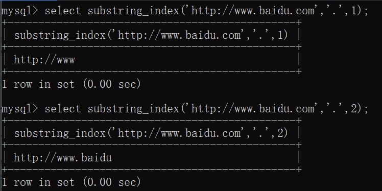
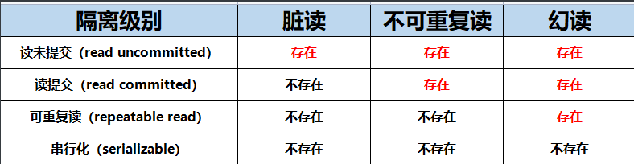

# 数据库概述

## 数据库类型

### 关系型数据库

### 非关系型数据库(NoSQL)

# 初始化数据

```sql
DROP TABLE IF EXISTS EMP;
DROP TABLE IF EXISTS DEPT;
DROP TABLE IF EXISTS SALGRADE;

CREATE TABLE DEPT(DEPTNO int(2) not null ,
	DNAME VARCHAR(14) ,
	LOC VARCHAR(13),
	primary key (DEPTNO)
);
CREATE TABLE EMP(EMPNO int(4)  not null ,
	ENAME VARCHAR(10),
	JOB VARCHAR(9),
	MGR INT(4),
	HIREDATE DATE  DEFAULT NULL,
	SAL DOUBLE(7,2),
	COMM DOUBLE(7,2),
	primary key (EMPNO),
	DEPTNO INT(2) 
);

CREATE TABLE SALGRADE( GRADE INT,
	LOSAL INT,
	HISAL INT
);

INSERT INTO DEPT ( DEPTNO, DNAME, LOC ) VALUES ( 10, 'ACCOUNTING', 'NEW YORK'); 
INSERT INTO DEPT ( DEPTNO, DNAME, LOC ) VALUES ( 20, 'RESEARCH', 'DALLAS'); 
INSERT INTO DEPT ( DEPTNO, DNAME, LOC ) VALUES ( 30, 'SALES', 'CHICAGO'); 
INSERT INTO DEPT ( DEPTNO, DNAME, LOC ) VALUES ( 40, 'OPERATIONS', 'BOSTON'); 
 
INSERT INTO EMP ( EMPNO, ENAME, JOB, MGR, HIREDATE, SAL, COMM,DEPTNO ) VALUES ( 7369, 'SMITH', 'CLERK', 7902,  '1980-12-17', 800, NULL, 20); 
INSERT INTO EMP ( EMPNO, ENAME, JOB, MGR, HIREDATE, SAL, COMM,DEPTNO ) VALUES ( 7499, 'ALLEN', 'SALESMAN', 7698,  '1981-02-20', 1600, 300, 30); 
INSERT INTO EMP ( EMPNO, ENAME, JOB, MGR, HIREDATE, SAL, COMM,DEPTNO ) VALUES ( 7521, 'WARD', 'SALESMAN', 7698,  '1981-02-22', 1250, 500, 30); 
INSERT INTO EMP ( EMPNO, ENAME, JOB, MGR, HIREDATE, SAL, COMM,DEPTNO ) VALUES ( 7566, 'JONES', 'MANAGER', 7839,  '1981-04-02', 2975, NULL, 20); 
INSERT INTO EMP ( EMPNO, ENAME, JOB, MGR, HIREDATE, SAL, COMM,DEPTNO ) VALUES ( 7654, 'MARTIN', 'SALESMAN', 7698,  '1981-09-28', 1250, 1400, 30); 
INSERT INTO EMP ( EMPNO, ENAME, JOB, MGR, HIREDATE, SAL, COMM,DEPTNO ) VALUES ( 7698, 'BLAKE', 'MANAGER', 7839,  '1981-05-01', 2850, NULL, 30); 
INSERT INTO EMP ( EMPNO, ENAME, JOB, MGR, HIREDATE, SAL, COMM,DEPTNO ) VALUES ( 7782, 'CLARK', 'MANAGER', 7839,  '1981-06-09', 2450, NULL, 10); 
INSERT INTO EMP ( EMPNO, ENAME, JOB, MGR, HIREDATE, SAL, COMM,DEPTNO ) VALUES ( 7788, 'SCOTT', 'ANALYST', 7566,  '1987-04-19', 3000, NULL, 20); 
INSERT INTO EMP ( EMPNO, ENAME, JOB, MGR, HIREDATE, SAL, COMM,DEPTNO ) VALUES ( 7839, 'KING', 'PRESIDENT', NULL,  '1981-11-17', 5000, NULL, 10); 
INSERT INTO EMP ( EMPNO, ENAME, JOB, MGR, HIREDATE, SAL, COMM,DEPTNO ) VALUES ( 7844, 'TURNER', 'SALESMAN', 7698,  '1981-09-08', 1500, 0, 30); 
INSERT INTO EMP ( EMPNO, ENAME, JOB, MGR, HIREDATE, SAL, COMM,DEPTNO ) VALUES ( 7876, 'ADAMS', 'CLERK', 7788,  '1987-05-23', 1100, NULL, 20); 
INSERT INTO EMP ( EMPNO, ENAME, JOB, MGR, HIREDATE, SAL, COMM,DEPTNO ) VALUES ( 7900, 'JAMES', 'CLERK', 7698,  '1981-12-03', 950, NULL, 30); 
INSERT INTO EMP ( EMPNO, ENAME, JOB, MGR, HIREDATE, SAL, COMM,DEPTNO ) VALUES ( 7902, 'FORD', 'ANALYST', 7566,  '1981-12-03', 3000, NULL, 20); 
INSERT INTO EMP ( EMPNO, ENAME, JOB, MGR, HIREDATE, SAL, COMM,DEPTNO ) VALUES ( 7934, 'MILLER', 'CLERK', 7782,  '1982-01-23', 1300, NULL, 10); 
 
INSERT INTO SALGRADE ( GRADE, LOSAL, HISAL ) VALUES ( 1, 700, 1200); 
INSERT INTO SALGRADE ( GRADE, LOSAL, HISAL ) VALUES ( 2, 1201, 1400); 
INSERT INTO SALGRADE ( GRADE, LOSAL, HISAL ) VALUES ( 3, 1401, 2000); 
INSERT INTO SALGRADE ( GRADE, LOSAL, HISAL ) VALUES ( 4, 2001, 3000); 
INSERT INTO SALGRADE ( GRADE, LOSAL, HISAL ) VALUES ( 5, 3001, 9999); 
commit;
```

命令

```sql
source sql脚本路径
desc 表明 #查看表的结构
```

# 查询

## 简单查询

```sql
#查询部门编号、部门名称以及位置
SELECT DEPTNO, DNAME, LOC FROM DEPT;

#查询员工名字以及工作岗位
SELECT ENAME, JOB FROM EMP;

#查员工年薪
SELECT ENAME, SAL*12 FROM EMP;

#起别名
SELECT ENAME AS NAME FROM EMP;#as也可以省略
SELECT ENAME NAME FROM EMP;
SELECT ENAME 'EMP NAME' FROM EMP;#别名中有空格，用引号括起来
```

## 条件查询

| **条件**           | **说明**                           |
| ------------------ | ---------------------------------- |
| =                  | 等于                               |
| <>或!=             | 不等于                             |
| >=                 | 大于等于                           |
| <=                 | 小于等于                           |
| >                  | 大于                               |
| <                  | 小于                               |
| between...and...   | 等同于 >= and <=                   |
| is null            | 为空                               |
| is not null        | 不为空                             |
| <=>                | 安全等于（可读性差，很少使用了）。 |
| and 或 &&          | 并且                               |
| or 或 &#124;&#124; | 或者                               |
| in                 | 在指定的值当中                     |
| not in             | 不在指定的值当中                   |
| exists             |                                    |
| not exists         |                                    |
| like               | 模糊查询                           |

### 条件查询语法格式

```sql
select 
  ...
from
  ...
where
  过滤条件;
```

```sql
#查询月薪3000的员工编号以及姓名
SELECT EMPNO, ENAME FROM EMP WHERE SAL = 3000;

#查询ford的岗位以及月薪
SELECT JOB, SAL FROM EMP WHERE ENAME = 'FORD';
```

通过测试发现，即使写成小写ford，也是可以查询到结果的，**不过这里需要注意的是：在Oracle数据库当中是查询不到数据的，Oracle的语法要比MySQL的语法严谨。对于SQL语句本身来说是不区分大小写的，但是对于表中真实存储的数据，大写A和小写a还是不一样的，这一点Oracle做的很好。MySQL的语法更随性。另外在Oracle当中，字符串是必须使用单引号括起来的，但在MySQL当中，字符串可以使用单引号，也可以使用双引号**

### AND和OR的优先级

and优先级比or大

### BETWEEN AND

between...and...等同于 >= and <=
做区间判断的，包含左右两个边界值。
它支持数字、日期、字符串等数据类型。
between...and...在使用时一定是**左小右大**。左大右小时无法查询到数据。
between...and... 和 >= and <=只是在写法结构上有区别，执行原理和效率方面没有区别。

### IS NULL

判断为空不能用=

### IN

```sql
#找出工作岗位是MANAGER和SALESMAN的员工姓名，薪资
SELECT ENAME, SAL FROM EMP WHERE JOB IN ('MANAGER', 'SALESMAN');
```

```SQL
select * from emp where comm in(NULL, 300);
select * from emp where comm = NULL or comm = 300;
```

in是自动忽略null的。因为comm=null始终为假

```sql
select * from emp where comm NOT in(NULL, 300);
select * from emp where comm != NULL AND comm != 300;
```

not in中的null会导致查不出任何东西。not in的括号中不能有空

### 模糊查询like

通配符 %任意多个字符；_任意一个字符

```sql
#以s开头的员工姓名
SELECT EMPNO, JOB FROM EMP WHERE ENAME LIKE 'S%';
```

对于字段中有下划线或%的，使用转义字符\

## 排序

```sql
select .. from .. order by 字段 [asc]/desc#asc升序
```

### 单一字段

```sql
#查询员工的编号、姓名、薪资，按照薪资升序排
SELECT EMPNO, ENAME, SAL FROM EMP ORDER BY SAL ASC;
```

### 多字段

```sql
#查询员工的编号、姓名、薪资，按照薪资升序排，如果薪资相同，按照姓名降序排
SELECT EMPNO, ENAME, SAL FROM EMP ORDER BY SAL, ENAME DESC;
```

### where和order by

```sql
#找出工作岗位是MANAGER和SALESMAN的员工姓名，薪资，按照薪资升序排列
SELECT ENAME, SAL FROM EMP WHERE JOB IN ('MANAGER', 'SALESMAN') ORDER BY SAL;
```

ORDER BY 在select后面执行

## DISTINCT去重

```sql
#查询工作岗位，去重
SELECT DISTINCT JOB FROM EMP;
```

只能用在所有字段的最前方

## 数据处理函数

### 字符串相关

#### 转大、小写

```sql
# 查询所有员工名字，以大写形式展现
select upper(ename) as ename from emp;

# 查询名字是SMITH的员工编号，岗位，无论数据库中寸的是大写还是小写
select SAL, JOB from emp where lower(ename) = 'smith';
```

#### 子串

语法：substr('被截取的字符串', 起始下标, 截取长度)
有两种写法：
第一种：substr('被截取的字符串', 起始下标, 截取长度)
第二种：substr('被截取的字符串', 起始下标)，当第三个参数“截取长度”缺失时，截取到字符串末尾
注意：起始下标从1开始，不是从0开始。（1表示从左侧开始的第一个位置，-1表示从右侧开始的第一个位置。）

```SQL
#第二个字母是a的员工姓名和岗位
SELECT ENAME, JOB FROM EMP WHERE SUBSTR(ENAME, 2, 1) = 'A';
```

#### 字符串长度

length：统计字节长度，中文两个字节，英文一个字节

char_length：统计字符个数

#### 字符串拼接

语法：concat('字符串1', '字符串2', '字符串3'....)
拼接的字符串数量没有限制。

#### 去除字符串前后空白

```sql
select concat(trim('    a   bc    '), 'def');
```


去除前置0

```sql
select trim(leading '0' from '000111000');
```

去除后置0

```sql
select trim(trailing '0' from '000111000');
```

前置0和后置0全部去除

```sql
select trim(both '0' from '000111000');
```

### 数字相关

#### rand()和rand(x)

生成0-1的随机数，x为种子

#### round(x)和round(x, y)

四舍五入，保留整数位，舍去所有小数

四舍五入，保留y位小数

#### truncate(x, y)

舍去

#### ceil和floor

向上向下取整

### 空处理

ifnull(x, y)，空处理函数，当x为NULL时，将x当做y处理。
ifnull(comm, 0)，表示如果员工的津贴是NULL时当做0处理。
在SQL语句中，凡是有NULL参与的数学运算，最终的计算结果都是NULL：

```SQL
#求员工的月薪加上津贴
SELECT ENAME, SAL, ((SAL + COMM) * 12) AS YEARSAL FROM EMP;#有些员工的津贴为空导致年薪为空
SELECT ENAME, SAL, ((SAL + ifnull(COMM, 0)) * 12) AS YEARSAL FROM EMP;
```

### 日期和时间相关函数

#### 获取当前日期和时间

- now()：获取的是执行select语句的时刻。
- sysdate()：获取的是执行sysdate()函数的时刻。

#### 获取日期

- curdate()
- current_date()
- current_date

#### 获取时间

- curtime()
- current_time()
- current_time

#### 获取年月日时分秒

- year(now())
- month(now())
- day(now())
- hour(now())
- minute(now())
- second(now())
- data(now())获取年月日
- time(now())获取时分秒

#### data_add

date_add函数的作用：给指定的日期添加间隔的时间，从而得到一个新的日期。
date_add函数的语法格式：date_add(日期, interval 数量 单位)

```sql
date_add('2023-01-03', interval 3 day);
date_add('2023-01-03', interval 3 year);
```

- 日期：一个日期类型的数据
- interval：关键字，翻译为“间隔”，固定写法
- expr：指定具体的间隔量，一般是一个数字。**也可以为负数，如果为负数，效果和date_sub函数相同**。
- 单位：
  - year：年
  - month：月
  - day：日
  - hour：时
  - minute：分
  - second：秒
  - microsecond：微秒（1秒等于1000毫秒，1毫秒等于1000微秒）
  - week：周
  - quarter：季度

另外，单位也可以采用复合型单位，例如：

- SECOND_MICROSECOND
- MINUTE_MICROSECOND
- MINUTE_SECOND：几分几秒之后
- HOUR_MICROSECOND
- HOUR_SECOND
- HOUR_MINUTE：几小时几分之后
- DAY_MICROSECOND
- DAY_SECOND
- DAY_MINUTE
- DAY_HOUR：几天几小时之后
- YEAR_MONTH：几年几个月之后

```sql
date_add('2024-06-04 16:10:00', interval '3, 2' day_hour);
```

'3,2'这个应该很好理解，表示3天2个小时之后。'3,2'和day_hour是对应的。

#### date_format

将日期转换成具有某种格式的日期字符串，通常用在查询操作当中。（date类型转换成char类型）
语法格式：date_format(日期, '日期格式')

- 第一个参数：日期。这个参数就是即将要被格式化的日期。类型是date类型。
- 第二个参数：指定要格式化的格式字符串。
  - %Y：四位年份
  - %y：两位年份
  - %m：月份（1..12）
  - %d：日（1..30）
  - %H：小时（0..23）
  - %i：分（0..59）
  - %s：秒（0..59）

```sql
#获取当前系统时间，让其以这个格式展示：2000-10-11 20:15:30
select date_format(now(), '%Y-%m-%d %H:%i:%s')
```

#### str_to_date函数

该函数的作用是将char类型的日期字符串转换成日期类型date，通常使用在插入和修改操作当中。（char类型转换成date类型）

```sql
str_to_date('10/01/1985', '%m/%d/%Y')
```

当然，如果你提供的日期字符串格式能够被mysql解析，str_to_date函数是可以省略的，底层会自动调用该函数进行类型转换：

```sql
'1985-10-01'
'1985/10/01'
'85-10-01'
'85-10-01'
```

#### dayofweek、dayofmonth、dayofyear

dayofweek：一周中的第几天（1~7），周日是1，周六是7。
dayofmonth：一个月中的第几天（1~31）
dayofyear：一年中的第几天（1~366）

#### last_day

获取给定日期**所在月**的最后一天的日期

#### datediff

计算两个日期之间所差**天数**

#### timediff

计算两个日期所差时间，例如日期1和日期2所差10:20:30，表示差10小时20分钟30秒。

### if函数

```sql
SELECT IF(500<1000, "YES", "NO");

#如果工资高于3000，则输出1， 否则为0
SELECT ENAME, IF(SAL > 3000, 1, 0) FROM EMP;

#如果名字是SMITH的，工资上调10%，其他员工工资正常显示。
SELECT ENAME, IF(ENAME = 'SMITH', 1.1 * SAL, SAL) AS SAL FROM EMP;
```

### CASE函数

```sql
#工作岗位是MANAGER的工资上调10%，是SALESMAN的工资上调20%，其他岗位工资正常。
SELECT ENAME, JOB,
	CASE JOB
	WHEN 'MANAGER' THEN SAL * 1.1
	WHEN 'SALESMAN' THEN SAL * 1.2
	ELSE SAL
	END
	AS SAL
	FROM EMP;
```

### cast函数

cast函数用于将值从一种数据类型转换为表达式中指定的另一种数据类型
语法：cast(值 as 数据类型)
例如：cast('2020-10-11' as date)，表示将字符串'2020-10-11'转换成日期date类型。
在使用cast函数时，可用的数据类型包括：

- date：日期类型
- time：时间类型
- datetime：日期时间类型
- signed：有符号的int类型（有符号指的是正数负数）
- char：定长字符串类型
- decimal：浮点型

### 加密函数

md5函数，可以将给定的字符串经过md5算法进行加密处理，字符串经过加密之后会生成一个固定长度32位的字符串，md5加密之后的密文通常是不能解密的：

## 分组函数

**分组函数的执行原则：先分组，然后对每一组数据执行分组函数。如果没有分组语句group by的话，整张表的数据自成一组。**
分组函数包括五个：

- max：最大值
- min：最小值
- avg：平均值
- sum：求和
- count：计数

重点：所有的分组函数都是自动忽略NULL的。

**分组函数不能直接使用在where子句当中**

原因：分组的行为是在where执行之后才开始的。

## 分组查询

### GROUP BY

按照某个字段分组，或者按照**某些字段联合分组**。注意：group by的执行是在where之后执行。
语法：
group by 字段
group by 字段1,字段2,字段3....

```sql
#找出每个岗位的平均工资
SELECT JOB, AVG(SAL) FROM EMP GROUP BY JOB;

#找出每个部门的最高工资
SELECT DEPTNO, MAX(SAL) FROM EMP GROUP BY DEPTNO;

#找出每个部门不同岗位的平均工资
SELECT DEPTNO, JOB, AVG(SAL) FROM EMP GROUP BY DEPTNO, JOB;

#当select语句中有group by的话，select后面只能跟分组函数或参加分组的字段
```

当select语句中有group by的话，select后面只能跟分组函数或参加分组的字段

```sql
select ename,deptno,avg(sal) from emp group by deptno; // 这个SQL执行后会报错。
```

### HAVING

having写在group by的后面，当你对分组之后的数据不满意，可以继续通过having对分组之后的数据进行过滤。
where的过滤是在分组前进行过滤。having的过滤是在分组后进行的
使用原则：尽量在where中过滤，实在不行，再使用having。越早过滤效率越高。

```sql
#找出除20部门以外，其他部门的平均工资
SELECT DEPTNO, AVG(SAL) FROM EMP GROUP BY DEPTNO HAVING DEPTNO <> 20;
SELECT DEPTNO, AVG(SAL) FROM EMP WHERE DEPTNO <> 20 GROUP BY DEPTNO;

#查询每个部门的平均薪资，找出平均薪资高于2000的
SELECT DEPTNO, AVG(SAL) FROM EMP GROUP BY DEPTNO HAVING AVG(SAL) > 2000;
```

### 组内排序

substring_index



group_concat


```sql
#找出每个工作岗位的工资前两名
SELECT substring_index(group_concat(ENAME order by sal desc), ',', 2) AS TOP2, JOB FROM EMP GROUP BY JOB;
```

## 连接查询

mysql不支持全连接

### 笛卡尔积

添加了过滤条件后，虽然缩小了笛卡尔积的规模，但是匹配的次数并没有减少

### 内连接


满足条件的记录才会出现在结果集中。

#### 等值连接

连接时，条件为等量关系。

```sql
#查询每个员工所在的部门名称，要求显示员工名、部门名。
select
	e.ename,d.dname
from
	emp e
inner join
	dept d
on
	e.deptno = d.deptno;
```

inner可省略

#### 非等值连接

```sql
#查询工资大于1000每个员工的工资等级，显示员工名，工资，工资等级
SELECT E.ENAME, E.SAL, S.GRADE FROM EMP E INNER JOIN SALGRADE S ON E.SAL BETWEEN S.LOSAL AND HISAL WHERE E.SAL > 1000;
```

#### 自连接

```sql
#找出员工的直属领导，显示领导名和员工名
SELECT E.ENAME AS EMP, P.ENAME AS BOSS FROM EMP E INNER JOIN EMP P ON P.EMPNO = E.MGR;
```

### 外连接

内连接是满足条件的记录查询出来。也就是两张表的交集。
外连接是除了满足条件的记录查询出来，再将其中一张表的记录全部查询出来，另一张表如果没有与之匹配的记录，自动模拟出NULL与其匹配。


#### 左外连接

```sql
#查询所有部门信息，并且找出每个部门下的员工
SELECT D.DEPTNO, D.DNAME, D.LOC, E.ENAME FROM DEPT D LEFT OUTER JOIN EMP E ON E.DEPTNO = D.DEPTNO;
```

#### 右外连接

### 多表联查

```sql
#找出每个员工的部门名称，并且要求显示每个员工的薪资登记
SELECT e.ename, d.dname, s.grade from emp e join salgrade s on e.sal between s.losal and s.hisal join dept d on e.deptno = d.deptno;
```

## 子查询

select语句中嵌套select语句就叫做子查询。

select语句可以嵌套在where后面、from后面、select后面

### Where后面的子查询

```sql
#找出高于平均薪资的员工姓名和薪资
SELECT ENAME, SAL FROM EMP WHERE SAL > (SELECT AVG(SAL) FROM EMP);
```

### From后面的子查询

```sql
#找出每个部门的平均工资的等级
SELECT s.grade, t.* FROM (SELECT AVG(sal) as avgsal, deptno FROM emp GROUP BY deptno) t JOIN salgrade s ON t.avgsal BETWEEN s.losal AND s.hisal;
```

将from后面的子查询当作一张表

### SELECT后面的子查询

```sql
#查询员工姓名，和部门名称
SELECT e.ename, (select d.dname from dept d where e.deptno = d.deptno) as dname FROM emp e;
```

## EXISTS

在 MySQL 数据库中，EXISTS（存在）用于检查子查询的查询结果行数是否大于0。如果子查询的查询结果行数大于0，则 EXISTS 条件为真。

主要应用场景：

- EXISTS 可以与 SELECT、UPDATE、DELETE 一起使用，用于检查另一个查询是否返回任何行；
- EXISTS 可以用于验证条件子句中的表达式是否存在；
- EXISTS 常用于子查询条件过滤，例如查询有订单的用户等。

```sql
drop table if exists t_customer;
drop table if exists t_order;

create table t_customer(
  customer_id int,
  customer_name varchar(32)
);

create table t_order(
  order_id int,
  order_price decimal(5,1),
  customer_id int
);

insert into t_customer(customer_id,customer_name) values(1,'zhangsan');
insert into t_customer(customer_id,customer_name) values(2,'lisi');
insert into t_customer(customer_id,customer_name) values(3,'wangwu');

insert into t_order(order_id, order_price, customer_id) values(10, 1000.0, 1);
insert into t_order(order_id, order_price, customer_id) values(20, 2000.0, 1);
insert into t_order(order_id, order_price, customer_id) values(30, 3000.0, 2);
insert into t_order(order_id, order_price, customer_id) values(40, 4000.0, 2);

commit;
select * from t_customer;
select * from t_order;
```

```sql
#查询先前有过订单的顾客，而订单信息保存在 t_order 表中，顾客信息保存在 t_customer 表中
select customer_name from t_customer where customer_id in (select distinct customer_id from t_order);
select customer_name from t_customer c where exists(select * from t_order o where o.customer_id = c.customer_id);

#查询没有过订单的顾客
select customer_name from t_customer c where not exists(select * from t_order o where o.customer_id = c.customer_id);
```

## In和exists的区别

1.  IN 操作符是根据指定列表中的值来判断是否满足条件，而 EXISTS 操作符则是根据子查询的结果是否有返回记录集来判断。 
2.  EXISTS 操作符通常比 IN 操作符更快，尤其是在子查询返回记录数很大的情况下。因为 EXISTS 只需要判断是否存在符合条件的记录，而 IN 操作符需要比对整个列表，因此执行效率相对较低。 
3.  IN 操作符可同时匹配多个值，而 EXISTS 只能匹配一组条件。 

## Union&Union all

union还是union all都可以将两个查询结果集进行合并。

union会对合并之后的查询结果集进行去重操作。union all是直接将查询结果集合并，不进行去重操作。

```sql
#查询工作岗位是MANAGER和SALESMAN的员工
SELECT ename, job from emp where job in ('MANAGER', 'SALESMAN');
select ename, job from emp where job = 'MANAGER' union select ename, job from emp where job = 'SALESMAN';
```

考虑走索引优化之类的选择union all，其它选择or。

列数要一致

## Limit

limit作用：查询第几条到第几条的记录。通常是因为表中数据量太大，需要分页显示。

limit语法格式：limit 开始下标, 长度

```sql
#查询员工表前5条记录
select ename,sal from emp limit 0, 5;

#如果下标是从0开始，可以简写为：
select ename,sal from emp limit 5;

#查询工资排名在前5名的员工（limit是在order by执行之后才会执行的）
select ename,sal from emp order by sal desc limit 5;
```

## 35道查询题目

### 第1题

取得每个部门最高薪水的人员名称

```sql
select e.ename, t.* from emp e join (select max(sal) as maxsal, deptno from emp group by deptno) t on e.sal = t.maxsal and e.deptno = t.deptno;
```

1. 取得每个部门最高薪水
2. 将第一步的查询结果当做一张临时表t，进行表连接

### 第2题

哪些人的薪水在部门的平均薪水之上

1. 查询每个部门的平均薪水
2. 表连接判断

```sql
select e.ename, t.* from emp e join (select avg(sal) as avgsal, deptno from emp group by deptno) t on e.sal >= t.avgsal and e.deptno = t.deptno;
```

### 第3题

取得每个部门平均薪水的等级

1. 查询每个部门的平均薪水
2. 表连接判断薪水等级

```sql
select s.grade, t.* from salgrade s join (select avg(sal) as avgsal, deptno from emp group by deptno) t on t.avgsal between s.losal and s.hisal;
```

### 第4题

取得部门中（所有人的）平均的薪水等级

1. 查询每个人的薪水等级
2. 按部门分组，算平均等级

```sql
select avg(s.grade), e.deptno from emp e join salgrade s on e.sal between s.losal and s.hisal group by e.deptno;
```

### 第5题

不准用组函数（Max），取得最高薪水（给出两种解决方案）

```sql
select ename, sal from emp order by sal desc limit 1;

select ename,sal from emp where sal not in(select distinct a.sal from emp a join emp b on a.sal < b.sal);
```

### 第6题

取得平均薪水最高的部门的部门编号（至少给出两种解决方案）

```sql
select deptno, avg(sal) as avgsal from emp group by deptno order by avgsal desc limit 1;

select a.deptno, a.avgsal from (select avg(sal) as avgsal, deptno from emp group by deptno) a join (select max(t.avgsal) as maxavgsal from (select avg(sal) as avgsal from emp group by deptno) t) m on a.avgsal = m.maxavgsal;

select deptno,avg(sal) as avgsal from emp group by deptno having avg(sal)=(select max(t.avgsal) from (select avg(sal) as avgsal from emp group by deptno) t);
```

### 第7题

取得平均薪水最高的部门的部门名称

```sql
select d.dname, e.avgsal, d.deptno from dept d join (select deptno, avg(sal) as avgsal from emp group by deptno order by avgsal desc limit 1) e on d.deptno = e.deptno;

select d.dname, avg(e.sal) as avgsal, e.deptno from emp e join dept d on e.deptno = d.deptno group by deptno order by avgsal desc limit 1;
```

### 第8题

求平均薪水的等级最低的部门的部门名称

1. 求出每个部门的平均薪水
2. 求出薪水等级
3. 排序，连表找名称

```sql
#1
select avg(sal) as avgsal, deptno from emp group by deptno;
#2
select s.grade as grade, e.avgsal, e.deptno from (select avg(sal) as avgsal, deptno from emp group by deptno) e join salgrade s on e.avgsal between s.losal and s.hisal;
#3
select t.grade, d.dname from dept d join (select s.grade as grade, e.avgsal, e.deptno as deptno from (select avg(sal) as avgsal, deptno from emp group by deptno) e join salgrade s on e.avgsal between s.losal and s.hisal) t on d.deptno = t.deptno order by t.grade limit 1;
```

### 第9题

取得比普通员工(员工代码没有在mgr字段上出现的)的最高薪水还要高的领导人姓名

1. 找到非null字段的最高薪水
2. 找到比这个薪水还要高的人

```sql
#1
select max(sal) as maxsal from emp where mgr is not null;
#2
select e.ename, e.sal from emp e where e.sal > (select max(sal) as maxsal from emp where mgr is not null);
```

### 第10题

取得薪水最高的前五名员工

```sql
select ename, sal from emp where mgr is not null order by sal desc limit 5;
```

### 第11题

取得薪水最高的第六到第十名员工

```sql
select ename, sal from emp where mgr is not null order by sal desc limit 5, 5;
```

### 第12题

取得最后入职的5名员工

```sql
select ename hiredate from emp order by hiredate desc limit 5;
```

### 第13题

取得每个薪水等级有多少员工

1. 算出每个员工的薪水等级
2. count

```sql
#1
select s.grade, e.ename from emp e join salgrade s on e.sal between s.losal and s.hisal;
#2
select s.grade, count(e.ename) from emp e join salgrade s on e.sal between s.losal and s.hisal group by s.grade;
```

### 第14题

列出所有员工及领导的姓名

```sql
select e.ename, l.ename as leader from emp e join emp l on e.mgr = l.empno;
```

### 第15题

列出受雇日期早于其直接上级的所有员工的编号,姓名,部门名称

```sql
select e.empno, e.ename, d.dname from emp e join emp l on e.hiredate > l.hiredate and e.mgr = l.mgr join dept d on e.deptno = d.deptno;
```

### 第16题

列出部门名称和这些部门的员工信息,同时列出那些没有员工的部门

```sql
select d.dname, e.* from dept d left join emp e on e.deptno = d.deptno;
```

### 第17题

列出至少有5个员工的所有部门

1. 统计每个部门员工的数量
2. 找出大于5的

```sql
#1
select deptno, count(ename) as num from emp group by deptno;
#2
select deptno from (select deptno, count(ename) as num from emp group by deptno) t where t.num >= 5;

#方法二
select deptno, count(ename) as num from emp group by deptno having num >=5;
```

### 第18题

列出薪金比"SMITH"多的所有员工信息

1. 找出smith的薪金
2. 比他多的

```sql
#1
select sal from emp where ename = 'smith';
#2
select e.* from emp e where e.sal > (select sal from emp where ename = 'smith');
```

### 第19题

列出所有"CLERK"(办事员)的姓名及其部门名称,部门的人数

1. 算出部门人数及名称
2. 找出clerk

```sql
#1
select count(*) as num, d.deptno, d.dname from emp e join dept d on e.deptno = d.deptno group by deptno;
#2
select e.ename, t.num, t.dname from emp e join (select count(*) as num, d.deptno, d.dname from emp e join dept d on e.deptno = d.deptno group by deptno) t on e.deptno = t.deptno where e.job = 'clerk';
```

### 第20题

列出最低薪金大于1500的各种工作及从事此工作的全部雇员人数

```sql
select job, count(*) from emp group by job having min(sal) > 1500;
```

### 第21题

列出在部门"SALES"<销售部>工作的员工的姓名,假定不知道销售部的部门编号

```sql
select e.ename, d.dname from emp e join dept d on e.deptno = d.deptno where d.dname = 'sales';
```

### 第22题

列出薪金高于公司平均薪金的所有员工,所在部门,上级领导,雇员的工资等级

```sql
select e.ename, d.dname, l.ename, s.grade from emp e join emp l on e.mgr = l.empno join dept d on d.deptno = e.deptno join salgrade s on e.sal between s.losal and s.hisal where e.sal > (select avg(sal) from emp);
```

### 第23题

列出与"SCOTT"从事相同工作的所有员工及部门名称

1. 找出scott从事的工作
2. 找出相同的

```sql
#1
select job from emp where ename = 'scott';
#2
select e.ename, d.dname from emp e join dept d on e.deptno = d.deptno where e.job = (select job from emp where ename = 'scott') and ename <> 'scott';
```

### 第24题

列出薪金等于部门30中员工的薪金的其他员工的姓名和薪金

1. 找出部门30的员工的薪金
2. 不再30部门的相等薪金

```sql
#1
select sal from emp where deptno = 30;
#2
select ename, sal from emp where sal in (select sal from emp where deptno = 30) and deptno <> 30;
```

### 第25题

列出薪金高于在部门30工作的所有员工的薪金的员工姓名和薪金.部门名称

```sql
select e.ename, e.sal, d.dname from emp e join dept d on e.deptno = d.deptno where sal > (select max(sal) from emp where deptno = 30);
```

### 第26题

列出在每个部门工作的员工数量,平均工资和平均服务期限

```sql
select count(*), avg(sal), avg(datediff(now(), hiredate)) from emp group by deptno;
```

### 第27题

列出所有员工的姓名、部门名称和工资

```sql
select e.ename, d.dname, e.sal from emp e join dept d on e.deptno = d.deptno;
```

### 第28题

列出所有部门的详细信息和人数

```sql
select t.num, d.* from dept d join (select count(*) as num, deptno from emp group by deptno) t on t.deptno = d.deptno;
```

### 第29题

列出各种工作的最低工资及从事此工作的雇员姓名

```sql
select e.ename, t.job, t.minsal from emp e join (select min(sal) as minsal, job from emp group by job) t on e.job = t.job;
```

### 第30题

列出各个部门的MANAGER(领导)的最低薪金

```sql
select min(sal), deptno from emp where job = 'manager' group by deptno;
```

### 第31题

列出所有员工的年工资,按年薪从低到高排序

```sql
select ename, 12 * (sal + ifnull(comm, 0)) as asal from emp order by asal;
```

### 第32题

求出员工领导的薪水超过3000的员工名称与领导名称

```sql
select e.ename 员工名, l.ename 领导名 from emp e join emp l on e.mgr = l.empno where l.sal>3000;
```

### 第33题

求出部门名称中,带'S'字符的部门员工的工资合计、部门人数

```sql
select count(e.ename), sum(e.sal), d.deptno, d.dname from emp e right join dept d on e.deptno = d.deptno where d.dname like '%s%' group by deptno;
```

### 第34题

给任职日期超过30年的员工加薪10%

```sql
update emp set sal=sal*1.1 where datediff(now(),hiredate)/365 > 30;
```

### 第35题

```sql
CREATE TABLE SC
(
  SNO      VARCHAR(200),
  CNO      VARCHAR(200),
  SCGRADE  VARCHAR(200)
);

CREATE TABLE S
(
  SNO    VARCHAR(200 ),
  SNAME  VARCHAR(200)
);

CREATE TABLE C
(
  CNO       VARCHAR(200),
  CNAME     VARCHAR(200),
  CTEACHER  VARCHAR(200)
);

INSERT INTO C ( CNO, CNAME, CTEACHER ) VALUES ( '1', '语文', '张'); 
INSERT INTO C ( CNO, CNAME, CTEACHER ) VALUES ( '2', '政治', '王'); 
INSERT INTO C ( CNO, CNAME, CTEACHER ) VALUES ( '3', '英语', '李'); 
INSERT INTO C ( CNO, CNAME, CTEACHER ) VALUES ( '4', '数学', '赵'); 
INSERT INTO C ( CNO, CNAME, CTEACHER ) VALUES ( '5', '物理', '黎明'); 
commit;
 
INSERT INTO S ( SNO, SNAME ) VALUES ( '1', '学生1'); 
INSERT INTO S ( SNO, SNAME ) VALUES ( '2', '学生2'); 
INSERT INTO S ( SNO, SNAME ) VALUES ( '3', '学生3'); 
INSERT INTO S ( SNO, SNAME ) VALUES ( '4', '学生4'); 
commit;
 
INSERT INTO SC ( SNO, CNO, SCGRADE ) VALUES ( '1', '1', '40'); 
INSERT INTO SC ( SNO, CNO, SCGRADE ) VALUES ( '1', '2', '30'); 
INSERT INTO SC ( SNO, CNO, SCGRADE ) VALUES ( '1', '3', '20'); 
INSERT INTO SC ( SNO, CNO, SCGRADE ) VALUES ( '1', '4', '80'); 
INSERT INTO SC ( SNO, CNO, SCGRADE ) VALUES ( '1', '5', '60'); 
INSERT INTO SC ( SNO, CNO, SCGRADE ) VALUES ( '2', '1', '60'); 
INSERT INTO SC ( SNO, CNO, SCGRADE ) VALUES ( '2', '2', '60'); 
INSERT INTO SC ( SNO, CNO, SCGRADE ) VALUES ( '2', '3', '60'); 
INSERT INTO SC ( SNO, CNO, SCGRADE ) VALUES ( '2', '4', '60'); 
INSERT INTO SC ( SNO, CNO, SCGRADE ) VALUES ( '2', '5', '40'); 
INSERT INTO SC ( SNO, CNO, SCGRADE ) VALUES ( '3', '1', '60'); 
INSERT INTO SC ( SNO, CNO, SCGRADE ) VALUES ( '3', '3', '80'); 
commit;
```

有3个表S（学生表），C（课程表），SC（学生选课表）
S（SNO，SNAME）代表（学号，姓名）
C（CNO，CNAME，CTEACHER）代表（课号，课名，教师）
SC（SNO，CNO，SCGRADE）代表（学号，课号，成绩）

1，找出没选过“黎明”老师的所有学生姓名。

```sql
#1找出黎明老师教哪些课
select cno from c where cteacher = '黎明';
#2找出选了这些课的学生
select sno from sc where cno in (select cno from c where cteacher = '黎明');
#3找出不在名单里的学生姓名
select sname from s where sno not in (select sno from sc where cno in (select cno from c where cteacher = '黎明'));
```

2，列出2门以上（含2门）不及格学生姓名及平均成绩。

```sql
#找出有两门及以上不及格成绩的学生
select sno from sc where scgrade < 60 group by sno having count(*) >= 2;
#求平均成绩
select avg(sc.scgrade), s.sname from s join sc on s.sno = sc.sno where s.sno in (select sno from sc where scgrade < 60 group by sno having count(*) >= 2) group by s.sno;
```

3，既学过1号课程又学过2号课所有学生的姓名。

```sql
#1找到学过1号课程的学生
select distinct sno from sc where cno = '1';
#2找到学过2号课程的学生，且他学过1好课程
select sno from sc where cno = '2' and sno in (select distinct sno from sc where cno = '1');
```

# 表相关

## 创建表

```sql
create table 表名(
  字段名1 数据类型,
  字段名2 数据类型,
  字段名3 数据类型,
  ......
);
```

## 插入数据

```sql
insert into 表名(字段名1, 字段名2, 字段名3,......) values (值1,值2,值3,......);
```

字段名和值要一一对应。类型要一一对应，数量要一一对应。
字段名也可以省略，如果字段名省略就表示把所有字段名都写上去了，并且顺序和建表时的顺序相同。

## 删除表

```sql
drop table 表名;
drop table if exists 表名;
```

## MySQL数据类型

### 整数

tinyint：1个字节（微小整数）
smallint：2个字节（小整数）
mediumint：3个字节（中等大小的整数）
**int（integer）：4个字节（普通大小整数）**
**bigint：8个字节（大整数）**

### 浮点数

float：4个字节，单精度（最多5位小数）
**double：8个字节，双精度（最多16位小数）**

### 定点数

decimal：定点数类型。底层实际上采用字符串的形式存储数字。
语法：decimal(m, d)
例如：decimal(3, 2) 表示3个有效数字，2个小数。（有效数字最多65个，小数位最多30个）

### 日期和时间类型

year：1个字节，只存储年，格式YYYY
time：3个字节，只存储时间，格式HH:MM:SS / HHMMSS
date：3个字节，只存储年月日，格式：YYYY-MM-DD
datetime：8个字节，存储年月日+时分秒，格式：YYYY-MM-DD HH:MM:SS（从公元1000年~公元9999年）
timestamp：4个字节，存储年月日+时分秒，格式：YYYY-MM-DD HH:MM:SS（从公元1980年~公元2040年）或者格式为 YYYYMMDDHHMMSS（采用这种格式不需要使用单引号，当然你使用单引号也可以）

### 字符串类型

#### char

**char(m)：**m长度是0~255个字符。
固定长度字符串，在定义时指定字符串列长。当保存时，在右侧填充空格以达到指定的长度。m表示列的长度，范围是 0～255 个字符。
例如，CHAR(4) 定义了一个固定长度的字符串列，包含的字符个数最大为 4。当插入的字符长度大于4，则报错（除非超过4个长度之后都是空格字符，则空格字符会自动被删除用来保证插入的成功）。

#### varchar

**varchar(m)：**m长度是0~16383个字符
长度可变的字符串。varchar 的最大实际长度由最长的行的大小和使用的字符集确定，而实际占用的空间为字符串的实际长度加 1。
例如，varchar(50) 定义了一个最大长度为 50 的字符串，如果插入的字符串只有 10 个字符，则实际存储的字符串为 10 个字符和一个字符串结束字符。varchar在值保存和检索时尾部的空格仍保留。

#### text

- tinytext 表示长度为 255字符的 TEXT 列。
- text 表示长度为 65535字符的 TEXT 列。
- mediumtext 表示长度为 16777215字符的 TEXT 列。
- longtext 表示长度为 4294967295 或 4GB 字符的 TEXT 列。

#### emun

- 语法：<字段名> enum('值1','值2',...)
- 该字段插入值时，只能是指定的枚举值。

#### set

- 语法：<字段名> set('值1','值2','值3',...)   注意：值不可重复。
- 该字段插入值时，只能是指定的值。

### 二进制类型

BLOB类型：二进制大对象，可以存储图片、声音、视频等文件。

- blob：小的，最大长度65535个字节
- mediumblob：中等的，最大长度16777215个字节
- longblob：大的，最大长度4GB的字节

## 增删改查表的结构

### 创建一个学生表

```sql
create table t_student(
  no bigint,
  name varchar(255),
  age int comment '年龄'
);
```

### 查看建表语句

```sql
show create table 表名;
```

### 修改表名

```sql
alter table 表名 rename 新表名;
```

### 新增字段

```sql
alter table 表名 add 字段名 数据类型;
```

### 修改字段名

```sql
alter table 表名 change 旧字段名 新字段名 数据类型;
```

### 修改字段数据类型

```sql
alter table 表名 modify column 字段名 数据类型;
```

### 删除字段

```sql
alter table 表名 drop 字段名;
```

## 增删改查数据

### insert

```sql
insert into 表名(字段名1,字段名2,字段名3,...) values(值1,值2,值3,...);
```

表名后面的小括号当中的字段名如果省略掉，表示自动将所有字段都列出来了，并且字段的顺序和建表时的顺序一致。
一般为了可读性强，建议把字段名写上。

```sql
insert into 表名 values(值1,值2,值3,...);
```

一次可以插入多条记录：

```sql
insert into t_stu(no,name,age) values(1,'jack',20),(2,'lucy',30);
```

### delete

```sql
# 将所有记录全部删除
delete from 表名;

# 删除符合条件的记录
delete from 表名 where 条件;
```

以上的删除属于DML的方式删除，这种删除的数据是可以通过事务回滚的方式重新恢复的，但是删除的效率较低。（这种删除是支持事务的。）
另外还有一种删除表中数据的方式，但是这种方式不支持事务，不可以回滚，删了之后数据是永远也找不回来了。这种删除叫做：表被截断。
注意：这个语句删除效率非常高，巨大的表，瞬间干掉所有数据。但不可恢复。

```sql
truncate table 表名;
```

### update

```sql
update 表名 set 字段名1=值1, 字段名2=值2, 字段名3=值3 where 条件;
```

如果没有更新条件的话，所有记录全部更新。

## 约束

创建表时，可以给表的字段添加约束，可以保证数据的完整性、有效性。比如大家上网注册用户时常见的：用户名不能为空。对不起，用户名已存在。等提示信息。
约束通常包括：

- 非空约束：not null
- 检查约束：check
- 唯一性约束：unique
- 主键约束：primary key
- 外键约束：foreign key

### 非空约束

```sql
create table t_stu(
  no int,
  name varchar(255) not null,
  age int
);
```

### 检查约束

```sql
create table t_stu(
  no int,
  name varchar(255),
  age int,
  check(age > 18)
);
```

### 唯一性约束

```sql
create table t_stu(
  no int,
  name varchar(255),
  email varchar(255) unique
);
```

email字段设置为唯一性，唯一性的字段值是可以为NULL的。但不能重复。以上在字段后面添加的约束，叫做列级约束。

当然，添加约束还有另一种方式：表级约束：

```sql
create table t_stu(
  no int,
  name varchar(255),
  email varchar(255),
  unique(email)
);
```

使用表级约束可以为多个字段添加联合唯一。

```sql
create table t_stu(
  no int,
  name varchar(255),
  email varchar(255),
  unique(name,email)
);
```

创建约束时也可以给约束起名字，将来可以通过约束的名字来删除约束：

```sql
create table t_stu(
  no int,
  name varchar(255),
  email varchar(255),
  constraint t_stu_name_email_unique unique(name,email)
);
```

所有的约束都存储在一个系统表当中：table_constraints。这个系统表在这个数据库当中：information_schema

### 主键约束

1. 主键：primary key，简称PK
2. 主键约束的字段不能为NULL，并且不能重复。
3. 任何一张表都应该有主键，没有主键的表可以视为无效表。
4. 主键值是这行记录的身份证号，是唯一标识。在数据库表中即使两条数据一模一样，但由于主键值不同，我们也会认为是两条完全的不同的数据。
5. 主键分类：
   1. 根据字段数量分类：
      1. 单一主键（1个字段作为主键）==>建议的
      2. 复合主键（2个或2个以上的字段作为主键）
   2. 根据业务分类：
      1. 自然主键（主键和任何业务都无关，只是一个单纯的自然数据）===>建议的
      2. 业务主键（主键和业务挂钩，例如：银行卡账号作为主键）

#### 单一主键

```sql
create table t_student(
  id bigint primary key,
  sno varchar(255) unique,
  sname varchar(255) not null
)
```

#### 复合主键

```sql
create table t_user(
  no int,
  name varchar(255),
  age int,
  primary key(no,name)
);
```

#### 主键自增

```sql
create table t_vip(
  no int primary key auto_increment,
  name varchar(255)
);
```

既然主键值是一个自然的数字，mysql为主键值提供了一种自增机制，不需要我们程序员维护，mysql自动维护该字段。

### 外键约束

1. 外键约束：foreign key，简称FK。

2. 添加了外键约束的字段中的数据必须来自其他字段，不能随便填。

3. 假设给a字段添加了外键约束，要求a字段中的数据必须来自b字段，b字段不一定是主键，但至少要有唯一性。

4. 外键约束可以给单个字段添加，叫做单一外键。也可以给多个字段联合添加，叫做复合外键。复合外键很少用。

5. a表如果引用b表中的数据，可以把b表叫做父表，把a表叫做子表。
   1. 创建表时，先创建父表，再创建子表。
   2. 插入数据时，先插入父表，在插入子表。
   3. 删除数据时，先删除子表，再删除父表。
   4. 删除表时，先删除子表，再删除父表。

6. 如何添加外键：

   ```sql
   create table t_school( 
     sno int primary key, 
     sname varchar(255) 
   ); 
   create table t_student( 
     no int primary key, 
     name varchar(255), 
     age int, 
     sno int, 
     constraint t_school_sno_fk foreign key(sno) references t_school(sno) 
   );
   ```

7. 级联删除

   创建子表时，外键可以添加：on delete cascade，这样在删除父表数据时，子表会级联删除。谨慎使用。

   ```sql
   create table t_student( 
     no int primary key, 
     name varchar(255), 
     age int, 
     sno int, 
     constraint t_school_sno_fk foreign key(sno) references t_school(sno) on delete cascade 
   );
   ```

   ```sql
   ###删除约束
   alert table t_student drop foreign key t_student_sno_fk;
   ###添加约束
   alert table t_student add constraint t_student_sno_fk foreign key(sno) references t_school(sno) on delete cascade;
   ```

8. 级联更新

   ```sql
   create table t_student( 
     no int primary key, 
     name varchar(255), 
     age int, 
     sno int, 
     constraint t_school_sno_fk foreign key(sno) references t_school(sno) on update cascade 
   );
   ```

9. 级联置空

   ```sql
   create table t_student( 
     no int primary key, 
     name varchar(255), 
     age int, 
     sno int, 
     constraint t_school_sno_fk foreign key(sno) references t_school(sno) on delete set null 
   );
   ```

# 范式

一范式：需要有主键

二范式：非主键字段不能部份依赖主键

三范式：非主键字段不能传递依赖主键字段

一对多：一对多两张表，多的表加外键

多对多：多对多三张表，关系表添加外键。

一对一：


# 视图

1. 只能将select语句创建为视图。
2. 创建视图

```sql
create or replace view v_emp as select e.ename,d.dname from emp e join dept d on e.deptno = d.deptno;
```

3. 视图作用
   1. 如果开发中有一条非常复杂的SQL，而这个SQL在多处使用，会给开发和维护带来成本。使用视图可以降低开发和维护的成本。
   2. 视图可以隐藏表的字段名。
4. 修改视图

```sql
alter view v_emp as select e.ename,d.dname,d.deptno from emp e join dept d on e.deptno = d.deptno;
```

5. 删除视图
   1. drop view if exists v_emp;
6. 对视图增删改（DML：insert delete update）可以影响到原表数据。

# 事务

## 事务的特性

1. 原子性（Atomicity）：是指事务包含的所有操作要么全部成功，要么同时失败。
2. 一致性（Consistency）：是指事务开始前，和事务完成后，数据应该是一致的。例如张三和李四的钱加起来是5000，中间不管进行过多少次的转账操作(update)，总量5000是不会变的。这就是事务的一致性。
3. 隔离性（Isolation）：隔离性是当多个⽤户并发访问数据库时，⽐如操作同⼀张表时，数据库为每⼀个⽤户开启的事务，不能被其他事务的操作所⼲扰，多个并发事务之间要相互隔离。
4. 持久性（Durability）：持久性是指⼀个事务⼀旦被提交了，那么对数据库中的数据的改变就是永久性的，即便是在数据库系统遇到故障的情况下也不会丢失提交事务的操作。

## 事物的提交和回滚

回滚事务：rollback; 
提交事务：commit;
只要执行以上的rollback或者commit，事务都会结束。
MySQL默认情况下采用的事务机制是：自动提交。所谓自动提交就是只要执行一条DML语句则提交一次。

事务开始start transaction，此时自动提交会关闭

## 事物的隔离级别



**隔离级别从低到高排序：读未提交 < 读提交 < 可重复读 < 串行化**
**不同隔离级别会存在不同的现象，现象按照严重性从高到低排序：脏读 > 不可重复读 > 幻读**

p94
