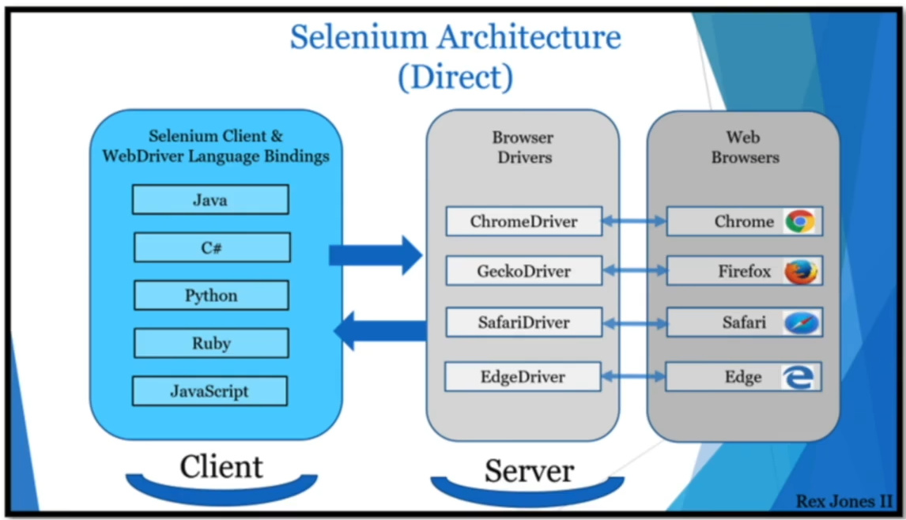
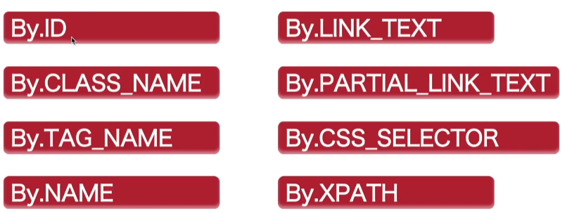
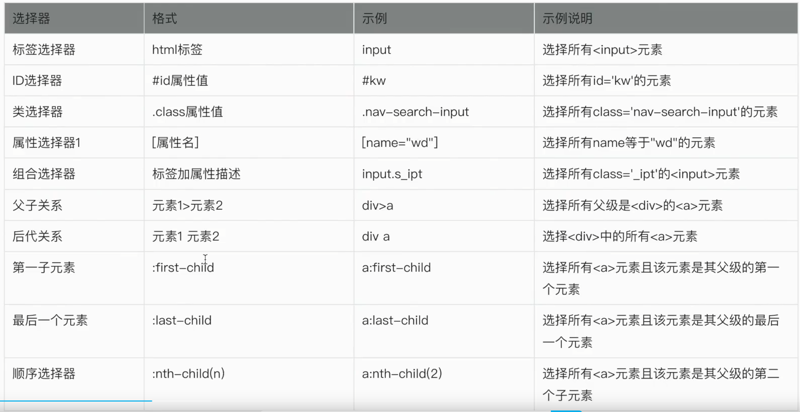
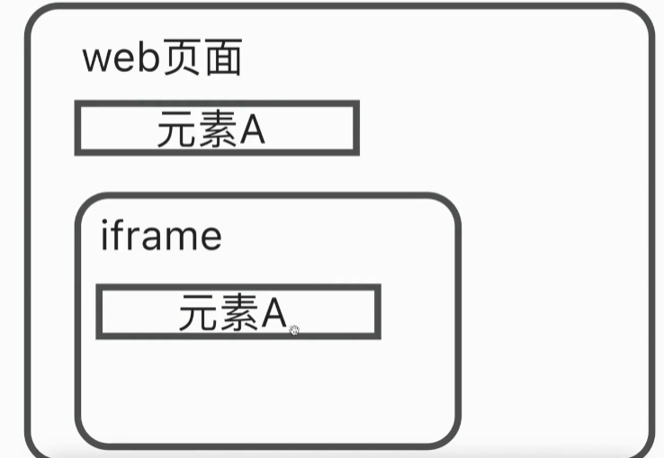

## 环境配置

下载chrome浏览器对应版本的chromedriver，并将其放在python环境的目录中。如将`chromedriver.exe`放到`.\Python39`中

## 环境引入

```python
from selenium import webdriver
from selenium.webdriver.common.by import By
```

## 代码示例

```python
#初始化实例
driver = webdriver.Chrome()

#根据url打开网页
driver.get("https://www.bilibili.com")

#找到输入框元素，并输入英雄联盟
driver.find_element(By.CLASS_NAME, "nav-search-input").send_keys("英雄联盟")

#关闭浏览器
driver.close()
```

## 源码分析



编程语言的客户端发送一个http请求发送个Server，也就是`Chromedriver。exe`。然后它会对浏览器做出相应操作。

## 元素定位



### ID元素定位

id在html中是唯一的，因此使用id定位可以确保找到页面上唯一的元素，提高了定位的效率

```python
driver = webdriver.Chrome()
driver.maximize_window()#窗口最大化
driver.get("https://www.baidu.com")
element = driver.find_element(By.ID, "kw")
element.send_keys("lol")
driver.find_element(By.ID, "su").click()
```

### CLASS_NAME定位

当有多个相同名字的CLASS时，他会选择第一个。

如果想同时定位多个，则使用`driver.find_elements()`

```python
driver = webdriver.Chrome()
driver.maximize_window()#窗口最大化
driver.get("https://www.bilibili.com")
elements = driver.find_elements(By.CLASS_NAME, "channel-link")#此时的elements为一个数组
```

 当一个元素同时有多个CLASS时，则无法使用

### TAG_NAME定位

```python
driver = webdriver.Chrome()

driver.get("https://www.bilibili.com")
driver.find_element(By.TAG_NAME, "input").send_keys("lol")
```

当有多个元素时，同上

### NAME定位

name属性一般在表单元素中

### LINK_TEXT定位

可点击链接定位

### PARTIAL_LINK_TEXT定位

部分包含即可。比如`新闻`用LINK_TEXT，则只有完全匹配才能够定位。而PARTIAL_LINK_TEXT则进行部分匹配

### CSS_SELECTOR定位

 

- 根据id定位，加一个#

```python
driver = webdriver.Chrome()
driver.maximize_window()
driver.get("https://www.baidu.com")
driver.find_element(By.CSS_SELECTOR, "#kw").send_keys("selenium")
driver.find_element(By.CSS_SELECTOR, "#su").click
```

- 根据class属性值定位，加一个.

  ```python
  driver = webdriver.Chrome()
  driver.maximize_window()
  driver.get("https://www.bilibili.com")
  driver.find_element(By.CSS_SELECTOR, ".nav-search-input").send_keys("selenium")
  ```

- 根据name定位

  ```python
  driver = webdriver.Chrome()
  driver.maximize_window()
  driver.get("https://www.baidu.com")
  driver.find_element(By.CSS_SELECTOR, '[name="wd"]').send_keys("selenium")
  ```

- 根据标签属性定位

  ```python
  driver = webdriver.Chrome()
  driver.maximize_window()
  driver.get("https://www.baidu.com")
  driver.find_element(By.CSS_SELECTOR, 'a[href="http://image.baidu.com/"]').click()
  driver.find_element(By.CSS_SELECTOR, 'a[href*="http://image.baidu.com/"]').click()#模糊查询
  driver.find_element(By.CSS_SELECTOR, 'a[href^="http://image.baidu"]').click()#开头精准匹配，后面模糊匹配
  driver.find_element(By.CSS_SELECTOR, 'a[href$="baidu.com/"]').click()#精准匹配尾部
  
  #组合定位
  driver.find_element(By.CSS_SELECTOR, 'input.s_ipt').click()#根据标签和class进行匹配
  ```

- 根据父子关系定位

  ```python
  driver = webdriver.Chrome()
  driver.maximize_window()
  driver.get("https://www.baidu.com")
  driver.find_element(By.CSS_SELECTOR, 'div>a').click()#带尖括号，只会定位到儿子
  driver.find_element(By.CSS_SELECTOR, 'div>a').click()#不带尖括号，会定位到所有子元素
  driver.find_element(By.CSS_SELECTOR, 'div#s-top-left>a').click()#只定位id为s-top-left的div
  driver.find_element(By.CSS_SELECTOR, 'div#s-top-left>a:first-child').click()#只选择第一个子节点
  driver.find_element(By.CSS_SELECTOR, 'div#s-top-left>a:nth-child(7)').click()#定位第n个子节点
  driver.find_element(By.CSS_SELECTOR, 'div.s-top-left-new.s-isindex-wrap>a:first-child').click()#有多个class用多个.连接
  ```

### XPATH定位

xpath是一门在xml文档中查找信息的语言

```python
driver = webdriver.Chrome()
driver.maximize_window()
driver.get("https://www.baidu.com")
driver.find_element(By.CSS_SELECTOR, '/html/body/div/div/div[3]/a').click()#绝对路径定位

driver.find_element(By.CSS_SELECTOR, '//input[@id="kw"]').click()#相对组合定位
driver.find_element(By.CSS_SELECTOR, '//input[@class="s_ipt"]').click()#相对组合定位
driver.find_element(By.CSS_SELECTOR, '//input[@class="s_ipt" and @name="wd" and @autocomplete="off"]').click()#相对组合定位

driver.find_element(By.CSS_SELECTOR, '//span[text()="重庆医院"]').click()#文本相等定位
driver.find_element(By.CSS_SELECTOR, '//span[contains(text(), "重庆医院")]').click()#文本包含定位
```

## iframe框架切换

iframe是一个内联框架，是在页面里生成一个内部框架。可以嵌套多个html页面。



