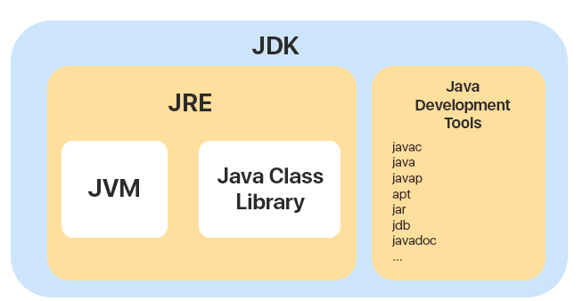
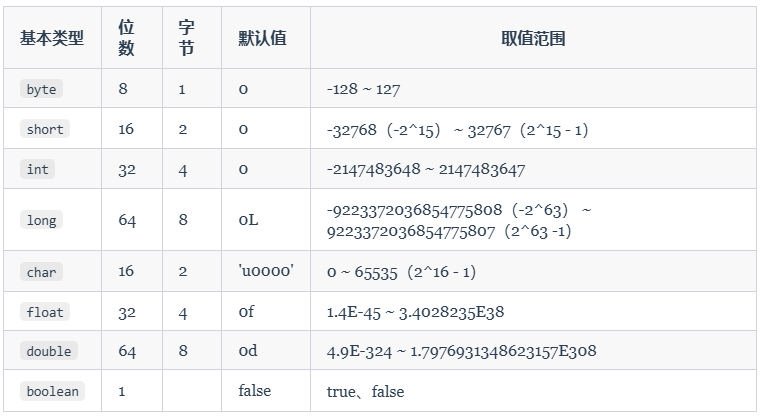

- String，StringBuilder，StringBuffer的区别

  三者在java中都是用来存储和操作字符串的，但是他们在性能和使用场景上有所不同。

  String是不可变的，这是因为String的实现中，使用了一个final数组。而另外两个是可变的

  他们可以插入，删除，修改，当数组容量不足时还会自动扩容

  StringBuilder是线程不安全的，而StringBuffer是线程安全的

- 哈希冲突的解决方法

  拉链法和开放寻址法

  可以从408笔记里再看看

- HashMap的底层原理

  由一个Entry数组和一些链表组成。每个Entry里都存储了键值对。当我们向HashMap中添加键值对时，首先会计算键的哈希值，然后使用这个哈希值来决定键值对存储在数组的哪个位置。如果这个位置已经有元素，则将其添加到链表末尾。

  当键值对的数量超过数组长度和加载因子的积时，就会进行扩容。扩容后的数组长度会是原来的两倍，扩容操作会重新计算每个键的哈希值，放到新的位置上

- 如果有100个键值对，怎么确定hashmap的值，并保证不扩容

  确定负载因子后，用100除以负载因子。由于hashmap的大小总是2的n次方，所以向上取整

# Java语言

1. java语言有哪些特点

   - 面向对象

     - 封装
     - 继承
     - 多态

   - 平台无关性

     Java 虚拟机实现平台无关性

2. JavaSE和JavaEE

   - JavaSE

     Java Platform，Standard Edition：Java 平台标准版，Java 编程语言的基础

   - JavaEE

     Java Platform, Enterprise Edition：Java 平台企业版，建立在 Java SE 的基础上，包含了支持企业级应用程序开发和部署的标准和规范（比如 Servlet、JDBC、JPA、JTA、JavaMail、JMS）。 

   - Java ME

     Java Platform，Micro Edition：Java ME 是 Java 的微型版本，主要用于开发嵌入式消费电子设备的应用程序。现在已经用不上了。

3. JVM vs JDK vs JRE

   - JVM

     Java虚拟机，是运行Java字节码的虚拟机。JVM 有针对不同系统的特定实现，目的是使用相同的字节码，它们都会给出相同的结果。字节码和不同系统的 JVM 实现是 Java 语言“一次编译，随处可以运行”的关键所在。

   - JDK

     它是功能齐全的 Java SDK，是提供给开发者使用，能够创建和编译 Java 程序的开发套件。它包含了 JRE，同时还包含了编译 java 源码的编译器 javac 以及一些其他工具比如 javadoc（文档注释工具）、jdb（调试器）、jconsole（基于 JMX 的可视化监控⼯具）、javap（反编译工具）等等。

   - JRE

     是 Java 运行时环境。它是运行已编译 Java 程序所需的所有内容的集合，主要包括 Java 虚拟机（JVM）、Java 基础类库（Class Library）。

   - JRE 是 Java 运行时环境，仅包含 Java 应用程序的运行时环境和必要的类库。而 JDK 则包含了 JRE，同时还包括了 javac、javadoc、jdb、jconsole、javap 等工具，可以用于 Java 应用程序的开发和调试。如果需要进行 Java 编程工作，比如编写和编译 Java 程序、使用 Java API 文档等，就需要安装 JDK。

     

4. 什么是字节码

   JVM 可以理解的代码就叫做字节码，即扩展名为 `.class` 的文件。它不面向任何特定的处理器，只面向虚拟机。Java 语言通过字节码的方式，在一定程度上解决了传统解释型语言执行效率低的问题，同时又保留了解释型语言可移植的特点。而且，由于字节码并不针对一种特定的机器，因此，Java 程序无须重新编译便可在多种不同操作系统的计算机上运行。

5. Java的解释与编译并存

   **编译型**：[编译型语言open in new window](https://zh.wikipedia.org/wiki/編譯語言) 会通过[编译器open in new window](https://zh.wikipedia.org/wiki/編譯器)将源代码一次性翻译成可被该平台执行的机器码。一般情况下，编译语言的执行速度比较快，开发效率比较低。常见的编译性语言有 C、C++、Go、Rust 等等。

   **解释型**：[解释型语言open in new window](https://zh.wikipedia.org/wiki/直譯語言)会通过[解释器open in new window](https://zh.wikipedia.org/wiki/直譯器)一句一句的将代码解释（interpret）为机器代码后再执行。解释型语言开发效率比较快，执行速度比较慢。常见的解释性语言有 Python、JavaScript、PHP 等等。

   Java 语言既具有编译型语言的特征，也具有解释型语言的特征。因为 Java 程序要经过先编译，后解释两个步骤，由 Java 编写的程序需要先经过编译步骤，生成字节码（`.class` 文件），这种字节码必须由 Java 解释器来解释执行。

6. AOT有什么优点

   JDK 9 引入了一种新的编译模式 **AOT(Ahead of Time Compilation)** 。和 JIT 不同的是，这种编译模式会在程序被执行前就将其编译成机器码，属于静态编译。AOT 避免了 JIT 预热等各方面的开销，可以提高 Java 程序的启动速度，避免预热时间长。并且，AOT 还能减少内存占用和增强 Java 程序的安全性，特别适合云原生场景。

    AOT 更适合当下的云原生场景，对微服务架构的支持也比较友好。除此之外，AOT 编译无法支持 Java 的一些动态特性，如反射、动态代理、动态加载、JNI（Java Native Interface）等。

7. Java和c++的区别

   虽然，Java 和 C++ 都是面向对象的语言，都支持封装、继承和多态，但是，它们还是有挺多不相同的地方：

   - Java 不提供指针来直接访问内存，程序内存更加安全
   - Java 的类是单继承的，C++ 支持多重继承；虽然 Java 的类不可以多继承，但是接口可以多继承。
   - Java 有自动内存管理垃圾回收机制(GC)，不需要程序员手动释放无用内存。
   - C ++同时支持方法重载和操作符重载，但是 Java 只支持方法重载（操作符重载增加了复杂性，这与 Java 最初的设计思想不符）。

8. 标识符和关键字

   - 标识符

     就是一个名字，可以是变量名、方法名、类名等等

   - 关键字

     有一些标识符，Java 语言已经赋予了其特殊的含义，只能用于特定的地方，这些特殊的标识符就是关键字

9. 移位运算符

   在 Java 代码里使用 `<<`、 `>>` 和`>>>`转换成的指令码运行起来会更高效些。

   - `<<` :左移运算符，向左移若干位，高位丢弃，低位补零。`x << 1`,相当于 x 乘以 2(不溢出的情况下)。
   - `>>` :带符号右移，向右移若干位，高位补符号位，低位丢弃。正数高位补 0,负数高位补 1。`x >> 1`,相当于 x 除以 2。
   - `>>>` :无符号右移，忽略符号位，空位都以 0 补齐。

   移位操作符实际上支持的类型只有`int`和`long`，编译器在对`short`、`byte`、`char`类型进行移位前，都会将其转换为`int`类型再操作。

   - 移位的位数超过数值所占有的位数

     当 int 类型左移/右移位数大于等于 32 位操作时，会先求余（%）后再进行左移/右移操作。也就是说左移/右移 32 位相当于不进行移位操作（32%32=0），左移/右移 42 位相当于左移/右移 10 位（42%32=10）。当 long 类型进行左移/右移操作时，由于 long 对应的二进制是 64 位，因此求余操作的基数也变成了 64。

     也就是说：`x<<42`等同于`x<<10`，`x>>42`等同于`x>>10`，`x >>>42`等同于`x >>> 10`。

10. Java的8种基本数据类型

    - 整型

      int long short

    - 布尔型

      boolean

    - 浮点型

      float double

    - 字节型

      byte

    - 字符型

      char

    - 

    - 对于 `boolean`，官方文档未明确定义，它依赖于 JVM 厂商的具体实现。逻辑上理解是占用 1 位，但是实际中会考虑计算机高效存储因素。

11. 基本类型和包装类的区别，为什么需要包装类

    - 用途

      除了定义一些常量和局部变量之外，我们在其他地方比如方法参数、对象属性中很少会使用基本类型来定义变量。并且，包装类型可用于泛型，而基本类型不可以。

    - 存储方式

      基本数据类型的局部变量存放在 Java 虚拟机栈中的局部变量表中，基本数据类型的成员变量（未被 `static` 修饰 ）存放在 Java 虚拟机的堆中。包装类型属于对象类型，我们知道几乎所有对象实例都存在于堆中。

    - 占用空间

      相比于包装类型（对象类型）， 基本数据类型占用的空间往往非常小。

    - 默认值

      成员变量包装类型不赋值就是 `null` ，而基本类型有默认值且不是 `null`。

    - 比较方式

      对于基本数据类型来说，`==` 比较的是值。对于包装数据类型来说，`==` 比较的是对象的内存地址。所有整型包装类对象之间值的比较，全部使用 `equals()` 方法。

    基本数据类型的存储位置取决于它们的作用域和声明方式。如果它们是局部变量，那么它们会存放在栈中；如果它们是成员变量，那么它们会存放在堆中。

12. 包装类型的缓存机制

    `Byte`,`Short`,`Integer`,`Long` 这 4 种包装类默认创建了数值 **[-128，127]** 的相应类型的缓存数据，`Character` 创建了数值在 **[0,127]** 范围的缓存数据，`Boolean` 直接返回 `True` or `False`。

    如果超出对应范围仍然会去创建新的对象，缓存的范围区间的大小只是在性能和资源之间的权衡。

    两种浮点数类型的包装类 `Float`,`Double` 并没有实现缓存机制。

13. 自动装箱拆箱

    - 装箱：将基本类型用它们对应的引用类型包装起来；

    - 拆箱：将包装类型转换为基本数据类型

    - 装箱其实就是调用了 包装类的`valueOf()`方法，拆箱其实就是调用了 `xxxValue()`方法。

    - 因此，

      - `Integer i = 10` 等价于 `Integer i = Integer.valueOf(10)`
      - `int n = i` 等价于 `int n = i.intValue()`;

      注意：如果频繁拆装箱的话，也会严重影响系统的性能。我们应该尽量避免不必要的拆装箱操作。

14. 为什么浮点数会损失精度

    计算机在表示一个数字时，宽度是有限的，无限循环的小数存储在计算机时，只能被截断，所以就会导致小数精度发生损失的情况。

15. 如何解决浮点数精度丢失的问题

    `BigDecimal` 可以实现对浮点数的运算，不会造成精度丢失。通常情况下，大部分需要浮点数精确运算结果的业务场景（比如涉及到钱的场景）都是通过 `BigDecimal` 来做的。

16. 超过long的整数如何处理

    `BigInteger` 内部使用 `int[]` 数组来存储任意大小的整形数据。

17. 成员变量与局部变量的区别

    