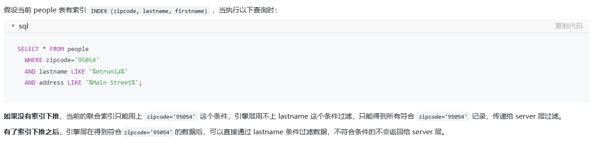

## 1.数据排序怎么实现的

首先，这个有2种情况，如果排序字段有索引的话，那么会利用索引排序。因为索引字段就是有序的

如果没有索引的话，则会使用`filesort`文件排序。意思就是需要主动进行排序，他会将数据读取到内存中，在`sort_buffer`中进行排序。如果数据大小没有超过`sort_buffer_size`，那么就在内存中完成排序，如果数据超过了buffer的大小，就需要用到一些外部排序算法，这时候排序效率就比较低了。

这里还需要注意的是`sort_buffer`中还有一个参数是`max_length_for_sort_data`，具体名字我记不太清了，就是表中单行的数据的最大值，默认为4096。如果单行数据大小超过了这个值，那么他排序的时候只会将排序字段和主键字段进行排序，排序完成后再通过主键字段做回表查询得到结果数据。等于是进行了两次查询。而如果表中单行数据没有超过这个最大值，就会将`select`的字段都放到`sort_buffer`中一起排序，这样就只需要查询一次了。


这样我们可以得出一些关于`ORDER BY`的查询优化：

1. 根据排序字段建立合适的索引，多字段排序时也会遵循最左前缀原则
2. 尽量使用覆盖索引
3. 多字段排序时，如果有升序降序，需要注意建立索引时的升序降序
4. 如果不可避免地要出现文件排序，可以适当增大`sort_buffer`的大小，MySQL默认为256kB

## 2.ChangeBuffer是什么，有什么作用

ChangeBuffer是MySQL InnoDB存储引擎的一个机制，他是用来存储对二级索引的插入和更新操作的变更，而不立即执行这些操作。当时机合适时，比如页被读取或者执行flush操作时，会将这些变更写入到二级索引。

比如说我们修改了一个有二级索引的字段的值，此时这个二级索引页是不在buffer pool中的。那么此时mysql不会立即执行这个修改，而是会将这个修改操作写入到changeBuffer中，当读取到这条数据时，会将**索引页**（不是数据页）加载到buffer pool中，这是才会进行change buffer中的修改操作。

这样可以减少对硬盘的访问次数，修改操作可以在二级索引读入时批量进行。

change buffer的大小可以通过`innodb_change_buffer_max_size`进行配置，最大值为buffer pool的25%大小。过大可能会导致内存不足。因为change buffer过大意味着他能写入更多的操作，也意味着存数据的缓冲区变小了，所以过大也会影响性能。


只适用于二级索引的更改。不适合主键索引、空间索引、全文索引和唯一索引

- 主键索引：主键索引都是聚簇索引，是和数据存在一起的

- 唯一索引：唯一索引是用来检查数据一致性的

  必须实时更新来检查数据唯一性，不能延迟

此外，change buffer也会进行持久化存储，写到硬盘上，因此也不需要担心数据库挂了丢失数据

优化：

1. 当内存足够大，或者二级索引很少，是可以关闭change buffer的，因为他也增加了复杂度
2. 如果所有的更新操作后都伴随着对这个值的查询，那么应该关闭它

## 3.详细描述一条SQL语句在MySQL中的执行过程

1. 首先会通过连接器校验权限
2. 然后利用分析器进行SQL语句的词法和语法分析，建立解析树
3. 之后会用优化器选择合适的索引和表连接顺序，给出一个最佳的执行计划
4. 最后会用执行器，执行操作查询数据，并将结果返回给客户端

## 4.存储引擎有哪些，它们之间有什么区别

1. InnoDB
   - 支持事务、行级锁和外键
   - 高并发性能，适用于高负载的OLTP应用
   - 数据以聚簇索引的形式存储
2. MyISAM
   - 不支持事务和外键，使用表级锁
   - 具有较高的读取性能和表级锁定
3. MEMORY
   - 数据存储在内存中，速度快
   - 适用于临时存储，缓存等

## 5.索引类型有哪些

1. 普通索引

   二级索引

2. 主键索引

3. 联合索引

   遵循最左前缀匹配原则使用联合索引

4. 唯一索引

   索引值必须唯一，但是允许为NULL。建立该索引的目的大多数时候是为了该字段的唯一性而不是查询效率

按照索引的结构还可以分成：

1. B+树索引

2. 哈希索引

   不支持范围查找

3. 全文索引（倒排索引）

   为了快速检索大文本数据中的关键字信息，类似于搜索引擎

4. 空间索引（R-树索引）

   处理空间数据，比如地理位置，几何形状等

## 6.聚簇索引和非聚簇索引的区别

聚簇索引通常为主键索引，他是和数据存放在一起的。也就是说聚簇索引的叶子节点存放的就是整行的数据，可以访问完整的数据

而非聚簇索引的叶子节点存储的是索引数据和主键数据，如果需要访问其他字段可以通过主键数据进行二次查询

## 7.索引的最左前缀匹配原则是什么

在使用联合索引时，查询条件需要从索引的最左侧开始匹配。查询条件必须包含索引第一列、第二列。。。

因为联合索引在B+树中是一个多次排序，如果第一个索引值相同再排第二个

查询优化：

1. 如果碰上 >、<，会使索引失效，因为此时经过第一个索引的筛查后剩下的数据是无序的，无法使用索引

2. 如果遇上 >=、<=、BETWEEN、前缀like的范围查询，不会停止匹配。因为这些查询包含一个等值判断，可以直接定位到某个数据。

   ```sql
   where a>=1 and b=2 and c=3;
   ```

   查询可以定位到 a=1这条数据，然后往后遍历即可。而在a=1数据内，b和c是有序的，可以利用索引查询

## 8. 数据库的脏读、幻读、不可重复读是什么

- 脏读

  一个事务读取到了另一个事务未提交的数据。如果该数据被回滚，那么第一个事务读取到的数据就是不一致的

- 不可重复读

  一个事务读取到了另一个事务提交前的数据。比如事务A读取了一个数据，事务B修改了这个数据并且提交，就会导致事务A再都这个数据是出现不一样的值

- 幻读

  同一个事务中，执行相同的查询操作，返回的结果集由于其他事务的插入而发生变化。

### 不可重复读和幻读的区别

不可重复读针对的是一条数据，而幻读则说明的是数据总量的突然增加或减少

## 9. 覆盖索引是什么

二级索引中包含了查询所需的所有字段，从而使查询可以仅通过二级索引而不需要访问实际的表数据

## 10. 索引下推是什么

一种减少回表查询，提高查询效率的技术。

允许使用索引查找数据时，将部分查询条件下推到存储引擎过滤，从而减少需要从表中读取的数据行，减少了I/O

就是本该由Server层做操作，交由存储引擎

索引下推是应用在联合索引上的



## 11. 回表是什么

在使用二级索引时无法查询到其他数据，而用主键去聚簇索引中查找实际的数据行，这个过程叫做回表

## 12. 索引一定有效吗，如何排查索引效果

索引不一定有效

使用explain

