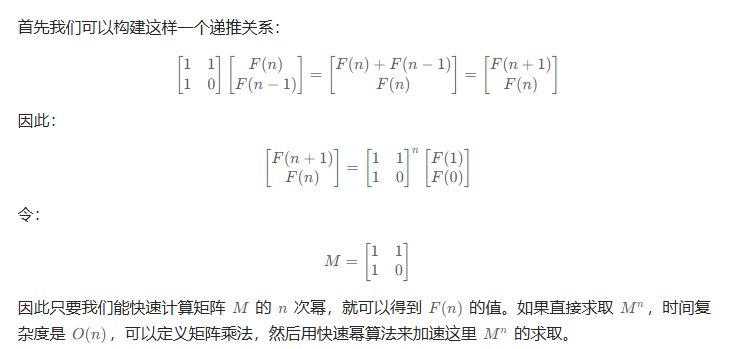

# 斐波那契数列

[509. 斐波那契数 - 力扣（LeetCode）](https://leetcode.cn/problems/fibonacci-number/description/)

[70. 爬楼梯 - 力扣（LeetCode）](https://leetcode.cn/problems/climbing-stairs/description/)

## 方法一：递归

```java
class Solution {
    public int fib(int n) {
        if(n == 1 || n == 0) return n;
        return fib(n - 1) + fib(n - 2);
    }
}
```

## 方法二：非递归

```java
class Solution {
    public int fib(int n) {
        if(n == 0 || n == 1) return n;
        int f0 = 0, f1 = 1;
        for(int i = 2; i <= n; ++i){
            int temp = f0;
            f0 = f1;
            f1 = f1 + temp;
        }
        return f1;
    }
}
```

## 方法三：矩阵快速幂



```java
class Solution {
    public int fib(int n) {
        if (n < 2) {
            return n;
        }
        int[][] q = {{1, 1}, {1, 0}};
        int[][] res = pow(q, n - 1);
        return res[0][0];
    }

    public int[][] pow(int[][] a, int n) {
        int[][] ret = {{1, 0}, {0, 1}};
        while (n > 0) {
            if ((n & 1) == 1) {
                ret = multiply(ret, a);
            }
            n >>= 1;
            a = multiply(a, a);
        }
        return ret;
    }

    public int[][] multiply(int[][] a, int[][] b) {
        int[][] c = new int[2][2];
        for (int i = 0; i < 2; i++) {
            for (int j = 0; j < 2; j++) {
                c[i][j] = a[i][0] * b[0][j] + a[i][1] * b[1][j];
            }
        }
        return c;
    }
}
```

