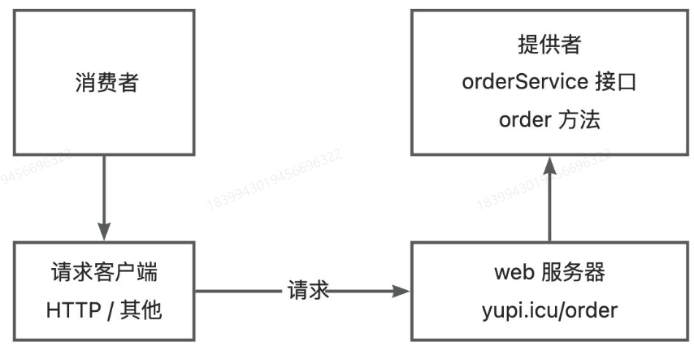
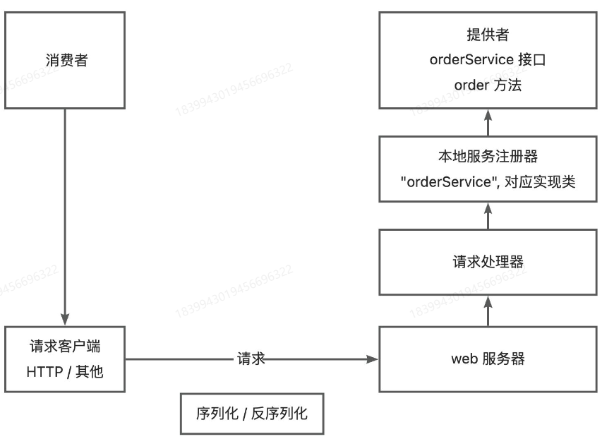
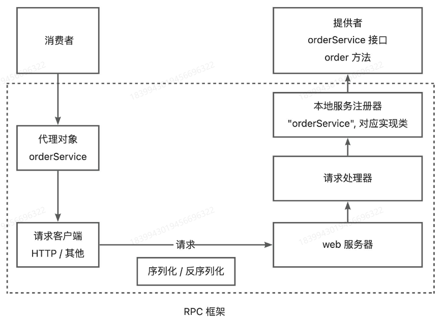
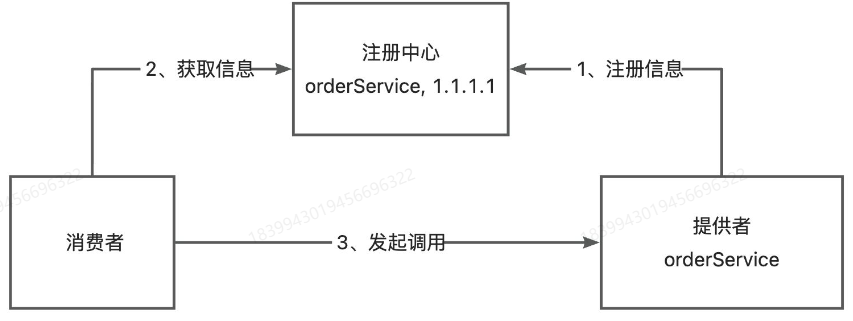
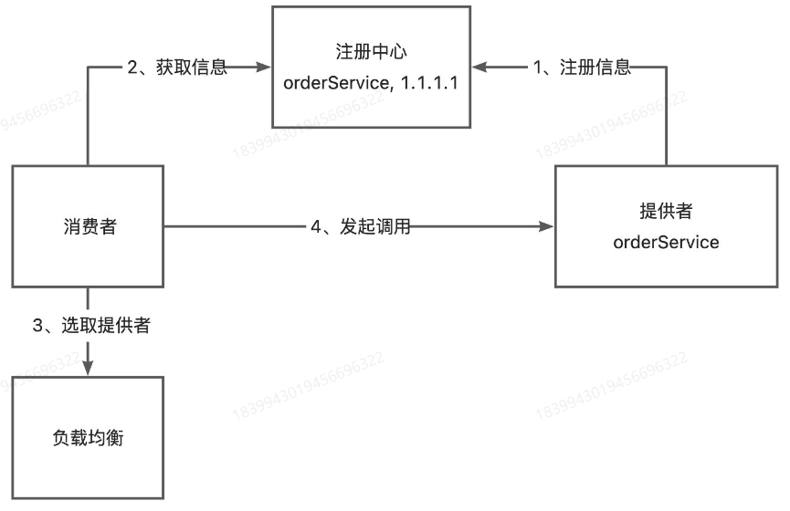
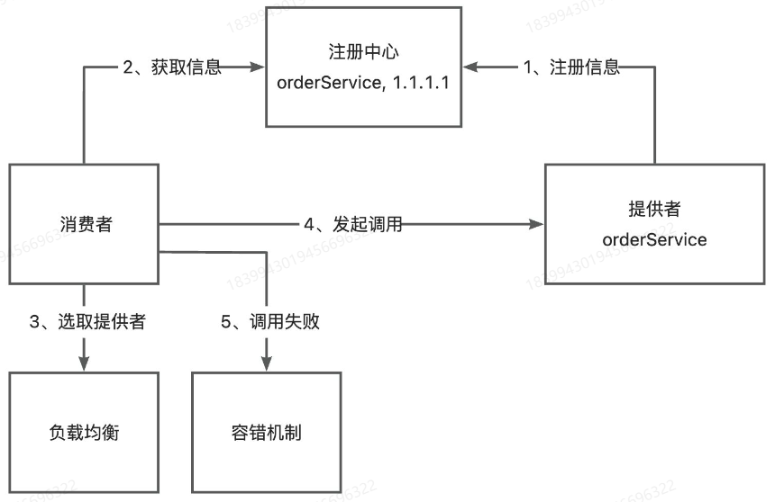

# 一、什么是RPC

## 1.1 什么是RPC

`RPC`，远程过程调用。一种计算机的通信协议，允许程序在不同的计算机之间进行通信和交互，就像在本地调用一样。

## 1.2 为什么需要rpc

`RPC`允许一个程序（服务消费者）像调用自己的方法一样，调用另一个程序（服务提供者）的接口，而不需要了解数据的传输处理方式、底层网络通信等细节。

举个例子，项目A提供了点餐服务，项目B需要用这个点餐来完成下单。

```java
interface OrderService {
    // 点餐，返回 orderId
    long order(参数1, 参数2, 参数3);
}
```

如果没有`RPC`框架，项目B要怎么调用这个方法呢？

由于A和B都是独立的项目，不能像SDK那样通过依赖引入。因此就需要项目A提供`web`服务，并且编写一个点餐服务的暴露接口，比如访问地址`http://golfar.xyz/order`就能调用点餐服务；项目B则需要自己构造请求，通过`HttpClient`请求这个地址。

```Java
url = "http://golfar.xyz/order"
req = new Req(参数1, 参数2, 参数3)
res = httpClient.post(url).body(req).execute()
orderId = res.data.orderId
```

而假如我们有了`RPC`框架，接口暴露以及请求接口就都可以交给`RPC`负责，项目B再调用这个方法只需要一行代码。

```java
orderId = orderService.order(参数1, 参数2, 参数3)
```

看起来就像调用自己的方法一样。

# 二、RPC框架的实现思路

## 2.1 基本设计



由上面的分析可知，在没有`RPC`框架时想要调用远程方法，需要经过上图的步骤。

但如果提供者提供了多个服务和方法呢？我们需要为每个方法都单独写一个接口吗？

我们可以提供一个统一的服务调用接口，通过`请求处理器`根据客户端的请求参数来进行不同的处理、调用不同的服务方法。

同时，我们还可以在服务提供者程序维护一个`本地服务注册器`，记录服务和对应实现类的映射。

*Java对象想要在网络中进行传输，需要实现`序列化`和`反序列化`接口*



为了简化消费者发请求的代码，实现类似于本地的方法调用，可以基于代理模式，为消费者要调用的接口生成一个代理对象， 由代理对象完成请求和响应的过程，而这个代理，就是`RPC`框架。



## 2.2 扩展设计

### 2.2.1 服务注册发现

消费者如何知道提供者的调用地址？

由提供者来填写它自己的地址，通过一个平台来维护。

因此，我们需要一个`注册中心`，来保存提供者的地址。消费者要调用服务时，只需要从`注册中心`中获取对应服务的提供者的地址。



一般会使用一些第三方注册中心，比如Redis、Zookeeper等。

### 2.2.2 负载均衡

如果同一个服务有多个服务提供者，那么消费者应该选择哪个提供者呢？

给消费者增加负载均衡能力，通过指定不同的负载均衡算法来决定调用哪一个服务提供者，比如轮询、随机、根据性能动态调整等。



### 2.2.3 容错机制

如果服务调用失败，应该如何处理？

为了保证分布式系统的高可用性，通常会给服务的调用增加一定的容错机制。比如失败重试、降级、熔断等。



### 2.2.4 其他

- 服务提供者下线了怎么办？

  需要一个失效节点剔除机制。

- 服务消费者每次都从注册中心拉取信息，性能会不会很差？

  使用缓存来优化性能。

- 如何优化整个`RPC`框架的传输通讯能力？

  选择合适的网络框架、自定义协议头、节省传输体积等。

- 如何让整个项目更利于扩展？

  使用Java的`SPI`机制，或者使用配置化等。

# 三、开发一个简易的RPC

## 3.1 项目准备

### 3.1.1 项目初始化

首先创建一个项目根目录`MyRPC`，然后创建几个子模块。

- `common`

  公共依赖，包括接口、Model等。

- `consumer`

  服务消费者。

- `provider`

  服务提供者。

- `easy-rpc`

  简易的`RPC`框架。

### 3.1.2 公共模块

公共模块需要同时被消费者和提供者引入，主要编写和服务相关的接口和实体类。

1）引入`lombok`和`hutool`依赖

```xml
<!-- https://mvnrepository.com/artifact/org.projectlombok/lombok -->
<dependency>
    <groupId>org.projectlombok</groupId>
    <artifactId>lombok</artifactId>
    <version>1.18.24</version>
    <scope>provided</scope>
</dependency>
<!-- https://doc.hutool.cn/ -->
<dependency>
    <groupId>cn.hutool</groupId>
    <artifactId>hutool-all</artifactId>
    <version>5.8.16</version>
</dependency>
```

2）编写`User`实体类

```java
package com.my.common.model;

import lombok.Data;

import java.io.Serializable;

/**
 * @author : golfar
 * @project : MyRPC
 * @description : 用户实体类
 * @date : 2024-11-14 16:13
 **/
@Data
public class User implements Serializable {

    private String name;

}
```

注意，实体类需要实现序列化，为后续网络传输提供序列化支持。

3）编写用户服务接口`UserService`，提供一个获取用户的方法

```java
package com.my.common.service;

import com.my.common.model.User;

/**
 * @author : golfar
 * @project : MyRPC
 * @description : 用户服务接口
 * @date : 2024-11-14 16:15
 **/
public interface UserService {

    /**
     * 获取用户
     *
     * @param user
     * @return
     */
    User getUser(User user);
}
```

### 3.1.3 服务提供者

1）引入`common`和`easy-rpc`依赖

```xml
<dependency>
    <groupId>com.my.rpc</groupId>
    <artifactId>easy-rpc</artifactId>
    <version>1.0-SNAPSHOT</version>
</dependency>
<dependency>
    <groupId>com.my.rpc</groupId>
    <artifactId>common</artifactId>
    <version>1.0-SNAPSHOT</version>
</dependency>
```

2）编写服务实现类，实现公共模块中定义的用户服务接口

功能是打印用户的名称，并且放回参数中的`User`对象。

```java
package com.my.provider.service.impl;

import com.my.common.model.User;
import com.my.common.service.UserService;

/**
 * @author : golfar
 * @project : MyRPC
 * @description : 用户服务实现类
 * @date : 2024-11-14 17:06
 **/
public class UserServiceImpl implements UserService {
    @Override
    public User getUser(User user) {
        System.out.println(user.getName());
        return user;
    }
}
```

3）编写服务提供者启动类`EasyProvide`，之后会在该类的方法中编写提供服务的代码

```java
package com.my.provider;

/**
 * @author : golfar
 * @project : MyRPC
 * @description : 服务提供者启动类
 * @date : 2024-11-14 17:09
 **/
public class EasyProvider {
    public static void main(String[] args) {
        // 提供服务
    }
}
```

### 3.1.4 服务消费者

1）引入`common`和`easy-rpc`依赖

```xml
<dependency>
    <groupId>com.my.rpc</groupId>
    <artifactId>easy-rpc</artifactId>
    <version>1.0-SNAPSHOT</version>
</dependency>
<dependency>
    <groupId>com.my.rpc</groupId>
    <artifactId>common</artifactId>
    <version>1.0-SNAPSHOT</version>
</dependency>
```

2）创建服务消费者启动类`EasyConsumer`，编写调用接口的代码

```java
import com.my.common.model.User;
import com.my.common.service.UserService;

/**
 * @author : golfar
 * @project : MyRPC
 * @description : 服务消费者启动类
 * @date : 2024-11-14 17:11
 **/
public class EasyConsumer {
    
    public static void main(String[] args) {
        // todo 需要获取 UserService 的实现类对象
        UserService userService = null;
        User user = new User();
        user.setName("golfar");
        // 调用
        User newUser = userService.getUser(user);
        if (newUser != null) {
            System.out.println(newUser.getName());
        } else {
            System.out.println("user == null");
        }
    }

}
```

需要注意的是，目前该方法并不能成功调用。因为目前是无法获取到`userService`实例的。我们的目标就是通过`easy-rpc`框架，快速得到一个支持远程调用服务提供者的代理对象，像调用本地方法一样调用`UserService`方法。

## 3.2 web服务器

我们需要让服务提供者提供一个可远程访问的`web`服务器，能够接受并处理请求，并返回响应。

本项目使用`Vert.x`作为`RPC`框架的服务器。

`Vert.x`官方文档：https://vertx.io

1）引入`Vert.x`和工具类依赖

```xml
<!-- https://mvnrepository.com/artifact/io.vertx/vertx-core -->
<dependency>
    <groupId>io.vertx</groupId>
    <artifactId>vertx-core</artifactId>
    <version>4.5.1</version>
</dependency>
<!-- https://doc.hutool.cn/ -->
<dependency>
    <groupId>cn.hutool</groupId>
    <artifactId>hutool-all</artifactId>
    <version>5.8.16</version>
</dependency>
<!-- https://projectlombok.org/ -->
<dependency>
    <groupId>org.projectlombok</groupId>
    <artifactId>lombok</artifactId>
    <version>1.18.24</version>
    <scope>provided</scope>
</dependency>
```

2）编写一个`web`服务器接口`HttpServer`，定义统一的服务器启动方法，便于后续的扩展

```java
package com.my.easyrpc.servier;

/**
 * @author : golfar
 * @project : MyRPC
 * @description : http服务器启动接口
 * @date : 2024-11-14 17:25
 **/
public interface HttpServer {

        /**
         * 启动服务器
         *
         * @param port
         */
        void doStart(int port);
}
```

3）基于`Vert.x`实现服务器`VertxHttpServer`，能够监听指定端口并处理请求

```java
package com.my.easyrpc.servier.impl;

import com.my.easyrpc.servier.HttpServer;
import io.vertx.core.Vertx;

/**
 * @author : golfar
 * @project : MyRPC
 * @description : Vert.x服务器实现类
 * @date : 2024-11-14 17:27
 **/
public class VertxHttpServer implements HttpServer {
    @Override
    public void doStart(int port) {
        // 创建 Vert.x 实例
        Vertx vertx = Vertx.vertx();

        // 创建 HTTP 服务器
        io.vertx.core.http.HttpServer server = vertx.createHttpServer();

        // 监听端口并处理请求
        server.requestHandler(request -> {
            // 处理 HTTP 请求
            System.out.println("Received request: " + request.method() + " " + request.uri());

            // 发送 HTTP 响应
            request.response()
                    .putHeader("content-type", "text/plain")
                    .end("Hello from Vert.x HTTP server!");
        });

        // 启动 HTTP 服务器并监听指定端口
        server.listen(port, result -> {
            if (result.succeeded()) {
                System.out.println("Server is now listening on port " + port);
            } else {
                System.err.println("Failed to start server: " + result.cause());
            }
        });
    }
}
```

4）验证`web`服务器能否启动成功并接受请求

修改`EasyProvider`类，编写启动`web`服务的代码

```java
package com.my.provider;

import com.my.easyrpc.servier.impl.VertxHttpServer;

/**
 * @author : golfar
 * @project : MyRPC
 * @description : 服务提供者启动类
 * @date : 2024-11-14 17:09
 **/
public class EasyProvider {
    public static void main(String[] args) {
        // 提供服务
        VertxHttpServer httpServer = new VertxHttpServer();
        httpServer.doStart(8080);
    }
}
```

## 3.3 本地服务注册器

简易`RPC`框架暂时不加入第三方注册中心，直接把服务注册到服务提供者本地即可。

在`easy-rpc`模块中，创建本地服务注册器`LocalRegistry`。

使用线程安全的`ConcurrentHashMap`存储服务信息，`key`为服务名称，`value`为服务的实现类。之后就可以根据要调用的服务名称获取到对应的实现类，然后通过反射进行方法调用。

```java
package com.my.easyrpc.registry;

import java.util.Map;
import java.util.concurrent.ConcurrentHashMap;

/**
 * @author : golfar
 * @project : MyRPC
 * @description : 本地服务注册器
 * @date : 2024-11-14 17:39
 **/
public class LocalRegistry {

    /**
     * 注册信息存储
     */
    private static final Map<String, Class<?>> map = new ConcurrentHashMap<>();

    /**
     * 服务注册方法
     * @param serviceName
     * @param serviceClass
     */
    public static void register(String serviceName, Class<?> serviceClass){
        map.put(serviceName, serviceClass);
    }

    /**
     * 获取服务实现类
     * @param serviceName
     * @return
     */
    public static Class<?> get(String serviceName){
        return map.get(serviceName);
    }

    /**
     * 注销服务
     * @param serviceName
     */
    public static void remove(String serviceName){
        map.remove(serviceName);
    }
}
```

服务提供者启动时，需要注册服务到注册中心，修改`EasyProvider`

## 3.4 序列化器

服务在本地注册后，我们就可以根据请求信息取出实现类并调用方法了。

但是在编写处理请求的逻辑前，我们要先实现序列化器模块。因为无论是请求或响应，都会涉及参数的传输。而 Java 对象是存活在`JVM`虚拟机中的，如果想在其他位置存储并访问、或者在网络中进行传输，就需要进行序列化和反序列化。

什么是序列化和反序列化呢?

- 序列化：将 Java 对象转为可传输的字节数组
- 反序列化：将字节数组转换为 Java 对象

有很多种不同的序列化方式，比如 Java 原生序列化、JSON、Hessian、Kryo、protobuf等

为了实现方便，此处选择 Java 原生的序列化器。

1）在 `easy-rpc`模块中编写序列化接口 Serializer，提供序列化和反序列化两个方法，便于后续扩展更多的序列化器。

```java
package com.my.easyrpc.serializer;

import java.io.IOException;

/**
 * 序列化器接口
 */
public interface Serializer {

    /**
     * 序列化
     *
     * @param object
     * @param <T>
     * @return
     * @throws IOException
     */
    <T> byte[] serialize(T object) throws IOException;

    /**
     * 反序列化
     *
     * @param bytes
     * @param type
     * @param <T>
     * @return
     * @throws IOException
     */
    <T> T deserialize(byte[] bytes, Class<T> type) throws IOException;
}
```

2）基于Java自带的序列化器实现`JdkSerilizer`

```java
package com.my.easyrpc.serializer.impl;

import com.my.easyrpc.serializer.Serializer;

import java.io.*;

/**
 * @author : golfar
 * @project : MyRPC
 * @description : Java原生Jdk序列化器
 * @date : 2024-11-14 18:01
 **/

public class JdkSerializer implements Serializer {

    /**
     * 序列化
     *
     * @param object
     * @param <T>
     * @return
     * @throws IOException
     */
    @Override
    public <T> byte[] serialize(T object) throws IOException {
        ByteArrayOutputStream outputStream = new ByteArrayOutputStream();
        ObjectOutputStream objectOutputStream = new ObjectOutputStream(outputStream);
        objectOutputStream.writeObject(object);
        objectOutputStream.close();
        return outputStream.toByteArray();
    }

    /**
     * 反序列化
     *
     * @param bytes
     * @param type
     * @param <T>
     * @return
     * @throws IOException
     */
    @Override
    public <T> T deserialize(byte[] bytes, Class<T> type) throws IOException {
        ByteArrayInputStream inputStream = new ByteArrayInputStream(bytes);
        ObjectInputStream objectInputStream = new ObjectInputStream(inputStream);
        try {
            return (T) objectInputStream.readObject();
        } catch (ClassNotFoundException e) {
            throw new RuntimeException(e);
        } finally {
            objectInputStream.close();
        }
    }
}
```

## 3.5 请求处理器

服务提供者使用请求处理器来统一处理请求。

请求处理器是`RPC`框架实现的关键，它的作用是：处理接收到的请求，并根据请求参数找到对应的服务和方法，通过反射实现调用，最后封装结果并响应请求。

1）在`easy-rpc`模块中编写请求和响应封装类

```java
package com.my.easyrpc.model;

import lombok.AllArgsConstructor;
import lombok.Builder;
import lombok.Data;
import lombok.NoArgsConstructor;
import java.io.Serializable;

/**
 * @author : golfar
 * @project : MyRPC
 * @description : RPC通用请求类
 * @date : 2024-11-14 18:10
 **/

@Data
@Builder
@AllArgsConstructor
@NoArgsConstructor
public class RpcRequest implements Serializable {

    /**
     * 服务名称
     */
    private String serviceName;

    /**
     * 方法名称
     */
    private String methodName;

    /**
     * 参数类型列表
     */
    private Class<?>[] parameterTypes;

    /**
     * 参数列表
     */
    private Object[] args;

}
```

```java
package com.my.easyrpc.model;

import lombok.AllArgsConstructor;
import lombok.Builder;
import lombok.Data;
import lombok.NoArgsConstructor;

import java.io.Serializable;
/**
 * @author : golfar
 * @project : MyRPC
 * @description : RPC通用响应类
 * @date : 2024-11-14 18:11
 **/

@Data
@Builder
@AllArgsConstructor
@NoArgsConstructor
public class RpcResponse implements Serializable {

    /**
     * 响应数据
     */
    private Object data;

    /**
     * 响应数据类型（预留）
     */
    private Class<?> dataType;

    /**
     * 响应信息
     */
    private String message;

    /**
     * 异常信息
     */
    private Exception exception;

}
```

2）编写请求处理器`HttpServerHandler`

业务流程如下：

1. 反序列化请求对象，从中获取参数
2. 根据服务名称从本地服务注册器中获取对应的实现类
3. 通过反射机制调用方法，并获取结果
4. 对结果进行封装并序列化，写入到响应中

```java
package com.my.easyrpc.server;

import com.my.easyrpc.model.RpcRequest;
import com.my.easyrpc.model.RpcResponse;
import com.my.easyrpc.registry.LocalRegistry;
import com.my.easyrpc.serializer.Serializer;
import com.my.easyrpc.serializer.impl.JdkSerializer;
import io.vertx.core.Handler;
import io.vertx.core.buffer.Buffer;
import io.vertx.core.http.HttpServerRequest;
import io.vertx.core.http.HttpServerResponse;

import java.lang.reflect.Method;

/**
 * @author : golfar
 * @project : MyRPC
 * @description : 请求处理器
 * @date : 2024-11-14 18:16
 **/
public class HttpServerHandler implements Handler<HttpServerRequest> {
    @Override
    public void handle(HttpServerRequest request) {
        // 指定序列化器
        final Serializer serializer = new JdkSerializer();
        // 记录日志
        System.out.println("Received request: " + request.method() + " " + request.uri());
        // 异步处理Http请求
        request.bodyHandler(body -> {
            byte[] bytes = body.getBytes();
            RpcRequest rpcRequest = null;
            try{
                rpcRequest = serializer.deserialize(bytes, RpcRequest.class);
            } catch (Exception e){
                e.printStackTrace();
            }
            // 构造响应结果对象
            RpcResponse rpcResponse = new RpcResponse();
            // 如果请求为null，直接返回
            if(rpcRequest == null) {
                rpcResponse.setMessage("rpcRequest is null");
                doResponse(request, rpcResponse, serializer);
                return;
            }
            try{
                // 获取要调用的服务实现类
                Class<?> implClass = LocalRegistry.get(rpcRequest.getServiceName());
                Method method = implClass.getMethod(rpcRequest.getMethodName(), rpcRequest.getParameterTypes());
                Object result = method.invoke(implClass.newInstance(), rpcRequest.getArgs());
                // 封装返回结果
                rpcResponse.setData(result);
                rpcResponse.setDataType(method.getReturnType());
                rpcResponse.setMessage("ok");
            } catch(Exception e){
                e.printStackTrace();
                rpcResponse.setException(e);
                rpcResponse.setMessage(e.getMessage());
            }
            // 响应
            doResponse(request, rpcResponse, serializer);
        });
    }

    /**
     * 响应
     * @param request
     * @param rpcResponse
     * @param serializer
     */
    void doResponse(HttpServerRequest request, RpcResponse rpcResponse, Serializer serializer){
        HttpServerResponse httpServerResponse = request.response()
                .putHeader("content-type", "application/json");
        try{
            // 序列化
            byte[] serialized = serializer.serialize(rpcResponse);
            httpServerResponse.end(Buffer.buffer(serialized));
        } catch (Exception e){
            e.printStackTrace();
            httpServerResponse.end(Buffer.buffer());
        }
    }
}
```

3）给HttpServer绑定请求处理器

修改`VertxHttpServer`

```java
package com.my.easyrpc.server.impl;

import com.my.easyrpc.server.HttpServer;
import com.my.easyrpc.server.HttpServerHandler;
import io.vertx.core.Vertx;

/**
 * @author : golfar
 * @project : MyRPC
 * @description : Vert.x服务器实现类
 * @date : 2024-11-14 17:27
 **/
public class VertxHttpServer implements HttpServer {
    @Override
    public void doStart(int port) {
        // 创建 Vert.x 实例
        Vertx vertx = Vertx.vertx();

        // 创建 HTTP 服务器
        io.vertx.core.http.HttpServer server = vertx.createHttpServer();

        // 指定请求处理器
        server.requestHandler(new HttpServerHandler());

        // 启动 HTTP 服务器并监听指定端口
        server.listen(port, result -> {
            if (result.succeeded()) {
                System.out.println("Server is now listening on port " + port);
            } else {
                System.err.println("Failed to start server: " + result.cause());
            }
        });
    }
}
```

## 3.6 代理

在服务消费者中，我们预留了一段代码，只要获取到了`UserService`对象，就可以调用其实现类的方法，跑通整个流程。但是`UserService`的实现类该如何获得呢？我们通过生成代理对象的方式来简化消费方的调用。

代理的实现方式分2类：静态代理和动态代理

### 3.6.1 静态代理

静态代理指的是为每一个特定类型的接口或对象，编写一个代理类。

在`consumer`模块中，创建一个`UserServiceProxy`，实现`UserService`接口和`getUser`方法。

```java
package com.my.consumer;

import cn.hutool.http.HttpRequest;
import cn.hutool.http.HttpResponse;
import com.my.common.model.User;
import com.my.common.service.UserService;
import com.my.easyrpc.model.RpcRequest;
import com.my.easyrpc.model.RpcResponse;
import com.my.easyrpc.serializer.impl.JdkSerializer;

/**
 * @author : golfar
 * @project : MyRPC
 * @description : UserService代理类
 * @date : 2024-11-14 18:38
 **/
public class UserServiceProxy implements UserService {
    @Override
    public User getUser(User user) {
        JdkSerializer serializer = new JdkSerializer();

        // 发请求
        RpcRequest rpcRequest = RpcRequest.builder()
                .serviceName(UserService.class.getName())
                .methodName("getUser")
                .parameterTypes(new Class[]{User.class})
                .args(new Object[]{user})
                .build();
        try{
            byte[] bodyBytes = serializer.serialize(rpcRequest);
            byte[] result;
            try(HttpResponse httpResponse = HttpRequest.post("http://localhost:8080")
                    .body(bodyBytes)
                    .execute()){
                result = httpResponse.bodyBytes();
            }
            RpcResponse rpcResponse = serializer.deserialize(result, RpcResponse.class);
            return (User) rpcResponse.getData();
        } catch (Exception e){
            e.printStackTrace();
        }
        return null;
    }
}
```

然后修改`EasyConsumer`

```JAVA
package com.my.consumer;

import com.my.common.model.User;
import com.my.common.service.UserService;

/**
 * @author : golfar
 * @project : MyRPC
 * @description : 服务消费者启动类
 * @date : 2024-11-14 17:11
 **/
public class EasyConsumer {
    public static void main(String[] args) {
        UserService userService = new UserServiceProxy();
        User user = new User();
        user.setName("golfar");
        // 调用
        User newUser = userService.getUser(user);
        if (newUser != null) {
            System.out.println(newUser.getName());
        } else {
            System.out.println("user == null");
        }
    }
}
```

### 3.6.2 动态代理

动态代理的作用是，根据要生成代理的对象类型，自动生成一个代理对象。

常用的动态代理有Jdk动态代理和基于字节码生成的动态代理（比如CGLib）。

此处使用Jdk代理。

1）在`easy-rpc`模块中编写动态代理类`ServiceProxy`，需要实现`InvocationHandler`接口的`invoke`方法。

```java
package com.my.easyrpc.proxy;

import cn.hutool.http.HttpRequest;
import cn.hutool.http.HttpResponse;
import com.my.easyrpc.model.RpcRequest;
import com.my.easyrpc.model.RpcResponse;
import com.my.easyrpc.serializer.impl.JdkSerializer;

import java.lang.reflect.InvocationHandler;
import java.lang.reflect.Method;

/**
 * @author : golfar
 * @project : MyRPC
 * @description : jdk动态代理
 * @date : 2024-11-14 18:50
 **/
public class ServiceProxy implements InvocationHandler {
    @Override
    public Object invoke(Object proxy, Method method, Object[] args) throws Throwable {
        JdkSerializer serializer = new JdkSerializer();

        // 发请求
        RpcRequest rpcRequest = RpcRequest.builder()
                .serviceName(method.getDeclaringClass().getName())
                .methodName(method.getName())
                .parameterTypes(method.getParameterTypes())
                .args(args)
                .build();
        try{
            byte[] bodyBytes = serializer.serialize(rpcRequest);
            byte[] result;
            try(HttpResponse httpResponse = HttpRequest.post("http://localhost:8080")
                    .body(bodyBytes)
                    .execute()){
                result = httpResponse.bodyBytes();
                RpcResponse rpcResponse = serializer.deserialize(result, RpcResponse.class);
                return rpcResponse.getData();
            }
        } catch (Exception e){
            e.printStackTrace();
        }
        return null;
    }
}
```

当用户调用某个接口的方法时，会改为调用`invoke`方法，在`invoke`方法中，我们可以获取到调用的方法信息、传入的参数信息等。

2）创建动态代理工厂`ServiceProxyFactory`，作用是根据指定类创建动态代理对象。

```java
package com.my.easyrpc.proxy;

import java.lang.reflect.Proxy;

/**
 * @author : golfar
 * @project : MyRPC
 * @description : 代理类工厂
 * @date : 2024-11-14 18:58
 **/
public class ServiceProxyFactory {

    public static <T> T getProxy(Class<T> serviceClass){
        return (T) Proxy.newProxyInstance(
                serviceClass.getClassLoader(),
                new Class[]{serviceClass},
                new ServiceProxy()
        );
    }
}
```

3）最后，在`EasyConsumer`中调用工厂类创建代理对象。

```java
package com.my.consumer;

import com.my.common.model.User;
import com.my.common.service.UserService;
import com.my.easyrpc.proxy.ServiceProxyFactory;

/**
 * @author : golfar
 * @project : MyRPC
 * @description : 服务消费者启动类
 * @date : 2024-11-14 17:11
 **/
public class EasyConsumer {
    public static void main(String[] args) {
        // 动态代理
        UserService userService = ServiceProxyFactory.getProxy(UserService.class);
        User user = new User();
        user.setName("golfar");
        // 调用
        User newUser = userService.getUser(user);
        if (newUser != null) {
            System.out.println(newUser.getName());
        } else {
            System.out.println("user == null");
        }
    }
}
```

